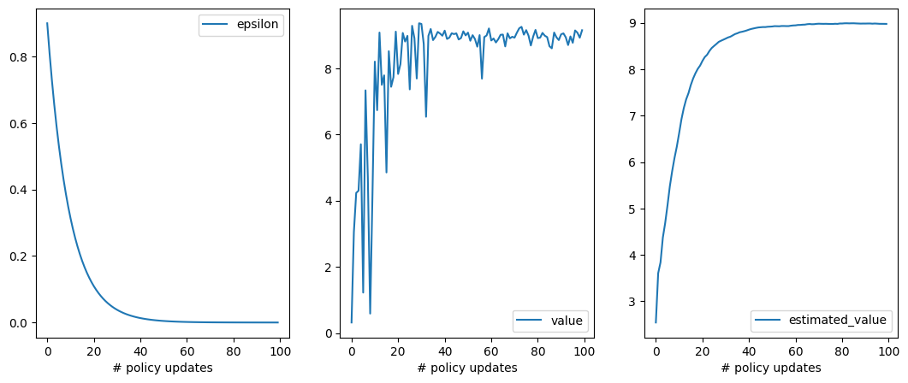
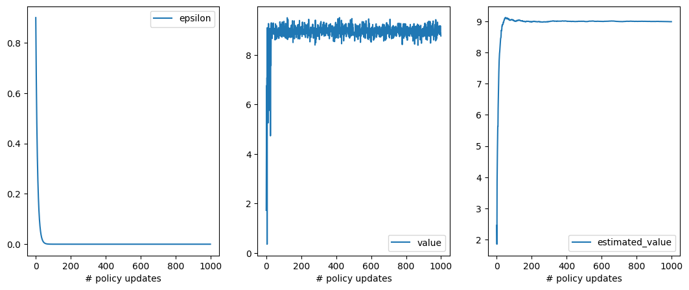
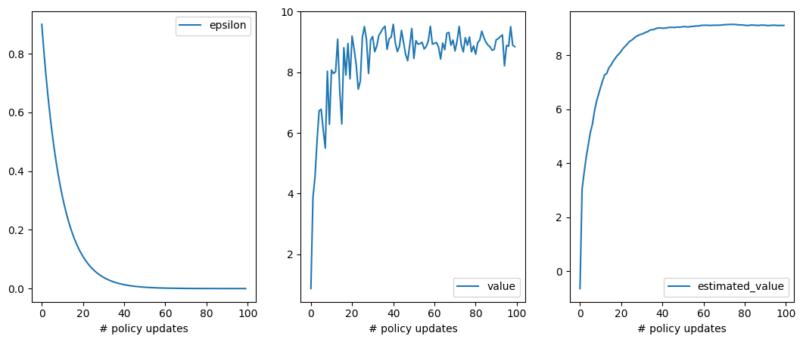
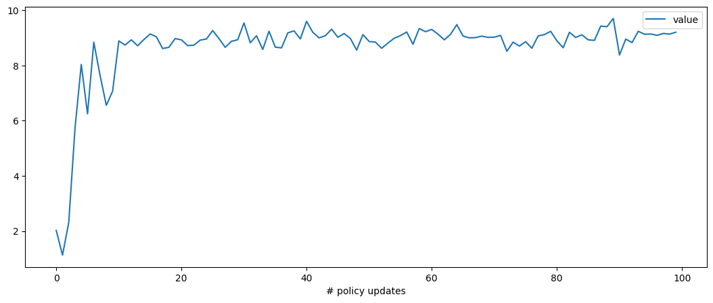
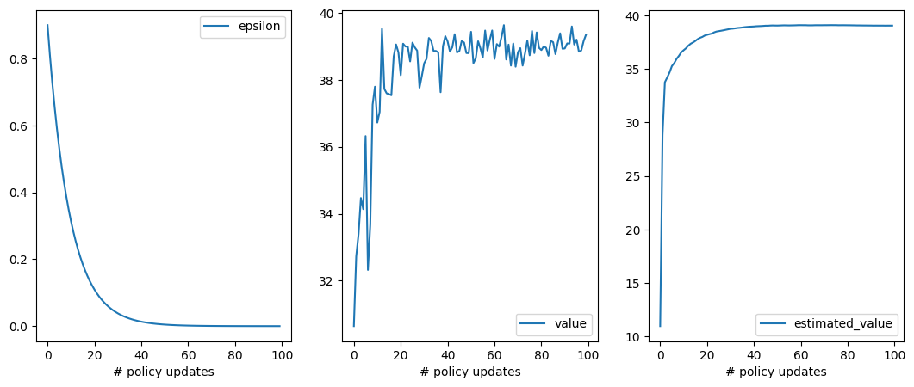
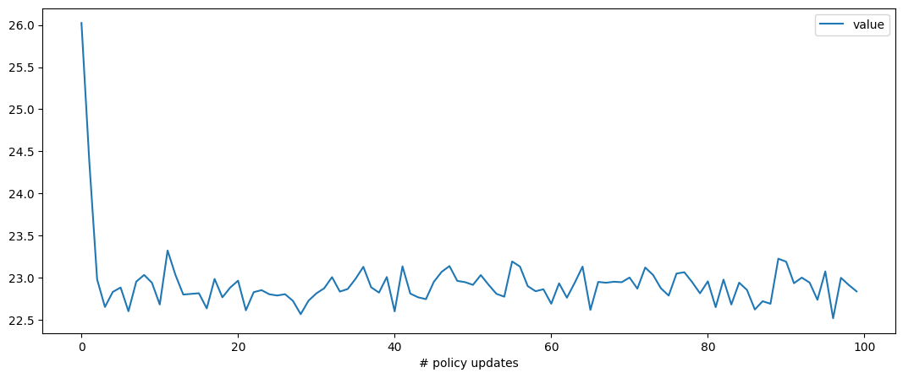
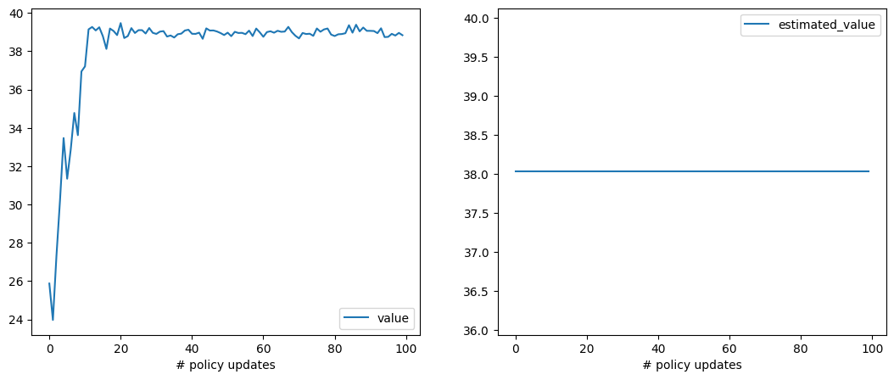

# rl-1. Statelessな場合

## 準備

手動でこのディレクトリ上の `*.py` ファイルをGoogle Colab上にアップロードするか、Google Colab上で以下を実行
```python
!pip install pettingzoo
!curl -o envs.py https://raw.githubusercontent.com/AkinoriTanaka-phys/cs4mathphys/refs/heads/main/python_and_ml/rl_np/envs.py
!curl -o opts_stateless.py https://raw.githubusercontent.com/AkinoriTanaka-phys/cs4mathphys/refs/heads/main/python_and_ml/rl_np/opts_stateless.py
!curl -o policies_stateless.py https://raw.githubusercontent.com/AkinoriTanaka-phys/cs4mathphys/refs/heads/main/python_and_ml/rl_np/policies_stateless.py
```
この後以下を実行
```python
from envs import *
from opts_stateless import *
from policies_stateless import *
```


## 環境とエージェントの設定

まずは簡単なケースとして、「状態のない」場合の強化学習を考えます。この場合の強化学習の確率システムは 
- **エージェント (agent)** のステップ（方策 $`\pi`$ による 行動選択 $`a`$）
- **環境 (environment)** のステップ (環境確率 $`P_\text{env}`$ による 報酬信号 $`r \in \mathbb{R}`$)

から構成されます：

```math
* \overset{\pi}{\to} a \overset{P_\text{env}}{\to} r 
```

このプロセスの 1 サンプル（$`(a, r)`$ の対）を **エピソード (episode)** と言い、$`r`$ の期待値を **価値 (value)** と呼びます。

### 環境

#### 作り方

以下で `num_slots`台のスロットマシン環境の作成ができます：
```python
env = Slots(num_slots=5, init_seed=1) 
```

これらの `env` オブジェクトは

```math
* \overset{\pi}{\to} a \overset{P_\text{env}}{\to} r 
```

のうち $`{P_\text{env}}`$ の部分を担当します。この `env` オブジェクトの中に実は $`P_\text{env}`$ の情報が隠されていて、エージェントからは見えないようになっています。具体的には `num_slots` 個のガウス分布を考え、$`P_\text{env}(r|a) = N(r|m_a, \sigma_a^2)`$ が `env` の中に格納されています：
- それぞれの台の平均の情報 $`[m_a]_{a=1}^\text{num\_slots}`$ は `env.means`
- それぞれの台の標準偏差の情報 $`[\sigma_a]_{a=1}^\text{num\_slots}`$ は `env.stds`

に書かれています。

#### 動かし方（サンプルの取り方）

$`a \overset{P_\text{env}}{\to} r `$ のサンプルに当たる関数は `env.step(a)` です。後の状態ありの場合と同じ使用感になるようにするため、返り値は $`r`$ 以外にもありますが、二つ目の値が報酬 $`r`$ です。

```python
a = ... # 0 ~ num_slots-1 の整数
env.step(a)
```
> ```python
> 0, r: float, terminated: bool, truncated: bool, info: dir
> ```

<center>


</center>

### エージェント

#### 作り方

このノートでは、エージェントのクラス `Agent` のオブジェクトを作成する際、方策 $`\pi`$ のクラス `policy` を読み込むという形式を取ります：
```python
env = Slots(...) 

policy = Policy(env) # これが $\pi$ に対応
agt = Agent(policy)
```

#### 動かし方（サンプルの取り方）

```math
* \overset{\pi}{\to} a \overset{P_\text{env}}{\to} r 
```

のうち $`* \overset{\pi}{\to} a`$ の部分が以下です：

```python
a, info_agt = agt.step() # 内部では policy.sample() が呼ばれている
```

<center>


</center>

#### このノートで使える方策

- 手で行動を入力する方策: $`\pi = \pi_\text{あなた}`$
    ```python
    policy = YourPolicy(env)
    print(policy.params)
    ```
    > ```
    > None
    > ```
- ランダム方策 (訓練不可): $`\pi = \pi_\text{一様分布}`$
    ```python
    policy = RandomPolicy(env, seed=1)
    print(policy.params)
    ```
    > ```
    > None
    > ```
- $`\epsilon`$-貪欲方策 (訓練可能): $`\pi = \pi^\epsilon`$
    ```python
    policy = EpsilonGreedyPolicy(env, epsilon=1, seed=None)
    print(policy.params)
    ```
    > ```
    > [0. 0. 0.] # num_slots = 3 の場合
    > ```
- softmax方策 (訓練可能): $`\pi = \text{softmax}(\theta)`$
    ```python
    policy = SoftmaxPolicy(env, seed=None)
    print(policy.params)
    ```
    > ```
    > [0. 0. 0.] # num_slots = 3 の場合
    > ```

### 全体のサンプリング・プログラム

このノートを通じて、
1. 実際に環境に対してエージェントを動作させる
2. それを通じて学習させる

ということをします。このうち 1 に当たる部分は以下のようなスタイルで書く事にします：

```python
# 環境などの設定
env = ...
policy = ...
agt = Agent(policy)

# サンプリング（ゲームを実際に1回プレイ）
episode_over = False
env.reset()
while not episode_over: # ここは実質1回で終了します
    a, info_agt = agt.step()
    s, r, terminated, truncated, info_env = env.step(a)
    episode_over = terminated or truncated
```

<center>


</center>

$\blacksquare$ **練習問題1:** 以下のプログラムをノートブック上にコピー＆ペーストして実際にこのスロットマシン環境と相互作用してみてください。特に `while not episode_over:` の部分のループが1回で終わっていることを確認してください。

```python
env = Slots(num_slots=5, init_seed=1) 
policy = YourPolicy(env)
agt = Agent(policy)

# 3回繰り返す
for episode in range(3):
    episode_over = False
    env.reset()
    print(f"----- episode {episode} start: -----")
    # サンプリング（ゲームを実際にプレイ）
    while not episode_over:
        a, info_agt = agt.step()
        s, r, terminated, truncated, info_env = env.step(a)
        episode_over = terminated or truncated
        print(f"a={a}, r={r}, episode_over={episode_over}")
    print("***** episode is over. *****")
env.close()
```

> [!TIP]
> <details>
> <summary>解答例</summary>
> 
> 動かすと以下のようになります：
> ```
> ----- episode 0 start: -----
> Your turn: type a value in Discrete(5)
> 1
> a=1, r=9.540856653038908, episode_over=True
> ***** episode is over. *****
> ----- episode 1 start: -----
> Your turn: type a value in Discrete(5)
> 2
> a=2, r=-7.422597796737038, episode_over=True
> ***** episode is over. *****
> ----- episode 2 start: -----
> Your turn: type a value in Discrete(5)
> 3
> a=3, r=8.641489287038858, episode_over=True
> ***** episode is over. *****
> ```
> `while not episode_over:` の中で定義されている print 文は 
> ```
> ----- episode x start: -----
> ...
> ***** episode is over. *****
> ```
> で挟まれた部分に表示されるはずですが、確かに3回あるエピソードの全てで1回で終わっています。
> </details>

$\blacksquare$ **練習問題2:** 上のプログラムでは `Policy=YourPolicy(env)` としていたため、エージェントの行動はあなた自身の方策に基づいたものになっていました。これを別の適当な方策にして、スロット環境を自動で探索できるようにしてください。
> [!TIP]
> <details>
> <summary>解答例</summary>
> 
>例えば `RandomPolicy` を使えます。
>```python
>env = Slots(num_slots=5, init_seed=1) 
>policy = RandomPolicy(env)     # ここを変更しただけ
>agt = Agent(policy)
>
># サンプリング（ゲームを実際にプレイ）
>for episode in range(3):
>    episode_over = False
>    env.reset()
>    print(f"----- episode {episode} start: -----")
>    while not episode_over:
>        a, info_agt = agt.step()
>        s, r, terminated, truncated, info_env = env.step(a)
>        episode_over = terminated or truncated
>        print(f"a={a}, r={r}, episode_over={episode_over}")
>    print("***** episode is over. *****")
>env.close()
>```
>> ```
>> ----- episode 0 start: -----
>> a=4, r=-3.687269065258097, episode_over=True
>> ***** episode is over. *****
>> ----- episode 1 start: -----
>> a=4, r=-3.8674414439735822, episode_over=True
>> ***** episode is over. *****
>> ----- episode 2 start: -----
>> a=1, r=8.861160070290293, episode_over=True
>> ***** episode is over. *****
>> ```
> </details>

## 期待値のモンテカルロ計算と訓練

強化学習では期待値計算が必要になることが多いです。例えば報酬の期待値（＝行動価値）は以下の期待値です：

```math
Q(a) = \mathbb{E}_{r \sim P_\text{env}(\cdot|a)}\left[ r \right]
```

ここではより一般の期待値

```math
E(a) = \mathbb{E}_{r \sim P_\text{env}(\cdot|a)}\left[ f(r) \right]
```

の値を何らかの方法で近似する：

```math
E(a) \approx \hat{E}(a) 
```
ことを考えます。

### モンテカルロ推定器

$`\hat{E}(a)`$ の値を決めるには、モンテカルロ法

```math
\hat{E}(a) =\frac{1}{N_\text{visit}(a)} \sum_{i=1}^{N_\text{visit}(a)} f(r_i)
```
を実行することが考えられます。これには複数のサンプルを用意して、定義通り平均値をとっても良いのですが、以下の考察により **サンプリングと並列して計算** することが可能なことがわかります：

```math
\begin{align*}
\hat{E}_\text{new}(a)
&=
\frac{1}{N_\text{visit}(a)  + 1} \Big(\sum_{i=1}^{N_\text{visit}(a)} f(r_i) + f(r)\Big) \\
&=
\frac{1}{N_\text{visit}(a)  + 1} \sum_{i=1}^{N_\text{visit}(a)} f(r_i) + \frac{f(r)}{N_\text{visit}(a)  + 1} \\
&=
\frac{N_\text{visit}(a)}{N_\text{visit}(a)  + 1} \hat{E}(a) + \frac{f(r)}{N_\text{visit}(a)  + 1} \\
&=\hat{E}(a) + \frac{f(r) - \hat{E}(a)}{N_\text{visit}(a)  + 1}
\end{align*}
```

この式は、新しいサンプル $`(a, f(r))`$ が入ってきた際に $`\hat{E}(a)`$ という訓練パラメータを
- ロス関数 $`l = \frac{1}{2}(f(r)-\hat{E}(a))^2`$
- 学習率 $`\eta = \frac{1}{N_\text{visit}(a)  + 1}`$

で勾配更新している：
```math
\hat{E}(a) \leftarrow \hat{E}(a) - \eta \nabla_{\hat{E}(a)} l
```
と考えることができることを示しています。この考察に基づいて、このような更新の機能を持ったモンテカルロ推定器を作れるようにしておきました：
```python
estimator = MonteCarloEstimator(in_shape, out_shape)
```
- `in_shape` は 引数の型、`out_shape` は 推定量のベクトルとしての型を入れるようにしてありますが、詳しくは後の例を見てもらった方が早いかと思います。
- 推定値のモンテカルロ法による更新は以下です
    ```python
    estimator.mc_update(a, f)  # f は期待値をとる観測量
    ```
- 実際には（状態ありの場合と同じにするため）一旦 `sample: dict` にサンプルを記録してから、その記録の値を代入して更新する形をとります。

使用の際のイメージ図を書いておきます：

<center>


</center>

- **例：実際にモンテカルロ法で $`Q(a)`$ の近似値を得てみる：**
    <details>
    <summary>クリックでプログラムの展開</summary>
    <blockquote>

    ```python
    env = Slots(num_slots=5, init_seed=1) 
    policy = RandomPolicy(env, seed=1)
    agt = Agent(policy)

    # Q(a) の モンテカルロ推定器
    Q_estimator = MonteCarloEstimator(in_shape=(env.action_space.n,),
                                      out_shape=())

    # サンプリング（ゲームを実際にプレイ）
    for episode in range(100):
        episode_over = False
        env.reset() # ここでもseed値を固定すると 実行ごとに同じ結果
        sample = {} # 辞書オブジェクトに "action" と "reward" を記録する
        while not episode_over:
            a, info_agt = agt.step()
            s, r, terminated, truncated, info_env = env.step(a)
            sample["action"] = a                      # a を記録
            sample["reward"] = r                      # r を記録
            episode_over = terminated or truncated
        
        Q_estimator.mc_update(a=sample["action"], f=sample["reward"]) # 推定器をアップデート

    print(f"Estimated values\n\t= {Q_estimator.params}")
    print(f"True values\n\t= {env.means}")
    env.close()
    ```
    > ```
    > Estimated values
    > 	= [ 0.1665267   9.09885157 -6.96455969  8.79926556 -3.70291069]
    > True values
    > 	= [ 0.23643249  9.00927393 -7.11680775  8.97298894 -3.76337096]
    > ```
    大体正しそうな推定結果が `estimator.params` に入っていることがわかります。

    </blockquote>
    </details>

- **例：実際にモンテカルロ法で $`J(\pi)`$ の近似値を得てみる：**

    <details>
    <summary>クリックでプログラムの展開</summary>
    <blockquote>
    
    ```python
    env = Slots(num_slots=5, init_seed=1) 
    policy = RandomPolicy(env)
    agt = Agent(policy)

    # J(policy) の モンテカルロ推定器
    J_estimator = MonteCarloEstimator(in_shape=(),
                                      out_shape=())

    # サンプリング（ゲームを実際にプレイ）
    for episode in range(100):
        episode_over = False
        env.reset()
        sample = {} # 辞書オブジェクトに "action" と "reward" を記録する
        while not episode_over:
            a, info_agt = agt.step()
            s, r, terminated, truncated, info_env = env.step(a)
            #sample["action"] = a                   # a を記録 消したけどあっても問題ない
            sample["reward"] = r                    # r を記録
            episode_over = terminated or truncated
        
        J_estimator.mc_update(f=sample["reward"]) # 推定器をアップデート

    print(f"Estimated value\n\t= {J_estimator.params}")
    print(f"True value\n\t= {np.mean(env.means)}")
    ```
    > ```
    > Estimated value
    >     = 1.5147306608225928
    > True value
    >     = 1.4677033315742203
    > ```
    まずまず近い値かと思います。True valueは方策が一様ランダムではない場合はこの計算では出せないのに注意してください。
    </blockquote>
    </details>

### モンテカルロ法に基づく訓練器

モンテカルロ推定器を使った訓練器として以下を実装しておきました：
- $`\epsilon`$-貪欲方策 と $`Q(a)`$ 推定によるもの：
    ```python
    policy = EpsilonGreedyPolicy(env ,epsilon=1)  
    opt = MC_Optimizer(policy, decay_r=0.99)     # decay_r は epsilon の減衰率です 
    ```
- パラメトリック方策（softmax方策）と方策勾配 $`\nabla_\theta J(\pi_\theta)`$ 推定によるもの：
    - ベースラインなし
        ```python
        policy = SoftmaxPolicy(env, seed=1)
        opt = ReinforceOptimizer_NoBaseline(policy, lr=.1) # lr は方策勾配法の学習率です
        ```
    - ベースラインあり
        ```python
        policy = SoftmaxPolicy(env, seed=1)
        opt = ReinforceOptimizer(policy, lr=.1) # lr は方策勾配法の学習率です
        ```


これら全て、以下のようなワークフローで使います：

<center>


</center>

その他いくつかの機能として：
- `opt.test()`: 現在の方策の良さを図るテストを行い、結果を記録
    - `opt.policy_update()`の後に使う想定
- `opt.plot_result()`: 上記のテスト結果をプロット

が使えます。

#### $`\epsilon`$-貪欲方策

単純に $`\epsilon`$-貪欲方策 と 行動価値のモンテカルロ推定値 $`\hat{Q}(a)`$ で動作します。
```python
policy = EpsilonGreedyPolicy(env ,epsilon=1)  
opt = MC_Optimizer(policy, decay_r=0.99)     # decay_r は epsilon の減衰率です 
```

- **例：実際に訓練してみる：**

    <details>
    <summary>クリックでプログラムの展開</summary>
    <blockquote>
    
    ```python
    env = Slots(num_slots=5, init_seed=1)
    policy = EpsilonGreedyPolicy(env, epsilon=1)
    agt = Agent(policy)

    # モンテカルロ推定器を使って学習
    opt = MC_Optimizer(policy, decay_r=.9)     

    # モンテカルロ更新＋方策更新
    for episode in range(1000):            
        episode_over = False
        env.reset()
        opt.reset_record()  # 辞書オブジェクトに "action" と "reward" を記録する
        while not episode_over:
            a, info_agt = agt.step()
            s, r, terminated, truncated, info_env = env.step(a)
            opt.record(action=a, reward=r)         # a, r を記録  
            episode_over = terminated or truncated

        opt.mc_update() # 推定器をアップデート
        
        if episode%10==0:       # 10エピソード毎に 
            opt.policy_update() # 方策をアップデート
            opt.test()          # 現在の方策のテストし、結果を記録
    
    opt.plot_result()   # テスト結果をプロット
    env.close()
    ```
    > 
    左から、$`\epsilon`$の値、現在の方策の価値、その`opt`による推定値を表します。

    </blockquote>
    </details>

$\blacksquare$ **練習問題3:** 上の例では
- 1エピソード毎に $\hat{Q}(a)$ のモンテカルロ推定値を更新
- 10エピソード毎にその段階での $\hat{Q}(a)$ を方策にコピーして $\epsilon$ を少し小さくすることで方策を更新

としていましたが、方策更新を1エピソードずつにしても問題なく訓練できることをチェックしてみてください。

> [!TIP]
> <details>
> <summary>解答例</summary>
> 
>`if ~` の部分の数字をいじってもいいですが、if文自体をなくして書いた方がわかりやすいです：
>```python
>env = Slots(num_slots=5, init_seed=1)
>policy = EpsilonGreedyPolicy(env, epsilon=1)
>agt = Agent(policy)
>
># モンテカルロ推定器を使って学習
>opt = MC_Optimizer(policy, decay_r=.9)     
>
># モンテカルロ更新＋方策更新
>for episode in range(1000):            
>    episode_over = False
>    env.reset()
>    opt.reset_record()  # 辞書オブジェクトに "action" と "reward" を記録する
>    while not episode_over:
>        a, info_agt = agt.step()
>        s, r, terminated, truncated, info_env = env.step(a)
>        opt.record(action=a, reward=r)         # a, r を記録  
>        episode_over = terminated or truncated
>
>    opt.mc_update() # 推定器をアップデート
>    opt.policy_update() # 方策をアップデート
>    opt.test()   
>    
>    # if episode%10==0:       # 10エピソード毎に 
>    #     opt.policy_update() # 方策をアップデート
>    #     opt.test()              
>opt.plot_result()
>env.close()
>```
>> 
> </details>

##### オフポリシー強化学習

こちらの方策と訓練器は、推定対象が $`Q(a)`$ ですが、状態がない場合はこれは方策 $`\pi`$ に依存しません。そのため、
```python
# 訓練器にはターゲットの方策を入れる
target_policy = EpsilonGreedyPolicy(env, epsilon=1)
opt = MC_Optimizer(target_policy, decay_r=.9)  

# エージェントには別の方策を入れる
behavior_policy = RandomPolicy(env)
agt = Agent(behavior_policy)
```
のように、モンテカルロサンプルをとる用の方策と、訓練方策を分けても問題ありません。図で書くと以下のようなイメージです：

<center>


</center>

このような状況での強化学習を **オフポリシー** と言います。これに対し、これまでのように `target_policy` = `behavior_policy` のケースを **オンポリシー** と言います。

> オフポリシー強化学習はどんなデータ `{"action": a, "reward": r}` でも使えるので、通常のデータありの機械学習のイメージに近いです。実際、深層学習と強化学習を組み合わせる際にオフポリシーだとサンプルを無駄にすることがないので、効率が良くなります。

- **例：オフポリシー強化学習**
    <details>
    <summary>クリックでプログラムの展開</summary>
    <blockquote>

    ```python
    env = Slots(num_slots=5, init_seed=1)

    # 訓練器にはターゲットの方策を入れる
    target_policy = EpsilonGreedyPolicy(env, epsilon=1)
    opt = MC_Optimizer(target_policy, decay_r=.9)  

    # エージェントには別の方策を入れる
    behavior_policy = RandomPolicy(env)
    agt = Agent(behavior_policy)

    # モンテカルロ更新＋方策更新
    for episode in range(1000):            
        episode_over = False
        env.reset()
        opt.reset_record()  
        while not episode_over:
            a, info_agt = agt.step()  # ここは behavior_policy でサンプルしている
            s, r, terminated, truncated, info_env = env.step(a)
            opt.record(action=a, reward=r)         
            episode_over = terminated or truncated

        opt.mc_update() 
        
        if episode%10==0:       
            opt.policy_update() 
            opt.test()              
    opt.plot_result()
    env.close()
    ```
    > 

    それでもうまく学習できています。
    </blockquote>
    </details>

#### softmax方策

このノートのSoftmax方策は、
```math
\pi_\theta(a) = \frac{e^{\theta_a}}{\sum_{\tilde{a}}e^{\theta_{\tilde{a}}}}
```
のように、各行動 $`\tilde{a}`$ に対してパラメータ $`\theta_{\tilde{a}} \in \mathbb{R}`$ を設定するものになっています。この場合、$`\nabla_{\theta} \log \pi(a)`$ を明示的に書き下せて、`policy.grad_log_p(a)` で計算ができるようになっています。そこで　（ベースラインなし）方策勾配の更新式

```math
\begin{align*}
\theta 
&\leftarrow \theta + \eta \mathbb{E}_{a \sim \pi_\theta}[Q(a) \nabla_\theta \log \pi_\theta(a)]\\
&=\theta + \eta\underbrace{\mathbb{E}_{a \sim \pi_\theta, r \sim P_\text{env}(\cdot|a)}[r  \nabla_\theta \log \pi_\theta(a)]}_{\nabla_\theta J(\pi_\theta)}
\end{align*}
```

をモンテカルロ法で近似して訓練するのが以下です：

```python
policy = SoftmaxPolicy(env, seed=1)
opt = ReinforceOptimizer_NoBaseline(policy, lr=.1) # lr は方策勾配法の学習率です
```

`opt.mc_update()` では 

```math
\hat{\nabla_\theta J}(\pi_\theta)\leftarrow \hat{\nabla_\theta J}(\pi_\theta) - \frac{r \nabla_\theta \log \pi_\theta(a) - \hat{\nabla_\theta J}(\pi_\theta)}{N_\text{visit}+1}
```

が実行されます。


- **例：`ReinforceOptimizer_NoBaseline`で 実際に訓練してみる：**

    <details>
    <summary>クリックでプログラムの展開</summary>
    <blockquote>

    ```python
    env = Slots(num_slots=5, init_seed=1)
    policy = SoftmaxPolicy(env, seed=1)
    agt = Agent(policy)

    # モンテカルロ推定器を使って学習
    opt = ReinforceOptimizer_NoBaseline(policy, lr=.1)     

    # モンテカルロ更新＋方策更新（以下、MC_optimizerと変わらないです）
    for episode in range(1000):            
        episode_over = False
        env.reset()
        opt.reset_record()  # 辞書オブジェクトに "action" と "reward" を記録する
        while not episode_over:
            a, info_agt = agt.step()
            s, r, terminated, truncated, info_env = env.step(a)
            opt.record(action=a, reward=r)         # a, r を記録  
            episode_over = terminated or truncated

        opt.mc_update() # 推定器をアップデート
        
        if episode%10==0:       # 10エピソード毎に 
            opt.policy_update() # 方策をアップデート
            opt.test()              
    opt.plot_result()
    env.close()
    ```
    > 

    そこそこうまくいっているようです。

    </blockquote>
    </details>
##### ベースラインの追加

スロット環境でボーナスを与えることを考えたとします。
```python
class BonusSlots(Slots):
    def step(self, a):
        s, r, terminated, truncated, info_env = super().step(a)
        r += 30   # 一律に全スロットで 30 ポイント増加
        return s, r, terminated, truncated, info_env 
```
この場合でこれまでの手法の振る舞いを確認しておきます：
- **$`\epsilon`$-貪欲方策と`MC_Optimizer` による訓練：**
    <details>
    <summary>クリックでプログラムの展開</summary>
    <blockquote>

    ```python
    # env = Slots(num_slots=5, init_seed=1)
    env = BonusSlots(num_slots=5, init_seed=1)   # 環境を変更
    policy = EpsilonGreedyPolicy(env, epsilon=1)
    agt = Agent(policy)

    # モンテカルロ推定器を使って学習
    opt = MC_Optimizer(policy, decay_r=.9)     

    # モンテカルロ更新＋方策更新
    for episode in range(1000):            
        episode_over = False
        env.reset()
        opt.reset_record()  # 辞書オブジェクトに "action" と "reward" を記録する
        while not episode_over:
            a, info_agt = agt.step()
            s, r, terminated, truncated, info_env = env.step(a)
            opt.record(action=a, reward=r)         # a, r を記録  
            episode_over = terminated or truncated

        opt.mc_update() # 推定器をアップデート
        
        if episode%10==0:       # 10エピソード毎に 
            opt.policy_update() # 方策をアップデート
            opt.test()              
    opt.plot_result()
    env.close()
    ```
    > 
    </blockquote>
    </details>
    きちんと 前回の最終値+30 のところに学習曲線がきます
- **softmax-方策と`ReinforceOptimizer_NoBaseline` による訓練：**

    <details>
    <summary>クリックでプログラムの展開</summary>
    <blockquote>
    
    ```python
    # env = Slots(num_slots=5, init_seed=1)
    env = BonusSlots(num_slots=5, init_seed=1)   # 環境を変更
    policy = SoftmaxPolicy(env, seed=1)
    agt = Agent(policy)

    # モンテカルロ推定器を使って学習
    opt = ReinforceOptimizer_NoBaseline(policy, lr=.1)     

    # モンテカルロ更新＋方策更新
    for episode in range(1000):            
        episode_over = False
        env.reset()
        opt.reset_record()  # 辞書オブジェクトに "action" と "reward" を記録する
        while not episode_over:
            a, info_agt = agt.step()
            s, r, terminated, truncated, info_env = env.step(a)
            opt.record(action=a, reward=r)         # a, r を記録  
            episode_over = terminated or truncated

        opt.mc_update() # 推定器をアップデート
        
        if episode%10==0:       # 10エピソード毎に 
            opt.policy_update() # 方策をアップデート
            opt.test()              
    opt.plot_result()
    env.close()
    ```
    > 
    </blockquote>
    </details>
    前回の最終値+30 のところに学習曲線がきません

この結果の違いはそれぞれのモンテカルロ推定の分散の違いによるものと解釈できます。
- $`\hat{Q}(a) \leftarrow r`$ の推定の場合、分散の値はボーナスを入れても不変です:
```math
\begin{align*}
\text{Var}_{r \sim P_\text{env}(\cdot|a)}[r] &= \mathbb{E}[r^2] - \mathbb{E} [r]^2\\
&\downarrow\\
\text{Var}_{r \sim P_\text{env}(\cdot|a)}[r+30] &= \mathbb{E}[\underbrace{(r+30)^2}_{r^2 + 60r + 30^2}] - \underbrace{\mathbb{E} [r+30]^2}_{\mathbb{E}[r]^2 + 60 \mathbb{E}[r] + 30^2}\\
&=
\mathbb{E}[r^2] - \mathbb{E}[r]^2 \\
&=
\text{Var}_{r \sim P(\cdot|a)}[r] 
\end{align*}
```
- $`\hat{\nabla_\theta J}(\pi_\theta) \leftarrow r \nabla_\theta \log \pi_\theta(a)`$ は一方で、ボーナスを入れると余計な項が出てきてしまいます：

    （以下、簡単のため $`\nabla_\theta \log \pi_\theta(a) = g(a)`$ と書いておきます。）：
```math
\begin{align*}
&\text{Var}_{a \sim \pi_\theta, r \sim P_\text{env}(\cdot|a)} [r g(a)]
=
\mathbb{E}[(r g(a))^2]
-\mathbb{E}[(r g(a))]^2
\\
&\downarrow\\
&\text{Var}_{a \sim \pi_\theta, r \sim P_\text{env}(\cdot|a)} [(r + 30) g(a)]\\
&=
\mathbb{E}[\underbrace{(r + 30)^2}_{r^2 + 60r + 30^2} g(a)^2]
-
\underbrace{\mathbb{E}[(r + 30) g(a)]^2}_{\mathbb{E}[rg(a)]^2 + 60 \mathbb{E}[rg(a)]\mathbb{E}[g(a)] + 30^2\mathbb{E}[g(a)]^2} \\
&=
\text{Var}_{a \sim \pi_\theta, r \sim P_\text{env}(\cdot|a)} [r g(a)]\\
&\quad\underbrace{+60 (\mathbb{E}[r g(a)^2] - \mathbb{E}[rg(a)]\mathbb{E}[g(a)]) +30^2\text{Var}[g(a)]}_\text{余計な寄与が出てくる}
\end{align*}
```

必ずしも正の分散が加わるわけではないと思いますが、ボーナスが大きい場合2項目の $`30^2`$ の項の絶対値の方が大きくなりがちで、これは分散が大きくなることを意味します。このように報酬信号を直接使うと、方策勾配の分散による学習不良が起こってしまう場合があります。この効果を緩和させるため、通常はREINFORCEをする際は

```math
\theta \leftarrow \theta + \eta \mathbb{E}_{a \sim \pi_\theta}[Q(a) \nabla_\theta \log \pi_\theta(a)]
```

ではなく

```math
\theta \leftarrow \theta + \eta \mathbb{E}_{a \sim \pi_\theta}[A_\pi(a) \nabla_\theta \log \pi_\theta(a)]
```

を使います。ここで $`A(a)`$ はアドバンテージ関数で、（statelessな場合は）以下で定義されます：

```math
A_\pi(a) = Q(a) -J(\pi)
```

この場合は、方策勾配のモンテカルロ推定を $`r \to r - J(\pi)`$ に置き換えて行えば良いことがわかります。$`J(\pi)`$ ですが、これもモンテカルロ推定してしまう事にします。この推定値を **ベースライン** と呼びます。
> ベースラインは必ずしも $`J(\pi)`$ にとらなければいけないというわけではないです。実際、方策勾配の推定値の分散を「最小化」するようなベースラインを形式的に求めることは可能で、ベースライン $`B`$ に関する2次方程式を解けば求まり、
> ```math
> B = \frac{\mathbb{E}[Q(a)g(a)\{g(a) - \mathbb{E}[g(a)]\}]}{\text{Var}[g(a)]}
> ```
> となりますが、これは **$`Q(a)`$ と $`g(a)`$ が独立（掛け算の期待値＝期待値の掛け算）だと仮定すると** 分母がキャンセルして、$`B = \mathbb{E}[Q(a)] = J(\pi)`$ となります。ですが、実際は独立ではないので、最適なベースラインは $`J(\pi)`$ ではないと思われます。

ベースライン $`J(\pi)`$ も同時にモンテカルロ推定して訓練するようなものを書いておきました：

```python
policy = SoftmaxPolicy(env, seed=1)
opt = ReinforceOptimizer(policy, lr=.1) # lr は方策勾配法の学習率です
```

この optimizer で上と同様のボーナス入り環境で強化学習してみます：
- **softmax-方策と`ReinforceOptimizer` による訓練：**
    <details>
    <summary>クリックでプログラムの展開</summary>
    <blockquote>
    
    ```python
    env = BonusSlots(num_slots=5, init_seed=1)
    policy = SoftmaxPolicy(env, seed=1)
    agt = Agent(policy)

    # 方策勾配のモンテカルロ推定器を使って学習
    opt = ReinforceOptimizer(policy, lr=.1)   

    # モンテカルロ更新＋方策更新
    for episode in range(1000):            
        episode_over = False
        env.reset()
        opt.reset_record()  # 辞書オブジェクトに "action" と "reward" を記録する
        while not episode_over:
            a, info_agt = agt.step()
            s, r, terminated, truncated, info_env = env.step(a)
            opt.record(action=a, reward=r)         # a, r を記録  
            episode_over = terminated or truncated

        opt.mc_update() # 推定器をアップデート
        
        if episode%10==0:       # 10エピソード毎に 
            opt.policy_update() # 方策をアップデート
            opt.test()              
    opt.plot_result()
    env.close()
    ```

    > 
    </blockquote>
    </details>

    きちんと 前回の最終値+30 のところに学習曲線がきます

$\blacksquare$ **練習問題4:** ボーナス +30点 ではなく、どのスロットもペナルティ -30 点がかかる場合に、ベースラインあり/なしを同じ設定で訓練して見てください。環境のカスタムは
```python
class PenaltySlots(Slots):
    def step(self, a):
        s, r, terminated, truncated, info_env = super().step(a)
        r -= 30   # 一律に全スロットで 30 ポイント減少
        return s, r, terminated, truncated, info_env 
```
のようにします。

> [!TIP]
> <details open>
> <summary>解答例</summary>
> 
> 回答略、定性的に本文と同じ結果（ベースラインなしだと最適方策に行かなくなる）になるはずです。
> </details>

| [次のsection](2.md)
