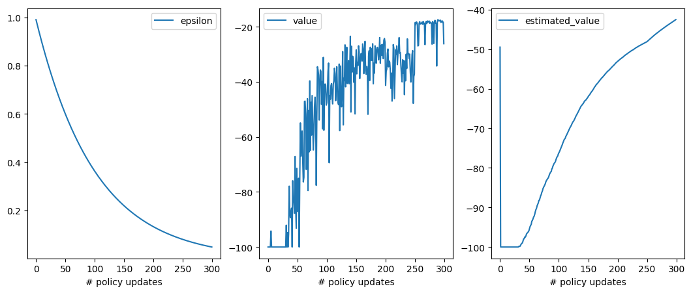
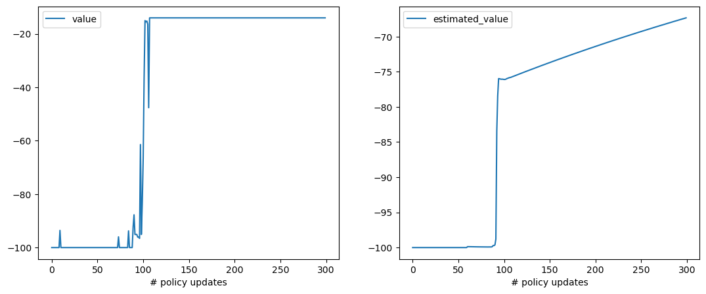

# rl-2. Statefulな場合1

## 実装の準備

手動でこのディレクトリ上の `*.py` ファイルをGoogle Colab上にアップロードするか、Google Colab上で以下を実行
```python
!pip install pettingzoo
!curl -o envs.py https://raw.githubusercontent.com/AkinoriTanaka-phys/cs4mathphys/refs/heads/main/python_and_ml/rl_np/envs.py
!curl -o opts.py https://raw.githubusercontent.com/AkinoriTanaka-phys/cs4mathphys/refs/heads/main/python_and_ml/rl_np/opts.py
!curl -o policies.py https://raw.githubusercontent.com/AkinoriTanaka-phys/cs4mathphys/refs/heads/main/python_and_ml/rl_np/policies.py
```
この後以下を実行
```python
from envs import *
from opts import *
from policies import *
from tqdm import tqdm
```

## 環境とエージェントの設定

次に「状態のある」強化学習を考えます。この場合の強化学習の確率システムは 
- **エージェント (agent)** の
    - 状態 $`s`$
    - 方策 $`\pi(\cdot|s)`$ による 行動選択 $`a`$
- **環境 (environment)** のステップ
    - 環境確率 $`P_\text{env}`$ による 報酬信号 $`r \in \mathbb{R}`$
    - 環境確率 $`P_\text{env}`$ による 次のエージェントの状態 $`s'`$

から構成されます：

```math
\begin{array}{cccccc}
*\overset{P_\text{env}^\text{init}}{\longrightarrow} (s_0 & \overset{\pi}{\longrightarrow} & a_0) & \overset{P_\text{env}}{\longrightarrow} & (s_1 & \overset{\pi}{\longrightarrow} & a_1) & \overset{P_\text{env}}{\longrightarrow} & (s_2 & \overset{\pi}{\longrightarrow} & a_2) & \overset{P_\text{env}}{\longrightarrow} & \cdots
\\
&&& \searrow &&&& \searrow &&&& \searrow 
\\
&&&& r_1 &&&& r_2 &&&& \cdots
\end{array}
```

このプロセスの 1 サンプル（$`\{(s_t, a_t, r_{t+1}) | t=0,1,2,\dots\}`$ ）を **エピソード (episode)** と言い、$`r_t`$ の重み付け和

```math
\sum_{\tau=1}^\infty \gamma^{\tau-1} r_{t+\tau}
```

の期待値（どのような部分で期待値を取るかで名前がいくつか存在する）を **価値 (value)** と呼びます。強化学習ではエピソードを重ねることで、初期状態の価値をなるべく最大化するのがエージェントの目標になります。

### いくつかの簡単な環境

このノートでは 
- Gymnasium https://gymnasium.farama.org/

という強化学習の環境用ライブラリを使いますが、前節の `Slots` とほとんど同じように使えます。このライブラリの使い方をより詳しく知りたい方は 別のノート
- [4-2. 強化学習の環境ライブラリ](../section4/4-2.md)

にいくらか説明を書いたので参考にしてみてください。

#### 作り方

Gymnasiumのデフォルトの設定を継承して作った環境を使います。以下、`max_episode_steps` は各エピソードの最大値で、それ以上になったら強制的にエピソード終了します。

- 崖歩き
    ```python
    # プロット機能を拡張しただけで、デフォルトと変わりなし
    env = CustomizedCliffWalking(render_mode="rgb_array", 
                                 max_episode_steps=100)
    # エージェントにとってもう少し簡単にしたバージョン
    env = EasyCliffWalking(render_mode="rgb_array", 
                           max_episode_steps=100)
    ```
- 凍った池（`is_slippery`を `True` にすると難しくなります）
    ```python
    # プロット機能を拡張しただけで、デフォルトと変わりなし
    env = CustomizedFrozenLake(is_slippery=False, render_mode="rgb_array", 
                               max_episode_steps=100)
    # エージェントにとってもう少し簡単にしたバージョン
    env = EasyFrozenLake(is_slippery=False, render_mode="rgb_array", 
                         max_episode_steps=100)
    ```
これらの `env` オブジェクトは
```math
\begin{array}{cccccc}
*\overset{P_\text{env}^\text{init}}{\longrightarrow} (s_0 & \overset{\pi}{\longrightarrow} & a_0) & \overset{P_\text{env}}{\longrightarrow} & (s_1 & \overset{\pi}{\longrightarrow} & a_1) & \overset{P_\text{env}}{\longrightarrow} & (s_2 & \overset{\pi}{\longrightarrow} & a_2) & \overset{P_\text{env}}{\longrightarrow} & \cdots
\\
&&& \searrow &&&& \searrow &&&& \searrow 
\\
&&&& r_1 &&&& r_2 &&&& \cdots
\end{array}
```

のうち $`{P_\text{env}}`$ の部分を担当します。この `env` オブジェクトの中に実は $`P_\text{env}`$ の情報が隠されていて、エージェントからは見えないようになっています。具体的にはクラス定義中の `def step(self, action, ...)` 部分に書かれています。

#### 動かし方（サンプルの取り方）

$`P_\text{env}`$ のサンプルに当たる関数は `env.step(a)` です。

```python
a = ... 
env.step(a)
```
> ```python
> s: int, r: float, terminated: bool, truncated: bool, info: dir
> ```

返り値が順番に、`状態, 報酬, エピソード終了したか, 強制終了したか, その他情報`、となっています。

<center>


</center>

### エージェント

#### 作り方

このノートでは、エージェントのクラス `Agent` のオブジェクトを作成する際、方策 $`\pi`$ のクラス `policy` を読み込むという形式を取ります：
```python
env = ...

policy = Policy(env) # これが $\pi$ に対応
agt = Agent(policy)
```

#### 動かし方

```math
\begin{array}{cccccc}
*\overset{P_\text{env}^\text{init}}{\longrightarrow} (s_0 & \overset{\pi}{\longrightarrow} & a_0) & \overset{P_\text{env}}{\longrightarrow} & (s_1 & \overset{\pi}{\longrightarrow} & a_1) & \overset{P_\text{env}}{\longrightarrow} & (s_2 & \overset{\pi}{\longrightarrow} & a_2) & \overset{P_\text{env}}{\longrightarrow} & \cdots
\\
&&& \searrow &&&& \searrow &&&& \searrow 
\\
&&&& r_1 &&&& r_2 &&&& \cdots
\end{array}
```

のうち $`s \overset{\pi}{\to} a`$ の部分が以下です：

```python
a_, info_agt = agt.step(s_) # 内部では policy.sample(s_) が呼ばれている
```

ここで、上のマルコフ決定過程の図で同じ時刻のパラメータであることを強調するために `s_, a_` とアンダースコアをつけました。

<center>


</center>

#### このノートで使える方策

- 手で行動を入力する方策: $`\pi = \pi_\text{あなた}`$
    ```python
    policy = YourPolicy(env)
    print(policy.params)
    ```
    > ```
    > None
    > ```
- ランダム方策 (訓練不可): $`\pi = \pi_\text{一様分布}`$
    ```python
    policy = RandomPolicy(env, seed=1)
    print(policy.params)
    ```
    > ```
    > None
    > ```
- $`\epsilon`$-貪欲方策 (訓練可能): $`\pi = \pi^\epsilon`$
    ```python
    #env = CustomizedCliffWalking(render_mode="rgb_array", max_episode_steps=100)
    policy = EpsilonGreedyPolicy(env, epsilon=1, seed=None)
    print(policy.params.shape)
    ```
    > ```
    > (48, 4)
    > ```
- softmax方策 (訓練可能): $`\pi = \text{softmax}(\theta)`$
    ```python
    #env = CustomizedCliffWalking(render_mode="rgb_array", max_episode_steps=100)
    policy = SoftmaxPolicy(env, seed=None)
    print(policy.params.shape)
    ```
    > ```
    > (48, 4)
    > ```

### 全体のサンプリング・プログラム

このノートを通じて、前回同様、
1. 実際に環境に対してエージェントを動作させる
2. それを通じて学習させる

ということをします。環境との相互作用のさせ方のフォーマットは前回の [rl-1. Statelessな場合](1.md) とほとんど同じで、このうち 1 に当たる部分は以下のようなスタイルで書く事にします：


```python
# 環境などの設定
env = ...
policy = ...
agt = Agent(policy)

# サンプリング（ゲームを実際に1回プレイ）
episode_over = False
s, info_env = env.reset()         # ここで s を受けることと
t = 0
while not episode_over: 
    s_ = s                        # 前回の s を この時刻での s_ とする
    a_, info_agt = agt.step(s_)   # ここに s の入力が入るのが違い
    s, r, terminated, truncated, info_env = env.step(a_)
    episode_over = terminated or truncated
    t += 1
```

<center>


</center>

$\blacksquare$ **練習問題1:** 以下のプログラムをノートブック上にコピー＆ペーストして実際に崖渡り環境と相互作用してみてください。操作は
- `0`:上、`1`:右、`2`:下、`3`:左

です。特に while not episode_over: の部分のループが1回で終わらないことを確認してください。
```python
env = EasyCliffWalking(render_mode="rgb_array", 
                       max_episode_steps=10)
policy = YourPolicy(env)
agt = Agent(policy)

# サンプリング（ゲームを実際にプレイ）
for episode in range(3):
    episode_over = False
    s, info_env = env.reset()
    plt.imshow(env.render())
    plt.show()
    print()
    print(f"----- episode {episode} start: -----")
    while not episode_over:
        a, info_agt = agt.step(s)
        s, r, terminated, truncated, info_env = env.step(a)
        episode_over = terminated or truncated
        print(f"s={s}, a={a}, r={r}, episode_over={episode_over}")
        plt.imshow(env.render())
        plt.show()
    print("***** episode is over. *****")
env.close()
```
> [!TIP]
> <details open>
> <summary>解答例</summary>
> 
> 略、実際にやってみると崖に落ちたところでエピソードが終わることがわかるはずです。
> </details>

$\blacksquare$ **練習問題2:** 適当なエージェントを設定して自動で3エピソード程度、動かしてみてください。
> [!TIP]
> <details>
> <summary>解答例</summary>
> 
> 以下を実行すると自動で動くはずです。出力は略。
> ```python
> env = EasyCliffWalking(render_mode="rgb_array", 
>                        max_episode_steps=10)
> policy = RandomPolicy(env)
> agt = Agent(policy)
> 
> # サンプリング（ゲームを実際にプレイ）
> for episode in range(3):
>     episode_over = False
>     s, info_env = env.reset()
>     plt.imshow(env.render())
>     plt.show()
>     print()
>     print(f"----- episode {episode} start: -----")
>     while not episode_over:
>         a, info_agt = agt.step(s)
>         s, r, terminated, truncated, info_env = env.step(a)
>         episode_over = terminated or truncated
>         print(f"s={s}, a={a}, r={r}, episode_over={episode_over}")
>         plt.imshow(env.render())
>         plt.show()
>     print("***** episode is over. *****")
> env.close()
> ```
> </details>

## 期待値のモンテカルロ計算と訓練

状態ありの強化学習（マルコフ決定プロセス）では「ある状態から始まるその先のすべての確率に関する期待値」を考えることが多いです。例えば、ある状態での行動の価値は以下です：

```math
\begin{array}{rrcccc}
(s, a) & \overset{P_\text{env}}{\longrightarrow} & (s_1 & \overset{\pi}{\longrightarrow} & a_1) & \overset{P_\text{env}}{\longrightarrow} & (s_2 & \overset{\pi}{\longrightarrow} & a_2) & \overset{P_\text{env}}{\longrightarrow} & \cdots &\cdots
\\
& \searrow &&&& \searrow &&&& \searrow 
\\
&& r_1 &&&& r_2 &&&& r_3 &\cdots\\
\\
&& \vdots &&&& \vdots\\
\mathbb{E}_{(\cdot|s, a)} \Big[&&r_1&&&&+\gamma \cdot r_2&&&&+\gamma^2 \cdot r_3 &+ \cdots& \Big]
\end{array}
```

ここではより一般の期待値

```math
E(s, a) = \mathbb{E}_{(\cdot|s, a)}\left[ f_1(r_1) + f_2(r_2) + f_3(r_3) + \cdots \right]
```

の値を何らかの方法で近似する：

```math
E(s, a) \approx \hat{E}(s, a) 
```
ことを考えます。

### モンテカルロ推定器

この `estimator.params[s, a]` $`= \hat{E}(s, a)`$ の値を決めるには、モンテカルロ法

```math
\hat{E}(s, a) =\frac{1}{N_\text{visit}(s, a)} \sum_{i=1}^{N_\text{visit}(s, a)} \Big[ f_1((r_1)_i) +  f_2((r_2)_i) +  f_3((r_3)_i) + \cdots \Big]
```
を実行することが考えられます。ここで $`i`$ はサンプルのラベルで、そのほかにマルコフ決定プロセスの時間ラベル（式中の $`1,2,3,\dots`$）もあることに注意です。この時間に渡る和を

```math
f(\{r_t\}_{t=1}^\infty) = f_1(r_1) +  f_2(r_2) +  f_3(r_3) + \cdots
```

と書く事にすると、モンテカルロの式は

```math
\hat{E}(s, a) =\frac{1}{N_\text{visit}(s, a)} \sum_{i=1}^{N_\text{visit}(s, a)}f(\{(r_t)_i\}_{t=1}^\infty)
```

となり、やはり以下の考察により **サンプリングと並列して計算** することが可能です。

```math
\begin{align*}
\hat{E}_\text{new}(s, a)
&=
\frac{1}{N_\text{visit}(s, a)  + 1} \Big(\sum_{i=1}^{N_\text{visit}(s, a)} f(\{(r_t)_i\}_{t=1}^\infty) + f(\{r_t\}_{t=1}^\infty)\Big) \\
&=
\frac{1}{N_\text{visit}(s, a)  + 1} \sum_{i=1}^{N_\text{visit}(s, a)} f(\{(r_t)_i\}_{t=1}^\infty) + \frac{f(\{r_t\}_{t=1}^\infty)}{N_\text{visit}(s, a)  + 1} \\
&=
\frac{N_\text{visit}(a)}{N_\text{visit}(a)  + 1} \hat{E}(s, a) + \frac{f(\{r_t\}_{t=1}^\infty)}{N_\text{visit}(a)  + 1} \\
&=\hat{E}(s, a) + \frac{f(\{r_t\}_{t=1}^\infty) - \hat{E}(s, a)}{N_\text{visit}(s, a)  + 1}
\end{align*}
```

この式は、新しいサンプル $`(a, f(r))`$ が入ってきた際に $`\hat{E}(s, a)`$ という訓練パラメータを
- ロス関数 $`l = \frac{1}{2}(f(\{r_t\}_{t=1}^\infty)-\hat{E}(s, a))^2`$
- 学習率 $`\eta = \frac{1}{N_\text{visit}(s, a)  + 1}`$

で勾配更新している：
```math
\hat{E}(s, a) \leftarrow \hat{E}(s, a) - \eta \nabla_{\hat{E}(s, a)} l
```
と考えることができることを示しています。この考察に基づいて、このような更新の機能を持ったモンテカルロ推定器を作れるようにしておきました：

```python
estimator = MonteCarloEstimator(in_shape, out_shape)
```
- `in_shape` は 引数の型、`out_shape` は 推定量のベクトルとしての型を入れるようにしてありますが、詳しくは後の例を見てもらった方が早いかと思います。
- 推定値のモンテカルロ法による更新は以下です
    ```python
    estimator.mc_update(s, a, f)  # f は期待値をとる観測量
    ```
- 実際には（状態ありの場合と同じにするため）一旦 `sample: dict` にサンプルを記録してから、その記録の値を代入して更新する形をとります。

使用の際のイメージ図を書いておきます：

<center>


</center>


- **例：実際にモンテカルロ法で $`Q_\pi(s, a)`$ の近似値を得てみる：**
    <details>
    <summary>クリックでプログラムの展開</summary>
    <blockquote>
    
    とりあえず一様ランダム方策で計算してみます：
    ```python
    env = CustomizedCliffWalking(render_mode="rgb_array", 
                                 max_episode_steps=300)
    policy = RandomPolicy(env)
    agt = Agent(policy)

    # $Q(s, a)$の推定器を導入
    Q_estimator = MonteCarloEstimator(
                    in_shape=(env.observation_space.n, env.action_space.n),
                    out_shape=())

    for episode in tqdm(range(1000)):
        episode_over = False
        s, info_env = env.reset()
        t = 0
        # record reset
        sample_history = {"state_action": [], "reward": [None]}
        # サンプルの記録のためのループ
        while not episode_over:
            s_ = s
            a_, info_agt = agt.step(s_)
            s, r, terminated, truncated, info_env = env.step(a_)
            t += 1
            # record
            sample_history["state_action"].append((s_, a_))
            sample_history["reward"].append(r)
            
            episode_over = terminated or truncated

        # サンプルの逆時間方向にモンテカルロ計算してゆく
        t_final = t
        G = 0
        gamma = .99
        for t_rev in np.arange(t_final)[::-1]: # 時間を逆方向にループ
            G = gamma*G + sample_history["reward"][t_rev + 1]
            s, a = sample_history["state_action"][t_rev]
            Q_estimator.mc_update(s=s, a=a, f=G) # $Q(s, a)$の推定器を更新

    plt.axis("off")
    env.plot_action(softmax(Q_estimator.params))

    env.close()
    ```
    > ```
    > 100%|██████████| 1000/1000 [00:09<00:00, 110.03it/s]
    > ```
    > 

    矢印の濃さが概ね 行動価値 $`\hat{Q}_\pi(s, a)`$ の大きさに対応します。方策 $`\pi`$ がランダムなので、ゴール近くでの推定した行動価値 $`\hat{Q}_\pi(s, a)`$ はゴールに向かっていますが、スタート周辺ではまだちゃんとした方向に価値が向いていません。

    </blockquote>
    </details>
- **例：実際にモンテカルロ法で $`V_\pi(s)`$ の近似値を得てみる：**
    <details>
    <summary>クリックでプログラムの展開</summary>
    <blockquote>
    
    とりあえず一様ランダム方策で計算してみます：
    ```python
    env = CustomizedCliffWalking(render_mode="rgb_array", 
                                 max_episode_steps=300)
    policy = RandomPolicy(env)
    agt = Agent(policy)

    # $V(s)$の推定器を導入
    V_estimator = MonteCarloEstimator(
                    in_shape=(env.observation_space.n, ),
                    out_shape=())

    for episode in tqdm(range(1000)):
        episode_over = False
        s, info_env = env.reset()
        t = 0
        # record reset
        sample_history = {"state_action": [], "reward": [None]}
        # サンプルの記録のためのループ
        while not episode_over:
            s_ = s
            a_, info_agt = agt.step(s_)
            s, r, terminated, truncated, info_env = env.step(a_)
            t += 1
            # record
            sample_history["state_action"].append((s_, a_))
            sample_history["reward"].append(r)
            
            episode_over = terminated or truncated

        # サンプルの逆時間方向にモンテカルロ計算してゆく
        t_final = t
        G = 0
        gamma = .99
        for t_rev in np.arange(t_final)[::-1]: # 時間を逆方向にループ
            G = gamma*G + sample_history["reward"][t_rev + 1]
            s, a = sample_history["state_action"][t_rev]
            V_estimator.mc_update(s=s, f=G) # $V(s)$の推定器を更新

    plt.subplot(2, 1, 1); plt.axis("off")
    plt.imshow(env.render())
    plt.subplot(2,1,2); plt.axis("off")
    plt.imshow(V_estimator.params.reshape(4, 12))
    plt.colorbar()

    env.close()
    ```
    > ```
    > 100%|██████████| 1000/1000 [00:09<00:00, 107.40it/s]
    > ```
    > 
    $`Q_\pi(s, a)`$ の $`a`$ 平均と大体同じような図が得られます。

    </blockquote>
    </details>

### モンテカルロ法に基づく訓練器


モンテカルロ推定器を使った訓練器として以下を実装しておきました：
- $`\epsilon`$-貪欲方策 と $`Q(a)`$ 推定によるもの：
    ```python
    policy = EpsilonGreedyPolicy(env ,epsilon=1)  
    opt = MC_Optimizer(policy, decay_r=0.99)     # decay_r は epsilon の減衰率です 
    ```
- パラメトリック方策（softmax方策）と方策勾配 $`\nabla_\theta J(\pi_\theta)`$ 推定によるもの：
    ```python
    policy = SoftmaxPolicy(env, seed=1)
    opt = ReinforceOptimizer(policy, lr=.1,  # lr は方策勾配法の学習率です
                             is_baseline_applied = True) # ベースラインを適用するかどうか
    ```

これら全て、以下のようなワークフローで使います：

<center>


</center>

その他いくつかの機能として：
- `opt.test()`: 現在の方策の良さを図るテストを行い、結果を記録
    - `opt.policy_update()`の後に使う想定
- `opt.plot_result()`: 上記のテスト結果をプロット

が使えます。

#### $`\epsilon`$-貪欲方策

単純に $`\epsilon`$-貪欲方策 $`\pi`$ と 行動価値のモンテカルロ推定値 $`\hat{Q}_\pi(s, a)`$ で動作します。
```python
policy = EpsilonGreedyPolicy(env ,epsilon=1)  
opt = MC_Optimizer(policy, decay_r=0.99)     # decay_r は epsilon の減衰率です 
```

- **例：実際に訓練してみる(崖歩き)：**
    <details>
    <summary>クリックでプログラムの展開</summary>
    <blockquote>
    
    ```python
    env = EasyCliffWalking(render_mode="rgb_array", max_episode_steps=300)
    policy = EpsilonGreedyPolicy(env, epsilon=1, seed=1)
    agt = Agent(policy)

    # モンテカルロ推定器を使って学習
    opt = MC_Optimizer(policy, gamma=.99, decay_r=0.99)

    # モンテカルロ更新＋方策更新
    for episode in tqdm(range(3000)):
        episode_over = False
        s, info_env = env.reset()
        t = 0                   # 時間を 0 にセット
        opt.reset_record()      # "(s_t, a_t)" と "r_{t+1}" の記録をリセット
        while not episode_over:
            s_ = s
            a_, info_agt = agt.step(s_)
            s, r, terminated, truncated, info_env = env.step(a_)
            t += 1                                       # 時間を1進める

            opt.record(state_action=(s_, a_), reward=r)  # (s_t, a_t), r_{t+1} を記録

            episode_over = terminated or truncated
        
        opt.mc_update(t_final=t)  # 時間を逆方向にループして推定器をアップデート

        if episode%10 == 0:       # 10エピソード毎に 
            opt.policy_update()   # 方策をアップデート
            opt.test()            # 現在の方策のテストし、結果を記録

    opt.plot_result()
    plt.show()

    env.close()
    ```
    > ```
    > 100%|██████████| 3000/3000 [00:08<00:00, 369.32it/s]
    > ```
    > 

    毎時刻 -1 点かかるので、-20 点は大体20マス程度動いてゴールに行けていることを意味します。訓練後の $`\hat{Q}_\pi(s, a)`$ を表示してみると：

    ```python
    plt.axis("off")
    env.plot_action(policy.softmax())
    ```
    > 

    となって、一番大きい推定行動価値の行動を選んでゆくとゴールに辿り着いています。

    </blockquote>
    </details>

$\blacksquare$ **練習問題3:** 以下の「凍った池」の環境で `MC_Optimizer` による訓練を行なってみてください。
```python
env = EasyFrozenLake(is_slippery=False, 
                     render_mode="rgb_array", 
                     max_episode_steps=300)
```

> [!TIP]
> <details open>
> <summary>解答例</summary>
> 
> 略：例のコードの環境を上の環境に置き換えるだけで、そこそこうまくいくはずです。例のコードでは 3000エピソード体験させていますが、それだと少し学習不足なようなので、5000くらいまで増やすと良さそうです。
> </details>

$\blacksquare$ **練習問題4:** （エージェントの動作のアニメーション作成）どの環境で訓練した方策でも良いので、実際にエージェントが動く様子を動画にしてみましょう。
- step1: gif画像を作るためのpng画像を保存するディレクトリを作ります
    ```
    # アニメーション用ディレクトリ作成
    !mkdir anim
    # やり直す場合
    !rm anim/*
    ```
- step2: 訓練した方策を用いて、1エピソードエージェントを動かして、各時刻でスナップショットを撮り、上のディレクトリに連番で保存します：
    ```python
    for episode in range(1):
        episode_over = False
        s, info_env = env.reset()
        t = 0
        while not episode_over:
            s_ = s
            a_, info_agt = agt.step(s_)
            s, r, terminated, truncated, info_env = env.step(a_)
            t += 1
            # 画像をディレクトリに保存する
            plt.imshow(env.render())
            plt.axis("off")
            plt.savefig(f"anim/{t:02}.jpg", bbox_inches="tight")

            episode_over = terminated or truncated
    ``` 
- step3: 連番のpng画像からgif動画を作成
    ```
    !ffmpeg -r 2 -i anim/%02d.jpg sample1.gif
    ```

> [!TIP]
> <details open>
> <summary>解答例</summary>
> 
> こんなのができるはずです：
> 
> </details>

#### softmax方策

このノートのSoftmax方策は、
```math
\pi_\theta(a|s) = \frac{e^{\theta_{s, a}}}{\sum_{\tilde{a}}e^{\theta_{s, \tilde{a}}}}
```
のように、各状態 $`s`$ と 行動 $`\tilde{a}`$ に対してパラメータ $`\theta_{s, \tilde{a}} \in \mathbb{R}`$ を設定するものになっています。この場合、$`\nabla_{\theta} \log \pi(a)`$ を明示的に書き下せて、`policy.grad_log_p(a)` で計算ができます。

そこで　方策勾配の更新式
```math
\theta \leftarrow \theta + \eta \sum_{t=0}^\infty \gamma^t \mathbb{E}_{s_0, a_0, s_1, a_1, \dots, s_t, a_t}[A_{\pi_\theta}(s_t, a_t) \nabla_\theta \log \pi_\theta(a_t|s_t)]
```
の期待値部分の計算をモンテカルロ法で実装することができます。今回は初めからベースライン込みの実装です：
```python
policy = SoftmaxPolicy(env, seed=1)
opt = ReinforceOptimizer(policy, lr=.1,  # lr は方策勾配法の学習率です
                         is_baseline_applied = True) # デフォルトで True: ベースラインを適用するかどうか
```

- **例：実際に訓練してみる(崖歩き)：**
    <details>
    <summary>クリックでプログラムの展開</summary>
    <blockquote>

    ```python
    env = EasyCliffWalking(render_mode="rgb_array", max_episode_steps=300)
    policy = SoftmaxPolicy(env, seed=1)
    agt = Agent(policy)

    # 方策勾配のモンテカルロ推定器を使って学習
    opt = ReinforceOptimizer(policy, gamma=.99, lr=0.1)

    # 以下、MC_Optimizerの時と同じ
    for episode in tqdm(range(3000)):
        episode_over = False
        s, info_env = env.reset()
        t = 0                          # 時間を 0 にセット
        opt.reset_record()             # "(s_t, a_t)" と "r_{t+1}" の記録をリセット
        while not episode_over:
            s_ = s
            a_, info_agt = agt.step(s_)
            s, r, terminated, truncated, info_env = env.step(a_)
            t += 1                                       # 時間を1進める

            opt.record(state_action=(s_, a_), reward=r)  # (s_t, a_t), r_{t+1} を記録

            episode_over = terminated or truncated
        
        opt.mc_update(t_final=t)  # 時間を逆方向にループして推定器をアップデート

        if episode%10 == 0:       # 10エピソード毎に 
            opt.policy_update()   # 方策をアップデート
            opt.test()            # 現在の方策のテストし、結果を記録

    opt.plot_result()
    plt.show()
    ```
    > ```
    > 100%|██████████| 3000/3000 [00:15<00:00, 198.50it/s]
    > ```
    > 

    毎時刻 -1 点かかるので、-20 点は大体20マス程度動いてゴールに行けていることを意味します。実際に方策を可視化してみます：
    ```python
    plt.axis("off")
    env.plot_action(policy.softmax())
    ```
    
    > 

    確かにゴールに行けています。

    </blockquote>
    </details>


$\blacksquare$ **練習問題5:** 以下の「凍った池」の環境で `ReinforceOptimizer` による訓練を行なってみてください。
```python
env = EasyFrozenLake(is_slippery=False, 
                     render_mode="rgb_array", 
                     max_episode_steps=300)
```
> [!TIP]
> <details open>
> <summary>解答例</summary>
> 略
> </details>

[前のsection](1.md) | [次のsection](3.md)
