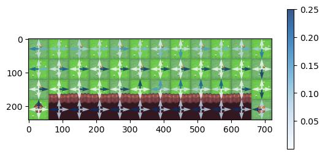

# rl-3. Statefulな場合2

## 実装の準備

手動でこのディレクトリ上の `*.py` ファイルをGoogle Colab上にアップロードするか、Google Colab上で以下を実行
```python
!curl -o envs.py https://raw.githubusercontent.com/AkinoriTanaka-phys/cs4mathphys/refs/heads/main/python_and_ml/rl_np/envs.py
!curl -o opts.py https://raw.githubusercontent.com/AkinoriTanaka-phys/cs4mathphys/refs/heads/main/python_and_ml/rl_np/opts.py
!curl -o policies.py https://raw.githubusercontent.com/AkinoriTanaka-phys/cs4mathphys/refs/heads/main/python_and_ml/rl_np/policies.py
```
この後以下を実行
```python
from envs import *
from opts import *
from policies import *
```

## Temporal Difference 学習

ここまでで モンテカルロ法ベースの方策訓練の実装を見てきましたが、statefulの場合のモンテカルロ推定は
- 1エピソード済むまで訓練パラメータの更新がなされない

ということがサンプル効率を悪くする原因になり得ます。これに対し、**Temporal Difference 学習 (TD学習)** と呼ばれる強化学習手法では、エピソード中のエージェントの行動選択後の環境変化の直後に訓練パラメータの更新を行います。崖渡りの環境（`CustomizedCliffWalking`）での両者の振る舞いを見ると違いがわかるかと思います：

|モンテカルロ法(REINFORCE)|TD学習(Actor-Critic)|
|:--:|:--:
||
|エピソード終了するまで矢印が変わらない|エピソードと並行して矢印が更新される

TD学習のイメージ図を書くと以下のようになっています：

<center>


</center>

エピソードと並行して方策のパラメータを更新していくため、
- 内部にモンテカルロ推定値を貯めておく必要がなく、モンテカルロ更新よりかなりシンプルな構造になっている
- 特にエピソード終了（`episode_over` が True）ではなくても `policy_update()` が毎回かかるため、方策の更新が早い

などが特徴です。このノートでは
- 価値に基づく手法：
    - SARSA
        ```python
        policy = EpsilonGreedyPolicy(env, epsilon=1)
        opt = SarsaOptimizer(policy, gamma=0.99, decay_r=0.99, lr=.1)
        ```
    - Q-learning
        ```python
        policy = EpsilonGreedyPolicy(env, epsilon=1)
        opt = QlearningOptimizer(policy, decay_r=0.99, lr=.1)
        ```
- 方策勾配法：
    - Actor-Critic
        ```python
        policy = SoftmaxPolicy(env)
        critic = Critic(policy)
        opt = ActorCriticOptimizer(policy, critic, gamma=.99, lr_c=.1, lr_a=.1)
        ```

の3つを使うことができます。また、以下の `opt` の機能は引き続き使えます：
- `opt.test()`: 現在の方策の良さを図るテストを行い、結果を記録
    - `opt.policy_update()`の後に使う想定
- `opt.plot_result()`: 上記のテスト結果をプロット


これらTD学習の正当化は **ベルマン方程式** によります。以下簡単に説明します。


### 価値に基づく手法

#### SARSA

行動価値関数のベルマン方程式

```math
Q_\pi(s_0, a_0) = \mathbb{E}_{r_1, s_1 \sim P_\text{env}(\cdot|s_0, a_0), a_1 \sim \pi(\cdot|s_1)}\Big[ r_1 + \gamma \cdot Q_\pi(s_1, a_1)\Big]
```

の右辺をモンテカルロ近似すれば良いというのがアイデアです。さらに
    
- **1サンプル近似** モンテカルロ法では1サンプルだけの近似でも（方策が大きく変わらない場合は）そこそこの精度が出ていたことを思い出すと、上の式を実際のサンプル $`(s_0, a_0, r_1, s_1, a_1)`$ を使って以下のように置き換えても良いでしょう
```math
Q_\pi(s_0, a_0) =  r_1 + \gamma \cdot Q_\pi(s_1, a_1)
``` 
- **モンテカルロ更新のロス関数的解釈** がありました：
<blockquote>
    
- ロス関数 $`l = \frac{1}{2}(\sum_{\tau=1}^\infty  \gamma^{\tau -1} r_{\tau}-\hat{Q}_\pi(s, a))^2`$
- 学習率 $`\eta = \frac{1}{N_\text{visit}(s, a)  + 1}`$
 
として

```math
\hat{Q}_\pi(s, a) \leftarrow \hat{Q}_\pi(s, a) - \eta \nabla_{\hat{Q}_\pi(s, a)} l
```
</blockquote>

これを上の**1サンプル近似**で真似ると、
- ロス関数 $`l = \frac{1}{2}(r_1 + \gamma \cdot Q_\pi(s_1, a_1) - Q_\pi(s_0, a_0))^2`$
- 学習率 $`\eta > 0`$

として
```math
\hat{Q}_\pi(s_0, a_0) 
\leftarrow \hat{Q}_\pi(s_0, a_0) - \eta \underbrace{\nabla_{\hat{Q}_\pi(s_0, a_0)} l }_{
Q_\pi(s_0, a_0) - (r_1 + \gamma \cdot Q_\pi(s_1, a_1))
}
```
が得られます。この際の $`\underbrace{}`$ は $`Q`$ が満たすべきベルマン方程式から、現在の推定値が1サンプルでどれだけ離れたかを表し、**TDエラー** と呼びます。また、このように行動価値関数のベルマン方程式に基づいたTD手法を **SARSA** と言います。

> なお、ベルマン方程式は次の「次」の時刻まで展開することもでき、その次まで...と拡張することができます。その場合はTD学習に時間幅がついていくことになります。これを n-step TD学習と言いますが今回は割愛します。

- **例：実際に訓練してみる(崖歩き)：**
    <details>
    <summary>クリックでプログラムの展開</summary>
    <blockquote>
    
    ```python
    env = CustomizedCliffWalking(render_mode="rgb_array", max_episode_steps=10000)

    policy = EpsilonGreedyPolicy(env, epsilon=1, seed=1)
    opt = SarsaOptimizer(policy, gamma = 0.99, decay_r=1, lr=.1)

    agt = Agent(policy)

    for episode in tqdm(range(1000)):
        episode_over = False
        s, info_env = env.reset()
        t = 0
        opt.reset_record()
        while not episode_over:
            s_ = s
            a_, info_agt = agt.step(s_)
            t += 1
            s, r, terminated, truncated, info_env = env.step(a_)
            # 方策をTD更新
            opt.policy_update(s_, a_, r, s)

            episode_over = terminated or truncated
        # $\epsilon$ の更新はエピソード後にやることにする（optで指定しても良いが、1にかなり近い値を取る必要がある）
        policy.epsilon*=.99
        # 現在の方策をテスト
        opt.test()

    opt.plot_result()
    ```
    > ```
    > 100%|██████████| 1000/1000 [00:04<00:00, 217.42it/s]
    > ```
    > 

    方策を図示してみますと：
    ```python
    env.plot_action(policy.softmax())
    ```
    > 

    となって、きちんとゴールできていることがわかります。SARSAのようなオンポリシー手法では一般に探索で悪いことがあるとそれを避けるような傾向があり、この方策も崖の際を歩くことを避けています。

    </blockquote>
    </details>

#### Q学習

SARSAと同じことをベルマン最適方程式

```math
Q_{\pi^*}(s_0, a_0) = \mathbb{E}_{r_1, s_1 \sim P_\text{env}(\cdot|s_0, a_0)}\Big[ r_1 + \gamma \cdot \max_{\tilde{a}_1}Q_{\pi^*}(s_1, \tilde{a}_1)\Big]
```

に適用したのが**Q学習**です。なお、この場合の推定量 $`Q_{\pi^*}(s_0, a_0)`$ は 探索用の方策に依存しないため、自然に **オフポリシー手法** となります。更新式は
- ロス関数 $`l = \frac{1}{2}(r_1 + \gamma \cdot \max_{\tilde{a}_1}Q_{\pi^*}(s_1, \tilde{a}_1) - Q_{\pi^*}(s_0, a_0))^2`$
- 学習率 $`\eta > 0`$

として
```math
\hat{Q}_{\pi^*}(s_0, a_0) 
\leftarrow \hat{Q}_{\pi^*}(s_0, a_0) - \eta \underbrace{\nabla_{\hat{Q}_{\pi^*}(s_0, a_0)} l }_{
Q_{\pi^*}(s_0, a_0) - (r_1 + \gamma \cdot \max_{\tilde{a}_1}Q_{\pi^*}(s_1, \tilde{a}_1))
}
```
です。$`\underbrace{}`$部分をやはり TDエラーと呼びます。

- **例：オンポリシー訓練(崖歩き)：**
    <details>
    <summary>クリックでプログラムの展開</summary>
    <blockquote>
    
    ```python
    env = CustomizedCliffWalking(render_mode="rgb_array", max_episode_steps=10000)

    policy = EpsilonGreedyPolicy(env, epsilon=1, seed=1)
    opt = QlearningOptimizer(policy, gamma = 0.99, decay_r=1, lr=.1)

    agt = Agent(policy)

    for episode in tqdm(range(1000)):
        episode_over = False
        s, info_env = env.reset()
        t = 0
        opt.reset_record()
        while not episode_over:
            s_ = s
            a_, info_agt = agt.step(s_)
            t += 1
            s, r, terminated, truncated, info_env = env.step(a_)
            # 方策をTD更新
            opt.policy_update(s_, a_, r, s)

            episode_over = terminated or truncated
        # $\epsilon$ の更新はエピソード後にやることにする（optで指定しても良いが、1にかなり近い値を取る必要がある）
        policy.epsilon*=.995
        # 現在の方策をテスト
        opt.test()

    opt.plot_result()
    ```
    > ``` 
    > 100%|██████████| 1000/1000 [00:06<00:00, 150.95it/s]
    > ```
    > 

    方策を図示してみますと：
    ```python
    env.plot_action(policy.softmax())
    ```
    > 

    となって、ゴールできているばかりか、ほぼ最適経路を通っていることがわかります。これはQ学習がオフポリシー設定であることと関係しています。学習している方策が探索用の方策に依存しないため、探索中に悪い出来事があっても積極的な方策を持ち続けることができます。
    </blockquote>
    </details>
- **例：オフポリシー訓練(崖歩き)：**
    <details>
    <summary>クリックでプログラムの展開</summary>
    <blockquote>
    
    ```python
    env = CustomizedCliffWalking(render_mode="rgb_array", max_episode_steps=10000)

    # target_policy で探索はしないので、最初から貪欲 $\epsilon=0$ で良い
    target_policy = EpsilonGreedyPolicy(env, epsilon=0, seed=1)
    opt = QlearningOptimizer(target_policy, gamma = 0.99, decay_r=1, lr=.1)

    # 一様ランダムな行動をとる方策で探索
    behavior_policy = RandomPolicy(env)
    agt = Agent(behavior_policy)

    # behavior_policy は全然ゴールできないので、（待つのが面倒なので）回数は少なめにする
    for episode in tqdm(range(100)):
        episode_over = False
        s, info_env = env.reset()
        t = 0
        opt.reset_record()
        while not episode_over:
            s_ = s
            a_, info_agt = agt.step(s_)
            t += 1
            s, r, terminated, truncated, info_env = env.step(a_)
            # 方策をTD更新
            opt.policy_update(s_, a_, r, s)

            episode_over = terminated or truncated
        # $\epsilon$ の更新は不要
        #policy.epsilon*=.99
        # 現在の方策をテスト
        opt.test()

    opt.plot_result()
    ```
    > ```
    > 100%|██████████| 100/100 [00:05<00:00, 16.84it/s]
    > ```
    > 

    方策を図示してみますと：
    ```python
    env.plot_action(policy.softmax())
    ```
    > 

    となって、やはりほぼ最適経路を通っていることがわかります。
    </blockquote>
    </details>

### 方策勾配法

方策勾配の更新式
```math
\theta \leftarrow \theta + \eta \sum_{t=0}^\infty \gamma^t \mathbb{E}_{s_0, a_0, s_1, a_1, \dots, s_t, a_t}[A_{\pi_\theta}(s_t, a_t) \nabla_\theta \log \pi_\theta(a_t|s_t)]
```

ですが、これもTD的な更新式にすることができます。

#### Actor-Critic

アドバンテージ関数の部分を展開します：

```math
\begin{align*}
A_{\pi_\theta}(s_t, a_t) 
&=
\underbrace{Q_{\pi_\theta}(s_t, a_t)}_\text{ベルマン方程式を使う} - V_{\pi_\theta}(s_t)\\
&=
\mathbb{E}_{r_{t+1}, s_{t+1} \sim P_\text{env}(\cdot|s_t, a_t)} \Big[r_{t+1} + \gamma V_{\pi_\theta}(s_{t+1})\Big] - V_{\pi_\theta}(s_t) \\
&=
\mathbb{E}_{r_{t+1}, s_{t+1} \sim P_\text{env}(\cdot|s_t, a_t)} \Big[r_{t+1} + \gamma V_{\pi_\theta}(s_{t+1}) - V_{\pi_\theta}(s_t) \Big]
\end{align*}
```
そうすると期待値の中身に、**状態価値関数に関するTDエラー** が現れます。

さらに、最初の更新式の和がちょうど時間方向に伸びているため、$`\theta`$ の変化量が少しずつだと思えば、エピソード中に逐次上の **状態価値関数に関するTDエラー** でアドバンテージを近似してパラメータ更新しても統計的に悪くないでしょう。

唯一残る懸念は $`V_{\pi_\theta}(s)`$ を知らないことです。ですがこの値もSARSAと同じようなTD学習で推定することができます。この状態価値の推定器のことを **批評家(Critic)** と言います。これは方策の **行動選択者(actor)** としての振る舞いを批評するという意味合いの命名と思われ、**Actor-Critic手法**と呼ばれます。

イメージ的にはエージェント内に自己評価する別のモデルがいる感じになります：
```python
env = ...
policy = ...
critic = Critic(policy)

opt = ActorCriticOptimizer(policy, critic, lr_c=0.1, lr_a=0.1)
agt = Agent(policy, critic=critic) # エージェントに食わせる必要はないですが、雰囲気を出すため
```

<center>


</center>

- **例：実際に訓練してみる(崖歩き)：**
    <details>
    <summary>クリックでプログラムの展開</summary>
    <blockquote>

    ```python
    env = CustomizedCliffWalking(render_mode="rgb_array", max_episode_steps=10000)

    policy = SoftmaxPolicy(env, seed=1)
    critic = Critic(policy)
    opt = ActorCriticOptimizer(policy, critic, gamma=.99, lr_c=.1, lr_a=.1)

    agt = Agent(policy, critic=critic)

    for episode in tqdm(range(1000)):
        episode_over = False
        s, info_env = env.reset()
        t = 0
        opt.reset_record()
        while not episode_over:
            s_ = s
            a_, info_agt = agt.step(s_)
            t += 1
            s, r, terminated, truncated, info_env = env.step(a_)
            # 方策をTD更新
            opt.policy_update(s_, a_, r, s)

            episode_over = terminated or truncated

        # 現在の方策をテスト
        opt.test()

    opt.plot_result()
    ```
    > ```
    > 100%|██████████| 1000/1000 [00:04<00:00, 249.17it/s]
    > ```
    > 

    estimated value の方は、criticの値を使っています。方策を見てみると：

    ```python
    env.plot_action(policy.softmax())
    ```
    > 

    となって、ほぼ最適経路を通っていることがわかります。ですが、Actor-Criticは基本的にオンポリシーなので、崖に落ちた記憶をやや引きずっているのかもしれません。

    </blockquote>
    </details>

$\blacksquare$ **練習問題1:** モンテカルロ法のセクションで使った崖歩きの環境（`env = EasyCliffWalking(render_mode="rgb_array", max_episode_steps=300)`）でも以下のいずれか：
```python
# EpsilonGreedyPolicy の場合
policy = EpsilonGreedyPolicy(env, epsilon=1)
opt = SarsaOptimizer(policy, gamma=0.99, decay_r=0.99, lr=.1) # パラメータは変えても良いです
# or
opt = QlearningOptimizer(policy, decay_r=0.99, lr=.1)

# SoftmaxPolicy の場合
policy = SoftmaxPolicy(env, seed=1)
critic = Critic(policy)
opt = ActorCriticOptimizer(policy, critic, gamma=1, lr_c=.1, lr_a=.1) # パラメータは変えても良いです
```
を使ってうまく訓練できることを確かめてみてください。
> [!TIP]
> <details>
> <summary>解答例</summary>
> 
>以下どれでもそれなりにうまくいくパラメータ設定です。色々試してみたところ、`ActorCriticOptimizer` は訓練が難しく、壁に寄ってしまう傾向がありました。`gamma` が大きいとそれでも保守的な形でゴールできるようです。（**Easy**CliffWalkingという命名は良くなかったかもしれません。）
>```python
>env = EasyCliffWalking(render_mode="rgb_array", max_episode_steps=300)
>
>policy = EpsilonGreedyPolicy(env, epsilon=1)
>opt = SarsaOptimizer(policy, gamma=0.99, decay_r=0.99, lr=.1) 
>#opt = QlearningOptimizer(policy, decay_r=0.99, lr=.1)
>
># policy = SoftmaxPolicy(env, seed=1)
># critic = Critic(policy)
># opt = ActorCriticOptimizer(policy, critic, gamma=1, lr_c=.1, lr_a=.1)
>
>agt = Agent(policy, critic=critic)
>
>for episode in tqdm(range(1000)):
>     episode_over = False
>     s, info_env = env.reset()
>     t = 0
>     opt.reset_record()
>     while not episode_over:
>          s_ = s
>          a_, info_agt = agt.step(s_)
>          t += 1
>          s, r, terminated, truncated, info_env = env.step(a_)
>          # 方策をTD更新
>          opt.policy_update(s_, a_, r, s)
>
>          episode_over = terminated or truncated
>
>     # 現在の方策をテスト
>     opt.test()
>
>opt.plot_result()
>```
> </details>


### モデルベース強化学習

モンテカルロ法でも言えることですが、TD手法を素朴に適応した場合、エージェントが折角良い経験をしても、その経験が訓練に反映されるのは1度きりで、これまでの経験は基本的に廃棄してしまいます。これは勿体無い気がします。

折角環境のデータがあるので、例えば $`P_\text{env}`$ の振る舞いも同時に学習するモデルを得ることができれば、実際の環境と相互作用しなくても環境モデルと相互作用することで強化学習のルーチンを回すことができます。これを **モデルベース強化学習** と言います。ここでは **Dyna-Q** と呼ばれる、単に環境の振る舞いを記憶しただけのモデルを導入できるようにしています：
```python
env = ...
policy = ...
opt = QlearningOptimizer()

model = Model(env) 
agt = Agent(policy, model=model) # エージェントに食わせる必要はないですが、雰囲気を出すため
```

以下のように `model.update(s_, a_, r, s)` で環境の振る舞いをモデル化（ここでは記憶するだけ）し、`model.simulate()` で環境の1ステップシミュレート結果 `s_, a_, r, s` を返します：

<center>


</center>

経験のリプレイはその時の方策に依存するため、おそらくオフポリシーであるQ学習を使うのが適切でしょう。ゴールになかなか辿りつきにくいケースなどで有用です。

- **例：実際に訓練してみる(崖歩き)：**
    <details>
    <summary>クリックでプログラムの展開</summary>
    <blockquote>
    
    ```python
    env = CustomizedCliffWalking(render_mode="rgb_array", max_episode_steps=10000)

    policy = EpsilonGreedyPolicy(env, epsilon=1, seed=1)
    opt = QlearningOptimizer(policy, gamma = 0.99, decay_r=1, lr=.1)

    # モデルをエージェント内部に設置
    agt = Agent(policy, model=Model(env))

    for episode in tqdm(range(1000)):
        episode_over = False
        s, info_env = env.reset()
        t = 0
        opt.reset_record()
        while not episode_over:
            s_ = s
            a_, info_agt = agt.step(s_)
            t += 1
            s, r, terminated, truncated, info_env = env.step(a_)
            # 方策をTD更新
            opt.policy_update(s_, a_, r, s)
            # モデルを更新
            agt.model.update(s_, a_, r, s)

            # モデルによるシミュレーションで自己訓練 (planning)
            for _ in range(5):
                S_, A_, R, S = agt.model.simulate()
                opt.policy_update(S_, A_, R, S)

            episode_over = terminated or truncated
        # $\epsilon$ の更新はエピソード後にやることにする（optで指定しても良いが、1にかなり近い値を取る必要がある）
        policy.epsilon*=.995
        # 現在の方策をテスト
        opt.test()

    opt.plot_result()
    ```
    > ```
    > 100%|██████████| 1000/1000 [00:33<00:00, 29.67it/s]
    > ```
    > 

    モデルシミュレーションによる訓練ステップを毎回の行動ごとに入れたので少し時間がかかるのがわかります。方策を見てみると：

    ```python
    env.plot_action(policy.softmax())
    ```
    > 

    となって、ほぼ最適経路を通っていることがわかります。
    </blockquote>
    </details>

$\blacksquare$ **練習問題2:** 凍った池環境
```python
env = CustomizedFrozenLake(is_slippery=False, 
                     render_mode="rgb_array", 
                     max_episode_steps=300)
```
での訓練を Dyna-Q で実行してみてください。

> [!TIP]
> <details>
> <summary>解答例</summary>
> 
>以下の設定でうまくいきます（ですが、環境モデルなしでもうまくいくようです。環境モデルがないと上手くいかない、といううまい例も他に多分あると思うのですが...）
>```python
>env = CustomizedFrozenLake(is_slippery=False, 
>                     render_mode="rgb_array", 
>                     max_episode_steps=300)
>
>policy = EpsilonGreedyPolicy(env, epsilon=1, seed=1)
>opt = QlearningOptimizer(policy, gamma = 0.99, decay_r=1, lr=.1)
>
># モデルをエージェント内部に設置
>agt = Agent(policy, model=Model(env))
>
>for episode in tqdm(range(200)):
>     episode_over = False
>     s, info_env = env.reset()
>     t = 0
>     opt.reset_record()
>     while not episode_over:
>          s_ = s
>          a_, info_agt = agt.step(s_)
>          t += 1
>          s, r, terminated, truncated, info_env = env.step(a_)
>          # 方策をTD更新
>          opt.policy_update(s_, a_, r, s)
>          # モデルを更新
>          agt.model.update(s_, a_, r, s)
>
>          # モデルによるシミュレーションで自己訓練 (planning)
>          for _ in range(5):
>               S_, A_, R, S = agt.model.simulate()
>               opt.policy_update(S_, A_, R, S)
>
>          episode_over = terminated or truncated
>     # $\epsilon$ の更新はエピソード後にやることにする（optで指定しても良いが、1にかなり近い値を取る必要がある）
>     policy.epsilon*=.99
>     # 現在の方策をテスト
>     opt.test()
>
>opt.plot_result()
>```
> </details>

## マルチエージェント強化学習によるゲーム学習

最後にオマケとして、マルチエージェント強化学習をやってみます。これまでの強化学習は
- エージェントが一人いて
- それが（変化しない）環境と相互作用する

という設定でした。これを一般化して

- エージェントが複数いて
- それが（変化しない）環境と相互作用する

ということを考えることもできます。環境のルールが変化しなくても、あるエージェントにとっては他のエージェントの振る舞いは訓練によって変化し得るので、これまでの強化学習の方策改善の考えだけでうまくいくかはよくわからないのですが、素朴にそれぞれのエージェントに強化学習手法を適用してうまくいくことが多いです。ここでは2プレイヤーの簡単なゲームを以下で作成できるようにしておきました：

```python
env = Count(N_lose=13, N_action=3)
```
この環境（上のパラメータ設定、**13を先に言ったら負けゲーム**）のルールは
- 各プレイヤーが交互に行動 $`a \in \{1,2,3\}`$ をとる
- 環境の初期状態 $`s=0`$ から始まり、プレイヤーが行動を選ぶと $`s' = s+a`$ となる
- 各プレイヤーは $`s'`$ が 13 を超えると負け（$`r=-1`$）
- 相手プレイヤーが負けの場合、残りのプレイヤーが勝利（$`r=+1`$）

というものです。この環境は GymnasiumではなくPettingZooという別ライブラリのクラスを継承して作っています。PettingZooはマルチエージェント用の環境を提供するライブラリで、使い方がこれまでと少し違いますが、詳しくは
- [4-2. 強化学習の環境ライブラリ](../section4/4-2.md)

の後半を見てください。

### TD手法と自己対戦で訓練

まず、このゲームは完全情報ゲームなので、先攻/後攻のどちらかが必勝のはずです。そこで訓練の指標として、先攻/後攻の勝率を記録できるようにしておきます：

```python
def test(env, agts, N_games=100):
    wins = {"player_0": 0,"player_1": 0}
    for episode in range(N_games):
        env.reset()
        for agent in env.agent_iter():
            s, r, termination, truncation, info = env.last()

            if termination or truncation:
                a = None
            else:
                a, info_agt = agts[agent].step(s)

            if r > 0:
                wins[agent] +=1
            env.step(a)   
    return {"player_0": wins['player_0']/N_games, "player_1": wins['player_1']/N_games}
```

これを定義したのち、以下で自己対戦による訓練ができます：
```python

env = Count() # デフォルトで上のパラメータルールになります

# actor-critic
# policy = SoftmaxPolicy(env, epsilon=1, seed=42)
# critic = Critic(policy)
# agt = Agent(policy, critic=critic)
# opt0 = ActorCriticOptimizer(policy, critic=critic, gamma=.99, lr_c=.1, lr_a=.1)
# opt1 = ActorCriticOptimizer(policy, critic=critic, gamma=.99, lr_c=.1, lr_a=.1)

policy = EpsilonGreedyPolicy(env, epsilon=1, seed=42)
# SARSA
# opt0 = SarsaOptimizer(policy, gamma=.99, decay_r=0.999, lr=.01)
# opt1 = SarsaOptimizer(policy, gamma=.99, decay_r=0.999, lr=.01)
# Qlearning
opt0 = QlearningOptimizer(policy, gamma=.99, decay_r=0.999, lr=.01)
opt1 = QlearningOptimizer(policy, gamma=.99, decay_r=0.999, lr=.01)

agt = Agent(policy)
agts = {"player_0": agt, "player_1": agt}
opts = {"player_0": opt0, "player_1": opt1}

wins = {"player_0": [], "player_1": []}

for episode in range(5000):
    env.reset()
    ts = {"player_0": 0, "player_1": 0}
    s_before = {"player_0": 0, "player_1": 0}
    a_before = {"player_0": 0, "player_1": 0}
    for agent in env.agent_iter():
        s, r, termination, truncation, info = env.last()

        if termination or truncation:
            a = None
        else:
            a, info_agt = agts[agent].step(s)
            #print(a)

        opts[agent].policy_update(s_before[agent], a_before[agent], r, s, t=ts[agent]+1)
        
        s_before[agent] = s
        a_before[agent] = a
        ts[agent]+=1
        env.step(a)
        #print(obs, r, termination, truncation, info)
    if episode % 100 == 0:
        results = test(env, agts, N_games=100)
        wins["player_0"].append(results["player_0"])
        wins["player_1"].append(results["player_1"])

plt.plot(wins["player_0"], label="player_0 win rate")
plt.plot(wins["player_1"], label="player_1 win rate")
plt.legend()
```
> 

後攻がほぼ勝率100%になるようです。どうもこのゲームは後攻必勝なことが簡単に証明できるようです。訓練後の方策を相手にゲームを遊ぶこともできます：
```python
You = Agent(YourPolicy(env))

# あなたが先攻の場合
agts = {"player_0": You, "player_1": agt}
# あなたが後攻の場合
#agts = {"player_0": agt, "player_1": You}

for episode in range(1):
    env.reset()
    for agent in env.agent_iter():
        s, r, termination, truncation, info = env.last()
        print(f"{agts[agent].policy.__class__}'s turn, n={s}")

        if termination or truncation:
            a = None
        else:
            a, info_agt = agts[agent].step(s)

        if r > 0:
            print(f"{agts[agent].policy.__class__} wins.")
            break

        print(f"choice = {a}")
        env.step(a)
```

$\blacksquare$ **練習問題3:** 
```python
env = Count(N_lose=30, N_action=3)
``` 
で自己対戦させてどうなるかみてみてください。なお、
- https://mcm-www.jwu.ac.jp/~mathphys/mejirosai/m/2023/3.aiki/images/count30.pdf

での解析でどちらが勝つかの公式が示されており、それが `Count` クラスに実装してあります。`env.theoretical_winner` で出力できるようになっています。

> [!TIP]
> <details open>
> <summary>解答例</summary>
> 
> コーディングはほとんど同じなので略。この設定では先攻が勝つようになるようです。
> </details>

[前のsection](2.md) | 