# 2-1. 配列と図のプロット

## 配列を取り扱うライブラリ `numpy`

すでに **リスト** や **タプル** といったオブジェクトを取り扱いました。このような「何かベクトル値のようなもの」を扱う際に便利なのが `numpy` というライブラリです。インポート文は
```python
import numpy as np
```
と書くのが世界共通で通例となっています。

以下ではその機能の全てを説明することはできません。より詳細は公式のドキュメント
- https://numpy.org/doc/stable/

を参照してください。

### numpyの配列について

`numpy` の配列は リストではなく、独自のオブジェクトです。一番わかりやすい作り方は、Pythonのリストから作成することです：
```python
np.array(リスト)
```
- 簡単な配列をリストから作ってみます：
    ```python
    np.array([1, 2, 3])
    ```
    > ```
    > array([1, 2, 3])
    > ```
    型を見てみます
    ```python
    type(np.array([1, 2, 3]))
    ```
    > ```
    > numpy.ndarray
    > ```
- 配列は `.tolist()` でリスト化できます
    ```python
    x_np = np.array([1, 2, 3])
    x_list = x_np.tolist()
    type(x_list)
    ```
    > ```
    > list
    > ```
- 配列はそのまま for ループに使うことができます：
    ```python
    x_np = np.array([1, 2, 3])
    for x in x_np:
        print(x)
    ```
    > ```
    > 1
    > 2
    > 3
    > ```
    
#### 配列の型： `dtype`

さて、Pythonで取り扱える数値には `int` や `float` などがありましたが、numpy でもこれらの型が設定されていることがわかります。型の情報は
```python
配列.dtype
```
という変数に格納されています。
- 例
    ```python
    x_np = np.array([1, 2, 3])
    x_np.dtype
    ```
    > ```
    > dtype('int64')
    > ```
    64というのは 64ビット （= $2^{64}$ 通りが表現できる） のメモリのことで、概ね表現できる整数の上限に対応します。最初の2ビットで正負、残りの 63ビット = $2^{63}$ で絶対値を表すということらしいです。
- dtypeは作成時に指定できます
    例えば32ビットの整数の配列にしたい場合、以下のように `dtype` という引数を指定すれば良いです。
    ```python
    x_np = np.array([1, 2, 3], dtype=np.int32)
    x_np.dtype
    ```
    > ```
    > dtype('int32')
    > ```
- dtypeを変更した配列を新しく作ることもできます
    例えば上の int32 の配列から float32 の配列を作る：
    ```python
    y_np = x_np.astype(np.float32)
    y_np.dtype
    ```
    > ```
    > dtype('float32')
    > ```

#### 配列の形：`shape`

リストのリストを作ることができます。例えば
```python
x_list = [[1, 2], 
          [3, 4],
          [5, 6]]
```
これは、3つの長さ2のリスト が格納されたリストです。これを numpy の配列にすることももちろんできます。
```python
x_np = np.array(x_list)
x_np
```
> ```
> array([[1, 2],
>        [3, 4],
>        [5, 6]])
>```

この時の、**3**つの長さ**2**の配列からなる配列という情報のための変数が `.shape` です：
```python
x_np.shape
```
> ```
> (3, 2)
> ```

`.shape` はタプルとして返されます。

$\blacksquare$ **練習問題1:** shape が (1, 3, 2) であるような numpy 配列を作って、自分でshapeを確かめてください。
> [!TIP]
> <details>
> <summary>解答例</summary>
> 
> ```python
> x_list = [
>           [[1, 2], 
>            [3, 4],
>            [5, 6]]
>          ]
> x_np = np.array(x_list)
> x_np.shape
> ```
> > ```
> > (1, 3, 2)
> > ```
> </details>

#### 単純な配列の生成関数

リストから作るのはわかりやすいのですが、サイズが大きくなると面倒です。numpy では直接「こういう配列を作って」と指定することで、単純な配列であれば自動生成してくれる関数がいくつか存在します。

よく使うものをまとめます：
- `np.ones(shape, dtype)`: 指定した型とshapeで、成分が全て1の配列を返す
    例
    ```python
    np.ones(shape=(2, 9))
    ```
    > ```
    > array([[1., 1., 1., 1., 1., 1., 1., 1., 1.],
    >    [1., 1., 1., 1., 1., 1., 1., 1., 1.]])
    > ```
- `np.zeros(shape, dtype)`: 指定した型とshapeで、成分が全て0の配列を返す
    例
    ```python
    np.zeros(shape=(2, 9))
    ```
    > ```
    > array([[0., 0., 0., 0., 0., 0., 0., 0., 0.],
    >        [0., 0., 0., 0., 0., 0., 0., 0., 0.]])
    > ```
- `np.arange(start, stop, step)`: `start` から `stop-1` まで `step` ごとに区切った整数からなる配列を返す
    例
    ```python
    np.arange(1, 10)
    ```
    > ```
    > array([1, 2, 3, 4, 5, 6, 7, 8, 9])
    > ```
- `np.linspace(start, stop, num)`: `start` から `stop` まで、`num` 個に等分割したfloatからなる配列を返す
    例
    ```python
    np.linspace(0, 1, 11)
    ```
    > ```
    > array([0. , 0.1, 0.2, 0.3, 0.4, 0.5, 0.6, 0.7, 0.8, 0.9, 1. ])
    > ```


### 配列の操作

numpyの配列を操作するための関数が多数存在します。ここではよく使うと思われるものに限定して紹介します。

#### 形を変える

shapeを変更した新たな配列を作ることも可能です。それには 
```python
配列.reshape(新しいshape)
```
とします。

- 例
    ```python
    x_np = np.array([[1, 2],
                     [3, 4],
                     [5, 6]])
    y_np = x_np.reshape(6,)
    y_np
    ```
    > ```
    > array([1, 2, 3, 4, 5, 6])
    > ```

#### 成分を抜き出す

shape が `(M, N)` の配列は行列と同じです。そうすると、shape が `(M, N, L, ...)` であるような配列はテンソルに対応するような多次元配列と考えることができます。リストの要素に `リスト[番号]` でアクセスできたように、配列も 
```python
配列[m, n, l, ...]
```
で対応する成分を抜き出すことができます。

- 例：次のような配列を考えます
    ```python
    x_np = np.arange(36).reshape(3, 3, 4)
    x_np
    ```
    > ```
    > array([[[ 0,  1,  2,  3],
    >         [ 4,  5,  6,  7],
    >         [ 8,  9, 10, 11]],
    > 
    >     [[12, 13, 14, 15],
    >         [16, 17, 18, 19],
    >         [20, 21, 22, 23]],
    > 
    >     [[24, 25, 26, 27],
    >         [28, 29, 30, 31],
    >         [32, 33, 34, 35]]])
    > ```
    この配列の [0, 1, 2] 成分を取り出す：
    ```python
    print(f"x_np[0, 1, 2] = {x_np[0, 1, 2]}")
    ```
    > ```
    > x_np[0, 1, 2] = 6
    > ```

さらに、各軸の番号指定で、自然数 `m` の代わりに `m1:m2` とすると、m番目から n-1 番目の要素だけを抜き出してくれます：
```python
配列[m1:m2, n, l, ...]  # 最初の軸の部分要素を抜き出す
```
これを **スライス** といいます。

- 例
    <blockquote>

    ```python
    x_np[0:2, 1, 2]
    ```
    > ```
    > array([ 6, 18])
    > ```
    </blockquote>

なお、スライスの両端は省略しても良いです。その意味は：
- `:n` = `0:n`：最初の成分から n-1 まで
    例：
    ```python
    x_np[:2, 1, 2]
    ```
    > ```
    > array([ 6, 18])
    > ```
- `m:` = `m:その軸の最大値`：m番目から最後の成分まで
    例：
    ```python
    x_np[1:, 1, 2]
    ```
    > ```
    > array([18, 30])
    > ```
- `:` = `0:その軸の最大値`：その軸の全成分
    例
    ```python
    x_np[:, 1, 2]
    ```
    > ```
    > array([ 6, 18, 30])
    > ```

です。


#### 転置


shape の各軸の数は変えたくないけど、軸の順番を入れ替えたい時は
```python
np.transpose(配列, axes=(入れ替え後の順番をタプルで指定))
```
とします。
- 軸の数が2の場合は行列の転置と同じ：
    ```python
    x_np = np.arange(6).reshape(3, 2)
    print(f"old array =\n{x_np}")

    y_np = np.transpose(x_np, axes=(0, 1)) # これは元の順番
    print(f"new array1 =\n{y_np}")

    z_np = np.transpose(x_np, axes=(1, 0)) # これは転置
    print(f"new array2 =\n{z_np}")
    ```
    >```
    > old array =
    > [[1 2]
    >  [3 4]
    >  [5 6]]
    > new array1 =
    > [[1 2]
    >  [3 4]
    >  [5 6]]
    > new array2 =
    > [[1 3 5]
    >  [2 4 6]]
    > ```
- より一般の配列の場合は、テンソルの転置と思えば良いです。

#### 結合

二つの配列を結合するのが以下の関数です。
```python
np.concatenate(結合したい配列のリスト, axis=どの軸に沿って結合するか)
```
- 例
    ```python
    x_np = np.ones(6).reshape(2, 3)
    #    = array([[1., 1., 1.],
    #             [1., 1., 1.]])
    y_np = np.zeros(3).reshape(1, 3)
    #    = array([[0., 0., 0.]])
    ```
    この例では `x_np.shape` は (2, 3)、`y_np.shape` は (1, 3) になっています。3が共通なので、0番目の軸に沿った結合が可能です：
    ```python
    np.concatenate([x_np, y_np], axis=0)
    ```
    > ```
    > array([[1., 1., 1.],
    >        [1., 1., 1.],
    >        [0., 0., 0.]])
    > ```
    `axis=1` で結合しようとするとエラーが出ます。

結合するリストの要素数は何個でも0K。

### 配列の演算

配列には様々な演算を施すことができます。

#### 演算ルール：broadcast

numpyの配列の演算ルールを **ブロードキャスト** と言います。
- 配列と数値の間の演算＝全成分に数値が作用
    - 四則演算
        ```python
        x_np = np.ones(3)
        #    = array([1., 1., 1.])
        x_np + 10
        ```
        > ```
        > array([11., 11., 11.])
        > ```
    - 数量比較
        ```python
        x_np = np.arange(3)
        #    = array([0, 1, 2])
        x_np == 2
        ```
        > ```
        > array([False, False,  True])
        > ```
        なお 真偽値は `True`が1 `False`が0 と考えて良いです。1を掛け算するとそのことがわかります：
        ```python
        (x_np == 2)*1
        ```
        > ```
        > array([0, 0, 1])
        > ```

- 同じ形の配列の間の演算＝成分ごと
    - 四則演算
        ```python
        x_np = np.array([[0., 0., 0.],
                         [1., 1., 1.],
                         [2., 2., 2.]])
        y_np = np.array([[3., 3., 3.],
                         [4., 4., 4.],
                         [5., 5., 5.]])
        x_np*y_np
        ```
        > ```
        > array([[ 0.,  0.,  0.],
        >        [ 4.,  4.,  4.],
        >        [10., 10., 10.]])
        > ```
    - 数量比較
        ```python
        np.arange(6).reshape(3, 2) < np.ones(6).reshape(3, 2)
        ```
        > ```
        > array([[ True, False],
        >        [False, False],
        >        [False, False]])
        > ```
    - 初等関数の適用
        ```python
        x_np = np.linspace(0, np.pi/2, 4)
        #    = np.array([0.        , 0.52359878, 1.04719755, 1.57079633])
        np.sin(x_np)
        ```
        > ```
        > array([0.       , 0.5      , 0.8660254, 1.       ])
        > ```


ブロードキャストは便利ですが、時に意図しない処理がエラーなく動いてしまうため注意が必要です。

$\blacksquare$ **練習問題2:** 以下の配列（$2^n, n=0,1,...,11$ を (3, 4) の shape に並べたもの）
```
array([[   1,    2,    4,    8],
       [  16,   32,   64,  128],
       [ 256,  512, 1024, 2048]])
```
をコマンドだけで作ってください。
> [!TIP]
> <details>
> <summary>解答例</summary>
> 
> ```python
> 2**np.arange(12).reshape(3,4)
> ```
> > ```
> > array([[   1,    2,    4,    8],
> >        [  16,   32,   64,  128],
> >        [ 256,  512, 1024, 2048]])
> > ```
> </details>

$\blacksquare$ **練習問題3:** 以下の配列（shape が (3, 5) で順番に 0, 1 が入ったもの）
```
array([[1, 0, 1, 0, 1],
       [0, 1, 0, 1, 0],
       [1, 0, 1, 0, 1]])
```
をコマンドだけで作ってください。
> [!TIP]
> <details>
> <summary>解答例</summary>
> 
> ```python
> (np.arange(15).reshape(3,5)%2==0)*1
> ```
> > ```
> > array([[1, 0, 1, 0, 1],
> >        [0, 1, 0, 1, 0],
> >        [1, 0, 1, 0, 1]])
> > ```
> </details>

$\blacksquare$ **練習問題4:** 以下の配列
```python
x_np = np.arange(12).reshape(6, 2)
#    = array([[ 0,  1],
#             [ 2,  3],
#             [ 4,  5],
#             [ 6,  7],
#             [ 8,  9],
#             [10, 11]])
```
をスライスすることで `array([ 0,  2,  4,  6,  8, 10])` を作ってください。
> [!TIP]
> <details>
> <summary>解答例</summary>
> 
> ```python
> x_np[:, 0]
> ```
> > ```
> > array([ 0,  2,  4,  6,  8, 10])
> > ```
> </details>

#### 軸方向の和と積

配列をテンソル表記して $x_{ijkl}$ のように書いたとして、

$$
\sum_i x_{ijkl}
$$

のような演算を施すことができます：
```python
np.sum(配列, axis=和を取りたい軸)
```
- 例
    ```python
    x_np = np.arange(6).reshape(3, 2)
    #    = array([[0, 1],
    #             [2, 3],
    #             [4, 5]])
    ```
    この時、axis=0 で和をとると
    ```python
    np.sum(x_np, axis=0, keepdims=True)
    ```
    > ```
    > array([[6, 9]])
    > ```
    となり、axis=1 で和をとると
    ```python
    np.sum(x_np, axis=1, keepdims=True)
    ```
    > ```
    > array([[1],
    >        [5],
    >        [9]])
    > ```
    となります。

積を取ることもできます。
```python
np.prod(配列, axis=積を取りたい軸)
```
- 例
    ```python
    x_np = np.arange(6).reshape(3, 2)
    #    = array([[0, 1],
    #             [2, 3],
    #             [4, 5]])
    ```
    この時、axis=0 で積をとると
    ```python
    np.prod(x_np, axis=0, keepdims=True)
    ```
    > ```
    > array([[ 0, 15]])
    > ```
    となり、axis=1 で積をとると
    ```python
    np.prod(x_np, axis=1, keepdims=True)
    ```
    > ```
    > array([[ 0],
    >        [ 6],
    >        [20]])
    > ```
    となります。

#### 統計量の計算

平均は `sum` を軸の次元で割れば計算できますが、以下を使うと割り算までやってくれます
```python
np.mean(配列, axis=平均を取りたい軸)
# あるいは np.average でもOK
```
- 例
    ```python
    x_np = np.arange(6).reshape(3, 2)
    #    = array([[0, 1],
    #             [2, 3],
    #             [4, 5]])
    ```
    この時、axis=0 で平均をとると
    ```python
    np.mean(x_np, axis=0, keepdims=True)
    ```
    > ```
    > array([[2., 3.]])
    > ```
    となり、axis=1 で積をとると
    ```python
    np.mean(x_np, axis=1, keepdims=True)
    ```
    > ```
    > array([[0.5],
    >        [2.5],
    >        [4.5]])
    > ```
    となります。

分散も計算できます：
```python
np.std(配列, axis=分散を計算したい軸)
```
- 例
    ```python
    x_np = np.arange(6).reshape(3, 2)
    #    = array([[0, 1],
    #             [2, 3],
    #             [4, 5]])
    ```
    この時、axis=0 で平均をとると
    ```python
    np.std(x_np, axis=0, keepdims=True)
    ```
    > ```
    > array([[1.63299316, 1.63299316]])
    > ```
    となり、axis=1 で積をとると
    ```python
    np.std(x_np, axis=1, keepdims=True)
    ```
    > ```
    > array([[0.5],
    >        [0.5],
    >        [0.5]])
    > ```
    となります。


### 疑似乱数の使用

[1-2. クラスとカプセル化](../section1/1-2.md) の **練習問題3** で擬似乱数生成器を作りましたが、そこでのものより遥かに良い擬似乱数生成器が numpy で定義されています。現在推奨されている使用法は以下のようなものです：
```python
rng = np.random.default_rng(seed=何か自然数)
rng.乱数生成コマンド()
```
`rng` として最初に乱数生成を制御するオブジェクトを作っておき、それのメソッドとして乱数生成を行うという仕様です。

> [!NOTE]
> ただし、このような仕様になったのは numpy の バージョン1.17 からで、割と最近です。なので、ネット上にあるプログラムでは レガシー版 の乱数生成が使われていることも少なくありません。レガシー版ではグローバルに何らかの整数でシードをきめ、`np.random` で定義されている関数で乱数生成する仕様で書いているコードが多い印象です：
> ```python
> np.seed(何か自然数)
> np.random.乱数生成コマンド()
> ```
> ただし、`乱数生成コマンド` に当たる部分の命名規則はほとんど変わっていないので、レガシー版を読むのもそう大変ではないと思います。

私がよく使う乱数配列生成コマンドを列挙します。詳しい使い方は `help()` 関数で見てください。
- `.choice()` リストの中から要素を選ぶ：
    ```python
    rng = np.random.default_rng()
    l = ["りんご", "みかん", "いちご"]
    p = [1/2, 1/4, 1/4]

    rng.choice(l, p=p, size=(10,))
    ```
    > ```
    > array(['いちご', 'りんご', 'みかん', 'みかん', 'りんご', 'みかん', 'りんご', 'りんご', 'いちご',
    >        'みかん'], dtype='<U3')
    > ```
- `.uniform()` 一様分布からサンプルする：
    ```python
    rng = np.random.default_rng()
    rng.uniform(-1, 1, size=(3, 2))
    ```
    >```
    > array([[-0.5874665 , -0.38223321],
    >        [ 0.42847632,  0.9350348 ],
    >        [-0.12015999, -0.66921333]])
    > ```
    - （なお、`.random()` は [0, 1) 区間上の一様分布） 
- `.normal()` ガウス分布からサンプルする：
    ```python
    rng = np.random.default_rng()
    rng.normal(0, 10, size=(3, 2))
    ```
    > ```
    > array([[ 4.89462294, -5.17289775],
    >        [14.05310993,  1.88514961],
    >        [13.23391128, 11.43275731]])
    > ```
    - レガシー版では `.randn()` で 平均0、分散1 のガウス分布でしたが、最新版にはない？ようです。`.standard_normal()` はどちらでも使えるようです。

なお、どのような乱数生成器を使うか（`default_rng` 以外にも）選べるようです。

$\blacksquare$ **練習問題5:**  `rng.normal(平均, 標準偏差, サンプル数)` で配列を生成し、適当な軸方向に平均と分散を計算することで、サンプルが確かに正規分布に従っていることを確認してください。
> [!TIP]
> <details>
> <summary>解答例</summary>
>
> ```python
> def trial(rng, mean, std, N_samples):
>     x_np = rng.normal(mean, std, N_samples)
>     print(f"mean={np.mean(x_np)}, std={np.std(x_np)}")
>     
> rng = np.random.default_rng()
> 
> trial(rng, mean=1, std=10, N_samples=100)
> trial(rng, mean=1, std=10, N_samples=10000)
> trial(rng, mean=1, std=10, N_samples=1000000)
> ```
> > ```
> > mean=0.6014542452396185, std=11.048757713097483
> > mean=0.901805135356927, std=10.023257756970718
> > mean=0.9860374541957714, std=9.991794698859767
> > ```
> サンプル数に対する `np.mean()` や `np.std()` のずれは 中心極限定理 で説明できます。
> </details>


## 図をプロットするライブラリ `matplotlib.pyplot`

プログラムを使用することの大きな恩恵の一つには、綺麗な図やグラフを描くことができるということが挙げられます。その際のデファクトスタンダードが `matplotlib.pyplot` というライブラリです。インポート文は
```python
import matplotlib.pyplot as plt
```
と書くのが世界共通で通例となっています。

以下ではその機能の全てを説明することはできません。より詳細は公式のドキュメント
- https://matplotlib.org/stable/

を参照してください。

### グラフのプロット

#### 単純なプロット

基本は
```python
plt.plot(x, y) # x と y は同じ1次元配列
```
です。線の書き方や色などがオプション引数で指定できます。
- 例
    ```python
    x_np = np.linspace(-5, 5, 100)
    y_np = np.sin(x_np)
    plt.plot(x_np, y_np)
    ```
    > 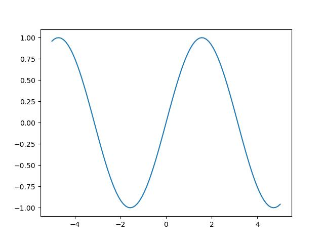</img>
- オプションでスタイルを変更した例
    ```python
    x_np = np.linspace(-5, 5, 100)
    plt.plot(x_np, np.sin(x_np), 
             color="red", marker=".", linestyle="none")
    ```
    > 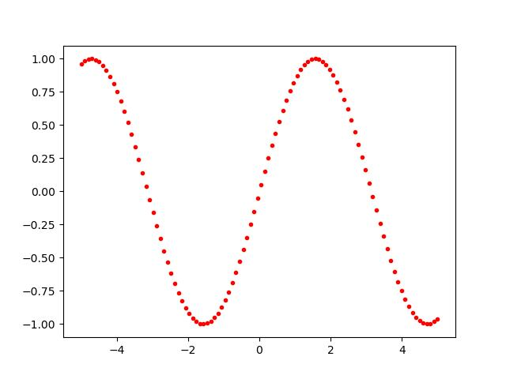</img>

#### 塗りつぶし

ある領域を塗りつぶすコマンド
```python
plt.fill_between(x, y1, y2, alpha) # x と y1, y2 は同じ1次元配列
```
は、`y1` から `y2` の領域を塗りつぶします。`alpha` で塗りつぶす色の透明度が指定できるのですが、エラーバーを示すのによく使われる印象があります。
- 例
    ```python
    x_np = np.linspace(-5, 5, 100)
    y_np = np.sin(x_np)
    plt.plot(x_np, y_np, color="black", linestyle="dashed")
    # 重ねてプロットすることもできる
    # y_np + 0.2 などは broadcast されていることに注意
    plt.fill_between(x_np, y_np - 0.2, y_np + 0.2, alpha=0.4)
    ```
    > 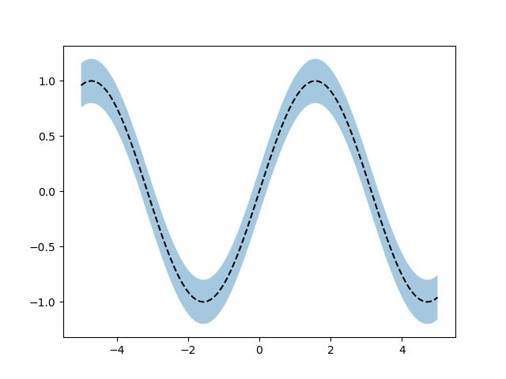</img>

#### 水平線や垂直線
水平線、垂直線を描くことも出来ます：
```python
plt.hlines(y, xmin, xmax) # 全て 数値 で指定
plt.vlines(x, ymin, ymax) # 同上
```
- 例
    ```python
    plt.hlines(y=0.5, xmin=0, xmax=1, color="black",  linestyle="dashed")
    plt.vlines(x=0.2, ymin=0, ymax=1, color="red",  linestyle="dotted")
    ```
    > 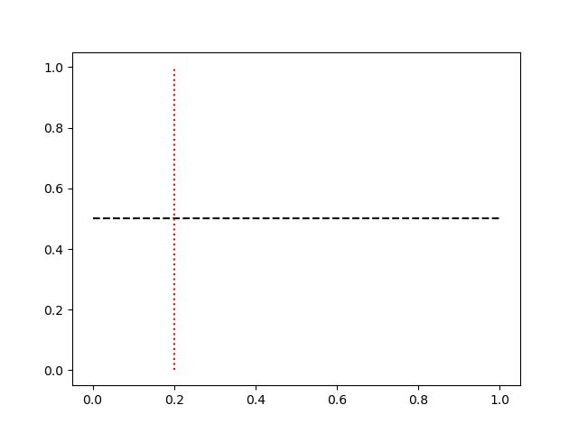</img>


### 2次元空間上のプロット

2次元空間の上に点を打ったり、ベクトル場を表示させたりできます。なお、同様のことを 3次元空間上に表示させることも可能なので、気になる人は調べてみてください。

#### 散布図

一番よく使うのは散布図でしょうか：
```python
plt.scatter(x, y) # x = 各点のx座標を集めた1次元配列、y = 各点のy座標を集めた1次元配列
```
- 例
    ```python
    rng = np.random.default_rng()
    x_np = rng.normal(0, 1, size=(1000, 2))
    plt.scatter(x_np[:, 0], x_np[:, 1], 
                marker="x", alpha=.4)
    ```
    > 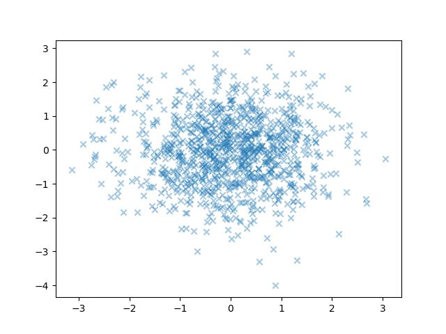</img>

$\blacksquare$ **練習問題6:** 区間 $[0, 1] \times [0, 1]$ 上に一様分布で擬似乱数を生成し、これが $x^2 + y^2 <1$ の円の内部に落ちる回数の平均値を求めてください。また、それぞれを可視化してみてください。`plt.scatter()` のオプションで `c=(サンプル数,)` を設定すると、値に対応した色をつけてくれます。
> [!TIP]
> <details>
> <summary>解答例</summary>
> 
> ```python
> def is_in_circle(xy_np):
>     'xy_np.shape = (N, 2)'
>     return np.sum(xy_np**2, axis=1)<1
> 
> def count_mean(N, rng):
>     xy_np = rng.uniform(0, 1, size=(N, 2))
>     return np.mean(is_in_circle(xy_np))
> 
> rng = np.random.default_rng()
> count_mean(N=100, rng=rng)
> ```
> > ```
> > 0.79
> > ```
> 
> こんな感じの値です。なお、この値は **大数の法則** により、1/4円内部の面積に相当するはずなので、4倍は円周率になるはずです。`N` を増やしてその値を表示させてみると：
> ```python
> def mc_pi(N, rng):
>     return count_mean(N, rng)*4
> 
> for N in [10**n for n in range(1, 8)]:
>     print(f"{mc_pi(N, rng=rng)}")
> ```
> > ```
> > 2.8
> > 2.92
> > 3.152
> > 3.1148
> > 3.13368
> > 3.140568
> > 3.142166
> > ```
> 
> だんだんと円周率の近似精度が良くなってきているのがわかります。このような（疑似）乱数による積分（期待値）計算の近似を **モンテカルロ法** と言います。なお、この命名はフォン・ノイマンによるものらしく、モンテカルロとはモナコ公国のカジノが有名な町の名前です。
> 
> 実際に `xy_np` を円の内部に入ったかどうか色分けで図示してみると感じが掴めるかもしれません：
> 
> ```python
> xy_np = rng.uniform(0, 1, size=(500, 2)) # 500 サンプルをとる
> plt.figure(figsize=(5, 5))               # アスペクト比の調整
> plt.scatter(xy_np[:, 0], xy_np[:, 1], 
>             marker="x", c=is_in_circle(xy_np))  # is_in_circle(xy_np) は bool からなる配列ですが、Trueは1、Falseは0 として計算されます
> ```
> > 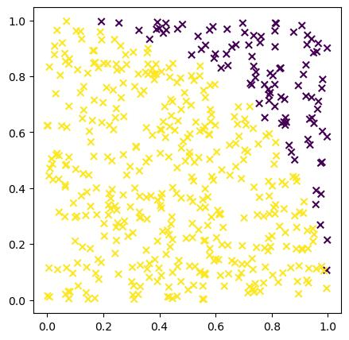</img>
> 
> 500サンプルの部分を増やしていったのが最初の計算で、上のコードで 500 を増やす（減らす）ことで、近似精度が上がる（下がる）理由が直感的にわかるかと思います。
> </details>

#### 等高線

等高線も引くことができます：
```python
# X, Y, Z のshapeは全て (L, L) 
# ここで L は等高線を引く際のグリッドの数です

# 線だけ
plt.contour(X, Y, Z) # X, Y が 位置、Z が高さ
# 塗りつぶしあり
plt.contourf(X, Y, Z) # X, Y が 位置、Z が高さ

# 高さを表示したい場合加えてください
plt.colorbar() 
```
`X`, `Y` は等高線を書く際に使用するグリッドに対応します。グリッドを作るには以下のようにするのが一般的です：
```python
x = np.linspace(x_min, x_max ,L)  # shape が (L,)
y = np.linspace(y_min, y_max, L)  # shape が (L,)
X, Y = np.meshgrid(x, y)          # ともに shape が (L, L) になる
```
これで以下のようなグリッド（`L=10`の場合）が作成できます：

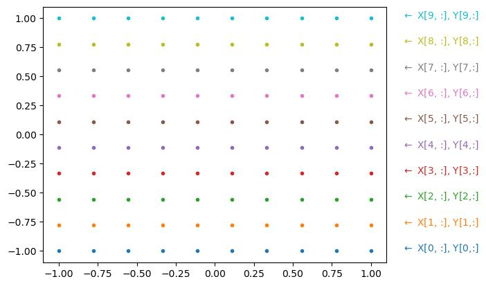</img>

このグリッド上の値に対応する配列が `Z` です。


- 単純な等高線
    ```python
    x = np.linspace(-1, 1 ,100)   # この3行をよく使います
    y = np.linspace(-1, 1, 100)   #
    X, Y = np.meshgrid(x, y)      # このコマンドで 100x100 のメッシュ作成
    Z = X**2 + Y**2

    plt.contour(X, Y, Z)
    plt.colorbar()
    ```
    > 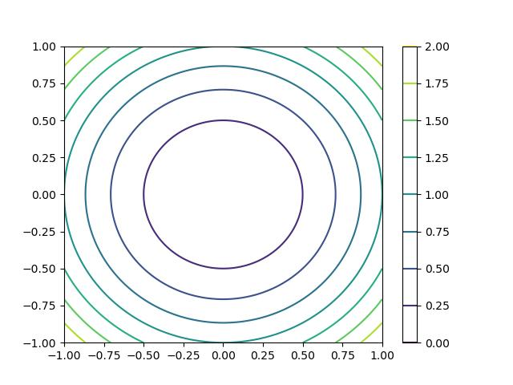</img>
- 塗りつぶした等高線（＋色を変更）
    ```python
    x = np.linspace(-1, 1 ,100)
    y = np.linspace(-1, 1, 100)
    X, Y = np.meshgrid(x, y)
    Z = X**2 + Y**2

    plt.contourf(X, Y, Z, cmap="Blues_r")
    plt.colorbar()
    ```
    > 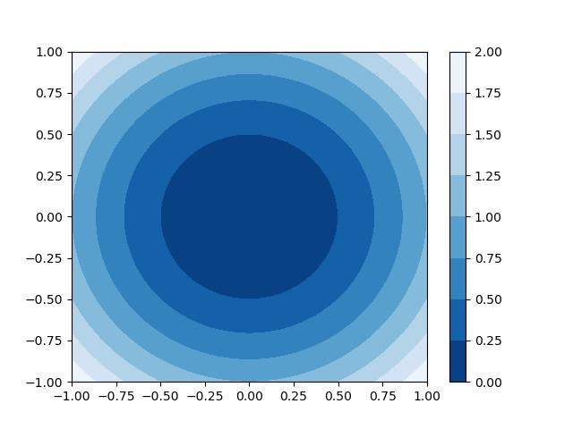</img>

#### ベクトル場

2次元のベクトル場の表示
```python
# X, Y のshape は (L,) でも (L, L) でもどちらでも良いようですが
# ベクトル場 U, V の shape は (L, L) でなくてはならないようです

# グリッド上にベクトル場を表示
plt.quiver(X, Y, U, V)
# グリッドを参考に滑らかなベクトル場を表示
plt.streamplot(X, Y, U, V)
```
- quiverの例
    ```python
    x = np.linspace(-1, 1 ,20)
    y = np.linspace(-1, 1, 20)
    X, Y = np.meshgrid(x, y)
    U, V = -Y, X

    plt.quiver(X, Y, U, V, color="blue")
    ```
    > 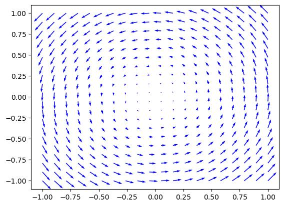</img> 
- streamplotの例
    ```python
    x = np.linspace(-1, 1 ,20)
    y = np.linspace(-1, 1, 20)
    X, Y = np.meshgrid(x, y)
    U, V = -Y, X

    plt.streamplot(X, Y, U, V, color="blue")
    ```
    > 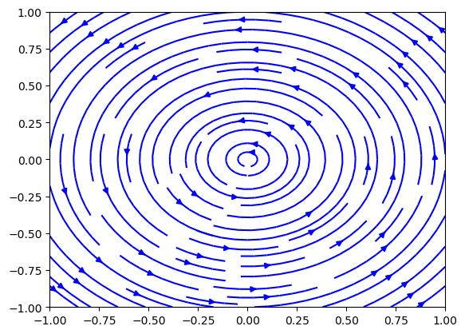</img> 

$\blacksquare$ **練習問題7:** $z = \sin(x)+\sin(y)$ の等高線を描いてください。また、$z = \sin(x)\sin(y)$ の等高線も描いてみてください。
> [!TIP]
> <details>
> <summary>解答例</summary>
> 
> ```python
> x = np.linspace(-10, 10 ,100)
> y = np.linspace(-10, 10, 100)
> X, Y = np.meshgrid(x, y)
> Z = np.sin(X) + np.sin(Y)
> 
> plt.contour(X, Y, Z)
> plt.colorbar()
> ```
> > 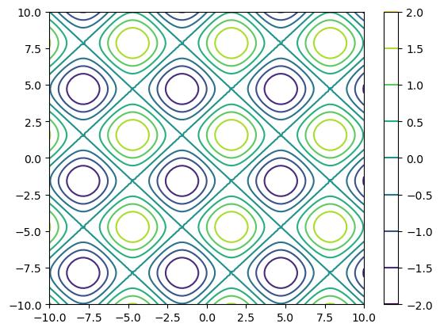</img> 
> 
> なんだが綺麗ですね。掛け算の方もやってみると：
> ```python
> Z = np.sin(X)*np.sin(Y)
> 
> plt.contour(X, Y, Z)
> plt.colorbar()
> ```
> > 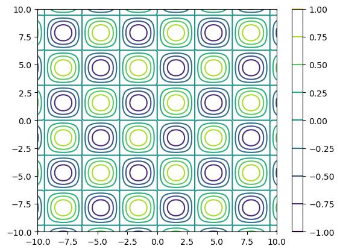</img> 
> 
> こんな感じで、先ほどから 45 度 傾けて、少しスケール倍したような図が出ます。
> </details>

$\blacksquare$ **練習問題8:** $u = \sin x + \sin y, v= \cos x + \cos y$ の 2成分からなるベクトル場 $(u, v)$ を描いてください。
> [!TIP]
> <details>
> <summary>解答例</summary>
> 
> ```python
> x = np.linspace(-10, 10 ,30)
> y = np.linspace(-10, 10, 30)
> X, Y = np.meshgrid(x, y)
> U, V = np.sin(X)+np.sin(Y), np.cos(X)+np.cos(Y), 
> 
> plt.quiver(X, Y, U, V, color="blue")
> ```
> > 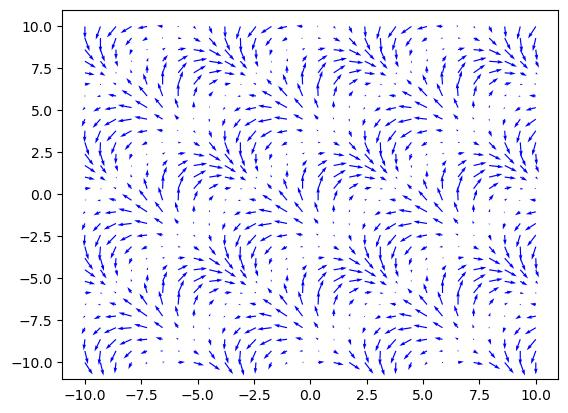</img> 
> 
> なんだか綺麗な図その３でした。
> </details>

### 画像の表示

ビットマップ画像は shape が `(縦の画素数, 横の画素数, 構成色の数)` のような配列 `x_img` として取り扱うことができます。そのような配列は画像として表示することができます：
```python
plt.imshow(x_img)
```
- 粗いですが手書き文字データを読み込んで表示：
    ```python
    from sklearn import datasets

    digits = datasets.load_digits()

    n = 7
    x_img = digits.data[n].reshape(8, 8, 1)
    plt.imshow(x_img, 
               cmap=plt.cm.gray_r, interpolation='nearest')
    ```
    > 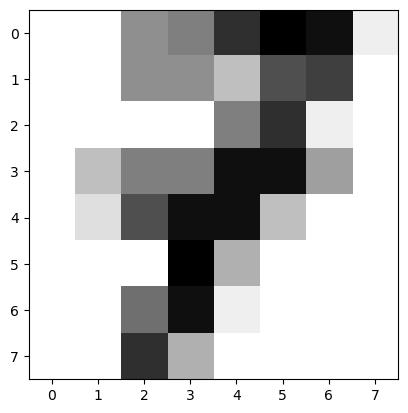</img> 
- 3軸目が3成分ならRGBカラーです：
    ```python
    rng = np.random.default_rng()
    x_img = rng.uniform(size=(32,32,3))

    plt.imshow(x_img)
    ```
    > 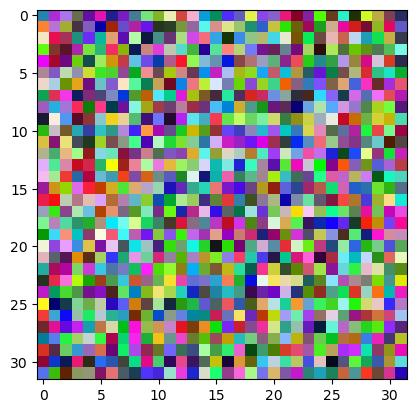</img> 

### プロット全般で使えること

#### プロットの表示と図の保存

これまで明示的に書いてきませんでしたが、図を表示させる命令は以下です。
```python
# 上でプロットの指示を書いた後
plt.show()
```
保存したい場合は以下のようにします。
```python
# 上でプロットの指示を書いた後
plt.savefig("ファイル名")
```
保存の際、オプションで `bbox_inches="tight"` を使うと余白がない図が保存できて便利なことがあります。
- 連番で画像を保存してgif動画にする例：
    まずGoogle Colabで適当なディレクトリを作ります。手で作っても良いですが、コマンドで作ることもできます：
    ```
    !mkdir figs
    ```
    これで `figs` というディレクトリができたはずです。この中にパラパラ漫画のように連番でプロット画像を保存します：
    ```python
    x_np = np.linspace(-5, 5, 100)
    N_time = 100
    dt = 1/N_time

    for n in range(N_time):
        t = (np.pi)*n*dt
        plt.ylim(-1, 1)
        plt.plot(x_np, np.sin(x_np)*np.sin(t))
        plt.savefig(f"figs/{n:03}.jpg")
        plt.close()
    ```
    `figs` の中に画像が溜まってゆくのがわかると思います。こののち、以下のコマンドで `output.gif` というファイルが作成されます：
    ```
    !ffmpeg -r 16 -i figs/%03d.jpg output.gif 
    ```
    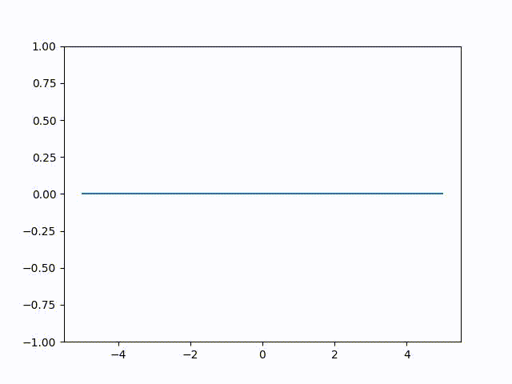</img> 

    `ffmpeg` は画像や動画などを編集するのに非常に便利なコマンドですが、pythonではありません。pythonでもこのような動画作成は可能なのですが、こちらのやり方の方が早いと思います。

$\blacksquare$ **練習問題9:** 適当な図を描いて、保存してみてください。
> [!TIP]
> <details>
> <summary>解答例</summary>
> 
> ```python
> x_np = np.linspace(-5, 5, 100)
> plt.plot(x_np, np.sin(x_np))
> 
> plt.savefig("sin.jpg")
> ```
> </details>


#### タイトル、軸名の表示

プロットする図にタイトルを表示することができます
```python
plt.title("文字列", fontsize=数値)
```
また、横軸と縦軸にも文字をつけることができます
```python
plt.xlabel("x軸につけたい文字", fontsize=数値)
plt.ylabel("y軸につけたい文字", fontsize=数値)
```
- 例
    ```python
    c = 1
    x_np = np.linspace(-5, 5 ,100)

    plt.plot(x_np, np.sin(x_np))
    x_fill = np.linspace(-np.pi, c ,100)
    plt.fill_between(x_fill, 0, np.sin(x_fill), alpha=0.3)

    plt.title(r"$\int_{-\pi}^c \sin x dx $" , fontsize=20)
    plt.xlabel("x", fontsize=15)
    plt.ylabel(r"$\sin x$", fontsize=15)
    ```
    > 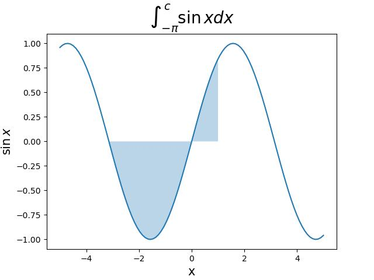</img> 
    
    `r"文字列"` は プロットの際に使うと 文字列中で `$` で挟んだ部分をLaTeXと解釈してレンダリングしてくれます。


#### ラベルとその表示

ここまでいくつか `plt.コマンド()` を紹介してきましたが、全てのコマンドで `label` にいう引数を渡すことができます。これは各プロットの名前に対応します。その後
```python
plt.legend()
```
とすると、ラベルとプロットの対応関係を自動で表示してくれます。
- 例
    ```python
    x_np = np.linspace(-5, 5, 100)

    plt.plot(x_np, np.sin(x_np), label=r"$\sin(x)$") 
    plt.plot(x_np, np.cos(x_np), label=r"$\cos(x)$")

    plt.legend()
    ```
    > 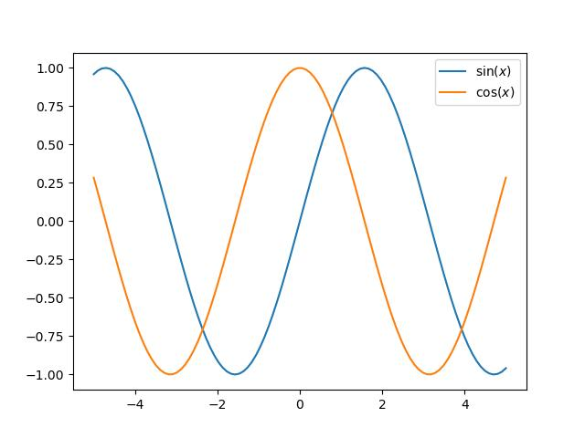</img>
    
    色を指定しなくても、勝手にデフォルトの順番でプロットの色を変えてくれます。

$\blacksquare$ **練習問題10:** $y = x^2$ のフーリエ展開は $y = \frac{\pi^2}{3} + \sum_{n=1}^\infty (-1)^n \frac{4}{n^2}\cos n x$ らしいのですが、これが本当かどうかをプロットして確認してください。円周率の数値は `np.pi` で出すことができます。
> [!TIP]
> <details>
> <summary>解答例</summary>
> 
>```python
>def fourier(x, N_max):
>    out = np.pi**2/3
>    for n in range(1, N_max+1):
>        out = out + (-1)**n*4/n**2*np.cos(n*x)
>    return out
>
>x = np.linspace(-5, 5, 1000)
>plt.plot(x, x**2, label=r"$y=x^2$", linestyle="dashed")
>plt.plot(x, fourier(x, 100), label=r"$y=Fourier(x)$")
>plt.legend()
>```
>> 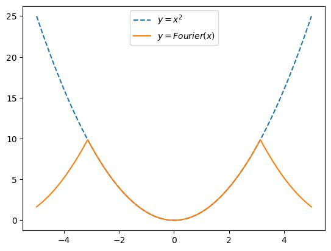</img>
>
>$(-\pi, \pi)$ では両者ピッタリと合っていますが、フーリエ級数は周期関数なので、その外側では $x^2$ から離れていくのが確認できます。
> </details>

#### 複数のプロットを別枠で描く

##### 順番に描く
```python
plt.figure(figsize=(横長, 縦長))

# i番目のプロット：
plt.subplot(縦ブロックの数, 横ブロックの数, i)
i番目のプロット処理
```
- 例
    ```python
    x = np.linspace(.1, 10)

    plt.figure(figsize=(14,4))

    plt.subplot(2,3,1)
    plt.plot(x, np.sin(x))

    plt.subplot(2,3,2)
    plt.plot(x, np.cos(x))

    plt.subplot(2,3,3)
    plt.plot(x, np.tan(x))

    plt.subplot(2,3,4)
    plt.plot(x, np.exp(x))

    plt.subplot(2,3,5)
    plt.plot(x, np.log(x))

    plt.subplot(2,3,6)
    plt.plot(x, np.tanh(x))
    ```
    > 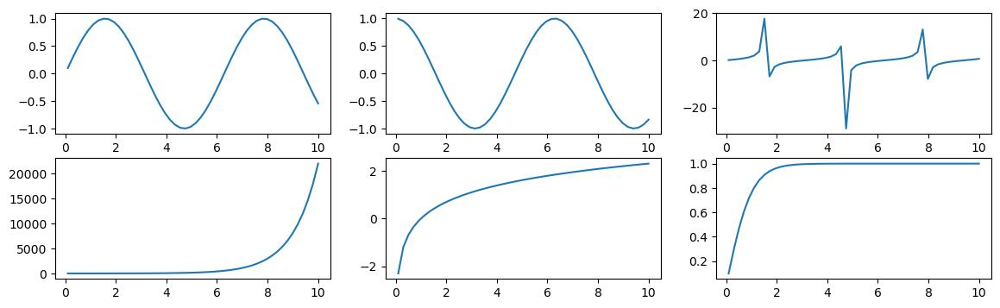</img> 

##### バラバラに描く

各プロットのブロックを制御するaxisオブジェクト（ax）を作って、そのメソッドでそれぞれのグラフをプロットする方法です。それぞれのaxisを別名で定義しておけば、プロット処理するのに順序は関係ありません：
```python
fig = plt.figure(figsize=(横長, 縦長))

# i番目のプロット：
ax_i = fig.add_subplot(縦ブロックの数, 横ブロックの数, i)
ax_i.プロット処理
```

`ax_i.プロット処理` の部分は大体は `plt.プロット()` の `plt` を `ax_i` に置き換えると動くと思いますが、細かいことをやろうとすると例外があるので、思うように描けない時は `help()` を見るか、インターネットで検索してください。


- 例
    ```python
    x = np.linspace(.1, 10)

    fig = plt.figure(figsize=(14,4))

    ax1 = fig.add_subplot(2,3,1)
    ax2 = fig.add_subplot(2,3,2)
    ax3 = fig.add_subplot(2,3,3)
    ax4 = fig.add_subplot(2,3,4)
    ax5 = fig.add_subplot(2,3,5)
    ax6 = fig.add_subplot(2,3,6)

    ax1.plot(x, np.sin(x))
    ax2.plot(x, np.cos(x))
    ax3.plot(x, np.tan(x))
    ax4.plot(x, np.exp(x))
    ax5.plot(x, np.log(x))
    ax6.plot(x, np.tanh(x))
    ```
    > </img> 

$\blacksquare$ **練習問題11:** `sklearn.datasets.load_digits()` で手書き数字の画像を配列型式で読み込むことができます。これを横に5個、縦に3個、計15個 順番に表示してください。
> [!TIP]
> <details>
> <summary>解答例</summary>
> 
> ```python
> digits = datasets.load_digits()
> fig = plt.figure(figsize=(7,4))
> 
> for n in range(1, 16):
>     ax = fig.add_subplot(3, 5, n)
>     x_img = digits.data[n].reshape(8, 8, 1)
>     ax.tick_params(labelbottom=False, labelleft=False, labelright=False, labeltop=False,
>                                 bottom=False, left=False, right=False, top=False)
>     ax.imshow(x_img, 
>                cmap=plt.cm.gray_r, interpolation='nearest')
> ```
> > 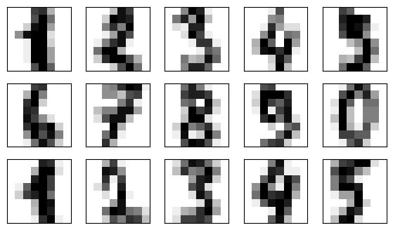</img> 
> </details>

[前のsection](preface.md) | [次のsection](2-2.md)