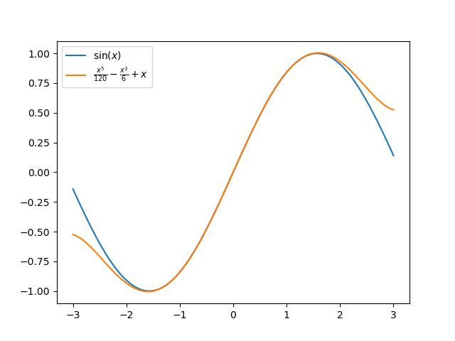
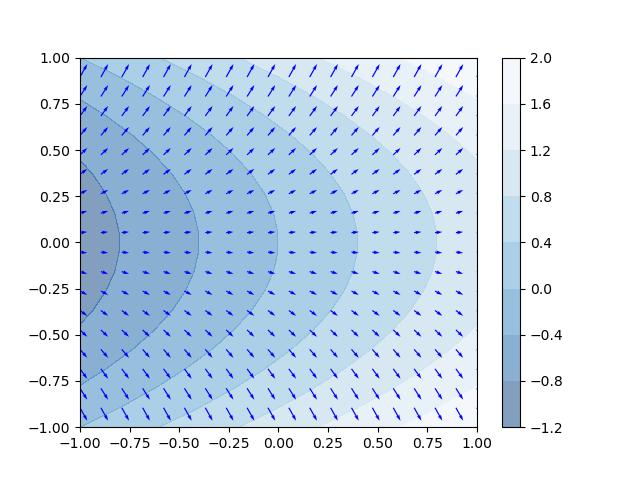
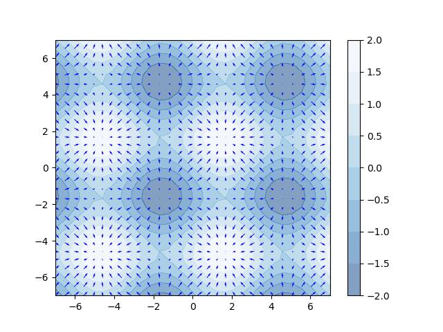
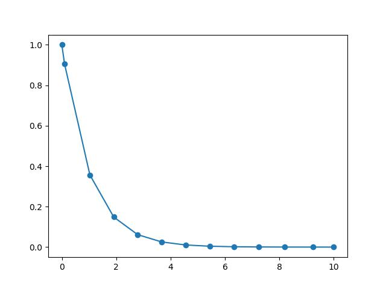
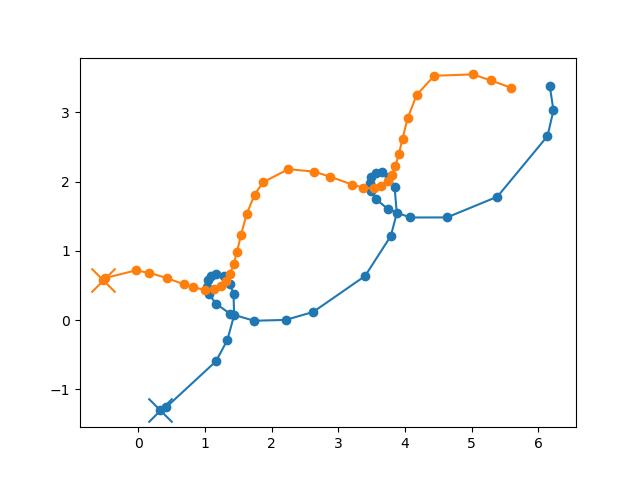
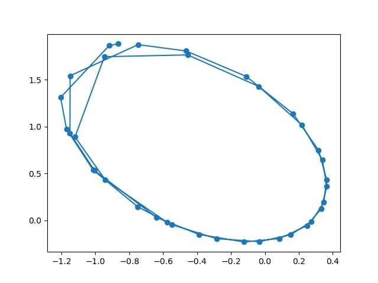
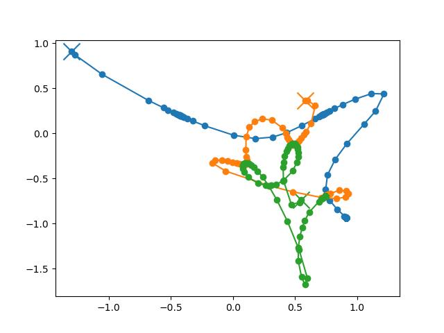
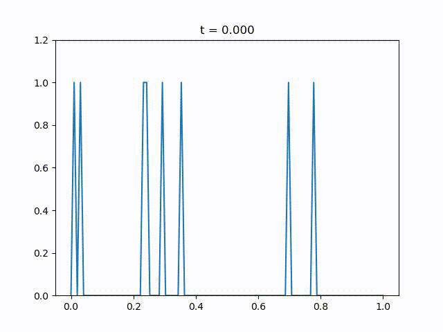
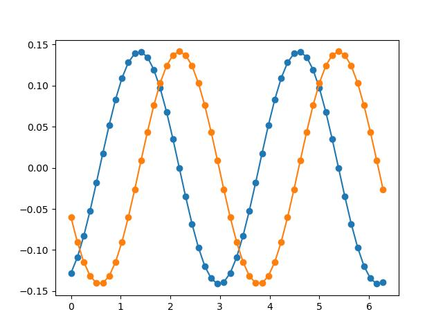

# 2-2. 数学的な処理

## 数式処理ライブラリ `sympy`

Mathematicaなど使ったことのある人は、それのPythonバージョンだと思うと良いかと思います。インポート文は公式ではワイルドカード `*` によるインポート（名前空間をなくすやり方）などが書かれていますが、予期せぬバグを防ぐためにも適当に名前をつけておくのが良いと思います。
```python
import sympy as syp 
```
この名前は標準的ではないです。なお、出力をうまく表示させるためには
```python
syp.init_printing(use_unicode=True)
```

を実行してください。

より詳細は公式のドキュメント
- https://docs.sympy.org/latest/index.html

を参照してください。

### シンボル

numpy におけるコアなコンセプトは配列でした。sympy で最も基本となるのは **シンボル** と呼ばれるオブジェクトです。シンボルは数学でいう変数（例えば $`x`$）のことで、以下の関数で作成できます
```python
syp.Symbol("変数に使いたい文字")
```
- 例：
    ```python
    x = syp.Symbol("x")
    x
    ```
    > $`x`$
- LaTeXで使用する文字も使えます
    ```python
    a = syp.Symbol("alpha")
    a
    ```
    > $`\alpha`$
    
    添え字も同じルールでつけられます：
    ```python
    x1 = syp.Symbol("x_1")
    x1
    ```
    > $`x_1`$

シンボルは一度に複数定義することもできます
```python
syp.symbols("文字1 文字2 文字3 ...") # 半角スペース区切り or
syp.symbols("文字1,文字2,文字3,...") # , 区切り
```
この関数で、シンボルオブジェクトがタプルで返ってきます。`symbols` は小文字なことに注意。
- 例：
    ```python
    x, y, z, a = syp.symbols("x y z alpha")
    a
    ```
    > $`\alpha`$
- なお、添え字だけが異なるシンボルの場合は `:` 記法でもっと簡単に作成できるようです
    ```python
    xs = syp.symbols("x0:10") # xs はタプル
    xs[9]                    # 要素を取り出す
    ```
    > $`x_9`$

#### シンボルの仮定

変数（シンボル）を指定するだけでなく、それがどういう要素に値を取るものかを指定することができます。
```python
syp.Symbol("文字", 仮定=True)
```
`仮定` として選べるものに何があるかは以下（公式）を参照してください：https://docs.sympy.org/latest/guides/assumptions.html#predicates
- 整数かどうかの仮定
    ```python
    n = syp.Symbol("n", integer=True)
    (3*n).is_integer
    ```
    > ```
    > True
    > ```
    ```python
    (3.14*n).is_integer
    ```
    > ```
    > 何も出ない
    > ```
- デフォルトでは可換な変数扱いの変数
    ```python
    X, Y = syp.symbols("X Y")
    X*Y == Y*X
    ```
    > ```
    > True
    > ```
    ですが、非可換なものと設定することもできます
    ```python
    X, Y = syp.symbols("X Y", commutative=False)
    X*Y == Y*X
    ```
    > ```
    > False
    > ```

#### 演算

すでに上の例でいくつか使いましたが、シンボルの間に四則演算など適用できます。
- 四則演算
    ```python
    xs = syp.symbols("x0:8")
    (xs[0] + xs[1] + xs[2]*xs[3])/(xs[4]/xs[5] - xs[6]**xs[7] )
    ```
    > $`\displaystyle \frac{x_{0} + x_{1} + x_{2} x_{3}}{\frac{x_{4}}{x_{5}} - x_{6}^{x_{7}}}`$
- 比較
    ```python
    x, y = syp.symbols("x y", positive=True)

    x*y > 0
    ```
    > ```
    > True
    > ```
シンボル間の計算だけでなく、整数の割り算結果を実数（正確には float型）にせず、有理数表示にしておくこともできます：
- 例：`syp.Rational(m, n)`
    ```python
    syp.Rational(3, 11)
    ```
    > $`\displaystyle \frac{3}{11}`$
    
    その結果とシンボルを掛け算することも可能です
    ```python
    x = syp.symbols("x")
    syp.Rational(3, 11)*x
    ```
    > $`\displaystyle \frac{3 x}{11}`$

$\blacksquare$ **練習問題1:** ベルヌーイ数 は $`B_0=1, B_n = - \frac{1}{n+1} \sum_{k=0}^{n-1} \begin{pmatrix}n+1\\ k\end{pmatrix}B_k`$ で再起的に書くことができます。これを計算するプログラムを書いてください。
> なお `from sympy.functions.combinatorial.numbers import nC` の `nC(m, n)` で $`\begin{pmatrix}m\\ n\end{pmatrix}`$ が計算できます。

> [!TIP]
> <details>
> <summary>解答例</summary>
> 
>一度やった計算を利用できるようにクラスにしておきました：
>```python
> from sympy.functions.combinatorial.numbers import nC
> 
> class BernoulliNum():
>     def __init__(self, N):
>         self.n = 0
>         self.B = [1]
>         self.update_terms(N)
>         
>     def update_terms(self, n):
>         for _ in range(n):
>             self.step()
>         
>     def step(self):
>         B = 0
>         self.n += 1
>         for k in range(len(self.B)):
>             combination = nC(self.n + 1, k)
>             coef = syp.Rational(combination, -(self.n + 1))
>             B += coef*self.B[k]
>         self.B.append(B)        
>```
>例えば：
>```python
>calculator = BernoulliNum(15)
>
>calculator.B[12]
>```
>> $`\displaystyle - \frac{691}{2730}`$
> </details>

$\blacksquare$ **練習問題2:** ベルヌーイ数の母関数 $`f(x) = \sum_{n=0}^\infty \frac{B_n}{n!}x^n`$ を 係数は floatにせず、有理数表示のまま適当な次数まで計算してください。
> [!TIP]
> <details>
> <summary>解答例</summary>
>
> 上で作成したベルヌーイ数のクラスを使って作りますと
>
> ```python
> calculator = BernoulliNum(15)
> x = syp.symbols("x")
> 
> expr = 0
> for (n, Bn) in enumerate(calculator.B):   # enumerate で囲むと、(リストインデックス, リスト要素) で for ループを回すことができ便利です
>     expr += syp.Rational(Bn, syp.factorial(n))*x**n
>     
> expr.series(n=14) # これを使わないと逆順になってしまいます
> ```
> > $`\displaystyle 1 - \frac{x}{2} + \frac{x^{2}}{12} - \frac{x^{4}}{720} + \frac{x^{6}}{30240} - \frac{x^{8}}{1209600} + \frac{x^{10}}{47900160} - \frac{691 x^{12}}{1307674368000} + O\left(x^{14}\right)`$
> </details>

### より高度なシンボル演算

ここまででも Python の制御構文と組み合わせていろいろな数式処理が可能ですが、数学や物理でよく使うものはデフォルトで入っているので、そちらを使ったほうが楽です。

#### 関数の適用

初等関数などはもちろん、整数に対する関数なども入っているようです。詳しくは
- https://docs.sympy.org/latest/modules/functions/elementary.html

の右側のカラムを見てください。

- 例：三角関数
    ```python
    x, y = syp.symbols("x y")

    syp.sin(x)**2 + syp.cos(x)**2
    ```
    > $`\sin^{2}{\left(x \right)} + \cos^{2}{\left(x \right)}`$
- 例：天井関数
    ```python
    n, m = syp.symbols("n m", integer=True)

    syp.ceiling(n**m)
    ```
    > $`\left\lceil{n^{m}}\right\rceil`$

関数が定義されていても、それが文字として入っているだけでは意味がありません。もちろんそうではなく、いろいろな操作の元での振る舞いを計算させることができます。

#### 代数学での計算

簡単な代数方程式や因数分解、簡略化などが可能です。

##### 代数方程式

```python
syp.solve(方程式シンボル, 
          解きたい変数シンボル)
```
これで `方程式シンボル` =0 の解 が（複数存在する場合もあるので）リストで返ってきます。
- 例：二次方程式
    ```python
    a, b, c, x = syp.symbols("a b c x")
    syp.solve(a*x**2+b*x+c, x)
    ```
    > $`\displaystyle \left[ \frac{- b - \sqrt{- 4 a c + b^{2}}}{2 a}, \  \frac{- b + \sqrt{- 4 a c + b^{2}}}{2 a}\right]`$
- 例：初等関数を入れてもできる限り解いてくれます：
    ```python
    x = syp.symbols("x")
    syp.solve(syp.sin(x)+syp.cos(x)**2, x)
    ```
    > $`\displaystyle \left[ 2 \text{atan}{\left(- \frac{1}{2} + \frac{\sqrt{5}}{2} + \frac{\sqrt{2} \sqrt{1 - \sqrt{5}}}{2} \right)}, \  - 2 \text{atan}{\left(\frac{1}{2} + \frac{\sqrt{5}}{2} + \frac{\sqrt{2} \sqrt{1 + \sqrt{5}}}{2} \right)}, \  - 2 \text{atan}{\left(- \frac{\sqrt{5}}{2} + \frac{1}{2} + \frac{\sqrt{2} \sqrt{1 - \sqrt{5}}}{2} \right)}, \  - 2 \text{atan}{\left(- \frac{\sqrt{2} \sqrt{1 + \sqrt{5}}}{2} + \frac{1}{2} + \frac{\sqrt{5}}{2} \right)}\right]`$

なお連立方程式も同じコマンドで処理できます。ただし、方程式シンボル、変数シンボルをリストで指定します。
```python
# 連立方程式
syp.solve([方程式シンボル1, 方程式シンボル2, ...], 
          [解きたい変数シンボル1, 解きたい変数シンボル2, ...])
```
- 例
    ```python
    x, y = syp.symbols("x y")
    eq1 = x+y
    eq2 = syp.sin(x)*syp.cos(y)
    syp.solve([eq1, eq2], [x, y])
    ```
    > $`\displaystyle \left[ \left( 0, \  0\right), \  \left( - \frac{3 \pi}{2}, \  \frac{3 \pi}{2}\right), \  \left( - \pi, \  \pi\right), \  \left( - \frac{\pi}{2}, \  \frac{\pi}{2}\right)\right]`$

##### 展開と因数分解

シンボルについての展開は以下です。
```python
syp.expand(展開したいシンボル)
```
- 例
    ```python
    x, y = syp.symbols("x y")
    syp.expand((x+y)**5)
    ```
    > $`\displaystyle x^{5} + 5 x^{4} y + 10 x^{3} y^{2} + 10 x^{2} y^{3} + 5 x y^{4} + y^{5}`$

逆に因数分解は以下です。
```python
syp.factor(因数分解したいシンボル)
```
- 例
    ```python
    x, y = syp.symbols("x y")
    syp.factor(x**2 + 2*x*y + y**2)
    ```
    > $`\displaystyle \left(x + y\right)^{2}`$

##### 簡略化

展開や因数分解に似た機能で、簡約化があります。これは分母分子の割り算によるキャンセルや、関数等式による同値な変形で、表式をなるべく簡単にする機能です。
```python
syp.simplify(簡約化したいシンボル)
```
- 例
    ```python
    x = syp.symbols("x")
    eq = (syp.sin(x)**2 + syp.cos(x)**2)*x + 2*syp.sin(x)*syp.cos(x)*x**2
    eq
    ```
    > $`\displaystyle 2 x^{2} \sin{\left(x \right)} \cos{\left(x \right)} + x \left(\sin^{2}{\left(x \right)} + \cos^{2}{\left(x \right)}\right)`$

    これでは見た目が悪いですが、
    ```python
    syp.simplify(eq)
    ```
    > $`\displaystyle x \left(x \sin{\left(2 x \right)} + 1\right)`$

    このように簡約化できます。

なお簡約化と展開には「どの関数等式を使うか」でいくつかのバージョンがあるようです。


$\blacksquare$ **練習問題3:** パスカルの三角形の計算を以下のように書きました：
```python
x, y = syp.symbols("x y")

def step(a):
    return a*x + a*y

hierarchy = [1]

for n in range(3):
    a = hierarchy[-1]
    hierarchy.append(step(a))
    
hierarchy
```
> $`\displaystyle \left[ 1, \  x + y, \  x \left(x + y\right) + y \left(x + y\right), \  x \left(x \left(x + y\right) + y \left(x + y\right)\right) + y \left(x \left(x + y\right) + y \left(x + y\right)\right)\right]`$

見た目が悪いので、なんとかキレイにしてください。

> [!TIP]
> <details>
> <summary>解答例</summary>
> 
> ```python
> hierarchy = [1]
> 
> for n in range(3):
>     a = hierarchy[-1]
>     simplified = syp.simplify(step(a)) # added
>     hierarchy.append(simplified)
>     
> hierarchy
> ```
> > $`\displaystyle \left[ 1, \  x + y, \  \left(x + y\right)^{2}, \  \left(x + y\right)^{3}\right]`$
> </details>

#### 解析学での計算

ここでは解析学関連のコマンドを紹介します。

##### 極限

極限の計算が可能です：
```python
syp.limit(極限を取りたいシンボル, 極限をとる対象のシンボル, どの値に近づけるか)
```

- 例
    ```python
    x = syp.symbols("x")
    syp.limit(syp.sin(x)/x, x, 0)
    ```
    > $`1`$

##### 微分
シンボル関数を微分することもできます：
```python
syp.diff(微分したい関数シンボル, どの変数で微分するか, 微分の回数)
```
- 偏微分も可能です
    ```python
    x, y = syp.symbols("x y")
    syp.diff(syp.sin(x)*y, x)
    ```
    > $`\displaystyle y \cos{\left(x \right)}`$
- 高階微分
    ```python
    x = syp.symbols("x")
    syp.diff(syp.sin(x), x, 2)
    ```
    > $`\displaystyle - \sin{\left(x \right)}`$

##### テイラー展開

テイラー展開が可能です：
```python
syp.series(expr=展開したい式のシンボル, x=展開する変数, x0=展開したい点, n=次数)
```
- 単純な場合は `expr`だけ指定すれば展開してくれます
    ```python
    x = syp.Symbol("x")
    syp.series(syp.sin(x))
    ```
    > $`\displaystyle x - \frac{x^{3}}{6} + \frac{x^{5}}{120} + O\left(x^{6}\right)`$

    展開する点を変えてみます
    ```python
    syp.series(syp.sin(x), x0=syp.pi)
    ```
    > $`\displaystyle \pi + \frac{\left(x - \pi\right)^{3}}{6} - \frac{\left(x - \pi\right)^{5}}{120} - x + O\left(\left(x - \pi\right)^{6}; x\rightarrow \pi\right)`$
- 変数シンボルが複数ある場合はどのシンボルで展開するか指定します
    ```python
    x, y = syp.symbols("x y")

    syp.series(syp.sin(x)*syp.exp(x+y), x=x)
    ```
    > $`\displaystyle x e^{y} + x^{2} e^{y} + \frac{x^{3} e^{y}}{3} - \frac{x^{5} e^{y}}{30} + O\left(x^{6}\right)`$
- 自作の関数を展開することも可能です
    ```python
    def f(x):
        out = 0
        for n in range(10):
            if n%2==0:
                out += syp.sin(n*x)
            else:
                out += syp.cos(n**2*x)
        return out

    syp.series(f(x))
    ```
    > $`\displaystyle 5 + 20 x - \frac{9669 x^{2}}{2} - \frac{400 x^{3}}{3} + \frac{16402903 x^{4}}{8} + \frac{1040 x^{5}}{3} + O\left(x^{6}\right)`$

##### 積分

積分は、定積分と不定積分両方ができます。まず不定積分：
```python
syp.integrate(積分したい関数シンボル, どの変数で積分するか)
```
積分定数は適当に省略されるようです。

- 例
    ```python
    x = syp.symbols("x")
    syp.integrate(syp.sin(x), x)
    ```
    > $`\displaystyle - \cos{\left(x \right)}`$
- そこそこ難しいのもやってくれるっぽいです
    ```python
    x, y = syp.symbols("x y")
    syp.integrate(syp.exp(y*x**4), x)
    ```
    > $`\displaystyle \frac{e^{- \frac{i \pi}{4}} \Gamma\left(\frac{1}{4}\right) \gamma\left(\frac{1}{4}, x^{4} y e^{i \pi}\right)}{16 \sqrt[4]{y} \Gamma\left(\frac{5}{4}\right)}`$

定積分は同じコマンドで、2番目の引数をタプルにすると実行できます
```python
syp.integrate(積分したい関数シンボル, (どの変数で積分するか, どこから, どこまで))
```
- 積分範囲にシンボルが含まれていても良いです
    ```python
    x, y = syp.symbols("x y")
    syp.integrate(syp.sin(x), (x, -syp.pi, y))
    ```
    > $`\displaystyle - \cos{\left(y \right)} - 1`$
- 無限大は `syp.oo` です。たとえばガウス積分
    ```python
    x, a = syp.symbols("x alpha")
    syp.integrate(syp.exp(-a*x**2), (x, -syp.oo, syp.oo))
    ```
    > $`\displaystyle \begin{cases} \frac{\sqrt{\pi}}{\sqrt{\alpha}} & \text{for}\: \left|{\arg{\left(\alpha \right)}}\right| \leq \frac{\pi}{2} \\\int\limits_{-\infty}^{\infty} e^{- \alpha x^{2}}\, dx & \text{otherwise} \end{cases}`$
    
    場合わけが出てきているのは、$`\alpha`$ の値に依存するからですが、こういう時、シンボルの仮定を使うと良いです：
    ```python
    a = syp.Symbol("alpha", positive=True)
    syp.integrate(syp.exp(-a*x**2), (x, -syp.oo, syp.oo))
    ```
    > $`\displaystyle \frac{\sqrt{\pi}}{\sqrt{\alpha}}`$

なお、ラプラス変換などの積分が絡む変換もたくさん用意されているようです。


$\blacksquare$ **練習問題4:** ベルヌーイ数はテイラー展開 $`\frac{x}{e^x-1} = \sum_{n=0}^\infty \frac{B_n}{n!}x^n`$ としても得られるらしいです。これを確認してください。
> [!TIP]
> <details>
> <summary>解答例</summary>
> 
> とりあえずテイラー展開をみてみましょう
> ```python
> x = syp.Symbol("x")
> 
> syp.series(x/(syp.exp(x)-1), n=14)
> ```
> > $`\displaystyle 1 - \frac{x}{2} + \frac{x^{2}}{12} - \frac{x^{4}}{720} + \frac{x^{6}}{30240} - \frac{x^{8}}{1209600} + \frac{x^{10}}{47900160} - \frac{691 x^{12}}{1307674368000} + O\left(x^{14}\right)`$
> 
> 上の練習問題2で得られたベルヌーイ数の母関数表示と一致していることがわかります。
> </details>

$\blacksquare$ **練習問題5:** ヤコビの三重積として知られる等式：$`\sum_{n=-\infty}^{\infty}q^{n^2}z^n = \prod_{m=1}^\infty(1-q^{2m})(1+q^{2m-1}z)(1+q^{2m-1}z^{-1})`$ を、$`q`$ の低いべきから確認してみてください。
> [!TIP]
> <details>
> <summary>解答例</summary>
> 
> とりあえず、左辺を計算する関数と右辺を計算する関数を素朴に定義してみます：
> ```python
> q, z = syp.symbols("q z")
> 
> def jacobi_left(N=10):
>     expr = 0
>     for n in range(-N, N+1):
>         expr += (q**(n**2))*(z**n)
>     return expr
> 
> def jacobi_right(M=10):
>     expr = 1
>     for m in range(1, M+1):
>         expr *= (1 - q**(2*m))*(1 + q**(2*m - 1)*z)*(1 + q**(2*m - 1)*z**(-1))
>     return expr
> ```
> まずは左辺、和のほう：
> ```python
> syp.series(jacobi_left(10), q, n=10)
> ```
> > $`\displaystyle 1 + q \left(z + \frac{1}{z}\right) + q^{4} \left(z^{2} + \frac{1}{z^{2}}\right) + q^{9} \left(z^{3} + \frac{1}{z^{3}}\right) + O\left(q^{10}\right)`$
> 
> これは和の構造から簡単に従う構造なので、たいして非自明ではないです。次に右辺の計算：
> ```python
> syp.series(syp.expand(jacobi_right(7)), q, n=10)
> ```
> > $`\displaystyle 1 + q \left(z + \frac{1}{z}\right) + q^{4} \left(z^{2} + \frac{1}{z^{2}}\right) + q^{9} \left(z^{3} + \frac{1}{z^{3}}\right) + O\left(q^{10}\right)`$
> 
> 確かに上の計算と一致しているようです。
> </details>

$\blacksquare$ **練習問題6:** $`x \in \mathbb{R}`$上の確率分布関数 $`p(x)`$ と $`q(x)`$ について、KLダイバージェンスは $`D_{KL}(p\|q) = \int_{-\infty}^{\infty} p(x)\log \frac{p(x)}{q(x)}dx`$ で定義されます。以下の場合のKLダイバージェンスを計算してください：

$$
\begin{align*}
p(x) &= \frac{1}{\sqrt{2\pi \sigma^2}} e^{- \frac{(x- \mu)^2}{2 \sigma^2}}
\\
q(x) &= \frac{1}{\sqrt{2\pi}} e^{- \frac{x^2}{2}}
\end{align*}
$$

なお、$`\pi`$ は `syp.pi` で表現でき、`syp.sqrt()` を使うとルートを float に変換せず、そのまま無理数として扱ってくれます。

> [!TIP]
> <details>
> <summary>解答例</summary>
> 
> ```python
> x = syp.symbols("x")
> m, s = syp.symbols("\mu \sigma", positive=True)
> 
> def get_gaussian_dist(x, m, s):
>     expr = syp.exp(-(x - m)**2/(2*s**2))/syp.sqrt(2*syp.pi*s**2)
>     return expr
> 
> def get_kl_divergence(p, q):
>     integrand = p*syp.log(p/q)
>     return syp.simplify(syp.integrate(integrand, (x, -syp.oo, syp.oo)))
> 
> p = get_gaussian_dist(x, m, s)
> q = get_gaussian_dist(x, 0, 1)
> 
> get_kl_divergence(p, q)
> ```
> > $`\displaystyle \frac{\mu^{2}}{2} + \frac{\sigma^{2}}{2} - \log{\left(\sigma \right)} - \frac{1}{2}`$
> </details>

#### 線形代数での計算

行列シンボルは
```python
syp.Matrix(リスト)
```
で作ることができます。`リスト` に当たる部分が
- numpyでいう `shape` が (m, n) のもの＝m行n列
- numpyでいう `shape` が (m, ) のもの＝m成分縦ベクトル

となります。

##### 行列積

作成した行列シンボルは Python の積 `*` のもとで、行列積が計算できます。

- 例
    ```python
    import numpy as np
    M = syp.Matrix(np.arange(6).reshape(2,3)) # numpy配列を直接代入もできるようです
    M
    ```
    > $`\displaystyle \left[\begin{matrix}0 & 1 & 2\\3 & 4 & 5\end{matrix}\right]`$
    ```python
    y = syp.Matrix([1,2,3])
    y
    ```
    > $`\displaystyle \left[\begin{matrix}1\\2\\3\end{matrix}\right]`$
    ```python
    M*y
    ```
    > $`\displaystyle \left[\begin{matrix}8\\26\end{matrix}\right]`$
- シンボルが含まれていてもOK
    ```python
    a, b, c, d = syp.symbols("a b c d")
    M = syp.Matrix([[a, b],
                    [c, d]])
    M
    ```
    > $`\displaystyle \left[\begin{matrix}a & b\\c & d\end{matrix}\right]`$
    ```python
    y = syp.Matrix([1,2])
    y
    ```
    > $`\displaystyle \left[\begin{matrix}1\\2\end{matrix}\right]`$
    ```python
    M*y
    ```
    > $`\displaystyle \left[\begin{matrix}a + 2 b\\c + 2 d\end{matrix}\right]`$

なお行と列は定義後に変更もできるようです。

##### 固有値計算の周辺

正方行列シンボルとして `M` を定義したのち
```python
M.eigenvects()
```
で `(固有値, 重複度, 固有ベクトル)` のタプルからなるリストが返ってきます。
- 例
    ```python
    M = syp.Matrix([[0, 1],
                    [-1, 0]])
    M
    M.eigenvects()
    ```
    > $`\displaystyle \left[ \left( - i, \  1, \  \left[ \left[\begin{matrix}i\\1\end{matrix}\right]\right]\right), \  \left( i, \  1, \  \left[ \left[\begin{matrix}- i\\1\end{matrix}\right]\right]\right)\right]`$

行列式は
```python
M.det()
```
あるいは
```python
syp.det(M)
```
どちらでも良いです。
- 例：Vandermondeの行列式
    ```python
    N = 4
    xs = syp.symbols(f"x1:{N+1}")
    M = []
    for c in range(N):
        m = []
        for l in range(N):
            m.append(xs[c]**l)
        M.append(m)

    M = syp.Matrix(M)
    M
    ```
    > $`\displaystyle \left[\begin{matrix}1 & x_{1} & x_{1}^{2} & x_{1}^{3}\\1 & x_{2} & x_{2}^{2} & x_{2}^{3}\\1 & x_{3} & x_{3}^{2} & x_{3}^{3}\\1 & x_{4} & x_{4}^{2} & x_{4}^{3}\end{matrix}\right]`$
    ```python
    syp.factor(M.det()) # factor は因数分解してくれるコマンド
    ```
    > $`\displaystyle \left(x_{1} - x_{2}\right) \left(x_{1} - x_{3}\right) \left(x_{1} - x_{4}\right) \left(x_{2} - x_{3}\right) \left(x_{2} - x_{4}\right) \left(x_{3} - x_{4}\right)`$

##### 掃き出し法

掃き出し法を実行してくれるコマンドは
```python
M.rref() # Reduced Row Echelon Form の略で RREF らしいです。
```
です。出力は `(基本変形後の行列, ピボット)` です。
- 例
    ```python
    rng = np.random.default_rng(seed=24)

    M = rng.choice([-2,-1,0,1,2], size=(4,8))
    M = syp.Matrix(M)
    M
    ```
    > $`\displaystyle \left[\begin{matrix}-1 & -1 & 1 & 0 & 1 & 0 & -2 & 0\\0 & 0 & 0 & 0 & 0 & 2 & -1 & -2\\1 & 1 & 0 & 2 & -1 & 1 & 1 & 0\\1 & 2 & -1 & -2 & 1 & 2 & -2 & 1\end{matrix}\right]`$
    ```python
    M.rref()
    ```
    > $`\displaystyle \left( \left[\begin{matrix}1 & 0 & 0 & 4 & -3 & 0 & \frac{9}{2} & -2\\0 & 1 & 0 & -2 & 2 & 0 & -3 & 3\\0 & 0 & 1 & 2 & 0 & 0 & - \frac{1}{2} & 1\\0 & 0 & 0 & 0 & 0 & 1 & - \frac{1}{2} & -1\end{matrix}\right], \  \left( 0, \  1, \  2, \  5\right)\right)`$


##### ImとKerの基底

`M` を行列シンボルとして、イメージの基底は
```python
M.columnspace()
```
で計算できます。基底ベクトルのシンボルがリストで返ってきます。
- 例
    ```python
    M = syp.Matrix([[1, 3, 0, -2],
                    [-2, -1, 2, 0],
                    [1, 8, 2, -6]])
    M.columnspace()
    ```
    > $`\displaystyle \left[ \left[\begin{matrix}1\\-2\\1\end{matrix}\right], \  \left[\begin{matrix}3\\-1\\8\end{matrix}\right]\right]`$

カーネルの基底は
```python
M.nullspace()
```
で計算できます。基底ベクトルのシンボルがリストで返ってきます。
- 例
    ```python
    M = syp.Matrix([[1, 3, 0, -2],
                    [-2, -1, 2, 0],
                    [1, 8, 2, -6]])
    M.nullspace()
    ```
    > $`\displaystyle \left[ \left[\begin{matrix}\frac{6}{5}\\- \frac{2}{5}\\1\\0\end{matrix}\right], \  \left[\begin{matrix}- \frac{2}{5}\\\frac{4}{5}\\0\\1\end{matrix}\right]\right]`$

$\blacksquare$ **練習問題7:** 微分方程式 $`\frac{d}{dt} \begin{pmatrix}x(t)\\ y(t)\end{pmatrix} = \begin{pmatrix}0 & 1\\ -1 & 0\end{pmatrix}\begin{pmatrix}x(t)\\ y(t)\end{pmatrix}`$ の解は適当な初期値を用いて $`\exp \begin{pmatrix}0 & t\\ -t & 0\end{pmatrix}\begin{pmatrix}x(0)\\ y(0)\end{pmatrix}`$ と書けますが、これを計算させてください。
> [!TIP]
> <details>
> <summary>解答例</summary>
> 
> sympyのexpでは行列積の意味での計算をしてくれます：
> ```python
> x0, y0, t = syp.symbols("x_0 y_0 t", real=True)
> 
> M = syp.Matrix([
>     [0, t],
>     [-t, 0]
> ])
> 
> X = syp.Matrix([x0, y0])
> syp.exp(M)*X
> ```
> > $`\displaystyle \left[\begin{matrix}y_{0} \sin{\left(t \right)} + x_{0} \cos{\left(t \right)}\\- x_{0} \sin{\left(t \right)} + y_{0} \cos{\left(t \right)}\end{matrix}\right]`$
> 
> 補足として、`t=1` の場合のnumpyでの処理を見てみましょう：
> ```python
> x = np.array([
>     [0, 1],
>     [-1, 0]
> ])
> 
> np.exp(x)
> ```
> > ```
> > array([[1.        , 2.71828183],
> >        [0.36787944, 1.        ]])
> > ```
> 
> numpyでは基本的に成分ごとの作用です。これが、sympyだと
>```python
>syp.exp(syp.Matrix(x))
>```
>> $`\displaystyle \left[\begin{matrix}\cos{\left(1 \right)} & \sin{\left(1 \right)}\\- \sin{\left(1 \right)} & \cos{\left(1 \right)}\end{matrix}\right]`$
>
> と、行列積を考慮した結果になります。このように、同じ `exp` でもライブラリによって挙動が異なります。このことはバグの温床になりがちなので、注意してください。
> </details>

$\blacksquare$ **練習問題8:** $`\mathbb{R}^3`$ の 極座標 $`r, \theta, \phi`$ から ユークリッド座標 $`x, y, z`$ への変換は

$$
\begin{align*}
x &= r \sin \theta \cos \phi \\
y &= r \sin \theta \sin \phi \\
z &= r \cos \theta
\end{align*}
$$

ですが、この変換に伴うヤコビアンを計算してください
> [!TIP]
> <details>
> <summary>解答例</summary>
> 
> まずヤコビ行列を定義します：
> ```python
> r, theta, phi = syp.symbols("r theta phi", real=True)
> 
> x = r*syp.sin(theta)*syp.cos(phi)
> y = r*syp.sin(theta)*syp.sin(phi)
> z = r*syp.cos(theta)
> 
> M = []
> for euc in [x, y, z]:
>     m = []
>     for polar in [r, theta, phi]:
>         m.append(syp.diff(euc, polar))
>     M.append(m)
> 
> J = syp.Matrix(M)
> J
> ```
> > $`\displaystyle \left[\begin{matrix}\sin{\left(\theta \right)} \cos{\left(\phi \right)} & r \cos{\left(\phi \right)} \cos{\left(\theta \right)} & - r \sin{\left(\phi \right)} \sin{\left(\theta \right)}\\\sin{\left(\phi \right)} \sin{\left(\theta \right)} & r \sin{\left(\phi \right)} \cos{\left(\theta \right)} & r \sin{\left(\theta \right)} \cos{\left(\phi \right)}\\\cos{\left(\theta \right)} & - r \sin{\left(\theta \right)} & 0\end{matrix}\right]`$
> 
> あとは `J` の行列式を計算すれば良いですが、そのままだと整理されていないので、簡略化します：
> ```python
> syp.simplify(J.det())
> ```
> > $`\displaystyle r^{2} \sin{\left(\theta \right)}`$
> </details>

#### いくつか便利な機能

##### latexコード出力

Google colabだとlatexのレンダリングはしてくれますが、出力のソースコードは出してくれないと思います。シンボルのlatexソースを文字列で出力させるには
```python
syp.latex(シンボル)
```
です。あるいは設定によっては `\` が重なって `\\` と出てしまう場合がありますが、その場合は `print()` 関数で表示させてください。
- 例
    ```python
    a = syp.Symbol("alpha", positive=True)
    ans = syp.integrate(syp.exp(-a*x**2), (x, -syp.oo, syp.oo))
    print(syp.latex(ans))
    ```
    > ```
    > \frac{\sqrt{\pi}}{\sqrt{\alpha}}
    > ```

##### 配列演算に変換：lambdify

sympyで色々計算させた結果を使って、図のプロットなどしたい際、matplotlib.pyplotを使うとなると、シンボルではなく配列としての計算が必要です。以下のようにすればシンボル計算を配列計算に変換できます：
```python
syp.lambdify(関数の入力シンボル, 関数の出力シンボル)
```
返り値は関数そのものとなります。

> [!NOTE]
> `syp.lambdify()` では `exec` 関数が使用されるため、セキュリティ上の問題があります。ですので、自分が作成したものであれば問題ないと思いますが、使用には注意が必要です。

- 例：テイラー展開のズレを可視化
    ```python
    x = syp.symbols("x")
    sin6 = syp.series(syp.sin(x), x, n=6).removeO() # sinのテイラー展開を計算し、 O() をシンボルから除く
    sin6_np = syp.lambdify(x, sin6)                 # lambdifyで x -> sin6 の配列向けの関数を作成

    # プロットしてみる
    import matplotlib.pyplot as plt

    x_np = np.linspace(-3,3,100)
    plt.plot(x_np, np.sin(x_np), label=r"$`\sin(x)`$")

    plt.plot(x_np, sin6_np(x_np),                   # ここで配列化した関数を使用
             label=fr"$`{syp.latex(sin6)}`$")         # 文字列前に f で{python変数}をその変数値に、 r でlatexレンダリングをオンに
    plt.legend()
    ```
    > </img>

$\blacksquare$ **練習問題9:** $`\mathbb{R}^2`$ 上の多項式関数 $`f(x,y)`$ の等高線を描く以下のプログラム
```python
import numpy as np
import matplotlib.pyplot as plt

f = lambda x,y: x + y**2 # ここは x, y の任意の多項式にできるとします

x = np.linspace(-1, 1 ,20)
y = np.linspace(-1, 1, 20)
X, Y = np.meshgrid(x, y)

Z = f(X, Y)
plt.contourf(X, Y, Z, cmap="Blues_r", alpha=0.5)
plt.colorbar()
```
を修正して、さらに $\nabla f(x, y) = (\partial_x f, \partial_y f)$ のベクトル場も追加で重ねて描いてください。`lambdify([引数シンボル1, 引数シンボル2, ...], 出力シンボル)` で多数の引数を持つ関数にすることができます。
> [!TIP]
> <details>
> <summary>解答例</summary>
> 
> ```python
> x, y = syp.symbols("x y")
> 
> dx_f = syp.lambdify([x, y], syp.diff(f(x, y), x))
> dy_f = syp.lambdify([x, y], syp.diff(f(x, y), y))
> ```
> これでベクトル場のそれぞれの成分を配列で計算できるようになりました。あとはこれを使って
> ```python 
> x = np.linspace(-1, 1 ,20)
> y = np.linspace(-1, 1, 20)
> X, Y = np.meshgrid(x, y)
> U, V = dx_f(X,Y), dy_f(X,Y) # added
> 
> Z = f(X, Y)
> plt.contourf(X, Y, Z, cmap="Blues_r", alpha=0.5)
> plt.colorbar()
> plt.quiver(X, Y, U, V, color="blue") # added
> ```
> > </img>
> </details>

$\blacksquare$ **練習問題10:** 前の問題では $`f(x, y)`$ として多項式しかうまくいきません（なぜでしょう？）。これを修正して、$`\sin(x)`$ や $`\log(x)`$ などの初等関数を使っても、等高線＋勾配ベクトルが描けるようにしてください。
> [!TIP]
> <details>
> <summary>解答例</summary>
> 
> 練習問題9 での `f` の処理では、少々トリッキーなことが起こっています。というのは
>```python
>Z = f(X, Y)
>```
>の部分では `f` の引数 `X, Y` は numpy配列ですが
>```python
>dx_f = syp.lambdify([x, y], syp.diff(f(x, y), x))
>```
>の部分の `f` の引数 `x, y` は sympyシンボルです。pythonの関数は引数の型を指定しなくても良きにはからってくれるため、このような少々危ない実装もできてしまいます。さて、`f` として初等関数を使う場合、プロットするには numpy 配列の入力でなくてはならず、`syp.diff` を使うには sympyシンボルでないといけませんので、両方定義しておくのが一つの解決策でしょう：
>
> ```python
> x, y = syp.symbols("x y")
> 
> f = lambda x,y: syp.sin(x) + syp.sin(y)              # sympy の初等関数にしておく
> f_np = syp.lambdify([x, y], f(x, y))                  # lambdifyで配列むけの関数 f_np を定義
> dx_f_np = syp.lambdify([x, y], syp.diff(f(x, y), x))  #  配列に対するx方向勾配計算 
> dy_f_np = syp.lambdify([x, y], syp.diff(f(x, y), y))  #  配列に対するy方向勾配計算 
> 
> x = np.linspace(-7, 7 ,30)
> y = np.linspace(-7, 7, 30)
> X, Y = np.meshgrid(x, y)
> 
> Z = f_np(X, Y)                                        # プロットには f_np を使う
> plt.contourf(X, Y, Z, cmap="Blues_r", alpha=0.5)
> plt.colorbar()
> 
> U, V = dx_f_np(X,Y), dy_f_np(X,Y)                     # プロットには dx_f_np, dy_f_np を使う
> plt.quiver(X, Y, U, V, color="blue")
> ```
> > </img>
> </details>

## 数値計算ライブラリ `scipy`

sympyは数値計算もいくらか可能ですが、あくまでシンボル計算に特化しているライブラリだと考えた方が良いです。より高度な数値計算は scipy というのを使うと良いです。scipyも定型のインポート文は知られていないように思いますが、ここでは
```python
import scipy as scp
```
としておきます。なお、numpy は scipy の一部なので、scipyをインポートしておけば numpy も使えるはずです。

scipyは機能が多いため、ここではその限られた機能しか説明できません。より詳細は公式のドキュメント
- https://docs.scipy.org/doc/scipy/

を参照してください。


### 積分

実は sympy でも数値積分はできるはずなのですが、scipyではルンゲクッタ法が使えるのが良い点かと思います。1階の微分方程式として

$$
\begin{align*}
\frac{d}{dt}\mathbf{x}(t) &= \mathbf{f}(t, \mathbf{x}), \quad \mathbf{x}(0) = \mathbf{y}
\end{align*}
$$

を考えます。ここで

- $`\mathbf{x}(t) = \Big(x_0(t), x_1(t), ... \Big)`$ 
    - 返り値、numpy配列 `array([x0, x1, ...])` に対応
- $`\mathbf{y} = \Big(y_0, y_1, ... \Big)`$
    - numpy配列 `y = array([y0, y1, ...])`
- $`\mathbf{f}(t, \mathbf{x}) = \Big(f_0(t, \mathbf{x}), f_1(t, \mathbf{x}), ... \Big)`$
    - 時刻（数値 `t` ）と $`\mathbf{x}`$ （numpy配列 `array([x0, x1, ...])`）を引数に持ち、numpy配列 `array([f0, f1, ...])` を返すような関数 `f`

だとします。この時 

```python
scp.integrate.solve_ivp(f, [初期時刻, 終時刻], y)
```
というコマンドを使うことで、この微分方程式を数値的に解くことができます。数値解の各ステップでの精度の調整なども可能です。より詳しくは公式ドキュメント
- https://docs.scipy.org/doc/scipy/reference/generated/scipy.integrate.solve_ivp.html#scipy.integrate.solve_ivp

をみてください。

返り値は `scipy.integrate._ivp.ivp.OdeResult` という独自のクラスのインスタンスであり、直接表示させると `変数名:中身` が表示されます。`返り値.変数名` でそれぞれの中身にアクセスすることができます。

- 1次元の例：
    $`\frac{d}{dt}x = -x, \quad x_0 = 1`$
    ```python
    import numpy as np
    import matplotlib.pyplot as plt

    f = lambda t, x: -x

    sol = scp.integrate.solve_ivp(f, [0, 10], np.array([1]))
    sol
    ```
    > ```
    > message: The solver successfully reached the end of the integration interval.
    > success: True
    > status: 0
    >         t: [ 0.000e+00  1.000e-01 ...  9.242e+00  1.000e+01]
    >         y: [[ 1.000e+00  9.048e-01 ...  9.755e-05  4.572e-05]]
    >     sol: None
    > t_events: None
    > y_events: None
    >     nfev: 74
    >     njev: 0
    >     nlu: 0
    > ```
    これを見ると、`sol.t` で離散化時間に、`sol.y[0]` でその離散時間での解が出せることがわかるので、以下のようにプロットできることがわかります。
    ```python
    plt.plot(sol.t, sol.y[0,:], "-o")
    ```
    > </img>

- 惑星の運動：

    もう少し難しくして、ニュートン方程式でn個の惑星の運動方程式を考えます。これは時間に関して2階なのですが、`solve_ivp` は1解の常微分方程式を想定しているので、速度の自由度を導入して2階微分を1階の連立微分方程式に書き直します
    $`\frac{d}{dt}x_n(t)=v_n(t), \quad \frac{d}{dt}v_n(t) = \sum_{m\neq n} Gm_m \frac{x_m(t) - x_n(t)}{\|x_m(t) - x_n(t)\|^3}`$
    ```python
    # 定数パラメータ
    N = 2         # 惑星の数
    G = 1         # 重力の強さ
    T0 = 0        # 初期時刻
    T1 = 10       # 終了時刻     

    # 擬似乱数による設定
    rng = np.random.default_rng(seed=1) # 擬似乱数生成器
    ms = rng.uniform(1, 2, N)                # = [m0, m1, ...] 惑星の質量
    xvs_flatten_init = rng.normal(0, 1, size=N*4) 
        # solve_ivp に入れるためには、shape が (数,) でなくてはいけないので、
        # 1次元配列の4スロットずつ、前半は2次元の位置x、後半は2次元の速度v を割り当てる
        #           = [x0, y0, v0, w0, 
        #              x1, y1, v1, w1, ...]

    def gravity_for_x1(x1, x2, m2):
        ''' x1 が x2 から感じる重力 '''
        R = x2 - x1
        r = np.linalg.norm(R)
        return G*m2*R/r**3

    def f(t, xvs_flatten):
        ''' xvs_flatten   = [x0, y0, v0, w0, 
                             x1, y1, v1, w1, ...] の自由度の1階微分の右辺'''
        forces = []
        for n in range(N):
            x1 = xvs_flatten[4*n   : 4*n+2]
            v1 = xvs_flatten[4*n+2 : 4*n+4]
            
            force = 0
            for m in range(N):
                if m!=n:
                    x2 = xvs_flatten[4*m   : 4*m+2]
                    m2 = ms[m]
                    force += gravity_for_x1(x1, x2, m2)
                    
            forces.append(v1)
            forces.append(force)

        forces_flatten = np.array(forces).reshape(-1)
        return forces_flatten

    sol = scp.integrate.solve_ivp(f, [T0, T1],  xvs_flatten_init)

    for n in range(N):
        y = sol.y[4*n   : 4*n+2]
        plt.plot(y[0, :], y[1, :], "o-")                                      # 軌道をプロット
        plt.scatter(y[0][0], y[1][0], marker="x", s=300) # 初期位置をプロット
    ```
    > </img>

    バツ印が初期位置です。上の例では二つの惑星が両方動いているように見える座標から見た軌道ですが、相対座標に行くとケプラーの法則で有名な楕円軌道となります：
    ```python
    y0 = sol.y[0:2]  # 1個目の点の位置座標（2:4成分が運動量）
    y1 = sol.y[4:6]  # 2個目の点の位置座標（6:8成分が運動量）
    y = y1 - y0
    plt.plot(y[0], y[1], "o-")
    ```
    > </img>

    上の方少しズレるのは数値誤差ですが、`solve_ivp` ではルンゲクッタ法の精度指定もできるので、もっと精度を上げれば綺麗な楕円になると思います。なお、最初の長いコードで `N=3` とすると解くのが難しいことで悪名高い 3対問題 となり、同じ擬似乱数シード値`1`で実行すると以下のような軌道となります：
    > </img>


- 空間を格子に切って1次元拡散方程式

    $`\frac{\partial}{\partial t} u(t, x) = T \frac{\partial^2}{\partial x^2}u(t, x)`$ の左辺を2次差分で近似する。アニメーションを作るためにディレクトリを作ります:
    ```python
    !mkdir anim
    ```
    この後、以下を実行します
    ```python
    # 定数パラメータ
    L = 1          # S^1 の直径
    T = 1          # 拡散係数（温度）

    N = 100       # 格子数
    T0 = 0        # 初期時刻
    T1 = 10       # 終了時刻   

    dx = L/N

    # 擬似乱数による設定
    rng = np.random.default_rng(seed=1) # 擬似乱数生成器
    u_init = rng.choice([0, 1], p=[.9, .1], size=N)        # u は適当な場所にピークを立たせたもの

    def f(t, u):
        u_up      = np.roll(u, 1)      # np.roll() は周期的なシフトなので、
        u_down = np.roll(u, -1)        # これは S^1 上の拡散になる
        return T*(u_up - 2*u + u_down)

    sol = scp.integrate.solve_ivp(f, [T0, T1],  u_init)

    for nt in range(len(sol.t)):
        plt.ylim(0, 1.2)
        plt.plot(np.linspace(0, L, N), sol.y[:, nt])
        plt.title(f"t = {sol.t[nt]:.3f}")
        plt.savefig(f"anim/{nt:03}.jpg")
        plt.close()
    ```
    後にアニメーションを以下で作ることができます
    ```python
    !ffmpeg -r 4 -i anim/%03d.jpg output2.gif
    ```
    > </img>
    
    https://qiita.com/Miya42/items/f61c4a33bd412a37f19f を参考にしましたが、この記事では、線分上の拡散や他のPDEも数値的に解いていて大変参考になります。


### 線形代数

固有値計算の周辺は、行列サイズが巨大になってくると計算量の問題が生じますが、疎行列であれば高速な計算が可能です。行列はオペレーターとして表現できますが、scipyではそのようにして行列を定めることもできます。そのためには以下のようにクラスを定義し、そのインスタンスとして実現します：
```python
from scipy.sparse.linalg import LinearOperator

class MyOperator(LinearOperator):
    def __init__(self):
        self.shape = (N, N) # 行列サイズ
        self.dtype = np.dtype(...)
        
    def _matvec(self, x):
        return 行列の作用の結果のベクトル M*x
    
    def _rmatvec(self, x):
        return 行列の随伴作用の結果のベクトル M^\dagger*x

Op = MyOperator()
```
このオペレーターの固有値計算をしたい場合は
```python
scipy.sparse.linalg import eigs

eigs(Op, k=出したい固有値の数, which="どの順番か")
```
です。`which` としてどのような文字列が許されるかは 公式ドキュメント
- https://docs.scipy.org/doc/scipy/reference/generated/scipy.sparse.linalg.eigs.html#scipy.sparse.linalg.eigs

をみてください。
返り値は `(固有値の配列, 固有ベクトルの配列)` のタプルです。固有ベクトルの配列のshapeは `(ベクトル次元, 何個目の固有ベクトルか)` です。
- 例：円周（$`t \simeq t + 2\pi`$）上の微分 $`i\frac{d}{dt}`$ 

    固有値は $`0, \pm n, n \in \mathbb{N}`$ ですが、これを差分化して行列の固有値問題として解いてみます。これを素朴に離散化するやり方として $`i \frac{x(t+\Delta t) - x(t)}{\Delta t}`$ が考えられます。そこで $`2\pi = N \Delta t `$ だとして、$`x(n \Delta t) = x_n`$ を成分にもつベクトルに対する差分演算行列を定義してみます。
    ```python
    import numpy as np
    from scipy.sparse.linalg import LinearOperator

    class FirstDerivativeOnCircle(LinearOperator):
        def __init__(self, N, L=2*np.pi, dtype='complex128'):
            self.N = N
            self.L = L
            self.dt = L/N
            self.shape = (self.N, self.N)
            self.dtype = np.dtype(dtype)
            
        def _matvec(self, x):
            return 1j*(x- np.roll(x, -1))/self.dt
        
        def _rmatvec(self, x):
            return -1j*(x - np.roll(x, +1))/self.dt
    ```
    これで実際に固有値問題を解かせてみます：
    ```python
    iD = FirstDerivativeOnCircle(N=50)
    evals, evecs = eigs(iD, k=11, which="SM", maxiter=1000)
    ```
    得られた固有値を見ると
    ```python
    evals
    ```
    > ```
    > array([-2.47534981e-16-3.09949654e-16j,  9.97370183e-01+6.27492132e-02j,
    >         1.97901124e+00+2.50007260e-01j, -9.97370183e-01+6.27492132e-02j,
    >        -1.97901124e+00+2.50007260e-01j, -2.92944211e+00+5.58820970e-01j,
    >         2.92944211e+00+5.58820970e-01j,  3.83367393e+00+9.84320165e-01j,
    >        -3.83367393e+00+9.84320165e-01j,  4.67744642e+00+1.51979447e+00j,
    >        -4.67744642e+00+1.51979447e+00j])
    > ```
    となっています。実部を見ると、元のオペレータの固有値（整数）に近いことがわかります。具体的には実部を四捨五入すると：
    ```python
    np.round(evals.real)
    ```
    > ```
    > array([-0.,  1.,  2., -1., -2., -3.,  3.,  4., -4.,  5., -5.])
    > ```
    となっています。この固有値はちょうど固有関数の山の数と対応しているはずです。固有ベクトル $`[x_0, x_1, ..., x_N] = [x(0), x(\Delta t), ..., x(N\Delta t)]`$ なので、これをプロットすればそれが確かめられます。ただし、複素数は実部と虚部に分けてプロットします。
    ```python
    i=4  # 何番目の固有値か
    print(evals[i])
    plt.plot(np.linspace(0, iD.L, iD.N), evecs[:, i].imag, "o-")
    plt.plot(np.linspace(0, iD.L, iD.N), evecs[:, i].real, "o-")
    ```
    > ```
    > (-1.9790112419626091+0.2500072601349987j)
    > ```
    > </img>
    
    概ね直感と合っている結果が得られました。


## コラム：数値計算とjulia言語

pythonではnumpyやscipyなどを用いることで高速な処理を行うことができるわけですが、同じことを **pythonだけ** でやろうとすると、どうしても遅くなってしまいます。numpyやscipyには存在しない処理をさせたい場合もあるかと思いますが、その場合は別のライブラリを探すということになると思います。

そのような場合は、別の選択肢として pythonと同じような言語設計の julia言語 というのを使うのが良いかもしれません。私の体感ですが、pythonだけの処理をそのままjulia言語に書き換えただけでも、数倍から数十倍のスピードアップが得られる気がします。

pythonのライブラリを julia言語 で使うことも可能らしいので、計算速度などが気になってきた場合は乗り換えるのも手だと思います。julia言語はオブジェクト指向の言語ではないですが、代わりに多重ディスパッチと呼ばれる機構があり、似た書き方をすることもできます。

`Google Colab julia` などで検索してみると、Google Colab上で julia言語 を使うこともできるようです。


[前のsection](2-1.md) | [次のsection](2-3.md)
