# 2-3. データサイエンス系

## データ処理のためのライブラリ `pandas`

我々が普段扱うデータでよくある形式が **テーブル形式** によるものです。すなわち

||A|B|C|
|--|--|--|--
|甲|a|b|c
|乙|d|e|f
|丙|g|h|i

といった形式のデータです。代表例は MicrosoftのExcelファイルや、Googleスプレッドシートなどが挙げられます。pandasはこの手の形式のデータを取り扱うのに長けたライブラリで、多くの場合
```python
import pandas as pd
```
とインポートされます。ここで紹介できる内容は限定的ですので、より詳細は公式のドキュメント
- https://pandas.pydata.org/docs/index.html

を参照してください。

### データを格納するオブジェクト

#### 辞書オブジェクト

pythonの文法でここまでで解説していないものに **辞書オブジェクト** というのがあります。リストに似ていますが、`{}` で囲んで作成することと、要素に当たるものが `インデックス:要素` になる点が異なります。

```python
d = {インデックス0:要素0, インデックス1:要素1, ...}
```
用途としてはリストと似ていますが、要素にアクセスするのに
```python
d[インデックス]
```
とする点が異なります。

- 例
    ```python
    d = {"small":1, "middle":3, "large":10}
    d["middle"]
    ```
    > ```
    > 3
    > ```

新要素の追加（list `l` の `l.append(要素)` に対応するもの）は、
- `d[新インデックス] = 新要素` 

です。（`d.update()` というメソッドが似ていますが、私はあまり使いません。）

$\blacksquare$ **練習問題1:** 以下の辞書オブジェクトを作り、作った辞書の3番目の要素を表示してください。
```
{'a': 0, 'b': 1, 'c': 2, 'd': 3, 'e': 4}
```

> [!TIP]
> <details>
> <summary>解答例</summary>
> 
> ```python
> abc = "abcde"
> 
> d = {}
> for (n, char) in enumerate(abc):
>     d[char] = n
>     
> d
> ```
> これで辞書はできるのですが、ついでに **内包表記** と呼ばれるシンタックスシュガー（[1-3. その他の役立つ文法](../section1/1-3.md) を参照）の一種で、これと以下と同じ働きをする書き方を紹介します：
> ```python
> abc = "abcde"
> 
> d = {char:n for (n, char) in enumerate(abc)}    
> 
> d
> ```
> このように内包表記では `{}` の中に for文を入れることができます。これはリストなどでも使えるので、覚えておくと便利かもしれません。
> 
> できた辞書オブジェクトにはインデックスを指定してアクセスします：
> ```python
> d['c']
> ```
> > ```
> > 2
> > ```
> </details>

$\blacksquare$ **練習問題2:** 辞書オブジェクトは実はこれまでの説明の中、背後で動いていました。例えば以下のクラスを定義します：
```python
class MyClass:
    def __init__(self):
        self.x = 1
        self.y = "hoge"
        
    def say_hoge(self):
        print(self.y)
```
このクラスのオブジェクトを作ると、実は隠れた辞書オブジェクト変数が設定されて、`self.x` や `self.y` の情報が入っています。`help()` 関数を用いてその変数を見つけてください。
> [!TIP]
> <details>
> <summary>解答例</summary>
> 
> ```python
> m = MyClass()
> help(m)
> ```
> > ```
> > Help on MyClass in module __main__ object:
> > 
> > class MyClass(builtins.object)
> >  |  Methods defined here:
> >  |  
> >  |  __init__(self)
> >  |      Initialize self.  See help(type(self)) for accurate signature.
> >  |  
> >  |  say_hoge(self)
> >  |  
> >  |  ----------------------------------------------------------------------
> >  |  Data descriptors defined here:
> >  |  
> >  |  __dict__
> >  |      dictionary for instance variables (if defined)
> >  |  
> >  |  __weakref__
> >  |      list of weak references to the object (if defined)
> > ```
> 
> いかにも `__dict__` というのが怪しそうです。見てみると：
> ```python
> m.__dict__
> ```
> > ```
> > {'x': 1, 'y': 'hoge'}
> > ```
> 
> となって、あたりです。試しに値を出してみましょう：
> ```python
> m.__dict__['x'], m.__dict__['y']
> ```
> > ```
> > (1, 'hoge')
> > ```
> </details>

#### 1次元データ `Series`

pandasにおけるデータは辞書オブジェクトの拡張と考えると良いです。というのは、辞書オブジェクトは表形式で

||name
|--|--
|インデックス0|要素0
|インデックス1|要素1
|...|...

とも表せるからです。この表に対応するのが `Series` オブジェクトで、
```python
s = pd.Series(辞書オブジェクト)
s.name = "列の名前"              # ここはなくても良いです
```
として作ることができます。
- 例：辞書オブジェクトをpandasのデータ型にしてみる
    ```python
    d = {"small":1, "middle":3, "large":10}

    s = pd.Series(d)
    s.name = "value"
    s
    ```
    >
    >|        |   value |
    >|:-------|--------:|
    >| small  |       1 |
    >| middle |       3 |
    >| large  |      10 |
    >

Seriesオブジェクトは他のやり方でも作ることができますが、割愛します。詳しくはドキュメントを見てください。

#### 2次元データ `DataFrame`

2次元データもいくつかの方法で作ることができますが、せっかくSeriesの作り方を勉強したので、それを使うと以下のように、列名をインデックスとして、Seriesオブジェクトを要素とした辞書型オブジェクトを使った作成法を紹介します：
```python
df = pd.DataFrame({"列名0":Seriesオブジェクト0, 
                   "列名1":Seriesオブジェクト1, 
                   ...})
```

- 例
    ```python
    s0 = pd.Series({"small":1,    "middle":3,   "large":10})
    s1 = pd.Series({"small":"小", "middle":"中", "large":"大"})

    df = pd.DataFrame({"value":s0, 
                       "japanese":s1})
    df
    ```
    >
    >|        |   value | japanese   |
    >|:-------|--------:|:-----------|
    >| small  |       1 | 小         |
    >| middle |       3 | 中         |
    >| large  |      10 | 大         |
    >
- 上の例では `s0`, `s1` でインデックスが同じでしたが、これを変えると？
    ```python
    s0 = pd.Series({"small":1,   "middle":3, "large":10                     })
    s1 = pd.Series({"small":"小",            "large":"大", "enormous":"巨大" })

    df = pd.DataFrame({"value":s0, "japanese":s1})
    df
    ```
    >|          |   value | japanese   |
    >|:---------|--------:|:-----------|
    >| enormous |     nan | 巨大       |
    >| large    |      10 | 大         |
    >| middle   |       3 | nan        |
    >| small    |       1 | 小         |

    このように、共通するインデックスでは今まで通りの挙動ですが、それぞれ足りない場所は `nan` (Not a Number) という、値がないことを意味する要素が割り振られます。

さて、いちいちSeriesオブジェクトを作るのが面倒な場合もあるでしょう。また、行の名前が不要なデータ形式もよくあります。そのような場合
```python
df = pd.DataFrame({"列名0":リスト0, # リスト は numpy配列 でも OK
                   "列名1":リスト1, 
                   ...})
```
のようにして作ることも可能です。この場合、行は0から順に番号づけられます。

あるいは、行ラベルをつける場合でも、Seriesオブジェクトではなく、辞書オブジェクトを直接使っても良いです：
```python
df = pd.DataFrame({"列名0":辞書オブジェクト0, 
                   "列名1":辞書オブジェクト1, 
                   ...})
```

$\blacksquare$ **練習問題3:** 以下のようなDataFrameオブジェクトを作ってください：

|    |        x |         sin |
|---:|---------:|------------:|
|  0 | 0        | 0           |
|  1 | 0.785398 | 0.707107    |
|  2 | 1.5708   | 1           |
|  3 | 2.35619  | 0.707107    |
|  4 | 3.14159  | 1.22465e-16 |

xとしては $`0`$ から$`\pi`$ までを等間隔に分けた値が上から順に入っており、sinはその際の $`\sin (x)`$ の値です。

> [!TIP]
> <details>
> <summary>解答例</summary>
> 
> ```python
> x = np.linspace(0, np.pi, 5)
> 
> df = pd.DataFrame({
>     "x": x,
>     "sin": np.sin(x)
> })
> 
> df
> ```
> </details>

$\blacksquare$ **練習問題4:** 以下のようなDataFrameオブジェクトを作ってください：

|              |        x |         sin |
|:-------------|---------:|------------:|
| 0-th element | 0        | 0           |
| 1-th element | 0.785398 | 0.707107    |
| 2-th element | 1.5708   | 1           |
| 3-th element | 2.35619  | 0.707107    |
| 4-th element | 3.14159  | 1.22465e-16 |

xとsinxの要素は同じで、行ラベルが変わったものです。

> [!TIP]
> <details>
> <summary>解答例</summary>
> 
> Seriesオブジェクトを定義するのが面倒なので、辞書オブジェクトを使ってみます。
> ```python
> x = np.linspace(0, np.pi, 5)
> sinx = np.sin(x)
> 
> df = pd.DataFrame({
>     "x": {f"{n}-th element": x[n] for n in range(len(x))},     # 内包表記で辞書オブジェクトを定義してます
>     "sin": {f"{n}-th element": sinx[n] for n in range(len(x))}
> })
> 
> df
> ```
> </details>

### 外部ファイル・さまざまなデータ形式からの読み込み

pythonを通じてpandasのデータオブジェクトを自分で作ることもありますが、むしろ外部データを読み込んで使うことのほうが多いかもしれないので、先に色々なファイル形式のデータの読み込み方を説明します。基本は
```python
pd.read_形式名("ファイルの場所")
```
です。

#### excelファイル

テーブル形式のファイルの典型例はエクセルファイルでしょう。
```python
df = pd.read_excel("ファイル名（ファイルパス）", 
                   sheet_name="シート名", 
                   index_col=何番目の列をインデックスと思うか) # これはオプショナル
```
で `df` が対象ファイルから作成したデータ形式となります。`index_col` を指定しない場合は、ちょうど リストやnumpy配列から DataFrameを作った時のように、インデックスは0から順につくはずです。
- 例

    |    |A|B | C       | D   |
    |---:|:-------------|-------:|:---------|:--------|
    |1| |価格 | 色       | color   |
    |2| にんじん     |    100 | 赤       | red     |
    |3| みかん       |    200 | オレンジ | orange  |
    |4| いちご       |    300 | 赤       | red     |

    のエクセルファイルを作り（Googleスプレッドシートから作って、エクセル形式で保存するなど）"test.xlsx" として直下のディレクトリに保存（Google Colabの場合は左のフォルダのアイコンからアップロード）してから以下：
    ```python
    df = pd.read_excel("test.xlsx", sheet_name="Sheet1", index_col=0)
    df
    ```
    >|          |   価格 | 色       | color   |
    >|:---------|-------:|:---------|:--------|
    >| にんじん |    100 | 赤       | red     |
    >| みかん   |    200 | オレンジ | orange  |
    >| いちご   |    300 | 赤       | red     |

なお、sheetを指定せずに DataFrameオブジェクトのリストとして読み込むやり方もあるようです。

#### csvファイル

csvファイルとは、`,` と改行で表現された表のことで
```
列名0, 列名1, ...
a, b, ...
1, 2, ...
```
のようなテキストファイルです。これをDataFrameオブジェクトとして読み込むには以下です。
```python
df = pd.read_csv("ファイル名（ファイルパス）", 
                 index_col=何番目の列をインデックスと思うか) # これはオプショナル
```

`index_col` を指定しない場合は、ちょうど リストやnumpy配列から DataFrameを作った時のように、インデックスは0から順につくはずです。

- 例：以下のようなファイルを `test.csv` という名前で保存します
    ```
    ,価格,色,color
    にんじん,100,赤,red
    みかん,200,オレンジ,orange
    いちご,300,赤,red
    ```
    これをpandasで開く：
    ```python
    df = pd.read_csv("test.csv", index_col=0)
    df
    ```
    |          |   価格 | 色       | color   |
    |:---------|-------:|:---------|:--------|
    | にんじん |    100 | 赤       | red     |
    | みかん   |    200 | オレンジ | orange  |
    | いちご   |    300 | 赤       | red     |


#### JSONファイル

JSONとは JavaScript Object Notation の略です。JavaScriptとはブラウザ上で動作するプログラミング言語のことで、これにはオブジェクト指向の考えが導入されています。その JavaScriptにおけるオブジェクトの定義の記法に基づいています。1個のデータは以下のように書きます（pythonの辞書と同じ記法です）：
```
{   
    名前0: 値0,
    名前1: 値1,
    ...
}
```
JavaScriptでこれをオブジェクト `x` として定義したとすると、`x.名前n` で `値n` にアクセスできるようになります。

複数データがある場合はこのオブジェクト記法からなるリストをpythonと同じ `[,]` で作ることができます。


- 例：以下の内容で `test.json` ファイルを作ります
    ```
    [
            {
                    "価格"  : "100",
                    "色"    : "赤",
                    "color" : "red"
            },
            {
                    "価格"  : "200",
                    "色"    : "オレンジ",
                    "color" : "orange"
            },
            {
                    "価格"  : "300",
                    "色"    : "赤",
                    "color" : "red"
            }
    ]
    ```
    後に python からpandasで開くと：
    ```python
    df = pd.read_json("test.json")
    df
    ```
    >|    |   価格 | 色       | color   |
    >|---:|-------:|:---------|:--------|
    >|  0 |    100 | 赤       | red     |
    >|  1 |    200 | オレンジ | orange  |
    >|  2 |    300 | 赤       | red     |

なお、JSON記法のオブジェクト定義は入れ子構造（オブジェクトの中にまたオブジェクトがある）というふうにもできます：
```
{
    名前: {
            名前0: 値1,
            ...
         },
    ...
}
```
このようなJSONファイルをpandasで読み込むと、列名が `名前.名前0` などになります。

#### その他

その他にも多くの表形式データを読み込むことができます。詳しくは公式
- https://pandas.pydata.org/docs/user_guide/io.html#basic

の表を参照してください。このリンクを見ればわかりますが、同様のフォーマットに**外部ファイルとして書き出す**ことも可能なはずです。

$\blacksquare$ **練習問題5:** インターネット上にあるデータを取りに行くこともできます。例えば 
```python
url = 'アドレス'
pd.read_html(url)
```
などとすると、指定されたurlのhtmlファイルに含まれるテーブルを探し、リスト化してくれます。https://en.wikipedia.org/wiki/Homotopy_groups_of_spheres (11/12, 2024)にある 球面のホモトピー群のテーブルの最初のものを読み込んで表示してみてください。コピペ用のアドレスは以下です：
```
https://en.wikipedia.org/wiki/Homotopy_groups_of_spheres
```
（ただし、これだけだとlatexレンダリングが働かず、所々変な表示になってしまいます。これを解決するには別処理が必要です。）
> [!TIP]
> <details>
> <summary>解答例</summary>
> 
> ```python
> url = 'https://en.wikipedia.org/wiki/Homotopy_groups_of_spheres'
> dfs = pd.read_html(url)
> dfs[1]
> ```
>> |    | Unnamed: 0   | π1   | π2   | π3   | π4   | π5   | π6   | π7    | π8   | π9   | π10    | π11   | π12   | π13    | π14          | π15      |
>> |---:|:-------------|:-----|:-----|:-----|:-----|:-----|:-----|:------|:-----|:-----|:-------|:------|:------|:-------|:-------------|:---------|
>> |  0 | S1           | Z    | 0    | 0    | 0    | 0    | 0    | 0     | 0    | 0    | 0      | 0     | 0     | 0      | 0            | 0        |
>> |  1 | S2           | 0    | Z    | Z    | Z2   | Z2   | Z12  | Z2    | Z2   | Z3   | Z15    | Z2    | Z2 2  | Z12×Z2 | Z84×Z2 2     | Z2 2     |
>> |  2 | S3           | 0    | 0    | Z    | Z2   | Z2   | Z12  | Z2    | Z2   | Z3   | Z15    | Z2    | Z2 2  | Z12×Z2 | Z84×Z2 2     | Z2 2     |
>> |  3 | S4           | 0    | 0    | 0    | Z    | Z2   | Z2   | Z×Z12 | Z2 2 | Z2 2 | Z24×Z3 | Z15   | Z2    | Z3 2   | Z120× Z12×Z2 | Z84×Z5 2 |
>> |  4 | S5           | 0    | 0    | 0    | 0    | Z    | Z2   | Z2    | Z24  | Z2   | Z2     | Z2    | Z30   | Z2     | Z3 2         | Z72×Z2   |
>> |  5 | S6           | 0    | 0    | 0    | 0    | 0    | Z    | Z2    | Z2   | Z24  | 0      | Z     | Z2    | Z60    | Z24×Z2       | Z3 2     |
>> |  6 | S7           | 0    | 0    | 0    | 0    | 0    | 0    | Z     | Z2   | Z2   | Z24    | 0     | 0     | Z2     | Z120         | Z3 2     |
>> |  7 | S8           | 0    | 0    | 0    | 0    | 0    | 0    | 0     | Z    | Z2   | Z2     | Z24   | 0     | 0      | Z2           | Z×Z120   |
> </details>

### 部分行/列の取り出し

とりあえずテストデータとして 後で紹介する seaborn のリポジトリから Fisher の iris（アヤメ）データを読み込んでおきます：
```python
df = pd.read_csv('https://raw.githubusercontent.com/mwaskom/seaborn-data/refs/heads/master/iris.csv')
df.head()
```
> |    |   sepal_length |   sepal_width |   petal_length |   petal_width | species   |
> |---:|---------------:|--------------:|---------------:|--------------:|:----------|
> |  0 |            5.1 |           3.5 |            1.4 |           0.2 | setosa    |
> |  1 |            4.9 |           3   |            1.4 |           0.2 | setosa    |
> |  2 |            4.7 |           3.2 |            1.3 |           0.2 | setosa    |
> |  3 |            4.6 |           3.1 |            1.5 |           0.2 | setosa    |
> |  4 |            5   |           3.6 |            1.4 |           0.2 | setosa    |

#### 部分列の取り出し

辞書オブジェクトと同様、列名を `df` に入力すれば良いのですが、
- `df["列名"]` は `Series` オブジェクト
- `df[["列名"]]` は `DataFrame` オブジェクト

となります。後者の方は `df[部分列を表示させたい列名のリスト]` に一般化できます。公式ドキュメントの絵：https://pandas.pydata.org/docs/_images/03_subset_columns.svg をみると何をやっているかよくわかると思います。


- 例
    ```python
    df[["sepal_length", "petal_length"]].head()
    ```
    >|    |   sepal_length |   petal_length |
    >|---:|---------------:|---------------:|
    >|  0 |            5.1 |            1.4 |
    >|  1 |            4.9 |            1.4 |
    >|  2 |            4.7 |            1.3 |
    >|  3 |            4.6 |            1.5 |
    >|  4 |            5   |            1.4 |

#### 部分行の取り出し

部分行は基本的に `df[ブール値の配列]` で指定できます。配列のshapeは `(dfの行数,)` である必要があります。こちらも公式ドキュメントの絵：https://pandas.pydata.org/docs/_images/03_subset_rows.svg
 をみるとイメージが掴めるかと思います。
- 例：奇数行だけ取り出す
    ```python
    df[df.index%2==0].head()
    ```
    >|    |   sepal_length |   sepal_width |   petal_length |   petal_width | species   |
    >|---:|---------------:|--------------:|---------------:|--------------:|:----------|
    >|  0 |            5.1 |           3.5 |            1.4 |           0.2 | setosa    |
    >|  2 |            4.7 |           3.2 |            1.3 |           0.2 | setosa    |
    >|  4 |            5   |           3.6 |            1.4 |           0.2 | setosa    |
    >|  6 |            4.6 |           3.4 |            1.4 |           0.3 | setosa    |
    >|  8 |            4.4 |           2.9 |            1.4 |           0.2 | setosa    |
- 例：特定の列の要素に対しての制約で取り出す
    ```python
    df[df["sepal_length"]<5].head()
    ```
    > |    |   sepal_length |   sepal_width |   petal_length |   petal_width | species   |
    > |---:|---------------:|--------------:|---------------:|--------------:|:----------|
    > |  1 |            4.9 |           3   |            1.4 |           0.2 | setosa    |
    > |  2 |            4.7 |           3.2 |            1.3 |           0.2 | setosa    |
    > |  3 |            4.6 |           3.1 |            1.5 |           0.2 | setosa    |
    > |  6 |            4.6 |           3.4 |            1.4 |           0.3 | setosa    |
    > |  8 |            4.4 |           2.9 |            1.4 |           0.2 | setosa    |

#### 部分行列の取り出し

部分列、部分行を、ここまでと似た方法で同時に取り出すには
```python
df.loc[ブール値の配列,
       部分列を表示させたい列名のリスト]
```
です。関数のような記法ですが、`df.loc()` のように丸括弧ではなく `df.loc[]` のようにカギ括弧なことに注意。こちらも公式ドキュメントの絵：https://pandas.pydata.org/docs/_images/03_subset_columns_rows.svg
 をみるとイメージが掴めるかと思います。
- 例
    ```python
    df.loc[df["sepal_length"] < 5, 
           ["sepal_length", "petal_length"]].head()
    ```
    >|    |   sepal_length |   petal_length |
    >|---:|---------------:|---------------:|
    >|  1 |            4.9 |            1.4 |
    >|  2 |            4.7 |            1.3 |
    >|  3 |            4.6 |            1.5 |
    >|  6 |            4.6 |            1.4 |
    >|  8 |            4.4 |            1.4 |

条件や列名ではなく、純粋に2次元配列と思って numpy のように `x[l:m, n:o]` のような抜き出し方もできます。
```python
df.iloc[l:m, n:o]
```
です。
- 例
    ```python
    df.iloc[10:13, 0:2]
    ```
    >|    |   sepal_length |   sepal_width |
    >|---:|---------------:|--------------:|
    >| 10 |            5.4 |           3.7 |
    >| 11 |            4.8 |           3.4 |
    >| 12 |            4.8 |           3   |

`df.loc[]` も `df.iloc[]` も、numpy配列のように、表の値を再定義するのにも使えるようです。

### 統計情報の取得

DataFrameでは表の統計情報を計算させる関数が組み込まれているため、わざわざ自分で計算のためのプログラムを書く必要がなく便利です。

全体の統計情報の表示は
```python
df.describe()
```
です。
- 例：これまで同様 iris データでやってみると：
    ```python
    df.describe()
    ```
    > |       |   sepal_length |   sepal_width |   petal_length |   petal_width |
    > |:------|---------------:|--------------:|---------------:|--------------:|
    > | count |     150        |    150        |       150      |    150        |
    > | mean  |       5.84333  |      3.05733  |         3.758  |      1.19933  |
    > | std   |       0.828066 |      0.435866 |         1.7653 |      0.762238 |
    > | min   |       4.3      |      2        |         1      |      0.1      |
    > | 25%   |       5.1      |      2.8      |         1.6    |      0.3      |
    > | 50%   |       5.8      |      3        |         4.35   |      1.3      |
    > | 75%   |       6.4      |      3.3      |         5.1    |      1.8      |
    > | max   |       7.9      |      4.4      |         6.9    |      2.5      |

    このように、上から「データが何個あるか」「平均値」「標準偏差」「最小値」「（個数ベースで）下から25%の値」...「最大値」が表示されます。

`df.describe()` で出てくる統計を個別に計算させるには、統計のそれぞれの行名（統計量）に対し `df.統計量()` で計算できます：

- 例：count
    ```python
    df.count()
    ```
    > ```
    > sepal_length    150
    > sepal_width     150
    > petal_length    150
    > petal_width     150
    > species         150
    > dtype: int64
    > ```
- 例：mean
    ```python
    df.mean(numeric_only=True) # このオプションがないと、speciesに対しても平均を計算しようとしてエラーが出ます
    ```
    > ```
    > sepal_length    5.843333
    > sepal_width     3.057333
    > petal_length    3.758000
    > petal_width     1.199333
    > dtype: float64
    > ```


#### groupby

適当な列の要素でグループ分けして統計の計算をさせることもできます：
```python
df.groupby("列名").統計量()
```
- 例
    ```python
    df.groupby("species").mean(numeric_only=True)
    ```
    > | species    |   sepal_length |   sepal_width |   petal_length |   petal_width |
    > |:-----------|---------------:|--------------:|---------------:|--------------:|
    > | setosa     |          5.006 |         3.428 |          1.462 |         0.246 |
    > | versicolor |          5.936 |         2.77  |          4.26  |         1.326 |
    > | virginica  |          6.588 |         2.974 |          5.552 |         2.026 |

### データの出力

ファイルの読み込みでさまざまな形式の表データを読み込めることを説明しましたが、同様の形式に
```python
df.to_形式名()
```
で出力することができます。ここではもしかしたら便利かもしれない二つの例を紹介します。

#### LaTeXに出力
```python
df.to_latex()
```
で LaTeXの表のソースコードに変換して出力ができます。論文など書く際に便利かもしれません。
- 例
    ```python
    print(df.head().to_latex())
    ```
    > ```
    > \begin{tabular}{lrrrrl}
    > \toprule
    >  & sepal_length & sepal_width & petal_length & petal_width & species \\
    > \midrule
    > 0 & 5.100000 & 3.500000 & 1.400000 & 0.200000 & setosa \\
    > 1 & 4.900000 & 3.000000 & 1.400000 & 0.200000 & setosa \\
    > 2 & 4.700000 & 3.200000 & 1.300000 & 0.200000 & setosa \\
    > 3 & 4.600000 & 3.100000 & 1.500000 & 0.200000 & setosa \\
    > 4 & 5.000000 & 3.600000 & 1.400000 & 0.200000 & setosa \\
    > \bottomrule
    > \end{tabular}
    > ```

#### Markdownに出力

Markdownを使っている方はこれも便利でしょう。GitHubのREADME.mdなどで表を載せたいときなど使えるかもしれません。

```python
df.to_markdown()
```
- 例
    ```python
    print(df.head().to_markdown())
    ```
    > ```
    > |    |   sepal_length |   sepal_width |   petal_length |   petal_width | species   |
    > |---:|---------------:|--------------:|---------------:|--------------:|:----------|
    > |  0 |            5.1 |           3.5 |            1.4 |           0.2 | setosa    |
    > |  1 |            4.9 |           3   |            1.4 |           0.2 | setosa    |
    > |  2 |            4.7 |           3.2 |            1.3 |           0.2 | setosa    |
    > |  3 |            4.6 |           3.1 |            1.5 |           0.2 | setosa    |
    > |  4 |            5   |           3.6 |            1.4 |           0.2 | setosa    |
    > ```

## データ可視化のためのライブラリ `seaborn`

すでに matplotlib.pyplot で図が描けることを説明しましたが、pyplotのラッパーとして seabornというものが便利です。seaborn は 特に pandas との連携が強く意識されたもので、pandasのDataFrameオブジェクトを使って簡単に美しい図を描くことができ便利です。多くの場合
```python
import seaborn as sns
```
とインポートされます。また、以下は必須ではないですが、seabornの図のスタイルが適用されて見た目が良くなります。
```python
sns.set_theme(style="darkgrid")
```

> [!NOTE]
> <details>
> <summary>なぜ sns ？</summary>
> 
> なぜ `sns` という名前でインポートする慣習なのかは、公式ドキュメントには載っていない？ようです。
> - https://qiita.com/flatsilver/items/2f3f36afc0c4b61caff1
>   - あるいは 元リンクの https://stackoverflow.com/questions/41499857/why-import-seaborn-as-sns?utm_medium=organic&utm_source=google_rich_qa&utm_campaign=google_rich_qa
>
> によると、とあるテレビドラマの登場人物の名前（Samuel Norman Seaborn）から取ったという説があるそうです。
> </details>

ここで紹介できる内容は限定的ですので、より詳細は公式のドキュメント
- https://seaborn.pydata.org/index.html

を参照してください。（今回の例では上のドキュメントを主に参考にしています。）

seabornには大雑把に分類すると二種類の機能
- **figureレベル**での制御：色々機能がまとまっていて使いやすく、以下の3種類があります
    - relplot：x-yの関係図のプロット
    - displot：分布に関するプロット
    - catplot：カテゴリー（離散ラベル）がついているデータのプロット
- **axesレベル**での制御：matplotlib.pyplotのaxesの描写に使え、より自由度が高いのが特徴

があります。以下では主に最初のものを紹介します。
### Figureレベル関数

以下では `df` は pandas のDataFrameオブジェクトとします。

#### x軸y軸のプロット `relplot`

まずは relplot ですが、
```python
sns.relplot(data=df, x="dfの列名", y="dfの列名")
```
が基本で、x-yのプロットを描くことが出来ます。これにいくつかオプション変数を加えることでデータ `df` の別の情報をプロットに反映できます。詳しくは
- https://seaborn.pydata.org/tutorial/relational.html

をみてください。以下、pandas同様に FisherのIrisデータを使います。

- 例：まず散布図（`kind="scatter"`）が基本です
    ```python
    df = pd.read_csv('https://raw.githubusercontent.com/mwaskom/seaborn-data/refs/heads/master/iris.csv')
    sns.relplot(data=df, x="sepal_length", y="sepal_width", 
                kind="scatter")
    ```
    > 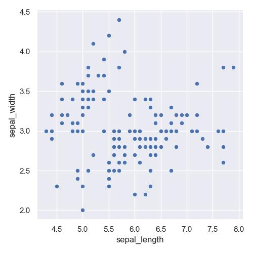</img>

    各点を線で繋ぐこともできます。それには `kind="line"` を使います
    ```python
    sns.relplot(data=df, x="sepal_length", y="sepal_width", kind="line",
                errorbar=None, estimator=None)
    ```
    > 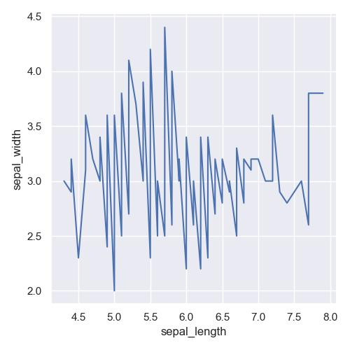</img>
- 例：適当な列名を指定して、その値ごとに色を変更してプロット
    ```python
    sns.relplot(
        data=df, x="sepal_length", y="sepal_width", 
        kind="scatter",
        hue="species")
    ```
    > 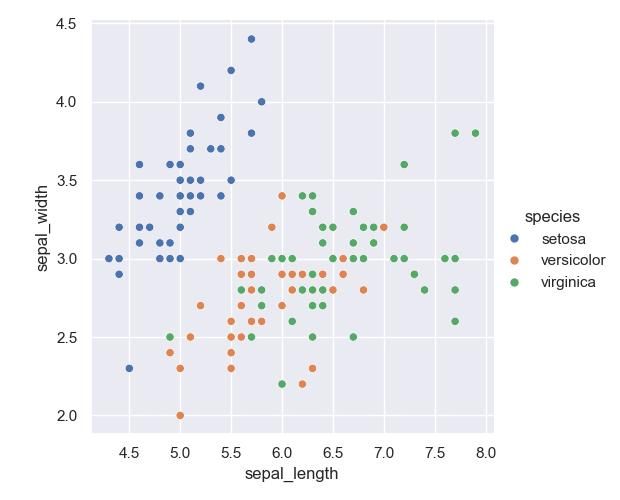</img>
- 例：各点を繋ぐ方は、適当な推定を行って誤差領域を書くこともできます
    ```python
    df = sns.load_dataset("fmri") # Copyright (c) 2015, Michael Waskom

    sns.relplot(
        data=df, x="timepoint", y="signal",
        kind="line",
        hue="region", style="event",
        dashes=False, markers=True, # errorbar=None, estimator=None
    )
    ```
    > 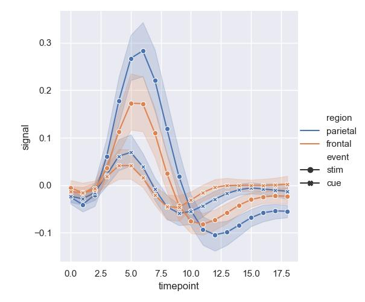</img>

#### 分布のプロット `displot`

displotは、
```python
sns.displot(df, x="dfの列名", y="dfの列名")
```
です。ここで `y` はなくてもよく、
- `y`なし：横軸 `x`、縦軸が分布のmassの大きさ
- `y`あり：横軸 `x`、縦軸 `y` での 等高線プロット

となります。詳しくは
- https://seaborn.pydata.org/tutorial/distributions.html

を参照してください。
- 例：
    ```python
    df = sns.load_dataset("penguins")

    sns.displot(data=df, x="flipper_length_mm")
    ```
    > 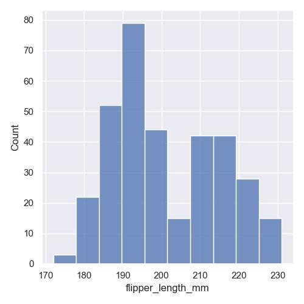</img>
    
    これは素朴に分布をヒストグラムでプロットしたものですが、適当な密度推定を行って（`kind="kde"`）滑らかにすることもできます：
    ```python
    sns.displot(data=df, x="flipper_length_mm",
                kind="kde", multiple="stack")
    ```
    > 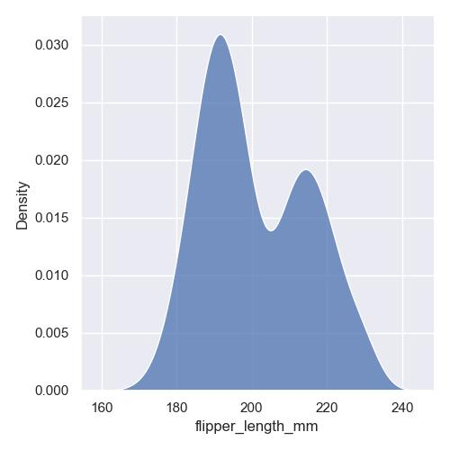</img>

- 例：適当な列名を指定して、その値ごとに色を変更してプロット：
    ```python
    sns.displot(df, x="flipper_length_mm", 
                hue="species")
    ```
    > 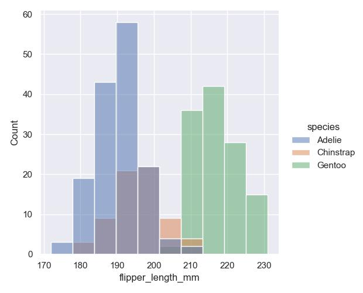</img>
- 例：`y` を指定して、2次元で等高線プロット
    ```python
    sns.displot(df, x="bill_length_mm", y="bill_depth_mm", 
                hue="species", kind="kde", fill=True, alpha=.7)
    ```
    > 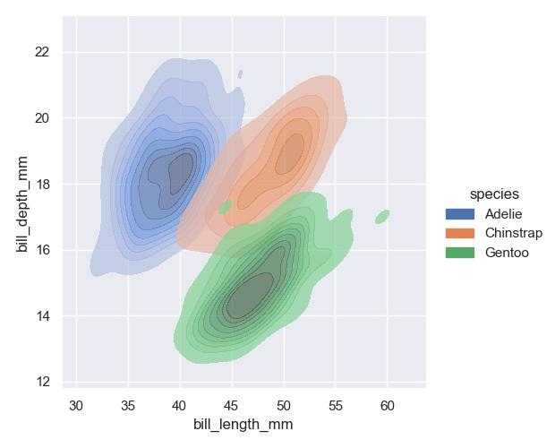</img>

#### カテゴリカルプロット `catplot`

最後に catplot は
```python
sns.catplot(data=df, x="dfの列名", y="dfの列名")
```
です。ここで `x` か `y` のどちらかは離散値である必要があります。機能的には relplot の片方が離散値になったようなイメージですが、より統計的な図を描くのに適しています。より詳細は
- https://seaborn.pydata.org/tutorial/categorical.html

を見てください。
- 例：
    ```python
    df = sns.load_dataset("penguins")

    sns.catplot(data=df, x="species", y="bill_length_mm")
    ```
    > 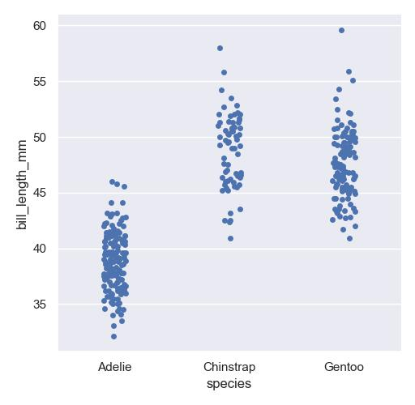</img>

    離散値の方は重ね打ちすると見にくい場合があるので、デフォルトでは適当にノイズがかけられます。それが嫌な場合は `jitter=False` にします：
    ```python
    sns.catplot(data=df, x="species", y="bill_length_mm",
                jitter=False)
    ```
    > 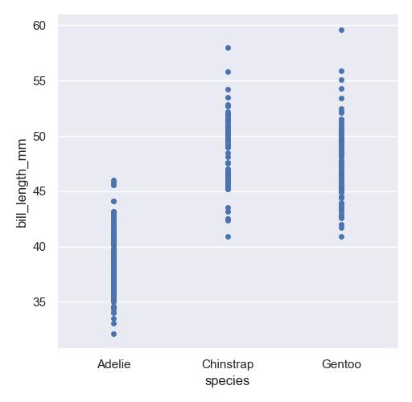</img>
- 例：適当な信頼区間を設けた、いわゆる「箱ひげプロット」
    ```python
    sns.catplot(data=df, x="species", y="bill_length_mm",
                kind="box")
    ```
    > 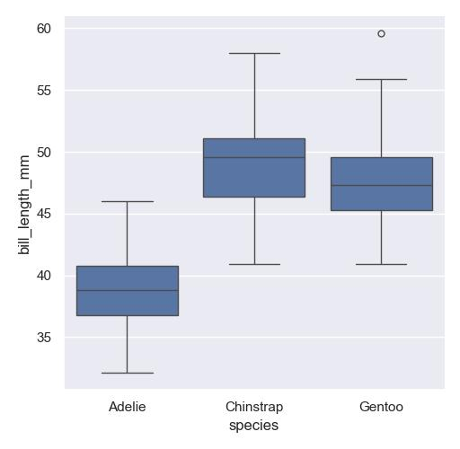</img>

    似たプロット方法として、いわゆる「バイオリンプロット」
    ```python
    sns.catplot(data=df, x="species", y="bill_length_mm",
                kind="violin")
    ```
    > 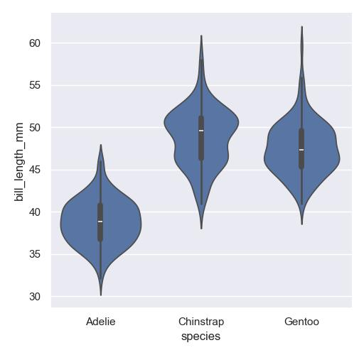</img>
- 例：もちろんラベル分けも可能です
    ```python
    sns.catplot(data=df, x="species", y="bill_length_mm",
                hue="sex",
                kind="violin", split=True)
    ```
    > 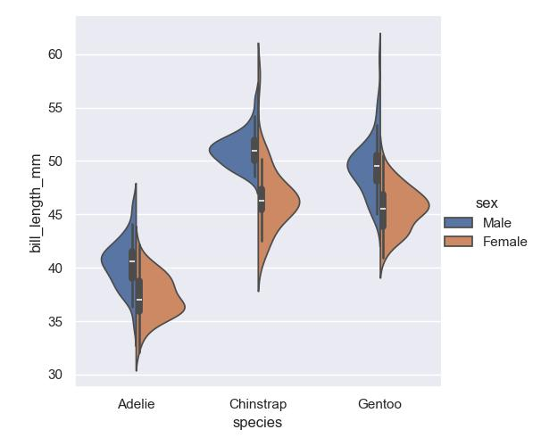</img>

$\blacksquare$ **練習問題6:** 次のようなデータ生成器 `get_noisy_sin` によって作られたデータ `df` を考えます：
```python
import matplotlib.pyplot as plt
import numpy as np

class get_noisy_sin:
    rng = np.random.default_rng(seed=1)
    
    def sample(self, N):
        x = self.rng.uniform(-3, 3, N)
        y = np.sin(x)
        noise = self.rng.normal(0, .2, N)
        is_noisy = self.rng.choice([True, False], N)
        y += is_noisy*noise
        return x, y, is_noisy
    
p = get_noisy_sin()
x, y, is_noisy = p.sample(100)
df = pd.DataFrame({
                "x": x,
                "y": y,
                "is_noisy": is_noisy
     })
df.head()
```
> |    |          x |          y | is_noisy   |
> |---:|-----------:|-----------:|:-----------|
> |  0 |  0.0709297 |  0.0708703 | False      |
> |  1 |  2.70278   |  0.424863  | False      |
> |  2 | -2.13504   | -0.672503  | True       |
> |  3 |  2.6919    |  0.434692  | False      |
> |  4 | -1.12901   | -0.770159  | True       |

このデータは y にノイズが入っていたり、入っていなかったりします。その構造がよくわかるようにプロットしてみてください。
> [!TIP]
> <details>
> <summary>解答例</summary>
> 
> 例えば `hue` でノイズ入りとそうでないものの色分けなどができます：
> ```python
> sns.relplot(
>     data=df, x="x", y="y", 
>     kind="scatter",
>     hue="is_noisy")
> ```
> > 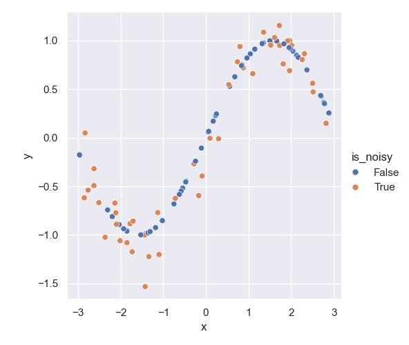</img>
> </details>

$\blacksquare$ **練習問題7:** 次のようなデータ生成器 `get_two_gauss` によって作られたデータ `df` を考えます：
```python
import matplotlib.pyplot as plt
import numpy as np

class get_two_gauss:
    rng = np.random.default_rng(seed=1)
    
    def sample(self, N):
        xs = []
        modes = []
        for n in range(N):
            mode = self.rng.choice(["left", "right"])
            if mode == "left":
                x = self.rng.normal(-1, 1)
            else:
                x = self.rng.normal(+1, 1)
            xs.append(x)
            modes.append(mode)
        xs = np.array(xs)
        modes = np.array(modes)
        return xs, modes
    
p = get_two_gauss()
xs, modes = p.sample(5000)
df = pd.DataFrame({
                "x": xs,
                "mode": modes
     })
df.head()
```
> |    |         x | mode   |
> |---:|----------:|:-------|
> |  0 | -0.178382 | left   |
> |  1 |  1.33044  | right  |
> |  2 |  1.90536  | right  |
> |  3 |  1.44637  | right  |
> |  4 | -0.418882 | left   |

このデータは x が $`\mathcal{N}(-1, 1)`$ からサンプルされた場合は mode = left を、x が $`\mathcal{N}(+1, 1)`$ からサンプルされた場合は mode = right という構成になっています。このデータの分布をプロットしてください。

> [!TIP]
> <details>
> <summary>解答例</summary>
> 
> ```python
> sns.displot(df, x="x", 
>             hue="mode")
> ```
> > 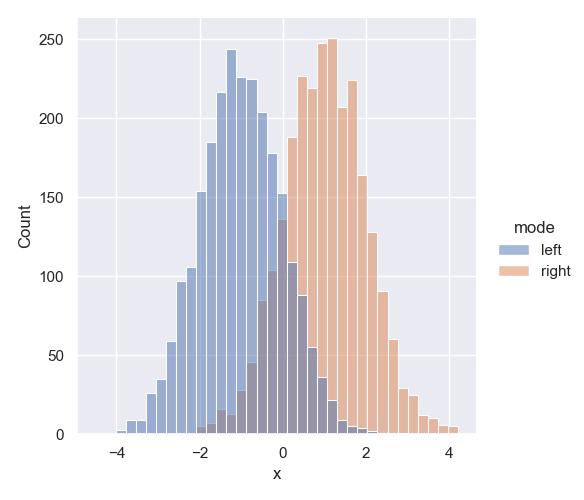</img>
> 
> なお、`hue` を指定せずに書くと周辺化になります：
> ```python
> sns.displot(df, x="x")
> ```
> > 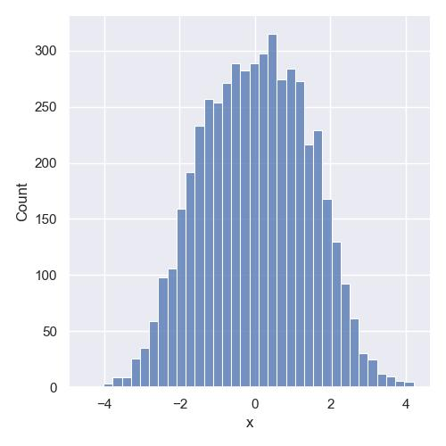</img>
> </details>

$\blacksquare$ **練習問題8:** 上の問題で作成したデータを、箱ひげプロットしてください。
> [!TIP]
> <details>
> <summary>解答例</summary>
> 
> ```python
> sns.catplot(df, x="mode", y="x",
>             kind="box",
>             hue="mode") # ここはなくても良いですが、上の問題の図との比較のため
> ```
> > 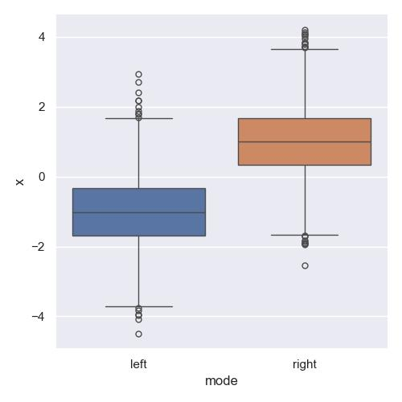</img>
> </details>

### Axesレベル関数

上記3つの関数は axes レベル関数のラッパーとなっています。詳しくは以下を参照：
- https://seaborn.pydata.org/tutorial/function_overview.html#figure-level-vs-axes-level-functions

この図にあるような一つ低レイヤーの関数は `ax` という入力を許しますが、これは `matplotlib.pyplot` の axesオブジェクトです。すなわち、matplotlib と seaborn を併用できるということです。典型的には以下のように使います

```python
import matplotlib.pyplot as plt

ax = plt.subplot()      # plt で axes を作る
sns.axesレベル関数(data=df, ...,
                 ax=ax) # それをここで代入している
```

axes レベルの関数は多岐にわたるので、ここでは解説しません。何かご自身でプロットする際「こういうプロットできないかな？」と思った際に、それを実現する関数がないか調べてみるのが良いかと思います。

- 例：`sns.scatterplot` と matplotlib の `plot` を併用
    ```python
    import numpy as np
    import matplotlib.pyplot as plt

    df = sns.load_dataset("penguins")
    x = np.linspace(190, 230, 10)

    ax = plt.subplot()     # matplotlib.pyplot で axes オブジェクトを作り
    sns.scatterplot(data=df, x="flipper_length_mm", y="bill_depth_mm",
                    ax=ax) # ここで代入している
    ax.plot(x, (20-14)/(230-190)*(x-190)+14, color="red")
    ```
    > 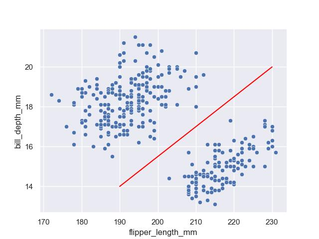</img>

$\blacksquare$ **練習問題9:** 練習問題6 の結果に、サインカーブを重ね書きしてください。
> [!TIP]
> <details>
> <summary>解答例</summary>
> 
> 判例がちょっと変かもですが、こんな感じです：
> ```python
> p = get_noisy_sin()
> x, y, is_noisy = p.sample(100)
> df = df = pd.DataFrame({
>                 "x": x,
>                 "y": y,
>                 "is_noisy": is_noisy
>             })
> x_np = np.linspace(-3, 3, 100)
> 
> ax = plt.subplot()
> ax.plot(x_np, np.sin(x_np), label="sin(x)")
> sns.scatterplot(data=df, x="x", y="y", 
>                 hue="is_noisy",
>                 ax=ax)
> ```
> > 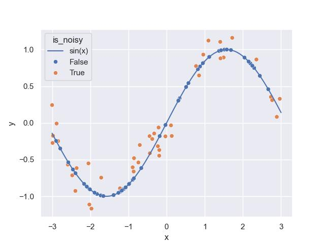</img>
> </details>

### Figureレベルで 複数の axes プロット

Figureレベルプロットのオプションで 
- `row="dfの列名"`：行方向に別々にプロット
- `col="dfの列名"`：列方向に別々にプロット

をすることができます。
- 例：
    ```python
    df = sns.load_dataset("penguins")

    sns.relplot(data=df, x="bill_length_mm", y="bill_depth_mm", 
                hue="sex", 
                col="species")
    ```
    > 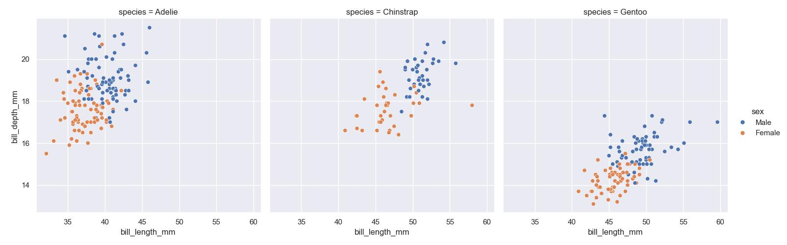</img>

    displotでもできます：
    ```python
    sns.displot(data=df, x="bill_length_mm", y="bill_depth_mm", 
                hue="sex", kind="kde",
                col="species")
    ```
    > 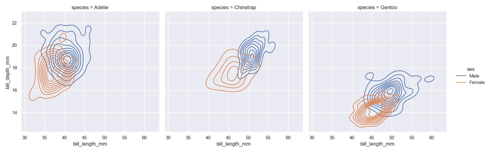</img>

    catplot：
    ```python
    sns.catplot(data=df, x="sex", y="bill_depth_mm", 
                hue="sex", kind="box",
                col="species")
    ```
    > 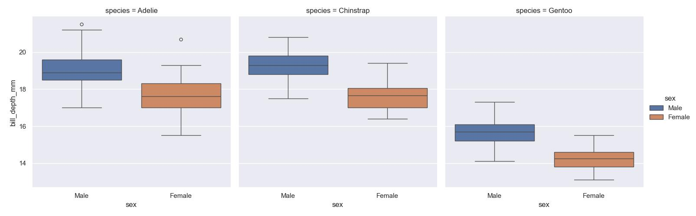</img>

#### jointplot：2変数の確率分布とその周辺化

紹介してこなかった figure レベルのプロットに `jointplot` というのがあります。二変数 $x, y$ についての分布 $p(x, y)$ があった時、これを周辺化して

|$p(x)$||
|--|--
|$p(x, y)$|$p(y)$

のような図を描くことができます。基本は以下です
```python
sns.jointplot(data=df, x="dfの列名", y="dfの列名")
```
- 例：
    ```python
    df = sns.load_dataset("penguins")
    sns.jointplot(data=df, x="bill_length_mm", y="bill_depth_mm", 
                  hue="species")
    ```
    > 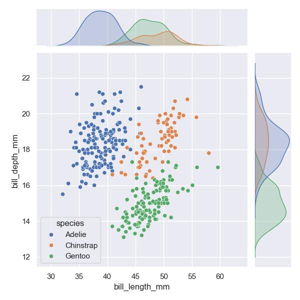</img>

#### pairplot：DataFrameの情報を全てプロット

DataFrameの全ての情報を可視化したい場合には
```python
sns.pairplot(df)
```
とすると、行、列として `df` に含まれる列名を全て含んだ組み合わせでのプロットが可能です。
- 例：
    ```python
    df = sns.load_dataset("penguins")
    sns.pairplot(df, hue="species")
    ```
    > 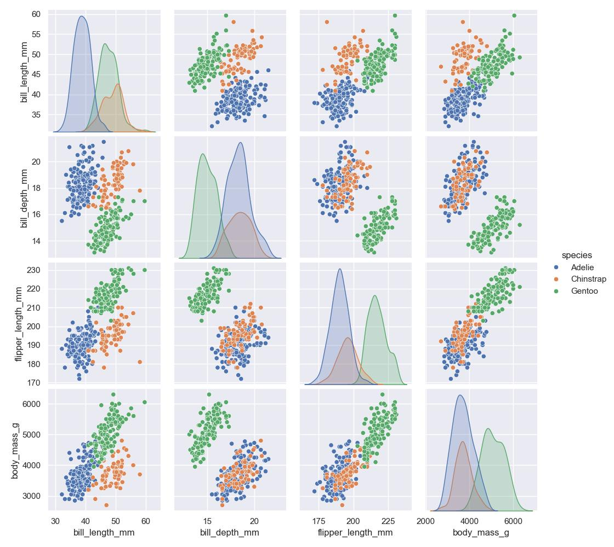</img>

## コラム：ネット上のデータを拾いに行くことに対しての注意

### 権利関係の確認と本ノートで使用したデータのライセンス

今回の pandas や seaborn では、コマンドでネット上のデータを取りに行くことができました。python に限らず、このようなことは他の言語でも可能です。その際、まず権利関係について把握しておくことをお勧めします。ネット上のデータは著作権や肖像権などで守られている場合があるためです。
> 今回使用したぶん調べてみると：
> - wikipediaのhtmlデータ: https://ja.wikipedia.org/wiki/Wikipedia:%E3%82%A6%E3%82%A3%E3%82%AD%E3%83%9A%E3%83%87%E3%82%A3%E3%82%A2%E3%82%92%E4%BA%8C%E6%AC%A1%E5%88%A9%E7%94%A8%E3%81%99%E3%82%8B を読むと今回の講義の使用はOKと読める
> - Irisデータ：R. A. Fisherによって制作、CC BY 4.0 ライセンスなので使用OKと読める
>   - ソース元：https://archive.ics.uci.edu/dataset/53/iris
> - fmriデータ：Copyright (c) 2015, Michael Waskom、以下のソース元のライセンス表示により使用OKと読める
>   - ソース元：https://github.com/mwaskom/Waskom_CerebCortex_2017
> - Penguinデータ CC0 1.0 Universal ライセンスなので使用OKと読める
>   - ソース元：https://github.com/allisonhorst/palmerpenguins
> 
> です。より詳細な著作権情報は上のリンクを参照してください。
> 


### 自動化処理では待つ時間を作るべし

そのあたりの問題をクリアしたのち、プログラムを用いて自動でデータ収集するとします。この時、例えば素朴に `for`文 などを用いて同じサーバーにデータを要求し続けると（pythonは遅いといえども）非常に高速なurlリクエストがサーバーに送られ続けることになり、
- サーバーに負荷を与えたり
- ネット回線を混雑させたり
- 相手側に不正アクセスを疑われたり

してしまいます。これが良くないというのは明らかでしょう。

このような処理の際のよくある対策は、ループ処理ごとに一旦決まった時間待つ処理を加えることです。もしpythonでデータ収集を自動化する際は、

```python
import time

# 自動化処理中
for n in ...:
    # サーバーにアクセスするコマンド
    time.sleep(60) # 60秒プログラムを停止する
```

のように、`time` モジュールを使って適切な時間待つべきです。これは pandas や seaborn に限らず、プログラムを使ってネット上にアクセスする際にはいつでも気をつけるべきことです。

[前のsection](2-2.md) | [次のsection](../section3/preface.md)