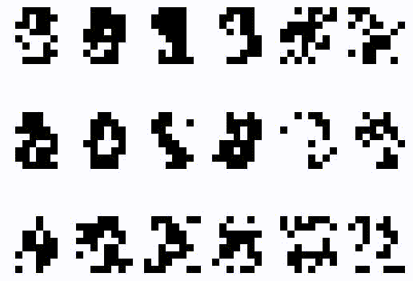
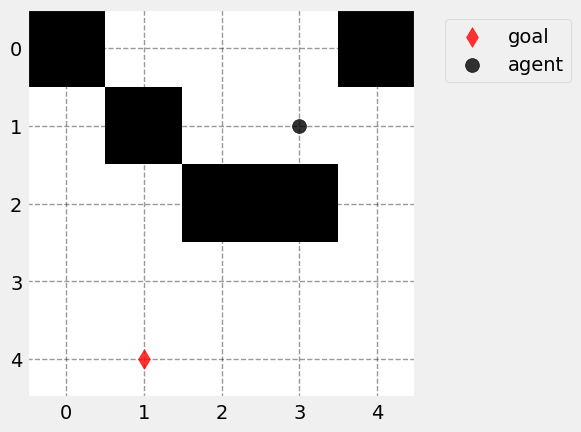

# 3-1. 軽量な機械学習

この節以降ではいくつかの機械学習アルゴリズムを扱いますが、その理論的な背景などはほとんど説明しないので、興味がある方はご自身で調べて見てください。

## 定番のライブラリ：`scikit-learn`

このセクションでは `scikit-learn` というライブラリを用いて、簡単な機械学習アルゴリズムが手軽に実装できることを見てゆく。このライブラリのインポート文は
```python
import sklearn
```
あるいは機能が多いため、`from sklearn import 使うもの` とする場合も多いです。公式ドキュメントは以下：
- https://scikit-learn.org/stable/

また、以後のプログラムでは以下のライブラリを使います：
```python
import numpy as np
import matplotlib.pyplot as plt
import seaborn as sns
import pandas as pd

sns.set_theme(style="darkgrid")
```
それぞれの使い方の基本は [セクション2-1 (numpy+matplotlib)](../section2/2-1.md)、あるいは [セクション2-3（pandas+seaborn）](../section2/2-3.md) をみてください。

### 教師あり学習

データの形式が $`(x, y) =`$ (入力, 出力) で与えられ、データが何らかの確率分布 $`p`$ に従う場合に データN標本 $`\{(x_i, y_i) \sim p\}_{i=1}^N`$ から何らかのモデルを構成し、同じ確率分布 $`p`$ から発生した新たな入力データ $`x_{new}`$ に関して $`y_{new}`$ を予言するのが 教師あり学習 の目的です。


#### 最小二乗法（回帰）

まずは $`x, y \in \mathbb{R}`$ の場合を考えてみましょう。モデルとして

```math
\begin{align*}
f_\theta(x) = \theta_0 + \theta_1 x 
\quad
\theta = (\theta_0, \theta_1) \in \mathbb{R}^{2}
\end{align*}
```

を考え、$`f_\theta(x) \approx y`$ を目指します。そのために

```math
\begin{align*}
\theta^* \in \text{argmin}_\theta \frac{1}{N} \sum_{i=1}^N (f_\theta(x_i) - y_i )^2
\end{align*}
```

を求める問題を考えます。これは `sklearn` だと簡単に実装できます。テンプレは以下の通り：
```python
from sklearn import linear_model

X = [[x1], [x2], ...] # shapeに注意
y = [y1, y2, ...]     # shapeに注意

model = linear_model.LinearRegression()
model.fit(X, y)
```

この疑似コードは上の図の最初の部分に当たります：


これで `model` というオブジェクトに $`\theta^*`$ が記録されます。実際にモデルを使って $`f_\theta(x)`$ を計算するには
```python
X_new = [[x1_new], [x2_new], ...]
y_pred = model.predict(X_new)
```
とすれば良いです。この部分は最初の絵の後半部分に対応します：


##### 入力のshapeに関する注意

なお、注意ですがモデルを通じて実際に処理をする場合、入力データのshapeが `(データ数, 1データの次元)` のようになっている必要があります。これは次回以降の他のライブラリでも同じ仕様となっています。 


これは例え1データ `x`（`データ数=1`、`次元=dim`） だけ処理する場合でも `x.shape` が `(1, dim)` となっていないといけないということです。

- 例：簡単な線形回帰

    検証のためのプロット関数を作ります：
    ```python
    def plot_regression(model, df, L=1, N=300):
        X_new = np.linspace(-L, L, N).reshape(-1, 1)
        y_pred = model.predict(X_new)
        # plot
        ax = plt.subplot()
        sns.scatterplot(df, x="x", y="y", ax=ax, label="data")
        ax.plot(X_new, y_pred, color="red", label="model prediction")
        plt.legend()
        return ax
    ```
    以後、回帰にはこのプロット関数を使います。

    <details class="memo">
    <summary>step1：データ生成分布 p の作成</summary>
    <blockquote>

    まずはデータ生成確率分布のクラスとそのオブジェクトを作ります：
    ```python
    class DataGeneraor1():
        def __init__(self, c1=.5, seed=1):
            self.c1 = c1
            self.rng = np.random.default_rng(seed)

        def sample(self, N):
            x = self.rng.uniform(-1,1, N)
            df = pd.DataFrame({"x": x, "y":self.c1*x + self.rng.normal(0, .05, N)})
            return df

    p = DataGeneraor1()
    ```
    これで、`p.sample(N)` とすれば同一の確率分布からのサンプルが pandas のDataFrameオブジェクトとして得られるようになりました。試しに `N=10` でデータを取ってみます：
    ```python    
    df = p.sample(N=10)

    ax = plt.subplot()
    sns.scatterplot(df, x="x", y="y", ax=ax)
    ```
    > </img>

    </blockquote>
    </details>

    <details class="memo">
    <summary>step2：モデルの作成</summary>
    <blockquote>

    このデータに対し、モデルを作る：
    ```python
    # X,y としてデータ df を適切な numpy 配列に整形
    X = df[["x"]].to_numpy().reshape(-1, 1)
    y = df[["y"]].to_numpy().reshape(-1)

    # モデルを作り X,y で訓練する
    model = linear_model.LinearRegression()
    model.fit(X, y)
    ```
    これで `model` 中のパラメータ $`\theta`$ が最適化されました。
    </blockquote>
    </details>
    
    <details>
    <summary>step3：モデルの可視化</summary>
    <blockquote>

    モデルの振る舞いをみてみると：
    ```python
    plot_regression(model, df)
    ```
    > </img>
    </blockquote>
    </details>
    

なお、より一般には $`x = (x_1, x_2, ...,x_p)\in \mathbb{R}^p`$ の場合のモデル

```math
\begin{align*}
f_\theta(x) = \theta_0 + \theta_1 x_1 + \theta_2 x_2 + \dots + \theta_p x_p 
\end{align*}
```

を作ることも可能です。これは入力データを
```python
X = [[x1], [x2], ...] # shapeに注意
```
から
```python
X = [[x1_1, x1_2, ..., x1_p], [x2_1, x2_2, ..., x2_p], ...] # shapeに注意
```
に変更することで実現できます。

例えば入力が1次元の$`x`$でも、これの適当な冪までを計算することにして、以下のように高次元化することが可能です：


このようにデータをモデルに食わせる前になんらかの形に加工することを一般に **前処理（preprocessing）** と言います。


- 例：sklearnでの実装

    <blockquote>

    入力を $`x`$ から $`[1, x, x^2, ..., x^\text{degree}]`$ に変更するクラスが `sklearn` にあります。
    ```python
    from sklearn.preprocessing import PolynomialFeatures

    poly = PolynomialFeatures(degree=5)
    ```
    preprocessingとはデータの値を事前に処理すると言う意味の機械学習の用語です。ここではデータから次数 `degree` までの単項式で作られるベクトルを作成するクラス、`PolynomialFeatures` を使っています。以後はこのオブジェクト `poly` を使えば、入力を変更できます。以下のように使います：
    ```python
    X_powers = poly.fit_transform(X) # X の shape が (データ数, データ次元) である必要あり
    ```
    これで `X_powers` は $`[1, x, x^2, ..., x^\text{degree}]`$ の形式からなるデータになりました。あとはこの `X_powers` をモデルに食わせてやれば良いです。

    </blockquote>

    


#### 前処理とモデルを一まとめにする方法

上の例のように、`X_powers` を使ってモデルを作っても良いのですが、モデルを動かす度に毎回前処理を書かないといけなくなり、面倒です。sklearn では `Pipeline` オブジェクトを使って、前処理とモデルをひとまとまりにした新たなモデルを構成でき便利です。より一般には、以下に描いたように、さまざまな処理をパッキングできる機能となります：


処理xに入るものは前処理でも、回帰のモデルなどでもOKです。作り方にはいくつかありますが、シンプルなのは以下の `make_pipeline` 関数を使うやり方です
```python
from sklearn.pipeline import make_pipeline

model = make_pipeline(
                        処理1,
                        処理2,
                        ...
                        )
model.fit(X, y)
```
こうしておくと、中間の処理が表に出てこなくてプログラムがシンプルになります。
なお、ここまででも `model.fit()` を実行すると 出力で何か見慣れない箱が出てきたと思いますが、これは作ったモデルの内部処理を絵的に表示したものです。クリックで詳細が見られます。

- 例：人工データ分布pで多項式回帰
    
    <details>
    <summary>5次のモデル（適切なやり方）</summary>
    <blockquote>

    ```python
    from sklearn.pipeline import make_pipeline

    model = make_pipeline(
                        PolynomialFeatures(degree=5),
                        linear_model.LinearRegression(fit_intercept=False)
                            # fit_intercept=False は切片を入れるかどうか。
                            # 今は 入力が [1, x, x^2, ...] で 1 を含むので、無しにしておく
                        )
    model.fit(X, y)
    ```
    モデルの振る舞い：
    ```python
    plot_regression(model, df)
    ```
    > </img>
    </blockquote>
    </details>
    <details>
    <summary>10次のモデル（過剰適合）</summary>
    <blockquote>

    `degree=10` に設定してみると以下のようになります。
    ```python
    # モデル取得
    model2 = make_pipeline(
                        PolynomialFeatures(degree=10),
                        linear_model.LinearRegression(fit_intercept=False)
                        )
    model2.fit(X, y)

    # プロット
    ax = plot_regression(model2, df)
    ax.set_ylim([-.55,.55])
    ```
    > </img>

    10次の多項式を使うと、フィッティングの自由度が大きいので、**データを完璧に再現することができます**。そのように言うと良いことのように感じるかもしれませんが、機械学習の目的は未知のデータに対する予言なのでした。このモデルに予言能力があるかどうか、実際に $`p`$ から新しいデータを取って、それと一緒にプロットしてみます：
    ```python
    df_new = p.sample(10) # new data
    ax = plot_regression(model2, df_new)
    ax.set_ylim([-.55,.55])
    ```
    > </img>

    このように新しいデータでは端の方の予言値が全然合っていません。学習用のデータに当てはめが良すぎることを**過剰適合**と言いますが、過剰適合はデータのノイズもモデルで再現しようとすることで生じる現象で、通常は避けねばなりません。
    </blockquote>
    </details>
    

##### L2正則化＝Ridge回帰

さて、モデルの表現力を上げたいけれど、上げすぎると過剰適合の問題があります。初めから適切な `degree` の値を知らない場合はどうすれば良いでしょうか。このような場合の処方箋として
1. ともかくモデルの表現力はなるべく大きくしておき
2. 最小化する目的に「表現力が大きすぎるとペナルティが生じる」ような項を追加する（これを**正則化項**と言います）

よくある正則化項に、$`\|\theta\|^2 = \theta_0^2 + \theta_1^2 + ...`$ を適当な正の係数をかけて追加するというのがあります：

```math
\begin{align*}
\theta^* \in \text{argmin}_\theta \left(
    \frac{1}{N} \sum_{i=1}^N (f_\theta(x_i) - y_i )^2
    + \alpha \|\theta\|^2
    \right)
\end{align*}
```

このような正則化付きの回帰を **Ridge回帰** と言います。Ridge回帰のモデルを作る場合は
```python
model = linear_model.Ridge(alpha)
model.fit(X, y) # pipelineを使わない場合
```
とします。

<details>
<summary>例：10次のモデルでRidge回帰</summary>
<blockquote>

$`f_\theta(x)`$ として又多項式を取りたいので、`linear_model.Ridge()` をそのまま使うことはせず、多項式化の事前処理とまとめた `Pipeline` オブジェクトを作ります
```python
model_ridge = make_pipeline(
                            PolynomialFeatures(degree=10),
                            linear_model.Ridge(alpha=.01, fit_intercept=False)
                            )
model_ridge.fit(X, y)

ax = plot_regression(model_ridge, df)
```
> </img>

このように、10次であっても振る舞いがほとんど線形（学習データの作成の仕方に沿っていることに注意）に抑えられました。
</blockquote>
</details>
    

##### L1正則化＝LASSO

別の正則化項に、$`|\theta| = |\theta_0| + |\theta_1| + ...`$ を適当な正の係数をかけて追加するというのがあります：

```math
\begin{align*}
\theta^* \in \text{argmin}_\theta \left(
    \frac{1}{N} \sum_{i=1}^N (f_\theta(x_i) - y_i )^2
    + \alpha |\theta|
    \right)
\end{align*}
```

このような正則化付きの回帰を **LASSO回帰** と言います。LASSO回帰のモデルを作る場合は
```python
model = linear_model.Lasso(alpha)
model.fit(X, y) # pipelineを使わない場合
```
とします。
    
<details>
<summary>例：10次のモデルでLasso回帰</summary>
<blockquote>

$`f_\theta(x)`$ として又多項式を取りたいので、`linear_model.Lasso()` をそのまま使うことはせず、多項式化の事前処理とまとめた `Pipeline` オブジェクトを作ります
```python
model_lasso = make_pipeline(
                            PolynomialFeatures(degree=10),
                            linear_model.Lasso(alpha=.01, fit_intercept=False)
                            )
model_lasso.fit(X, y)

ax = plot_regression(model_lasso, df)
```
> </img>
</blockquote>
</details>
    


LASSO回帰では、Ridge回帰に比べ有効な $`\theta`$ の成分以外は **0 になりやすい** と言う性質があります。このように、値が0のスロットが多くなるようなモデリングを **スパースモデリング** と言います。

<details class="memo">
<summary>例：10次モデルのパラメータ可視化</summary>
<blockquote>
    
モデルの実際のパラメータ $`\theta=[\theta_0, \theta_1, \theta_2, ...]`$ は配列として得られるので、これまでに得られた `degree=10` でのモデルのパラメータを可視化してみます。まず pandas でデータフレームを作ります：
```python
coefs = pd.DataFrame(
            {"coef": np.concatenate([model2.get_params()["linearregression"].coef_, 
                                        model_ridge.get_params()["ridge"].coef_, 
                                        model_lasso.get_params()["lasso"].coef_]),
                "degree": np.concatenate([np.arange(11), np.arange(11), np.arange(11)]),
                "penalty": np.concatenate([["linear"]*11, ["ridge"]*11, ["lasso"]*11])}
        )
```
一旦全ての分布を見てみましょう：
```python
g = sns.catplot(coefs, kind="bar", x="penalty", y="coef", hue="penalty", col="degree",)
g.set_titles(r"$`\theta_{{{col_name}}}`$", size=36)

for ax in g.axes.flat:
    ax.tick_params(axis='x', labelsize=25) 

plt.ylim([-1,1])
```
> </img>

これを見ると
- `linear`（正則化なし）：$`\theta`$ の値は高次に行くほど、大きな値（過剰適合のサイン）
- `ridge`：$`\theta`$ の値は、ほとんど1次のみで、高次も少し値がある
- `lasso`：$`\theta`$ の値は、1次のみ

となっているのがわかります。正則化による効果と、LASSOのスパースモデリングの性質がよくわかる例です。

</blockquote>
</details>


$\blacksquare$ **練習問題1:** 2-3の練習問題6で作成したデータ生成クラス `get_noisy_sin` を使ったデータ生成を考えます。

<details class="memo">
<summary>その時のプログラム（クリックで展開）</summary>

```python
# データ生成クラスとインスタンス作成
class get_noisy_sin:
    rng = np.random.default_rng(seed=1)
    
    def sample(self, N):
        x = self.rng.uniform(-3, 3, N)
        y = np.sin(x)
        noise = self.rng.normal(0, .2, N)
        is_noisy = self.rng.choice([True, False], N)
        y += is_noisy*noise
        return x, y, is_noisy

p = get_noisy_sin()

# データ生成
x, y, is_noisy = p.sample(30)
df = pd.DataFrame({
                "x": x,
                "y": y,
                "is_noisy": is_noisy
     })
```
</details>

`get_noisy_sin` のデフォルト設定で、30個のサンプルを生成し、
- `PolynomialFeatures(degree=10)`
- `linear_model.LinearRegression(fit_intercept=False)`

からなるパイプラインで、データ全て使ってモデルを作成してみてください。モデル `model` を使った 結果を確認するには
```python
ax = plot_regression(model, df, L=3.) # デフォルトのままだと幅が -1, 1 なので -3, 3 に直します
```
を使ってください。（なお、あまり良い結果にはなりません。）

> [!TIP]
> <details>
> <summary>解答例</summary>
> 
> ```python
> # データ生成クラスとインスタンス作成
> class get_noisy_sin:
>     rng = np.random.default_rng(seed=1)
>     
>     def sample(self, N):
>         x = self.rng.uniform(-3, 3, N)
>         y = np.sin(x)
>         noise = self.rng.normal(0, .2, N)
>         is_noisy = self.rng.choice([True, False], N)
>         y += is_noisy*noise
>         return x, y, is_noisy
> 
> p = get_noisy_sin()
> 
> # データ生成
> x, y, is_noisy = p.sample(30)
> df = pd.DataFrame({
>                 "x": x,
>                 "y": y,
>                 "is_noisy": is_noisy
>      })
> 
> # モデル
> X = df[["x"]].to_numpy().reshape(-1, 1)
> y = df[["y"]].to_numpy().reshape(-1)
> 
> model_test = make_pipeline(
>                       PolynomialFeatures(degree=10),
>                       linear_model.LinearRegression(fit_intercept=False)
>                       )
> model_test.fit(X, y)
> 
> # プロット
> ax = plot_regression(model_test, df, L=3.) # デフォルトのままだと幅が -1, 1 なので -3, 3 に直します
> ```
> > </img>
> 
> このように端の方でガタガタになってくるかと思います。
> </details>


$\blacksquare$ **練習問題2:** 同様のデータサンプルで、データにはノイズ入りかそうでないかの情報もありました。ノイズ無しのデータだけでモデル作成してみてください。上の（クリックして展開）にあるデータ生成の際、pandasのDataFrameオブジェクトとして `df` を作成していますが、この表から `is_noisy` が `False` のデータだけ抜き出す方法は以下です：

```python
df_clean = df[df["is_noisy"]==False]
```

> [!TIP]
> <details>
> <summary>解答例</summary>
> 
> ```python
> df_clean = df[df["is_noisy"]==False]
> 
> X = df_clean[["x"]].to_numpy().reshape(-1, 1)
> y = df_clean[["y"]].to_numpy().reshape(-1)
> 
> model_test = make_pipeline(
>                       PolynomialFeatures(degree=10),
>                       linear_model.LinearRegression(fit_intercept=False)
>                       )
> model_test.fit(X, y)
> 
> ax = plot_regression(model_test, df_clean, L=3.)
> ```
> > </img>
> 
> ノイズも入れた最初のバージョンとの振る舞いを比較して、かなり良いモデルになっていますが、問題は、**ノイズが入っているか入っていないかが最初からわかるケースは稀** だということです。ノイズがなくせるのであれば、それに越したことはありません。
> </details>

$\blacksquare$ **練習問題3:** ノイズ有りも入れた全データで同じことを
- `PolynomialFeatures(degree=10)`
- `linear_model.Lasso(alpha=.001, fit_intercept=False)`

からなるパイプラインで実行してみてください。
> [!TIP]
> <details>
> <summary>解答例</summary>
> 
> ```python
> X = df[["x"]].to_numpy().reshape(-1, 1)
> y = df[["y"]].to_numpy().reshape(-1)
> 
> model_test = make_pipeline(
>                       PolynomialFeatures(degree=10),
>                       linear_model.Lasso(alpha=.001, fit_intercept=False)
>                       )
> model_test.fit(X, y)
> 
> ax = plot_regression(model_test, df, L=3.)
> ```
> > ```
> > .../sklearn/linear_model/_coordinate_descent.py:631: ConvergenceWarning: Objective did not converge. You might want to increase the number of iterations, check the scale of the features or consider increasing regularisation. Duality gap: 1.959e-01, tolerance: 1.545e-03
> >   model = cd_fast.enet_coordinate_descent(
> > ```
> 
> 一応、これで警告が出るものの、それっぽい図は出ます。警告を読むと、アルゴリズムの途中で何らかの tolerance（閾値）を超えたため、どうやらアルゴリズムが収束する前にストップしたことがわかります。さらに警告の中で「featureのスケールをチェックするか、正則化を大きくするかしろ」と言っているので、そのようにしてみます。
> 
> 正則化を大きくするには `alpha` の値を大きくするだけで良いので簡単です。先にこちらを試してみると、むしろ結果が悪くなるのがわかります。そこでもう一方のスケールを変更する方を考えます。どのようなスケール変更が可能かは以下をみると書いてあるようです
> 
> - https://scikit-learn.org/1.5/modules/preprocessing.html#standardization-or-mean-removal-and-variance-scaling
> 
> ここで入力（feature）の前処理がいくつか書かれていますが、その中で `MaxAbsScaler` というのを見つけました。これを適用した新しいパイプラインを作ってみましょう：
> ```python
> from sklearn.preprocessing import MaxAbsScaler # added
> 
> X = df[["x"]].to_numpy().reshape(-1, 1)
> y = df[["y"]].to_numpy().reshape(-1)
> 
> model_test = make_pipeline(
>                       MaxAbsScaler(),          # added
>                       PolynomialFeatures(degree=10),
>                       linear_model.Lasso(alpha=.001, fit_intercept=False)
>                       )
> model_test.fit(X, y)
> 
> ax = plot_regression(model_test, df, L=3.)
> ```
> > </img>
> 
> 警告も出ず、なかなか良くなったのではないかと思います。
> </details>

#### 分類

教師あり学習は 入力 $`x`$ に対して 出力 $`y`$ を予想する問題でした。回帰では連続値 $`y \in \mathbb{R}`$ の 場合を考えましたが、何らかの $`N_\text{class} \in \mathbb{N}`$ について離散値 $`y \in \{1,2,...,N_\text{class}\}`$ のようなケースを考えるのが、分類問題です。

##### ロジスティック回帰

分類問題の一つの定式化に、入力値 $`x`$ を条件とした離散値 $`y`$ の条件つき確率モデル $`q(y|x)`$ を考え、データを生成している真の条件付き確率 $`p(y|x)`$ にこれを近づけると言う考え方があります。このためには両者の KLダイバージェンスを最小化することが一つの選択肢です。

条件付き確率のモデルとして、何らかの関数 $`f(y, x)`$ を持ってきて、

```math
\begin{align*}
q(y|x) = \frac{e^{f(y, x)}}{\sum_{\tilde{y}} e^{f(\tilde{y}, x)}}
\end{align*}
```

とすることが考えられます。この関数をさらに、$`x`$ に関する関数と パラメータ $`\theta`$ を使って

```math
\begin{align*}
f(y, x) = \theta_{y0} + f_1(x) \theta_{y1} + \cdots
\end{align*}
```

のように表した場合の 最小化問題

```math
\begin{align*}
\theta^* \in \text{argmin}_\theta \left(
    \frac{-1}{N} \sum_{i=1}^N \log q_\theta(y_i|x_i)
    \right)
\end{align*}
```

をロジスティック回帰と言います。sklearnではやはり
```python
model = linear_model.LogisticRegression()
model.fit(X, y)
```
のように作ることができます。
- 例：人工データ分布pで分類

    後で別の分類モデルも紹介するので、そこでも使える結果のプロット関数を定義しておきます：
    ```python
    def plot_classification(model, df, x0="x0", x1="x1", hue="y", L=300):
        X0 = df[[x0]].to_numpy()
        X1 = df[[x1]].to_numpy()
        X = np.linspace(np.min(X0), np.max(X0) ,L) 
        Y = np.linspace(np.min(X1), np.max(X1), L)  
        X, Y = np.meshgrid(X, Y)        
        
        X_new = np.concatenate([X.reshape(-1, 1), Y.reshape(-1, 1)], axis=1)
        Z = model.predict(X_new).reshape(L, L)
        #print(Z)
        
        ax = plt.subplot()
        mappable = ax.contourf(X, Y, Z, alpha=.5)
        sns.scatterplot(data=df, x=x0, y=x1, ax=ax, hue=hue)
        plt.colorbar(mappable)
    ```
    
    <details>
    <summary>step1：データ生成分布 p の作成</summary>
    <blockquote>

    まずはデータ生成確率分布のクラスとそのオブジェクトを作ります：
    ```python
    class DataGenerator2():
        ''' データを人工的に生成するためのクラスその2
            self.sample(N) で pd.DataFrame オブジェクトを出力
            "x0", "x1", y" がそれぞれの要素に対応
        '''
        def __init__(self, dim=2, n_class=3, seed=1):
            self.dim = dim
            self.n_class = n_class
            self.rng = np.random.default_rng(seed)
            self.mu_for_class_np = self.rng.normal(0, 1, size=(n_class, dim))
            
        def sample(self, N_batch):
            x = []
            y = []
            for n in range(self.n_class):
                mu = self.mu_for_class_np[n]
                x.append(self.rng.normal(0, .3, size=(N_batch//self.n_class, self.dim)) + mu)
                y.append(n*np.ones(shape=(N_batch//self.n_class)))
                
            x = np.concatenate(x, axis=0)
            y = np.concatenate(y, axis=0)
            
            df = pd.DataFrame(
                                {"x0": x[:, 0], 
                                 "x1": x[:, 1], 
                                 "y":np.array(y)}
                             )
            
            return df
        
    p = DataGenerator2()
    ```
    これで、`p.sample(N)` とすれば同一の確率分布からのサンプルが pandas のDataFrameオブジェクトとして得られるようになりました。デフォルトでは $`x`$は2次元、$`N_c=3`$ です。試しに `N=50` でデータを取ってみます：
    ```python
    df = p.sample(50)

    ax = plt.subplot()
    sns.scatterplot(df, x="x0", y="x1", hue="y", ax=ax)
    ```
    > </img>
    </blockquote>
    </details>
    <details>
    <summary>step2：分類モデルの作成</summary>
    <blockquote>

    このデータをロジスティック回帰を使って分類してみます。$`f`$としては適当な次数の冪をとります。そのためには又 `PolynomialFeatures` を使うことができるので、`Pipeline` オブジェクトとして実装しておきます。
    ```python
    from sklearn.preprocessing import PolynomialFeatures

    X = df[["x0", "x1"]].to_numpy()
    y = df[["y"]].to_numpy().reshape(-1)

    model = make_pipeline(
                        PolynomialFeatures(degree=10),
                        linear_model.LogisticRegression(fit_intercept=False)
                        )
    model.fit(X, y)
    ```
    </blockquote>
    </details>

    <details>
    <summary>step3：モデルの可視化</summary>
    <blockquote>
    
    モデルの分類結果を表示してみます：
    ```python
    plot_classification(model, df)
    ```
    > </img>

    うまく分類できているのがわかります。

    </blockquote>
    </details>
    


##### サポートベクトルマシン

これまでの手法では、データ $`D_{N} = \{(x_i, y_i) \sim p\}_{i=1}^N`$ が与えられたとき、そのすべてを使ってモデルを取得していました。分類問題に話を限ると、ちょうどロジスティック回帰の上の図を見るとわかるように、入力データ $`x`$ の空間上に **分類境界** の曲線を描いて空間をいくつかの領域に分け、領域ごとに $`y`$ の値を振り分けるのがモデルのやっていることだとわかります。

そういう意味では、分類境界の近傍のデータしか要らない気がします。そのようなデータを **サポートベクトル** と言います。サポートベクトルマシンの構成では、データ $`D_N`$ の全てを用いることはせず、サポートベクトルだけを最終的なモデルの選択に用います。数学的な説明は少し長くなるため割愛することにして、定性的には、

- サポートベクトルと分類境界の間の距離（マージン）をなるべく大きくする

ようなモデルを選びます。sklearnにおける `SVM` クラスでは、ガウスカーネル（RBF kernel）によるサポートベクトルマシンを以下のようにして簡単に作ることができます。
```python
from sklearn import svm

model = svm.SVC()
model.fit(X, y)
```
- 例：ロジスティック回帰と同じデータでモデルを作ってみる

    
    <details>
    <summary>分類モデル作成＋可視化</summary>
    <blockquote>
    
    ```python
    model = svm.SVC()
    model.fit(X, y)

    plot_classification(model, df)
    ```
    > </img>

    分類境界からサポートベクトルまでの距離（マージンと呼ばれます）をなるべく大きくするように線が引かれていることがわかるかと思います。
    </blockquote>
    </details>
    

$\blacksquare$ **練習問題4:** seabornから呼び出すことができるpenguinデータセットで分類の教師あり学習させてみましょう。以下のデータを使って、好きな分類モデルを作ってプロットしてみてください。
```python
df = sns.load_dataset("penguins").dropna()
x0, x1 = "bill_length_mm", "bill_depth_mm" # ここは df の他の数値型の列名でも良いです

X = df[[x0, x1]].to_numpy()
name2num = {"Adelie":0, "Chinstrap":1, "Gentoo":2}
y = [name2num[name] for name in df[["species"]].to_numpy().reshape(-1)]
```
上のプログラムで学習データが作成できます。モデル作成後のプロットはロジスティック回帰での例で定義した関数：
```python
plot_classification(model, df, x0=x0, x1=x1, hue="species")
```
を使ってください。

> [!TIP]
> <details>
> <summary>解答例</summary>
> 
> ```python
> model = svm.SVC()
> model.fit(X, y)
> 
> plot_classification(model, df, x0=x0, x1=x1, hue="species")
> ```
> > </img>
> </details>

#### その他重要なもの

sklearn にはこの他にも数多くの機械学習アルゴリズムが実装されており、これまで同様
```python
model = Model()
model.fit(X, y)
```
のように使えます。決定木やガウス過程、アンサンブル学習など様々です。詳しくは公式ドキュメントを参照してみてください：
- https://scikit-learn.org/stable/supervised_learning.html

### 教師なし学習

データの形式が $`(x, -) =`$ (入力, -) で与えられ、データが何らかの確率分布 $`p`$ に従う場合に データN標本 $`\{(x_i, -) \sim p\}_{i=1}^N`$ から何らかのモデルを構成し、同じ確率分布 $`p`$ から発生した新たな入力データ $`x_{new}`$ に関して何らかの予言を行うのが 教師なし学習 の目的です。

#### 生成モデル（統計モデル）

この設定だと $`p(x)`$ そのものを予想したくなるかもしれません。


そのための単純な方法に、適当なパラメータで添字づけられた別の確率分布 $`q_\theta(x)`$ を設定し、

```math
\begin{align*}
\theta^* \in \text{argmin}_{\theta} \frac{-1}{N} \sum_{i=1}^N \log q_\theta(x_i)
\end{align*}
```

を見つけることで、$`q_{\theta^*}(x) \approx p(x)`$ を実現する、**最尤推定** と呼ばれる手法が挙げられます。

##### 混合ガウスモデル

簡単な $`q_\theta(x)`$ の作り方として、「成分数」$`M`$ を固定し

```math
\begin{align*}
q_\theta = \sum_{m=1}^M w_m \mathcal{N}(x|\mu_m, \Sigma_m),
\quad
\theta = \{(w_m, \mu_m, \Sigma_m)\}_{m=1}^M
\end{align*}
```

のように、ガウス分布の重ね合わせを考えるやり方があります。これを混合ガウスモデル（Gaussian Mixture Model, GMM）と呼びます。ただし、$`w_m\geq0, \quad\sum_{m=1}^M w_m = 1`$ です。

混合ガウスモデルはsklearnにて、以下のように作ることができます
```python
from sklearn.mixture import GaussianMixture

model = GaussianMixture(n_components, random_state=seed)
model.fit(X)
```

<details>
<summary>例：モデルの作成＋可視化</summary>
<blockquote>

分類のところで作ったデータ生成分布で、$`y`$ の情報を落とせば教師なしデータになるため、それを使いましょう。
```python
p = DataGenerator2(seed=2)

df = p.sample(50)

ax = plt.subplot()
sns.scatterplot(df, x="x0", y="x1", ax=ax)
```
> </img>

$`M=3`$ で混合ガウスモデルを作ります：
```python
from sklearn.mixture import GaussianMixture

model = GaussianMixture(n_components=3, random_state=1)
X = df[["x0", "x1"]].to_numpy()
model.fit(X)
```
できたモデルの密度（の $`\log`$）をプロットする関数を作り、プロットします：
```python
def plot_loglikelihood(model, df, x="x0", y="x1", L=300):
    x0 = df[[x]].to_numpy()
    x1 = df[[y]].to_numpy()
    X = np.linspace(np.min(x0), np.max(x0) ,L) 
    Y = np.linspace(np.min(x1), np.max(x1), L)  
    X, Y = np.meshgrid(X, Y)        
    X_test = np.concatenate([X.reshape(-1, 1), Y.reshape(-1, 1)], axis=1)
    Z = model.score_samples(X_test).reshape(L, L)
    # plot
    ax = plt.subplot()
    mappable = ax.contourf(X, Y, Z, alpha=.5)
    sns.scatterplot(data=df, x=x, y=y, ax=ax)
    plt.colorbar(mappable)

plot_loglikelihood(model, df)
```
> </img>

うまくデータを再現するような密度になっていることがわかります。
</blockquote>
</details>
    

$\blacksquare$ **練習問題5:** seabornから呼び出すことができるpenguinデータセットで混合ガウスモデルを訓練してみましょう。データは
```python
df = sns.load_dataset("penguins").dropna()
x0, x1 = "bill_length_mm", "bill_depth_mm"

X = df[[x0, x1]].to_numpy()
```
で作ることができます。また、できたモデルの可視化は以下を使ってください：

<details class="memo">
<summary>関数定義</summary>

```python
def plot_loglikelihood(model, df, x="x0", y="x1", L=300):
    x0 = df[[x]].to_numpy()
    x1 = df[[y]].to_numpy()
    X = np.linspace(np.min(x0), np.max(x0) ,L) 
    Y = np.linspace(np.min(x1), np.max(x1), L)  
    X, Y = np.meshgrid(X, Y)        
    X_test = np.concatenate([X.reshape(-1, 1), Y.reshape(-1, 1)], axis=1)
    Z = model.score_samples(X_test).reshape(L, L)
    # plot
    ax = plt.subplot()
    mappable = ax.contourf(X, Y, Z, alpha=.5)
    sns.scatterplot(data=df, x=x, y=y, ax=ax)
    plt.colorbar(mappable)
```
</details>

```python
plot_loglikelihood(model, df, x=x0, y=x1)
```

関数定義の部分をクリックすると `plot_loglikelihood` の定義が出てくるので、コピペして使ってください。

> [!TIP]
> <details>
> <summary>解答例</summary>
> 
> ```python
> model = GaussianMixture(n_components=3, random_state=1)
> model.fit(X)
> 
> plot_loglikelihood(model, df, x=x0, y=x1)
> ```
> > </img>
> </details>

##### ボルツマンマシン

別の作り方として、物理の統計力学のように

```math
\begin{align*}
q_\theta(x) = \frac{e^{-E_\theta(x)}}{Z_\theta}
\end{align*}
```

の形式で、パラメータに依存する何らかのエネルギー関数 $`E_\theta(x)`$ を決め、これを最尤推定する方法も考えられます。$`x`$ が連続変数の場合でも良いのですが、sklearnではどうやら $`x \in \{0, 1\}^\text{dim}`$ のケースのみ実装されているようなので、$`x`$はこのように 0か1かの値をとるものとします。作り方は
```python
from sklearn.neural_network import BernoulliRBM

model = BernoulliRBM()
model.fit(X)
```
です。なお、ボルツマンマシンの確率値の計算は難しいですが、標本抽出はマルコフ連鎖

$$
\begin{align*}
x_0 \to x_1 \to \cdots \to x_{N_{mcmc}}
\end{align*}
$$

が使えます：
```python
x_test = [...] # 初期状態。 shape = (一度に実行したい数, X1データの次元)
N_mcmc = ...   # 何回マルコフ連鎖を繋げるか

for _ in range(N_mcmc): 
    x_test = model.gibbs(x_test) # これが上のマルコフ連鎖の → に対応
```
`model.gibbs(x_test)` の部分が上のマルコフ連鎖の $`\to`$ に相当します。

これで十分大きな `N_mcmc` にしておけば、最終的な `x_test` は モデルからのサンプルとみなせます。
- 例（手書き文字の生成）
    
    <details>
    <summary>step1：手書き文字データの読み込み</summary>
    <blockquote>

    手書き文字を適当に2値化して、ボルツマンマシンで再現できるように訓練してみます。まずはデータですが
    ```python
    from sklearn import datasets

    df = datasets.load_digits()
    ```
    これを使ってみましょう。`df["images"]` がnumpy配列になっており、`shape = (1797, 8, 8)` です。1797枚の8x8の小さな手書き文字画像が入っています。画素値が（0〜16）になっているのですが、5あたりで分けるとそれなりに数字っぽく見えます：
    ```python
    X = (df["images"]>5)*1

    N=6
    M=3

    for m in range(M):
        for n in range(N):
            plt.subplot(M,N,n+1+m*N)
            plt.axis("off")
            plt.imshow(X[n+m*N].reshape(8, 8), cmap="gray_r")
    ```
    > </img>
    </blockquote>
    </details>
    <details>
    <summary>step2：モデルの作成</summary>
    <blockquote>

    この `X` の shape を `(1797, 64)` に変えれば、ボルツマンマシンを作れます。以下、デフォルトだとイマイチの結果だったので、適当に引数を調整してみました：
    ```python
    from sklearn.neural_network import BernoulliRBM

    model = BernoulliRBM(batch_size=10, n_iter=128, learning_rate=0.05, 
                         random_state=10) # これは擬似乱数のシード値
    model.fit(X.reshape(-1, 64))
    ```
    </blockquote>
    </details>
    <details>
    <summary>step3：モデルの可視化</summary>
    <blockquote>

    作ったボルツマンマシンを、初期状態 0, 1 をランダムに取ったベクトルに対して mcmc することでサンプリングしてみます。これは新しい手書き文字を描かせていることに対応します。
    ```python
    N=6
    M=3
    rng = np.random.default_rng(seed=1)

    x_test = rng.choice([0,1], size=N*M*64).reshape(N*M, 64)

    for _ in range(100):
        x_test = model.gibbs(x_test) 

    for m in range(M):
        for n in range(N):
            plt.subplot(M,N,n+1+m*N)
            plt.axis("off")
            plt.imshow(x_test[n+m*N].reshape(8, 8), cmap="gray_r")
    ```
    > </img>

    そこそこ認識できる文字ができた気がします。
    
    </blockquote>
    </details>

$\blacksquare$ **練習問題6:** 上の "step3：モデルの可視化" のプログラムを少し改変して、訓練済みのボルツマンマシンを `model` として
- ランダムな 8x8 配列（要素は0か1のみ）を作り
- `model.gibbs()` を用いてそれを更新しつつ、更新ステップ毎に現在の8x8配列の状態を画像として保存

することで、最初のランダムな 8x8 配列状態がどのように変化して文字に見えるようになるかをgifアニメーションにしてください。gifアニメーションの作り方は [2-1(右クリックからタブで開くの推奨)](../section2/2-1.md) の最後の方で説明した ffmpeg を使うやり方が良いかと思います。
> [!TIP]
> <details>
> <summary>解答例</summary>
> 
> まずはgif画像の元画像保存用のディレクトリを作ります：
> ```
> !mkdir anim
> ```
> 次にgibbsサンプリングの度に連番で画像保存します。
> ```python
> N=6
> M=3
> rng = np.random.default_rng(seed=1)
> 
> x_test = rng.choice([0,1], size=N*M*64).reshape(N*M, 64)
> 
> for t in range(100):
>     x_test = model.gibbs(x_test) 
>     for m in range(M):
>         for n in range(N):
>             plt.subplot(M,N,n+1+m*N)
>             plt.axis("off")
>             plt.imshow(x_test[n+m*N].reshape(8, 8), cmap="gray_r")
>         
>     plt.savefig(f"anim/{t:03}.jpg", bbox_inches="tight")
>     plt.close()
> ```
> あとは `ffmpeg` でgifを出します：
> ```
> !ffmpeg -r 16 -i anim/%03d.jpg generated.gif
> ```
> > 
> 
> </details>

### モデル性能の評価

以下では説明のために教師ありの場合のみで考えますが、基本的な考え方は教師なしでも同じです。

#### 新データが取れる場合

教師あり機械学習の図をもう一度眺めてみます：


データ発生源からフレッシュなデータ $`(x_\text{new}, y_\text{new})`$ がいつでも取れる場合は、この図の通りのワークフローで訓練されたモデルの評価を行うことができます。このことは上の説明でもプロットするなどして実演しましたが、以下ではモデルのデータ `(X, y)` に対する当てはめ度（1が最大）をみる手法を紹介します。基本は以下です：
```python
model.score(X, y)
```
このコマンドで、`model` が `X, y` に対してどれくらいの予測精度を出しているかの値を出力してくれます。最大値はパーフェクトな場合で値1のようです。

- 例：回帰
    
    <details>
    <summary>訓練データでのスコア（間違った評価方法）</summary>
    <blockquote>

    ```python
    p = DataGeneraor1()
    df = p.sample(N=10)

    X = df[["x"]].to_numpy().reshape(-1, 1)
    y = df[["y"]].to_numpy().reshape(-1)
    model = linear_model.LinearRegression()
    model.fit(X, y)
    model.score(X, y)
    ```
    >```
    > 0.9959652115801666
    >```
    これは訓練用データのスコアになり、**高い値なのは当たり前**です。モデルの評価方法としては間違っていますが、訓練データにちゃんと適合しているかどうかを調べる（訓練アルゴリズムが間違っていないか確かめる）場合などに使います。
    </blockquote>
    </details>
    <details>
    <summary>新データでのスコア（正しい評価方法）</summary>
    <blockquote>

    知らないデータに対してのスコアは以下のように新データをとって測ると良いです：
    ```python
    df_new = p.sample(N=10)

    X_new = df_new[["x"]].to_numpy().reshape(-1, 1)
    y_new = df_new[["y"]].to_numpy().reshape(-1)

    model.score(X_new, y_new)
    ```
    > ```
    > 0.9633599798994246
    > ```
    訓練データのスコアより少し低いのが分かりますが、これがこのモデルの予測性能の正しい見積もりです。
    </blockquote>
    </details>
- 例：分類

    <details>
    <summary>訓練データでのスコア（間違った評価方法）</summary>
    <blockquote>
    
    ```python
    p = DataGenerator2()
    df = p.sample(50)

    X = df[["x0", "x1"]].to_numpy()
    y = df[["y"]].to_numpy().reshape(-1)

    model = svm.SVC()
    model.fit(X, y)
    model.score(X, y)
    ```
    > ```
    > 0.9583333333333334
    > ```
    これも訓練データに関するスコアで、評価の仕方としては誤りですが、訓練アルゴリズムが望みの振る舞いをしていることはわかります。
    </blockquote>
    </details>
    <details>
    <summary>新データでのスコア（正しい評価方法）</summary>
    <blockquote>
    
    新データの分類スコアを見てみます：
    ```python
    df_new = p.sample(50)

    X_new = df_new[["x0", "x1"]].to_numpy()
    y_new = df_new[["y"]].to_numpy().reshape(-1)

    model.score(X_new, y_new)
    ```
    > ```
    > 0.8541666666666666
    > ```
    分類の場合のスコアは正答率と考えていいかと思います。
    </blockquote>
    </details>

新データが何度でも取れる場合は、新データが「偶然モデルにとって有利になる」可能性を下げるため、モデルの評価になるべくたくさんのデータを使うと良いです。

#### 新データが取れない場合

この場合でもモデルの評価のためにできることはあります。

##### 素朴なやり方：ホールドアウト検証

機械学習アルゴリズムに使っていないデータであれば、それが訓練前/訓練後のどちらのタイミングでサンプルされていようが関係ないでしょう。そこで
- 最初に与えられたデータ＝訓練データ（訓練用）＋テストデータ（性能を測る用）

と分割しておく方法がまず考えられます。これを **ホールドアウト検証** と呼びます。以下の図が概要です：


データ発生源から二つのデータが出てきており、訓練に使ったデータはテストに使われていないため、新データが取れる場合の図と比べてみても、（与えられたデータをどのように分けるかなどの選択肢はあれど、本質的には）ほとんど同じことをやっていることになるのがわかると思います。

この方法を取るのは簡単で、データを分割すれば良いだけです。sklearnにはそのような処理が入っており、以下で実行できます：
```python
from sklearn.model_selection import train_test_split

X_train, X_test, y_train, y_test = train_test_split(X, y, test_size=0.4, random_state=0)
```
ここで `test_size` はテストデータに回す比率、`random_state` はデータ分割に使う擬似乱数のシードです。

<details>
<summary>例：回帰でホールドアウト検証</summary>
<blockquote>

```python
# データ生成確率にはアクセスできないことが多いことに注意
# すなわちここから
p = DataGeneraor1()
df = p.sample(N=20)
# ここまでは多くの場合で使用できない。

X = df[["x"]].to_numpy().reshape(-1, 1)
y = df[["y"]].to_numpy().reshape(-1)

X_train, X_test, y_train, y_test = train_test_split(X, y, test_size=0.5, random_state=0)

model = linear_model.LinearRegression()
model.fit(X_train, y_train)
model.score(X_train, y_train)
```
>```
> 0.9730219296206295
>```
これは訓練データのスコアです。性能評価には `_test` がついている方のデータを使います。
```python
model.score(X_test, y_test)
```
>```
> 0.9469924447182273
>```
</blockquote>
</details>
<details>
<summary>例：分類でホールドアウト検証</summary>
<blockquote>

```python
# データ生成確率にはアクセスできないことが多いことに注意
# すなわちここから
p = DataGenerator2()
df = p.sample(100)
# ここまでは多くの場合で使用できない。

X = df[["x0", "x1"]].to_numpy()
y = df[["y"]].to_numpy().reshape(-1)

X_train, X_test, y_train, y_test = train_test_split(X, y, test_size=0.5, random_state=0)

model = svm.SVC()
model.fit(X_train, y_train)
model.score(X_train, y_train)
```
> ```
> 0.9183673469387755
> ```
これは訓練データに対するスコアで、性能評価には不要です。問題はテストデータのスコアです：
```python
model.score(X_test, y_test)
```
> ```
> 0.86
> ```
</blockquote>
</details>
    


##### より良い評価のやり方

ホールドアウト検証は「どのようにデータを分けるか」のランダム性のため、偶然モデルにとって都合の良い分け方になってしまう可能性が捨てきれません。そこで統計を上げるためにテストデータへの分割を重複なく複数回行い、それぞれの場合でモデル評価をする **k-分割交差検証** などもsklearnから使えます。

また、同じデータを使って、複数の機械学習モデルのうちどれが最も良い性能のものになるかを決定したい時（例えばハイパーパラメータ探索などするとき）は、データを2分割するだけだと、暗黙のうちにテストデータへの過剰適合が起こる恐れがあり、もう一段階注意が必要な場合があります。これは [4-1（ハイパラ探索）](../section4/4-1.md) で説明しようと思います。

$\blacksquare$ **練習問題7:** 練習問題4でpenguinデータを使いました：

<details class="memo">
<summary>データ導入のプログラム（練習問題4と同様）</summary>

```python
df = sns.load_dataset("penguins").dropna()
x0, x1 = "bill_length_mm", "bill_depth_mm" # ここは df の他の数値型の列名でも良いです

X = df[[x0, x1]].to_numpy()
name2num = {"Adelie":0, "Chinstrap":1, "Gentoo":2}
y = [name2num[name] for name in df[["species"]].to_numpy().reshape(-1)]
```
</details>

このデータを実際に `train_test_split(X, y)` で分割し、訓練用データとテスト用データを可視化してみてください。

> [!TIP]
> <details>
> <summary>解答例</summary>
> 
> データ分割まで：
> ```python
> df = sns.load_dataset("penguins").dropna()
> x0, x1 = "bill_length_mm", "bill_depth_mm" # ここは df の他の数値型の列名でも良いです
> 
> X = df[[x0, x1]].to_numpy()
> name2num = {"Adelie":0, "Chinstrap":1, "Gentoo":2}
> y = [name2num[name] for name in df[["species"]].to_numpy().reshape(-1)]
> 
> X_train, X_test, y_train, y_test = train_test_split(X, y)
> ```
> これで分けられましたが、可視化は素朴にやるなら以下のように matplotlib でやれば良いでしょう：
> ```python
> plt.scatter(X_train[:, 0], X_train[:, 1], c=y_train, label="train")
> plt.scatter(X_test[:, 0], X_test[:, 1], marker="x", c=y_test, label="test")
> plt.legend()
> ```
> > </img>
> 
> 一応これで、マル＝訓練データ、バツ＝テストデータ、として描けましたが、色などがややわかりづらいです。seabornを使ってより綺麗に書いてみると：
> ```python
> num2name = {0:"Adelie", 1:"Chinstrap", 2:"Gentoo"}
> 
> df_train = pd.DataFrame({
>     "bill_length_mm": X_train[:, 0],
>     "bill_depth_mm": X_train[:, 1],
>     "species": [num2name[i] for i in y_train],
>     "type": ["train" for i in y_train]
> })
> 
> df_test = pd.DataFrame({
>     "bill_length_mm": X_test[:, 0],
>     "bill_depth_mm": X_test[:, 1],
>     "species": [num2name[i] for i in y_test],
>     "type": ["test" for i in y_test]
> })
> 
> # データフレームを結合
> df = pd.concat([df_train, df_test])
>    
> sns.relplot(data=df, x="bill_length_mm", y="bill_depth_mm",
>                 hue="species", style="type") 
> ```
> > </img>
> 
> このような感じです。
> 
> </details>

$\blacksquare$ **練習問題8:** 練習問題4でpenguinデータの分類をやりましたが、これをホールドアウト検証ありのバージョンに書き換えてください。
> [!TIP]
> <details>
> <summary>解答例</summary>
> 
> データ分割、モデル訓練、訓練スコアまで出します：
> ```python
> from sklearn import svm
> from sklearn.model_selection import train_test_split
> 
> df = sns.load_dataset("penguins").dropna()
> x0, x1 = "bill_length_mm", "bill_depth_mm" # ここは df の他の数値型の列名でも良いです
> 
> X = df[[x0, x1]].to_numpy()
> name2num = {"Adelie":0, "Chinstrap":1, "Gentoo":2}
> y = [name2num[name] for name in df[["species"]].to_numpy().reshape(-1)]
> 
> # データを訓練用とテスト用に分割
> X_train, X_test, y_train, y_test = train_test_split(X, y, test_size=0.3, random_state=0)
> 
> # モデルは訓練用データだけ使って取得する
> model = svm.SVC()
> model.fit(X_train, y_train)
> model.score(X_train, y_train)
> ```
> > ```
> > 0.9570815450643777
> > ```
> テストスコアは使わなかった `X_test`, `y_test` で行います：
> ```python
> model.score(X_test, y_test)
> ```
> > ```
> > 0.92
> > ```
> 
> </details>

## おまけ：`grid world` による簡単な強化学習

強化学習は教師あり/なしに続く第三のパラダイムとして紹介されることが多いように感じるので、ここで簡単に紹介しておきます。


軽量なライブラリで定番のものはないと思いますが、私が趣味で作った2次元の迷路環境での強化学習アルゴリズムを実装したリポジトリがあるので、それを紹介します。

まず、githubから該当のリポジトリをダウンロードします。Google Colabから以下を実行してください：

```python
!git clone https://github.com/AkinoriTanaka-phys/gridworld_rl.git
```
> ```
> Cloning into 'gridworld_rl'...
> remote: Enumerating objects: 22, done.
> remote: Counting objects: 100% (22/22), done.
> remote: Compressing objects: 100% (19/19), done.
> remote: Total 22 (delta 5), reused 11 (delta 2), pack-reused 0 (from 0)
> Receiving objects: 100% (22/22), 12.09 KiB | 6.05 MiB/s, done.
> Resolving deltas: 100% (5/5), done.
> ```

これで直下にディレクトリができたはずです。

### 迷路環境の仕様

強化学習では、学習するエージェントの他に、それを動かすための環境がないといけません。このパッケージでは以下のようにすると2次元の迷路環境が作れるようになっています：
```python
from gridworld_rl.src.env import Maze
env = Maze()
```
オプションは `help(env)` などで参照してください。

#### 基本動作

オブジェクト `env = Maze()` の基本動作は 強化学習の環境ライブラリの定番（の後継）である https://gymnasium.farama.org/index.html の仕様を踏襲しているつもりです：
- `env.render()`: 現在の環境全体の状態を表示します。
- `env.get_state()`: 現在のエージェントの状態（このパッケージでは座標）を返します。
    > （これは 以下の `env.step(a)` で代用できるため https://gymnasium.farama.org/index.html では存在しない機能ですが、わかりやすさのために入れています）
- `env.step(a)`: `a` という行動をエージェントが取った際の (次のエージェントの状態, 報酬値, ゴールについたかどうかの真偽値, `{}`) を返し、同様に内部でのエージェントの状態を更新します

例えば以下のようにエージェントとしてあなた（`You`）を設定すれば、ランダム位置からスタートし、自分で迷路を解くことができます：
```python
from gridworld_rl.src.env import Maze
from gridworld_rl.src.agt import You

env = Maze(10, 10, sparseness=1.3)
agt = You(env)

env.reset()
while not env.is_terminated():
    env.render()
    s = env.get_state()
    a = agt.play(s)
    sn, rn, _, _ = env.step(a)
    print(f"reward={rn}")
env.render()
```
while文は説明してきませんでしたが、for文のような繰り返し処理で、 `while 真偽値:` で 真偽値が `True` の間ずっとその階層の処理を繰り返します。
> つまり `white True:` とすると無限ループになります。（`break` を使うと抜けられますが。）

以下では エージェント をモデルにして、自動で上の問題を解かせるのが目的です。

### 強化学習アルゴリズム

強化学習の背景を説明すると長くなってしまうので、ここではさわり程度の説明にします。強化学習手法には色々あるのですが、ここでは
- 価値ベース手法
    - エージェントが得られる未来の報酬和の期待値を推定し、それが大きくなるような行動 `a` を取るように設計されたもの。
- 方策ベース手法
    - エージェントが取る行動 `a` についての確率をモデル化し、それが未来の報酬和を大きくするように設計されたもの。

#### 価値ベース手法

エージェントが得られる未来の報酬和の期待値のことを **価値** と言います。状態$`s`$ にいる時に 行動$`a`$ を選ぶ価値は典型的には $`\gamma \in (0,1)`$ として

```math
\begin{align*}
Q(s, a) = \mathbb{E}[r_1 + \gamma r_2 + \gamma^2 r_3 + \cdots]
\end{align*}
```

のような、その行動の後に得られる報酬の累積和の期待値として書かれます。

- モンテカルロ法

    モンテカルロ法では、この期待値を実際に標本平均で近似し、それを $`Q`$ の推定値とします。その推定値を用いて、一番得られる報酬和が大きそうな行動を選ぶというものです。
    <details>
    <summary>具体例</summary>
    <blockquote>

    以下で学習させられます：
    ```python
    from gridworld_rl.src.agt import Agent, EpsilonGreedy
    from gridworld_rl.src.opt import MonteCarlo

    N_episode = 1000

    agt = Agent(env, Policy_class=EpsilonGreedy)
    # 学習用のインスタンスを定義
    opt = MonteCarlo(agt, gamma=.99, erase_history=False) 

    for episode in range(N_episode):
        env.reset()
        opt.reset()
        while not env.is_terminated():
            s = env.get_state()
            a = agt.play(s)
            sn, rn, _, _ = env.step(a)
            opt.step(s, a, rn, sn)
        opt.flush() 
    ```
    学習後に適当な位置から始めて迷路を解かせてみます：
    ```python
    env.reset()
    env.play(agt)
    ```
    > </img>

    なお、学習結果（各座標でどの `a` が選ばれがちかどうか）を可視化することもできます：
    ```python
    env.render(values_table=agt.policy.param.table)
    ```
    > </img>
    </blockquote>
    </details>

- SARSA

    SARSAはこの確率過程のマルコフ性を利用したモンテカルロ法の亜種です。というのは、価値は 
    - $`Q(s, a) = \mathbb{E}[r_1 + \gamma  Q(s_1, a_1)]`$
    
    ともかけるのですが、このように書き直すと $`Q`$ を毎回標本平均取る代わりに、$`Q`$ の推定値をデータとして持っておいて、それが上の方程式（**ベルマン方程式**と言います）を近似的に満たすようにすれば良いことがわかります。2行目の期待値だけを標本平均で近似するのが SARSA です。SARSA という名前は、上のベルマン方程式に含まれる変数が $`s, a, r_1, s_1, a_1`$ であることから来ていると思われます。

    <details>
    <summary>具体例</summary>
    <blockquote>

    ```python
    from gridworld_rl.src.agt import Agent, EpsilonGreedy
    from gridworld_rl.src.opt import SARSA

    N_episode = 1000

    agt = Agent(env, Policy_class=EpsilonGreedy)
    # 学習用のインスタンスを定義
    opt = SARSA(agt, eta=.5, gamma=.99)

    for episode in range(N_episode):
        env.reset()
        opt.reset()
        while not env.is_terminated():
            s = env.get_state()
            a = agt.play(s)
            sn, rn, _, _ = env.step(a)
            opt.step(s, a, rn, sn)
        opt.flush() 
    ```
    学習後のエージェントを動かしてみます：
    ```python
    env.reset()
    env.play(agt)
    ```
    > </img>
    </blockquote>
    </details>
- Q学習

    Q学習は「ベルマン最適方程式」と呼ばれる以下の方程式 
    - $`Q^*(s, a) = \mathbb{E}[r_1 + \gamma \max_{\tilde{a}} Q^*(s_1, \tilde{a})]`$ 
    
    に基づいて $`Q^*`$ を推定する方法です。これは右辺で $`\tilde{a}`$ について最大値を取るので、標本平均を取る際に次の時刻の行動は反映されません。このような「推定したい量の標本平均を取る際に実際にエージェントがとる行動が学習結果に影響を与えない」ような手法を **オフポリシー手法** と言います。その逆は **オンポリシー手法** と言います。今回紹介するうちでオフポリシーなのは Q学習だけですが、他の手法をオフポリシー化することもできます。

    <details>
    <summary>具体例</summary>
    <blockquote>

    ```python
    from gridworld_rl.src.agt import Agent, EpsilonGreedy
    from gridworld_rl.src.opt import Qlearning

    N_episode = 1000

    agt = Agent(env, Policy_class=EpsilonGreedy)
    # 学習用のインスタンスを定義
    opt = Qlearning(agt, eta=.5, gamma=.99)

    for episode in range(N_episode):
        env.reset()
        opt.reset()
        while not env.is_terminated():
            s = env.get_state()
            a = agt.play(s)
            sn, rn, _, _ = env.step(a)
            opt.step(s, a, rn, sn)
        opt.flush() 
    ```
    学習後のエージェントを動かしてみます：
    ```python
    env.reset()
    env.play(agt)
    ```
    > </img>
    </blockquote>
    </details>

#### 方策ベース手法

エージェントが探索に使っている条件付き確率 $`\pi(a|s)`$ を **方策** と言います。方策ベース手法ではこれを適当なパラメータ付けられた族 $`\pi_\theta(a|s)`$ に制限したのち初期状態からの累積報酬和の期待値

```math
\begin{align*}
J(\theta) &= \mathbb{E}_{\pi_\theta}[r_1 + \gamma r_2 + \gamma^2 r_3 + \cdots]
\end{align*}
```

を直接微分更新することで良い $`\theta`$ を探索します：

```math
\begin{align*}
\theta \leftarrow \theta + \eta \nabla_\theta J(\theta)
\end{align*}
```

この際、$`\nabla_\theta J(\theta)`$ は以下のような形になることが知られています（**方策勾配定理**）：

```math
\begin{align*}
\nabla_\theta J(\theta) &= 
\sum_{t=0}^\infty \gamma^t
\mathbb{E}\left[
Q_{\pi_\theta}(s_{t}, a_{t}) \nabla_\theta \log \pi_\theta(a_{t} | s_{t})
\right]
\end{align*}
```

- REINFORCE

    方策勾配 $`\nabla_\theta J(\theta)`$ の期待値は標本平均で置き換えるとして、$`Q`$の値がわからないという問題があります。これをモンテカルロ法で推定し、$`\theta`$ の更新に使うのが REINFORCE と呼ばれるアルゴリズムです。

    <details>
    <summary>具体例</summary>
    <blockquote>

    ```python
    from gridworld_rl.src.agt import Agent, Softmax, Value
    from gridworld_rl.src.opt import REINFORCE

    N_episode = 1000

    agt = Agent(env, Policy_class=Softmax, Value_class=Value)
    opt = REINFORCE(agt, eta_p=.5, eta_v=.5, gamma=.99)

    for episode in range(N_episode):
        env.reset()
        opt.reset()
        while not env.is_terminated():
            s = env.get_state()
            a = agt.play(s)
            sn, rn, _, _ = env.step(a)
            opt.step(s, a, rn, sn)
        opt.flush() 
    ```
    学習後のエージェントを動かしてみます：
    ```python
    env.reset()
    env.play(agt)
    ```
    > </img>
    </blockquote>
    </details>
- Actor-Critic
    
    実は方策勾配は任意の関数 $`b(s)`$ を用いて 
    - $`\nabla_\theta J(\theta)=\sum_{t=0}^\infty \gamma^t\mathbb{E}\left[\Big(Q_{\pi_\theta}(s_{t}, a_{t}) - b(s_t)\Big)   \nabla_\theta \log \pi_\theta(a_{t} | s_{t})\right]`$ 
    
    と書くことができます。これは $`b`$ の寄与がゼロになることから従います。これは一見無駄なことのように思えますが、実際にはこの期待値を標本平均するわ時、適切な $`b`$ を考慮しないとその標本の分散が大きくなってしまい、学習に悪影響を与える場合があるため、標本平均まで考えると意味のある項になり、**ベースライン** と呼ばれます。標準的には $`b(s) = \mathbb{E}_{a \sim \pi_\theta}[Q_{\pi_\theta}(s, a)]`$ ととると分散を減らせることが知られており、その場合、実は 
    - $`\nabla_\theta J(\theta) = \sum_{t=0}^\infty \gamma^t\mathbb{E}\left[\Big(r_{t+1} + \gamma b(s_{t+1}) - b(s_t) \Big)\nabla_\theta \log \pi_\theta(a_{t} | s_{t})\right]`$ 
    
    と書き直すことができます。そこで $`b(s)`$ の推定をやりながら、その推定値を上の右辺に代入することで、$`\theta`$ の更新が可能です。これは二つのモデル
    - $`\pi_\theta`$：実際に行動を起こす主体（俳優、actor）
    - $`b`$：その価値を推定するモデル（批評家、critic）

    からなるアルゴリズムとなるため、actor-critic と呼ばれます。

    <details>
    <summary>具体例</summary>
    <blockquote>

    ```python
    from gridworld_rl.src.agt import Agent, Softmax, Value
    from gridworld_rl.src.opt import ActorCritic

    N_episode = 1000

    agt = Agent(env, Policy_class=Softmax, Value_class=Value)
    opt = ActorCritic(agt, eta_p=.5, eta_v=.5, gamma=.99)

    for episode in range(N_episode):
        env.reset()
        opt.reset()
        while not env.is_terminated():
            s = env.get_state()
            a = agt.play(s)
            sn, rn, _, _ = env.step(a)
            opt.step(s, a, rn, sn)
        opt.flush() 
    ```
    学習後のエージェントを動かしてみます：
    ```python
    env.reset()
    env.play(agt)
    ```
    > </img>

    ところで critic は価値を推定するため、盤面評価関数として使えるはずです。実際に環境にその最終値を重ねてプロットしてみると：
    ```python
    import matplotlib.pyplot as plt

    env.reset()

    ax = plt.subplot(1, 1, 1)

    env.render(ax=ax, canvas=True)
    mappable = ax.imshow(agt.value.param.table.reshape(10, 10).T, alpha=.7)
    plt.colorbar(mappable)
    ```
    > </img>

    となってゴールに近いほど値が大きく、遠いほど値が小さいことがわかります。
    </blockquote>
    </details>

$\blacksquare$ **練習問題9:** 適当な強化学習アルゴリズムを動かしながら、その実際の動作と学習した方策の時間発展をgif動画にしてください。なお `agt` を作ったのち、
```python
ax = plt.subplot()
env.render(ax=ax, values_table=agt.policy.param.table, canvas=True)
```
とすると `agt` の方策の絵を `ax` に書き込むことができます。

> [!TIP]
> <details>
> <summary>解答例</summary>
> 
> まず、
> - 動画が長くならないように迷路は小さくする
> - 一度ゴールしたら次の時刻でランダムな位置に置かれますが、閉じた部屋ができるとゴールできないので、そのような迷路にならないようにする
> 
> の2点に気をつけます。そのような環境が出るまで適当にやり直します（乱数シードを固定する設定になっていないため）
> ```python
> env = Maze(5, 5, sparseness=1.3)
> 
> ax = plt.subplot()
> env.render(ax=ax)
> ```
> > </img>
> 
> あとは以下です。animというディレクトリがない場合は作ってください。`N_episode = 1000` はもう少し少なくて良いかもしれません。以下のgif動画は適当なところで以下のプログラムを止めて作りました。
> 
> ```python
> import matplotlib.pyplot as plt
> 
> import numpy as np
> from gridworld_rl.src.env import GridWorld, Maze
> from gridworld_rl.src.agt import You, Agent, Softmax, EpsilonGreedy, Value
> from gridworld_rl.src.opt import ActorCritic, REINFORCE, MonteCarlo, SARSA, Qlearning
> 
> N_episode = 1000
> 
> agt = Agent(env, Policy_class=Softmax, Value_class=Value)
> # 以下はなんでも良いはずです
> opt = ActorCritic(agt, eta_p=.5, eta_v=.5, gamma=.99)
> 
> i = 0
> 
> for episode in range(N_episode):
>     env.reset()
>     opt.reset()
>     while not env.is_terminated():
>         s = env.get_state()
>         a = agt.play(s)
>         sn, rn, _, _ = env.step(a)
>         opt.step(s, a, rn, sn)
>         
>         ax = plt.subplot()
>         env.render(ax=ax,values_table=agt.policy.param.table, canvas=True)
>         plt.savefig(f"anim/{i:04d}.jpg")
>         plt.clf()
>         i+=1
>     opt.flush() 
> ```
> 
> あとは `ffmpeg` を使います：
> 
> ```
> !ffmpeg -r 16 -i anim/%04d.jpg rl.gif
> ```
> > </img>
> 
> 
> 
> </details>

[前のsection](preface.md) | [次のsection](3-2.md)
