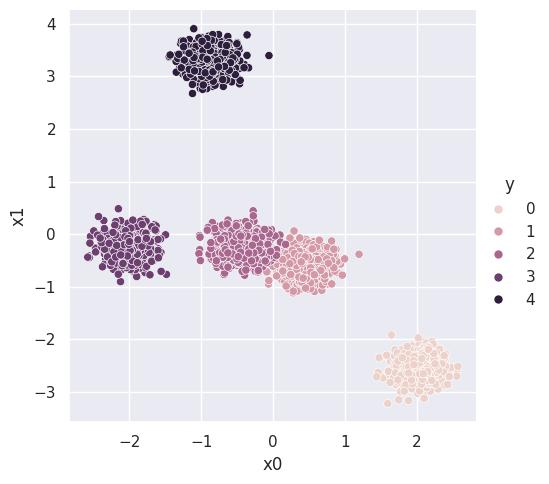
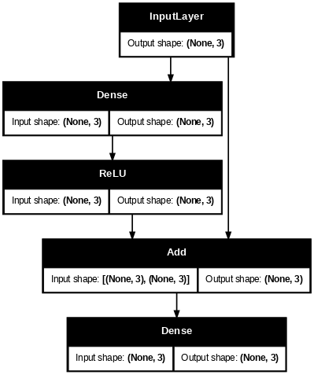
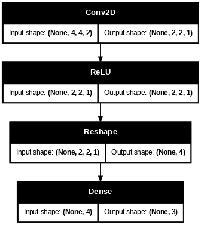
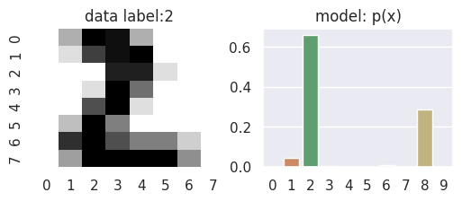

# 3-2. 深層学習ライブラリ（その1）

## 深層学習入門

### ニューラルネットワークによるモデル

深層学習の肝は深層（人工）ニューラルネットワークを使うことで、これをどのような設計にするのかが性能に大きく影響します。ニューラルネットワークの構成パーツは
- 線形変換＋ベクトルの加算
- 非線形関数の成分毎の作用

の二つで、前者のパラメータがこれまでの機械学習における訓練パラメータ $`\theta`$ に当たるものとなります。以下で解説しますが、ニューラルネットワークの設計はsklearnのpipelineのように作るか、あるいはpythonのクラス継承で作る場合が多いです。

### モデル訓練の大枠

深層学習でモデルを得るための典型的なプロセスは以下のようなものです：


これを $\theta$ として良さそうなものが得られるまで続けます。

- 各 $N_\text{batch}$個のデータ を **ミニバッチ** と言います。しばしば単に **バッチ** と呼ぶこともあるようです。関連して、ミニバッチに含まれるデータの数 $N_\text{batch}$ を **バッチサイズ** と呼ぶことが多いです。
- $\theta$ の更新には以下の微分更新（※）を用います<br>
        $`
        \begin{align*}
        \theta\leftarrow \theta - \eta \nabla_\theta \frac{1}{N_\text{batch}} \sum_{i=1}^{N_\text{batch}} l(f_\theta, \text{データ}_i)
        \end{align*}
        `$
    > ここで $\eta >0$ は **学習率 (learning rate)** と呼ばれます。
    
    微分の前にもう少し係数や行列をつける亜種もあります。名前をいくつか挙げておくと
    - SGD: 上の更新則そのままの手法
    - Adam や RMSprop: $\eta$ の値を、それまでの統計から適当に定めたもの

    といった感じです。

うまくパラメータが調整されたところで訓練（パラメータ更新）をやめます。得られたモデルは新データによる検証や、あるいは元データをホールドアウト検証の枠組みに乗せることで、訓練用データは全データの一部しか使用せず、残りはテスト用に回すなどします。


### 深層学習用のフレームワークとは

これらの処理は numpy や sympy を使って書くことができますが、そのようなライブラリを使ったとしても、実際にプログラムを書くのは骨の折れる仕事です。
> numpy を用いて 全て自分で作るやり方が書かれた書籍に
> - https://www.oreilly.co.jp/books/9784873117584/
>
> などがあります。動作原理を知りたい人はこれらの書籍を読んでみるといいかもしれません。

これから紹介するライブラリ（深層学習のための**フレームワーク**とも呼ばれます）は、この辺りの処理をやってくれるというわけです。深層学習フレームワークには色々あるのですが、TensorFlow, PyTorchあたりが主流で、最近では JAX+flax などを使う人も一定数いる印象です。これらの説明は次回に回すことにして、以下ではこれらのライブラリを統合して使うことのできる **Keras** と言うライブラリを紹介します。

## 深層学習ライブラリ `Keras`

深層学習ライブラリはかつで「戦国時代」があり、群雄割拠の様相だった名残で、いくつかのライブラリが存在します。どのライブラリも大体は似たような使用なのですが、細かい点で異なる部分があるため、あれもこれも使っていては面倒に感じるかもしれません。

Kerasはそのような深層学習ライブラリたちを統一的に扱うことのできるライブラリです。細かい設定に立ち入らなければ、ものすごく簡単に深層学習の実装に入門できます。それに加えて、細かい設定も可能なので、慣れれば複雑なシステムの実装も可能です。

インポートにはエイリアスを使わず、そのまま

```python
import keras
```

とすることが多いかと思います。これまで同様、このノートで全てを説明することはできないので、詳細は公式ドキュメント
- https://keras.io/api/

をみてください。

また、以後のプログラムでは以下のライブラリを使います：
```python
import numpy as np
import matplotlib.pyplot as plt
import seaborn as sns
import pandas as pd

sns.set_theme(style="darkgrid")
```
それぞれの使い方の基本は [セクション2-1 (numpy+matplotlib)](../section2/2-1.md)、あるいは [セクション2-3（pandas+seaborn）](../section2/2-3.md) をみてください。


### 基本的な使い方

実は sklearn 風のAPI `model.fit(X, y)` が使え、ほとんどの場合これで事足りるかと思います。詳細は後々説明することにして、全体像を書くと以下のようになります。
```python
# 全体データ 
X = [x1, x2, ...]     
y = [y1, y2, ...]     

# モデルの作成（sklearn の pipeline のようなもの） 
model = keras.models.Sequential([
            層1の処理,
            層2の処理,
            ...
            層Lの処理
        ])

# 訓練
model.compile(optimizer='勾配更新名', loss='ロス関数名') 
model.fit(X, y)
```
訓練を経て、新たな入力データ `X_new` に対してモデルの出力を見たい場合は
```python
# テスト用データ
X_new = [x1_new, x2_new, ...]

# 出力
y_pred = model.predict(X_new)
```
とします。あるいは、新たな出力信号データ `y_new` もあれば、モデルの予言がどれくらいのロス関数を返すかをみることもできます：
```python
# テスト用データ
X_new = [x1_new, x2_new, ...]
y_new = [y1_new, y2_new, ...]

# 上のデータでのロス関数や精度の値
model.evaluate(X_new, y_new)
```
この際にロス関数は必ず出ますが、他にどのような値が計算されるかは、`model.compile()` でのオプション引数に依存します。

$\blacksquare$ **練習問題1:** 以下の例を実際に動かして、各段階で何をやっているのか確認してください。
- 例：人工データ分布でkerasを実際に動かしてみる

    <details>
    <summary>データの用意</summary>
    <blockquote>
    
    適当なデータ生成器を作っておきます
    ```python
    class ToyDataGenerator():
        def __init__(self, dim: int, n_class: int):
            self.rg = np.random.default_rng(seed=3)
            self.mu_for_class_np = self.rg.normal(0, 1, size=(n_class, dim))
            self.dim = dim
            self.n_class = n_class
            
        def sample(self, N_batch:int):
            x = []
            y = []
            for n in range(self.n_class):
                mu = self.mu_for_class_np[n]
                x = x + (self.rg.normal(0, .2, size=(N_batch//self.n_class,self.dim)) + mu).tolist()
                y = y + (n*np.ones(shape=(N_batch//self.n_class, 1))).tolist() 
            x = np.array(x).astype(np.float32)
            y = np.array(y).astype(np.int32)
            df = pd.DataFrame(
                {"x0": x[:, 0],
                "x1": x[:, 1],
                "y": y.reshape(-1)}
                )  
            return df
    ```
    このクラスからデータ生成器を作って、実際に訓練用データを取ってみると以下のような感じです：
    ```python
    p = ToyDataGenerator(dim=2, n_class=5)
    df = p.sample(3000)
    sns.relplot(data=df, x="x0", y="x1", hue="y")
    ```
    > </img>

    </blockquote>
    </details>

    <details>
    <summary>ニューラルネットの準備＋訓練</summary>
    <blockquote>

    上のデータを使ってニューラルネットを実際に訓練してみます。まずニューラルネットの作成は以下：
    ```python
    model = keras.models.Sequential([keras.layers.Input(shape=(2,)),
                                    keras.layers.Dense(10, activation='relu'),
                                    keras.layers.Dense(8, activation='relu'),
                                    keras.layers.Dense(5, activation='softmax')])

    model.summary()
    ```
    > ```
    > Model: "sequential"
    > ┏━━━━━━━━━━━━━━━━━━━━━━━━━━━━━━━━━━━━━━┳━━━━━━━━━━━━━━━━━━━━━━━━━━━━━┳━━━━━━━━━━━━━━━━━┓
    > ┃ Layer (type)                         ┃ Output Shape                ┃         Param # ┃
    > ┡━━━━━━━━━━━━━━━━━━━━━━━━━━━━━━━━━━━━━━╇━━━━━━━━━━━━━━━━━━━━━━━━━━━━━╇━━━━━━━━━━━━━━━━━┩
    > │ dense (Dense)                        │ (None, 10)                  │              30 │
    > ├──────────────────────────────────────┼─────────────────────────────┼─────────────────┤
    > │ dense_1 (Dense)                      │ (None, 8)                   │              88 │
    > ├──────────────────────────────────────┼─────────────────────────────┼─────────────────┤
    > │ dense_2 (Dense)                      │ (None, 5)                   │              45 │
    > └──────────────────────────────────────┴─────────────────────────────┴─────────────────┘
    >  Total params: 163 (652.00 B)
    >  Trainable params: 163 (652.00 B)
    >  Non-trainable params: 0 (0.00 B)
    > ```

    訓練には上で読み込んだデータ `df` を使います。
    ```python
    X_train = df[["x0", "x1"]]
    y_train = df["y"]

    # どのような訓練をするかの設定をコンパイル
    model.compile(optimizer='adam', 
                  loss='sparse_categorical_crossentropy',
                  metrics=['accuracy'])
    # 訓練
    model.fit(X_train, y_train, epochs=5, batch_size=10)
    ```
    > ```
    > Epoch 1/5
    > 300/300 ━━━━━━━━━━━━━━━━━━━━ 5s 6ms/step - accuracy: 0.4919 - loss: 1.3585
    > Epoch 2/5
    > 300/300 ━━━━━━━━━━━━━━━━━━━━ 2s 5ms/step - accuracy: 0.7835 - loss: 0.5471
    > Epoch 3/5
    > 300/300 ━━━━━━━━━━━━━━━━━━━━ 4s 9ms/step - accuracy: 0.9930 - loss: 0.1890
    > Epoch 4/5
    > 300/300 ━━━━━━━━━━━━━━━━━━━━ 2s 7ms/step - accuracy: 0.9947 - loss: 0.0751
    > Epoch 5/5
    > 300/300 ━━━━━━━━━━━━━━━━━━━━ 2s 5ms/step - accuracy: 0.9942 - loss: 0.0422
    > ```

    このように、エポックごとに、各ミニバッチでの精度、ロスを時々刻々計算した値を表示してくれます（しないようなオプションも可能です）。
    訓練データに対するロスが減って、精度が上がっているのがわかります。    
    
    </blockquote>
    </details>

    <details>
    <summary>できたモデルの評価</summary>
    <blockquote>
    
    新たなデータをとって、どれくらい精度良く当てられるかみてみます：
    ```python
    df_new = p.sample(300)
    X_test = df_new[["x0", "x1"]]
    y_test = df_new["y"]

    model.evaluate(X_test, y_test, return_dict=True)
    ```
    > ```
    > 10/10 ━━━━━━━━━━━━━━━━━━━━ 0s 7ms/step - accuracy: 0.9966 - loss: 0.0273  
    > {'accuracy': 0.996666669845581, 'loss': 0.025339990854263306}
    > ```

    訓練データ以外でもそれなりに精度が出ています。`model.predict(X)` を使うと `X` に対する出力値も出してくれるため、それを使うと分類境界の可視化も可能です：

    ```python
    def plot_classification(model, df, x0="x0", x1="x1", hue="y", L=300):
        X0 = df[[x0]].to_numpy()
        X1 = df[[x1]].to_numpy()
        X = np.linspace(np.min(X0), np.max(X0) ,L) 
        Y = np.linspace(np.min(X1), np.max(X1), L)  
        X, Y = np.meshgrid(X, Y)        
        
        X_new = np.concatenate([X.reshape(-1, 1), Y.reshape(-1, 1)], axis=1)
        Z = model.predict(X_new).reshape(L, L, -1)
        Z = np.argmax(Z, axis=-1) # modelは最終値として確率値 p_i (i=0,...,4) を 出す（shapeで-1に対応する部分、ここが5ということ）ため、そこでの最大値を返す番号を返すようにする
        
        ax = plt.subplot()
        mappable = ax.contourf(X, Y, Z, alpha=.5)
        sns.scatterplot(data=df, x=x0, y=x1, ax=ax, hue=hue)
        plt.colorbar(mappable)

    plot_classification(model, df_new)
    ```
    > </img>

    これをみると クラス1と3の間の判別で少しミスがあるのがわかります。これはそもそもデータが重なっている場所なので、改善しようがないミスであることもわかります。

    </blockquote>
    </details>

> [!TIP]
> <details>
> <summary>解答例</summary>
> 
> 特になし。
> </details>

### 層構造のAPI

ニューラルネットの処理を一つずつ見ていきます。深層ニューラルネットモデルでは、簡単な処理の部品を組み合わせてモデルを作成します：


処理の部品に対応する単位を **層（layer）** と言います。層は訓練可能なパラメータ $`\theta`$ を含むものと含まないものがあります。kerasが用意している層構造を組み合わせて全体のモデルを作成するので、まずはどのような層構造があるかを紹介します。

#### 入力のshapeに関する注意

sklearnの時と同様、ニューラルネットの全ての処理で、入力のshapeはやはり `(バッチサイズ, ベクトル次元, ...)` となっている必要があります。以下の絵では例えば入力のshapeは `(2, 4)` のケースです：


これは例え1データ `x`（`バッチサイズ=1`、`次元=dim`） だけ処理する場合でも `x.shape` が `(1, dim)` となっていないといけないということです。以下で絵を使った説明をする際は基本的に `バッチサイズ=1` の場合の絵を描いています。

#### 訓練しない層

##### Activation

- 全てのニューラルネットで使用
- 詳しくは：https://keras.io/api/layers/activation_layers/


日本語では活性化関数と言います。入力ベクトルに対して、ほとんどは成分ごとに何らかの非線形関数を作用させます。代表的な $`f`$ には以下のものがあります：
- $`\text{ReLU}(x) = \max(0, x)`$
- $`\text{LeakyReLU}(x) = \max(\alpha x, x)`$（$`\alpha \in (0, 1)`$）
- $`\text{Softmax}(\vec{x}) = \frac{1}{\sum_{i=1}^d e^{x_i}}(e^{x_1}, e^{x_2}, ..., e^{x_d})`$

上二つはベクトルへの作用は成分ごとで、そうではない活性化関数でよく使うものは Softmax だけかと思います。Softmaxは出力値を確率値にしたい場合に使います。

kerasでは以下のようにして使うことができます。

```python
act = keras.layers.f() # 活性化関数の作成
tx = act(x)            # 出力
```

<details class="memo">
<summary>例：ReLU</summary>
<blockquote>

成分ごとに作用するため、numpy配列で簡単にプロットできます。
```python
act = keras.layers.ReLU()

x = np.linspace(-2,2,100)
plt.plot(x, act(x))
```
> </img>

shapeが多次元でも成分ごとです：

```python
act = keras.layers.ReLU()

x = np.arange(0, 6).reshape(2, 3)
x = (-1)**x
act(x)
```
> ```
> <tf.Tensor: shape=(2, 3), dtype=int64, numpy=
> array([[1, 0, 1],
>        [0, 1, 0]])>
> ```
</blockquote>
</details>

<details class="memo">
<summary>例：LeakyReLU</summary>
<blockquote>

```python
act = keras.layers.LeakyReLU()

x = np.linspace(-2,2,100)
plt.plot(x, act(x))
```
> </img>

こちらは負の方向に行くと0ではなく、少しスロープがなだらかになるようなイメージです。負の方向にも漏れ出す（＝Leakyな）ReLUということでしょう。
</blockquote>
</details>

<details class="memo">
<summary>例：Softmax</summary>
<blockquote>

こちらは成分ごとではなく、一旦成分ごとに 指数関数の肩に乗せられた後で、足して1になるように規格化されます。
```python
act = keras.layers.Softmax()
rng = np.random.default_rng(seed=1)

x = rng.uniform(-3, 3, 10)
plt.subplot(1,2,1)
plt.title("x")
plt.bar(np.arange(len(x)), x, label="x")
plt.subplot(1,2,2)
plt.title("Softmax(x)")
plt.bar(np.arange(len(x)), act(x))
```
> </img>

これを見ると x が負の場合は出力値が0に近いことがわかります。
</blockquote>
</details>

なお、出力が`tf.Tensor` というクラスのオブジェクトになりますが、numpyには自動で変換してくれます。
> [!NOTE]
> 
> 次回説明しますが、実はkerasは背後で別のライブラリが動いており、デフォルトでは TensorFlow と呼ばれる深層学習用ライブラリが読み込まれるようです。ここでは活性化関数の実装も TensorFlow のものを使うため、出力が TensorFlow のオブジェクトになっているというわけです。

##### Dropout

- 全てのニューラルネットで使用
- 詳しくは：https://keras.io/api/layers/regularization_layers/


ドロップアウト層では、入力ベクトルをランダムに0にします。それに何の意味があるのかと思うかもしれませんが、入力情報を一定数捨てることで、基本的にはニューラルネットが入力値に過剰適合するのを防ぐ働きをします。kerasでは以下のようにして使えます：

```python
drp = keras.layers.Dropout(rate=p)
tx = drp(x, training=TrueかFalse)            # 出力
```
<details class="memo">
<summary>例：バッチサイズ1の場合（データが1個だけの場合）</summary>
<blockquote>

```python
drp = keras.layers.Dropout(rate=.1)

x = np.ones(shape=(1, 10))
drp(x, training=True)     # training=Trueに注意
```
> ```
> <tf.Tensor: shape=(1, 10), dtype=float32, numpy=
> array([[1.1111112, 1.1111112, 1.1111112, 1.1111112, 1.1111112, 1.1111112,
>         1.1111112, 1.1111112, 0.       , 1.1111112]], dtype=float32)>
> ```

この場合は `training=True` のためドロップアウトが実行されます。一方、この引数を `training=False` にすると：

```python
drp(x, training=False)     
```
> ```
> <tf.Tensor: shape=(1, 10), dtype=float32, numpy=array([[1., 1., 1., 1., 1., 1., 1., 1., 1., 1.]], dtype=float32)>
> ```

となって、恒等写像になっているのがわかります。

</blockquote>
</details>

<details class="memo">
<summary>例：バッチサイズが1ではない場合</summary>
<blockquote>

```python
drp = keras.layers.Dropout(rate=.1)

x = np.ones(shape=(3, 10))
drp(x, training=True)
```
> ```
> <tf.Tensor: shape=(3, 10), dtype=float32, numpy=
> array([[0.       , 1.1111112, 1.1111112, 1.1111112, 1.1111112, 1.1111112,
>         1.1111112, 1.1111112, 1.1111112, 1.1111112],
>        [1.1111112, 0.       , 0.       , 0.       , 1.1111112, 1.1111112,
>         1.1111112, 1.1111112, 1.1111112, 1.1111112],
>        [1.1111112, 1.1111112, 1.1111112, 1.1111112, 0.       , 1.1111112,
>         1.1111112, 0.       , 1.1111112, 1.1111112]], dtype=float32)>
> ```

3つの入力に対して、それぞれ独立に確率的なドロップアウト処理が行われているのがわかります。

</blockquote>
</details>

##### Reshape

- 全てのニューラルネットで使用
- 詳細：https://keras.io/api/layers/reshaping_layers/


```python
res = keras.layers.Reshape(target_shape)
tx = res(x)            # 出力
```

<details class="memo">
<summary>例：バッチサイズ1の場合（データが1個だけの場合）</summary>
<blockquote>

```python
res = keras.layers.Reshape((3,2))

x = np.arange(6).reshape(1, 6)
res(x)            
```
> ```
> <tf.Tensor: shape=(1, 3, 2), dtype=int64, numpy=
> array([[[0, 1],
>         [2, 3],
>         [4, 5]]])>
> ```

</blockquote>
</details>

<details class="memo">
<summary>例：バッチサイズが1ではない場合</summary>
<blockquote>

バッチを増やした場合、それぞれが独立にreshapeされます：

```python
x = np.arange(12).reshape(2, 6)
res(x) 
```
> ```
> <tf.Tensor: shape=(2, 3, 2), dtype=int64, numpy=
> array([[[ 0,  1],
>         [ 2,  3],
>         [ 4,  5]],
> 
>        [[ 6,  7],
>         [ 8,  9],
>         [10, 11]]])>
> ```

</blockquote>
</details>

##### Pooling

- 画像処理系のニューラルネットで使用
- 詳細：https://keras.io/api/layers/pooling_layers/


プーリングは主に画像処理に用います。適当なサイズの「窓」を用意して、その窓の中に入っている入力に依存した処理をし、出力画像とします。

```python
pool = keras.layers.プーリング名(
            pool_size=(H, W), 
            strides=(h, w), 
            padding="valid"か"same"
        )
y = pool(x)            # 出力
```
「窓」のサイズが `pool_size`、`strides`は2次元

<details class="memo">
<summary>例：MaxPooling</summary>
<blockquote>

MaxPoolingは `pool_size` ごとに最大値を抜き出すような操作です：
```python
mpool = keras.layers.MaxPooling2D(
    pool_size=(2, 2), strides=(1,1), padding="valid")

x = 1*(np.arange(25).reshape(1, 5, 5)%2==0).astype(np.float32)
print(f"x: \n{x.reshape(5, 5)}")

tx = mpool(x.reshape(1, 5, 5, 1))
out_shape=tx.shape
print(f"tx: \n{tx.numpy().reshape(out_shape[1], out_shape[2])}")
```
> ```
> x: 
> [[1. 0. 1. 0. 1.]
>  [0. 1. 0. 1. 0.]
>  [1. 0. 1. 0. 1.]
>  [0. 1. 0. 1. 0.]
>  [1. 0. 1. 0. 1.]]
> tx: 
> [[1. 1. 1. 1.]
>  [1. 1. 1. 1.]
>  [1. 1. 1. 1.]
>  [1. 1. 1. 1.]]
> ```

</blockquote>
</details>

<details class="memo">
<summary>例：AveragePooling</summary>
<blockquote>

例：AveragePoolingは `pool_size` ごとに平均値を返すような操作です：
```python
apool = keras.layers.AveragePooling2D(
    pool_size=(2, 2), strides=(1,1), padding="valid")

x = 1*(np.arange(25).reshape(1, 5, 5)%2==0).astype(np.float32)
print(f"x: \n{x.reshape(5, 5)}")

tx = apool(x.reshape(1, 5, 5, 1))
out_shape=tx.shape
print(f"tx: \n{tx.numpy().reshape(out_shape[1], out_shape[2])}")
```
> ```
> x: 
> [[1. 0. 1. 0. 1.]
>  [0. 1. 0. 1. 0.]
>  [1. 0. 1. 0. 1.]
>  [0. 1. 0. 1. 0.]
>  [1. 0. 1. 0. 1.]]
> tx: 
> [[0.5 0.5 0.5 0.5]
>  [0.5 0.5 0.5 0.5]
>  [0.5 0.5 0.5 0.5]
>  [0.5 0.5 0.5 0.5]]
> ```
</blockquote>
</details>

##### Attention

- 全てのニューラルネットで使用、特に言語モデルでの使用が有用
- 詳細：https://keras.io/api/layers/attention_layers/attention/


アテンションはその名の通り、「入力のどこに注意を向けるべきか」を表したもので、クエリ $`Q`$、バリュー $`V`$、キー $`K`$ の三つの配列を入力とし、
1. $`q`$ に対して $`K = [k_1, k_2, ..., k_{T_v}]`$ を構成する $`k_i`$ に向ける注意の度合い $`p_i(q, K)`$ （確率値の場合もあれば、そうでない場合もある）を計算する
2. $`V = [v_1, v_2, ..., v_{T_v}]`$ を1で計算した $`p_i(q, K)`$ で重みづけ和（確率値の場合は平均に対応）し、出力 $`o`$ とする
3. これを $`Q = [q_1, q_2, ..., q_{T_q}]`$ の要素一つずつに適用し、出力の配列 $`O = [o_1, o_2, ..., o_{T_q}]`$ とする

という操作です。作成前にマスク（適当な要素に0掛け）が入る場合もあり、オプション変数で設定できます。`score_mode` はどのようにして $`p_i`$ を計算するかの指定です。オプションでドロップアウトなども可能なようです。

```python
attn = keras.layers.Attention(score_mode="dot")
O = attn([Q, V, K])  # 出力 
```

ここで `Q, V, K` の shape はそれぞれ `(バッチサイズ, ベクトルが何個あるか, 1ベクトルの次元)` となります。

<details>
<summary>例：適当なベクトルで計算してみる</summary>
<blockquote>

ランダムに適当な設定を作り、計算させてみます。

```python
# 設定
rng = np.random.default_rng(seed=1)
dim = 3
Tq = 5
Tv = 4

# 計算
attn = keras.layers.Attention()

Q = rng.normal(0, 1, size=(1, Tq, dim))
V = rng.normal(0, 1, size=(1, Tv, dim))
K = rng.normal(0, 1, size=(1, Tv, dim))

O, score = attn([Q, V, K], return_attention_scores=True)
O
```
> ```
> <tf.Tensor: shape=(1, 5, 3), dtype=float32, numpy=
> array([[[-0.26951313,  0.78206295,  0.62274337],
>         [ 0.01423475, -0.19782028, -0.19828793],
>         [-0.2893681 , -0.06717286,  0.02850986],
>         [-0.6165123 ,  0.23476368,  0.37249482],
>         [-1.2784956 , -0.93359005, -0.1490969 ]]], dtype=float32)>
> ```

なお、`return_attention_scores=True` とすると、重みも一緒に出力してくれます。デフォルトでは確率値なので、確認すると：
```python
np.sum(score, axis=2)
```
> ```
> array([[1.0000001 , 1.        , 1.        , 0.99999994, 1.        ]],
>       dtype=float32)
> ```
となっています。また、重みづけ和は配列についての行列積で表現できるので確認してみると：
```python
np.matmul(score, V)
```
> ```
> array([[[-0.26951313,  0.78206295,  0.62274337],
>         [ 0.01423479, -0.19782029, -0.19828795],
>         [-0.28936807, -0.06717286,  0.02850985],
>         [-0.61651229,  0.2347637 ,  0.37249481],
>         [-1.2784955 , -0.93359005, -0.14909691]]])
> ```

となっていて、`O` と同じ値になっています。

</blockquote>
</details>

$\blacksquare$ **練習問題2:** numpyで以下のような配列を作るとします：

```python
rng = np.random.default_rng(seed=1)
x = rng.normal(0, 1, size=(3, 6))
```
この配列を、6次元ベクトルのデータが3つ集まったものとみなして、以下の処理を施してください。
1. `x` に適当なactivationを作用させる
2. `x` に適当な確率でdropoutを作用させる
3. `x` の1つ1つのベクトル（shape=`(6,)`）をshape=`(3, 2)` の配列にする

> [!TIP]
> <details>
> <summary>解答例</summary>
> 
> 
> 1. 
>     ```python
>     act = keras.layers.ReLU()
>     act(x)
>     ```
>     > ```
>     > <tf.Tensor: shape=(3, 6), dtype=float32, numpy=
>     > array([[0.34558418, 0.82161814, 0.33043706, 0.        , 0.9053559 ,
>     >         0.44637457],
>     >        [0.        , 0.5811181 , 0.3645724 , 0.2941325 , 0.02842224,
>     >         0.546713  ],
>     >        [0.        , 0.        , 0.        , 0.5988462 , 0.03972211,
>     >         0.        ]], dtype=float32)>
>     > ```
> 
> 2. 
>     ```python
>     drp = keras.layers.Dropout(rate=0.5)
>     drp(x, training=True)
>     ```
>     > ```
>     > <tf.Tensor: shape=(3, 6), dtype=float32, numpy=
>     > array([[ 0.69116837,  1.6432363 ,  0.        , -2.6063144 ,  1.8107117 ,
>     >          0.        ],
>     >        [ 0.        ,  0.        ,  0.7291448 ,  0.        ,  0.05684448,
>     >          1.093426  ],
>     >        [ 0.        , -0.3258199 ,  0.        ,  0.        ,  0.        ,
>     >         -0.5849135 ]], dtype=float32)>
>     > ```
> 3. 
>     ```python
>     res = keras.layers.Reshape((3, 2))
>     res(x)
>     ```
>     > ```
>     > <tf.Tensor: shape=(3, 3, 2), dtype=float32, numpy=
>     > array([[[ 0.34558418,  0.82161814],
>     >         [ 0.33043706, -1.3031572 ],
>     >         [ 0.9053559 ,  0.44637457]],
>     > 
>     >        [[-0.5369532 ,  0.5811181 ],
>     >         [ 0.3645724 ,  0.2941325 ],
>     >         [ 0.02842224,  0.546713  ]],
>     > 
>     >        [[-0.73645407, -0.16290995],
>     >         [-0.48211932,  0.5988462 ],
>     >         [ 0.03972211, -0.29245675]]], dtype=float32)>
>     > ```
> </details>

$\blacksquare$ **練習問題3:** numpyで以下のような配列を作るとします：

```python
rng = np.random.default_rng(seed=1)
x = rng.normal(0, 1, size=(3, 8, 8, 1))
```
この配列を、8x8（1色）画像のデータが3つ集まったものとみなして、適当なpooling処理を施してください。
> [!TIP]
> <details>
> <summary>解答例</summary>
> 
> ```python
> pool = keras.layers.MaxPool2D(pool_size=(2, 2))
> pool(x).shape
> ```
> > ```
> > TensorShape([3, 4, 4, 1])
> > ```
> サイズが半分になっています。
> </details>

$\blacksquare$ **練習問題4:** numpyで以下のような配列を作るとします：
```python
rng = np.random.default_rng(seed=1)

Q = rng.normal(0, 1, size=(3, 2, 5))
V = rng.normal(0, 1, size=(3, 4, 5))
K = rng.normal(0, 1, size=(3, 4, 5))
``` 
これらに attention を作用させてください。

> [!TIP]
> <details>
> <summary>解答例</summary>
> 
> ```python
> attn = keras.layers.Attention()
> attn([Q, V, K])
> ```
> > ```
> > <tf.Tensor: shape=(3, 2, 5), dtype=float32, numpy=
> > array([[[ 1.0864301 , -0.84879124, -0.7228425 ,  0.94255924,
> >           0.35209227],
> >         [ 0.631123  , -0.5753258 , -0.4464404 ,  0.80551064,
> >           0.55120134]],
> > 
> >        [[-0.10606895, -0.0634468 ,  0.1446741 , -0.98569787,
> >           0.39695987],
> >         [-0.44219097,  0.4086092 , -0.12353042, -1.2265096 ,
> >           0.08081713]],
> > 
> >        [[ 0.71163046, -0.6019023 , -0.17235962,  0.3892439 ,
> >           0.37065995],
> >         [ 0.86748666, -0.14489771, -1.3171242 , -0.395032  ,
> >           0.2785853 ]]], dtype=float32)>
> > ```
> </details>

#### 訓練可能な層

次にモデルパラメータ $`\theta`$ を含む代表的な層を紹介します。パラメータはそれぞれ
```python
layer.trainable_weights
```
でリストとして得ることができます。

##### Dense

- 全てのニューラルネットで使用
- https://keras.io/api/layers/core_layers/dense/


これは最も単純な変換で、以下のようなベクトルの線形変換とシフトを組み合わせたものです：

$$
\begin{align*}
l: \mathbf{x} \to \mathbf{y} = W \mathbf{x} + \mathbf{b}
\end{align*}
$$

訓練可能なパラメータは $`\theta=(W, \mathbf{b})`$ です。

このような変換は以下で作成できます：
```python
l = keras.layers.Dense(units=yの次元数)
y = l(x)               # 出力
```
実際に `l` にベクトル `x` を入力する（`l(x)`とする）場合、ミニバッチで入ってくることが前提なので、`x.shape` は `(バッチサイズ, ベクトルの次元)` が想定されていることに注意です。
> なお、オプション引数の `activation` を指定すると続けて活性化関数を適用するレイヤーを一度に定義できます。

<details class="memo">
<summary>例：適当なベクトルで計算してみる</summary>
<blockquote>

以下、バッチサイズ 4, 入力ベクトルの次元3, 出力ベクトル次元2：
```python
rng = np.random.default_rng(seed=1)
bs = 4
dim = 3

l = keras.layers.Dense(units=2)
x = rng.normal(0, 1, size=(bs, dim))
l(x)
```
> ```
> <tf.Tensor: shape=(4, 2), dtype=float32, numpy=
> array([[ 0.93349534, -0.37618077],
>        [ 0.3658485 , -1.177283  ],
>        [ 0.38859648, -0.69347847],
>        [ 0.35595998, -0.32047385]], dtype=float32)>
> ```

パラメータ情報を見てみると：
```python
l.trainable_weights
```
> ```
> [<KerasVariable shape=(3, 2), dtype=float32, path=dense_1/kernel>,
>  <KerasVariable shape=(2,), dtype=float32, path=dense_1/bias>]
> ```
となって、行列 $`W`$ と ベクトル $`\mathbf{b}`$ に対応している。

</blockquote>
</details>

##### Conv

- 画像処理系のニューラルネットで使用
- https://keras.io/api/layers/convolution_layers/convolution2d/


次に2次元畳み込み演算：

$$
\begin{align*}
\text{conv}: x_{ij}^c \to y_{IJ}^C = \sum_{c} (w^{C, c} * x^c)_{IJ} + b^C
\end{align*}
$$

です。$`ij, IJ`$ は画像の縦横の座標に対応し、$`c, C`$ はその座標上の成分（色など）を表し、$`*`$ は畳み込み演算です。

<details class="memo">
<summary>畳み込み演算の視覚的イメージ</summary>
<blockquote>


</blockquote>
</details>

$`c, C`$ 方向だけに注目すれば行列積になっているため、 `Dense` と同じ処理になっています。

この 各 $`w^{C, c}`$ のサイズを **カーネルサイズ**と言い、何個ずらしで畳み込みを行うかを **ストライド** と言います。また、上の図では端から順番に畳み込んでいますが、wikipediaのアニメーションでは入力画像の端に0を加えてから畳み込んでいます。これは出力画像のサイズを調整したい時に使い、**パディング**（0埋めなので特にゼロパディング）と呼ばれます。

畳み込み（2次元畳み込み）は以下で作成できます：


```python
conv = keras.layers.Conv2D(
            filters=N,        # 出力画像の枚数
            kernel_size=L,    # カーネルサイズ（自然数）
            strides=(lj, li), # ストライド（自然数のタプル）,
            padding=...       # "valid" が パディングなし
                              # "same" が パディングあり（strides=(1,1)の時に入力と出力の画像が同じサイズになるようにパディング）
    )
y = conv(x)                   # 出力
```

実際に `conv` に画像 `x` を入力する（`conv(x)`とする）場合、ミニバッチで入ってくることが前提なので、`x.shape` は `(バッチサイズ, 高さ(jの個数), 幅（iの個数）, チャンネル数（cの個数）)` が想定されていることに注意です。
> - チャンネル数がshapeの何番目であるべきかは、オプショナル引数の `data_format` を設定することで変えられるようです。
> - なお、オプション引数の `activation` を指定すると続けて活性化関数を適用するレイヤーを一度に定義できます。

<details>
<summary>例：適当な画像で計算してみる</summary>
<blockquote>

配列値を出してもよくわからないので、shapeを確認：
```python
rng = np.random.default_rng(seed=1)
bs = 1
Lj = 10
Li = 10
c = 5

conv = keras.layers.Conv2D(filters=4, kernel_size=3)
x = rng.normal(0, 1, size=(bs, Lj, Li, c))
conv(x).shape
```
> ```
> TensorShape([1, 8, 8, 4])
> ```
訓練可能なパラメータ：
```python
conv.trainable_weights
```
> ```
> [<KerasVariable shape=(3, 3, 5, 4), dtype=float32, path=conv2d_4/kernel>,
>  <KerasVariable shape=(4,), dtype=float32, path=conv2d_4/bias>]
> ```

1つ目が $`w^{C, c}`$ に対応（最初の `3, 3` が カーネルサイズ、`c`が $`c`$ の数、`filters`が $`C`$の数）し、二つ目が $`b^C`$ に対応します。

</blockquote>
</details>

##### Normalization

- 全てのニューラルネットで使用
- 詳細：https://keras.io/api/layers/normalization_layers/

基本的には入力の正規化＋パラメータですが、どの軸方向に正規化を取るかで種類があります。入力が画像 $x_{ij}^c$ の場合は正規化は チャンネル $`c`$ 方向に行います。（統計は画像の縦横$`ij`$ 方向にもとります。画像方向全てを一つのノードで表現したと思うと良いです。）

**レイヤーノルム**（最近は言語モデルで使用される）


バッチ1つ当たり、ベクトルの成分方向に平均と標準偏差を計算し、まず成分方向の平均、標準偏差を 0、1 にします。その後、訓練可能なパラメータとして$`\gamma, \beta`$ の二つのベクトルを持ってきて、平均と標準偏差を全バッチ一律に再定義するような操作です。

```python
ln = keras.layers.LayerNormalization()
tx = ln(x)
```

<details>
<summary>例：適当なベクトルで計算してみる</summary>
<blockquote>

```python
rng = np.random.default_rng(seed=1)
bs = 4
dim = 3

ln = keras.layers.LayerNormalization()
x = rng.normal(0, 1, size=(bs, dim))
tx = ln(x)
tx
```
> ```
> <tf.Tensor: shape=(4, 3), dtype=float32, numpy=
> array([[-0.6672541 ,  1.400296  , -0.73304224],
>        [-1.3857579 ,  0.9339211 ,  0.45183682],
>        [-1.3874826 ,  0.91689473,  0.4705878 ],
>        [ 0.02045476, -1.2213926 ,  1.2009377 ]], dtype=float32)>
> ```

こんなふうに、出力は入力と同じ shape です。1データごと（`axis=1`）に正規化されていることを確かめてみると：

```python
print("ベクトルの成分の平均")
print(f"mean(x) = {np.mean(x, axis=1)}")
print(f"mean(tx) = {np.mean(tx, axis=1)}")
print("ベクトルの成分の標準偏差")
print(f"std(x) = {np.std(x, axis=1)}")
print(f"std(tx) = {np.std(tx, axis=1)}")
```
> ```
> ベクトルの成分の平均
> mean(x) = [0.49921314 0.01619107 0.13624576 0.28975591]
> mean(tx) = [-1.1920929e-07  0.0000000e+00 -3.9736431e-08 -3.9736431e-08]
> ベクトルの成分の標準偏差
> std(x) = [0.22805862 0.95155168 0.48416297 0.21161394]
> std(tx) = [0.99052304 0.99944824 0.9978739  0.98901796]
> ```

となって、出力ベクトルの成分方向に平均0、標準偏差1になるように処理されていることがわかります。なお、これは初期化時の状態であり、訓練をするとその後のパラメータが更新されるので、この限りではありません。その訓練パラメータ $`\theta`$ を確認してみます：
```python
ln.trainable_weights
```
> ```
> [<KerasVariable shape=(3,), dtype=float32, path=layer_normalization_1/gamma>,
>  <KerasVariable shape=(3,), dtype=float32, path=layer_normalization_1/beta>]
> ```

gamma, beta という名前のパラメータがそれぞれ shape `(3,)` で入っています。現在の値はそれぞれ全成分が 1 と 0 になっているはずです：

```python
print(ln.trainable_weights[0].value) # gamma
print(ln.trainable_weights[1].value) # beta
```
> ```
> <tf.Variable 'layer_normalization_1/gamma:0' shape=(3,) dtype=float32, numpy=array([1., 1., 1.], dtype=float32)>
> <tf.Variable 'layer_normalization_1/beta:0' shape=(3,) dtype=float32, numpy=array([0., 0., 0.], dtype=float32)>
> ```

確かにそうなっています。

</blockquote>
</details>
<details>
<summary>例：適当な画像で計算してみる</summary>
<blockquote>

画像の場合は上でも書いた通り少し異なる処理で、基本的にはチャンネル方向をベクトル成分と考えます。

```python
rng = np.random.default_rng(seed=1)
bs = 4
Lj = 10
Li = 10
c = 5

ln = keras.layers.LayerNormalization()
x = rng.normal(0, 1, size=(bs, Lj, Li, c))
tx = ln(x, training=True)
tx.shape
```
> ```
> TensorShape([4, 10, 10, 5])
> ```

入力と同じshapeです。一方で訓練パラメータを見ると：
```python
ln.trainable_weights
```
> ```
> [<KerasVariable shape=(5,), dtype=float32, path=layer_normalization_2/gamma>,
>  <KerasVariable shape=(5,), dtype=float32, path=layer_normalization_2/beta>]
> ```

となって、$`\gamma, \beta`$ 両方ともチャンネル方向の数しかパラメータを持っていないことがわかります。

</blockquote>
</details>

**バッチノルム**（一昔前は画像処理などで使用されたが、最近はレイヤーノルムの方がよく使用される？）


```python
bn = keras.layers.BatchNormalization()
tx = bn(x)
```

<details>
<summary>例：適当なベクトルで計算してみる</summary>
<blockquote>

```python
rng = np.random.default_rng(seed=1)
bs = 4
dim = 3

bn = keras.layers.BatchNormalization()
x = rng.normal(0, 1, size=(bs, dim))
tx = bn(x, training=True)
tx
```
> ```
> <tf.Tensor: shape=(4, 3), dtype=float32, numpy=
> array([[ 0.9529804 ,  0.6910609 , -1.0267203 ],
>        [-1.4804415 ,  0.9347259 ,  0.2729745 ],
>        [-0.34958032, -0.00876009, -0.6440525 ],
>        [ 0.87704146, -1.617027  ,  1.397799  ]], dtype=float32)>
> ```
やはり出力のshapeは入力と同じです、1バッチごと（`axis=0`）に正規化されていることを確かめてみると：
```python
print("バッチの成分の平均")
print(f"mean(x) = {np.mean(x, axis=0)}")
print(f"mean(tx) = {np.mean(tx, axis=0)}")
print("バッチの成分の標準偏差")
print(f"std(x) = {np.std(x, axis=0)}")
print(f"std(tx) = {np.std(tx, axis=0)}")
```
> ```
> バッチの成分の平均
> mean(x) = [-0.30009844  0.58412859  0.42202426]
> mean(tx) = [ 2.9802322e-08 -8.9406967e-08  1.7881393e-07]
> バッチの成分の標準偏差
> std(x) = [0.67680197 0.34220128 0.08341035]
> std(tx) = [0.99891025 0.9957574  0.93505555]
> ```
となって、出力ベクトルのバッチ方向に平均0、標準偏差1になるように処理されていることがわかります。なお、これは初期化時の状態であり、訓練をするとその後のパラメータが更新されるので、この限りではありません。その訓練パラメータ $`\theta`$ を確認してみます：
```python
bn.trainable_weights
```
> ```
> [<KerasVariable shape=(3,), dtype=float32, path=batch_normalization_1/gamma>,
>  <KerasVariable shape=(3,), dtype=float32, path=batch_normalization_1/beta>]
> ```
gamma, beta という名前のパラメータがそれぞれ shape `(3,)` で入っています。現在の値はそれぞれ全成分が 1 と 0 になっているはずです：

```python
print(bn.trainable_weights[0].value) # gamma
print(bn.trainable_weights[1].value) # beta
```
> ```
> <tf.Variable 'batch_normalization_1/gamma:0' shape=(3,) dtype=float32, numpy=array([1., 1., 1.], dtype=float32)>
> <tf.Variable 'batch_normalization_1/beta:0' shape=(3,) dtype=float32, numpy=array([0., 0., 0.], dtype=float32)>
> ```

確かにそうなっています。

</blockquote>
</details>

<details>
<summary>例：適当な画像で計算してみる</summary>
<blockquote>

画像の場合は上でも書いた通り少し異なる処理で、基本的にはチャンネル方向をベクトル成分と考えます。

```python
rng = np.random.default_rng(seed=1)
bs = 4
Lj = 10
Li = 10
c = 5

bn = keras.layers.BatchNormalization()
x = rng.normal(0, 1, size=(bs, Lj, Li, c))
tx = bn(x, training=True)
tx.shape
```
> ```
> TensorShape([4, 10, 10, 5])
> ```

入力と同じshapeです。一方で訓練パラメータを見ると：
```python
bn.trainable_weights
```
> ```
> [<KerasVariable shape=(5,), dtype=float32, path=batch_normalization_3/gamma>,
>  <KerasVariable shape=(5,), dtype=float32, path=batch_normalization_3/beta>]
> ```

となって、$`\gamma, \beta`$ 両方ともチャンネル方向の数しかパラメータを持っていないことがわかります。

</blockquote>
</details>

##### Recurrent

- 主に言語モデルなどで使用
- 詳細：https://keras.io/api/layers/recurrent_layers/


邦訳は再帰的ニューラルネットと言います。これまでの層では、入力→出力の処理が基本でしたが、再帰的ニューラルネットでは、出力（の一部、あるいは内部に隠された出力）を次の入力に用います。この処理を縦方向に順番に描くと上の図のようになります。

構造としては、1回あたりの処理（$\mathbf{x}_t \to \mathbf{y}_t+$内部状態更新）をするレイヤー `RNNcell` を `RNN()` でラップすると、全時刻を並べた配列の処理 $`[\mathbf{x}_0, \mathbf{x}_1, \dots, \mathbf{x}_T] \to [\mathbf{y}_0,\mathbf{y}_1, \dots, \mathbf{y}_T]`$ をする大きなニューラルネットを作ることができる、というイメージです。

```python
rnn = keras.layers.RNN(
          keras.layers.RnnCell()
     )

ys = rnn(xs) # xs = [x0, x1, ...]
```

<details>
<summary>例：RnnCellだけの処理</summary>
<blockquote>

まずは cell がどのような振る舞いをするかについてです。話をわかりやすくするためバッチサイズ1で、時系列の長さ `T` は 5、ベクトルの次元は 3 で
- 適当に `x`　を作り 
- 前の時刻の内部状態 `states` を適当に初期化
- for ループを使って毎回の処理を書く

    その際、1回のRNNcellを使った処理は
    ```python
    tx, states = cell(x, states)
    ```
    と受ける

という書き方をしたのが以下です：
```python
rng = np.random.default_rng(seed=1)
bs = 1
T  = 5
dim = 3

cell = keras.layers.SimpleRNNCell(units=3)

x = rng.normal(0, 1, size=(bs, dim))
states = cell.get_initial_state(batch_size=bs)

for t in range(T):
  tx, states = cell(x, states) # 1回前の states が代入される
  print(f"tx = {tx}")
```
> ```
> tx = [[ 0.23330611  0.219907   -0.6528118 ]]
> tx = [[ 0.46601883  0.66301507 -0.3997527 ]]
> tx = [[ 0.6773219   0.41642106 -0.1280835 ]]
> tx = [[ 0.75471187  0.26401338 -0.44682923]]
> tx = [[ 0.772421    0.55407536 -0.49489683]]
> ```

`tx, states = cell(x, states)` の部分で 内部状態 が更新されています。なお、`SimpleRNNCell` では内部状態は `tx` と同じです：
```python
tx, states = cell(x, states)
tx, states
```
> ```
> (<tf.Tensor: shape=(1, 3), dtype=float32, numpy=array([[-0.9094764 ,  0.8845763 ,  0.72256386]], dtype=float32)>,
>  [<tf.Tensor: shape=(1, 3), dtype=float32, numpy=array([[-0.9094764 ,  0.8845763 ,  0.72256386]], dtype=float32)>])
> ```
もう少し洗練された RNN もあり（LSTMなど）、その場合は両者は異なります。

なお、`states` の更新をやめて、毎回同じ `states` を入力すると、出力は同じになります：

```python
cell = keras.layers.SimpleRNNCell(units=3)
x = rng.normal(0, 1, size=(bs, dim))
states = cell.get_initial_state(batch_size=bs)

for t in range(T):
  tx, _ = cell(x, states)
  print(f"tx = {tx}")
```
> ```
> tx = [[-0.3099162   0.25869295 -0.14747381]]
> tx = [[-0.3099162   0.25869295 -0.14747381]]
> tx = [[-0.3099162   0.25869295 -0.14747381]]
> tx = [[-0.3099162   0.25869295 -0.14747381]]
> tx = [[-0.3099162   0.25869295 -0.14747381]]
> ```

このようにcellだけでも深層学習用のプログラムを書くことは可能ですが、訓練するのは今回の話だけではダメで、次回以降のライブラリの少し深い部分について理解する必要があります。

</blockquote>
</details>

<details>
<summary>例：layers.RNNでラップする処理</summary>
<blockquote>

この場合、
- forループを書かなくてよくなる
- 関連して、`states` を明示的に処理に書かなくてよくなる
- 簡単に訓練させられる

という恩恵があります。ですので、最初はこちらを使うのが良いと思います。

```python
rng = np.random.default_rng(seed=1)
bs = 1
T  = 5
dim = 3

cell = keras.layers.SimpleRNNCell(units=3)
rnn = keras.layers.RNN(cell, return_sequences=True)

xs = rng.normal(0, 1, size=(bs, T, dim))
rnn(xs)
```
> ```
> <tf.Tensor: shape=(1, 5, 3), dtype=float32, numpy=
> array([[[-0.7012051 ,  0.44930977, -0.49390155],
>         [-0.5699269 , -0.78129053,  0.9443375 ],
>         [ 0.43300432,  0.6388341 ,  0.5185464 ],
>         [-0.80768365,  0.3196442 , -0.7856061 ],
>         [ 0.4356985 , -0.74077004,  0.96214736]]], dtype=float32)>
> ```


</blockquote>
</details>

##### MultiHeadAttention

- 主に言語モデルなどで使用
- 詳細：https://keras.io/api/layers/attention_layers/multi_head_attention/


attentionだけでは訓練可能なパラメータを持ちませんでしたが、MultiHeadAttentionでは、
- 入力配列 $`Q, V, K`$ から、各ベクトルに対して 一旦 Dense による処理をかける（2+1種類のDense）
- attentionの各出力ベクトルに対しても Dense をかける（1種類のDense）
- これを複数枚に渡って処理する

複数枚のattentionを用意するためにこのような命名になっています。

```python
attn = keras.layers.MultiHeadAttention(
            num_heads=枚数, 
            key_dim=内部でのkeyベクトルとqueryベクトルの次元, 
            value_dim=内部でのvalueベクトルの次元, 
            output_shape=出力ベクトル列の1ベクトルの次元)

O = attn(query=Q, value=V, key=K)
```
<details>
<summary>例：適当なベクトルで計算してみる</summary>
<blockquote>

```python
rng = np.random.default_rng(seed=1)
bs = 1
dim = 3
Tq = 5
Tv = 4

attn = keras.layers.MultiHeadAttention(num_heads=2, 
                                       key_dim=10, 
                                       value_dim=8, 
                                       output_shape=2)

Q = rng.normal(0, 1, size=(bs, Tq, dim))
V = rng.normal(0, 1, size=(bs, Tv, dim))
K = rng.normal(0, 1, size=(bs, Tv, dim))

O, score = attn(query=Q, value=V, key=K, 
                return_attention_scores=True) # 重みもみたい場合

O
```
> ```
> <tf.Tensor: shape=(1, 5, 2), dtype=float32, numpy=
> array([[[-0.01790731, -0.02872526],
>         [-0.07340798, -0.04997256],
>         [-0.0763535 , -0.05067822],
>         [-0.10964327, -0.0639399 ],
>         [-0.1345029 , -0.06796385]]], dtype=float32)>
> ```

この例では、バッチが1つ、ヘッドが2枚、queryの列が5個、keyの列が4個なので、重み行列は (1, 2, 5, 4) の shape となります：
```python
score
```
> ```
> <tf.Tensor: shape=(1, 2, 5, 4), dtype=float32, numpy=
> array([[[[0.22903256, 0.2666265 , 0.3013921 , 0.20294887],
>          [0.20348491, 0.30441257, 0.2630783 , 0.22902407],
>          [0.22438604, 0.2776596 , 0.26441845, 0.2335359 ],
>          [0.25529835, 0.24143142, 0.24648276, 0.25678745],
>          [0.24158053, 0.26194564, 0.23449495, 0.2619788 ]],
> 
>         [[0.27541098, 0.22988096, 0.26021335, 0.23449467],
>          [0.29920885, 0.2108361 , 0.26224878, 0.22770627],
>          [0.27567658, 0.22915898, 0.2598066 , 0.23535782],
>          [0.23793206, 0.26197267, 0.25948995, 0.24060528],
>          [0.2608526 , 0.23906659, 0.24096586, 0.25911492]]]],
>       dtype=float32)>
> ```

一応訓練パラメータもみておくと：

```python
attn.trainable_weights
```
> ```
> [<KerasVariable shape=(3, 2, 10), dtype=float32, path=multi_head_attention_10/query/kernel>,
>  <KerasVariable shape=(2, 10), dtype=float32, path=multi_head_attention_10/query/bias>,
>  <KerasVariable shape=(3, 2, 10), dtype=float32, path=multi_head_attention_10/key/kernel>,
>  <KerasVariable shape=(2, 10), dtype=float32, path=multi_head_attention_10/key/bias>,
>  <KerasVariable shape=(3, 2, 8), dtype=float32, path=multi_head_attention_10/value/kernel>,
>  <KerasVariable shape=(2, 8), dtype=float32, path=multi_head_attention_10/value/bias>,
>  <KerasVariable shape=(2, 8, 2), dtype=float32, path=multi_head_attention_10/attention_output/kernel>,
>  <KerasVariable shape=(2,), dtype=float32, path=multi_head_attention_10/attention_output/bias>]
> ```

となって、query、key、value、attention_output に関する Dense が枚数分確保されていることがわかります。

</blockquote>
</details>


$\blacksquare$ **練習問題5:** Denseレイヤーで、出力次元が3のものを作成してみてください。

> [!TIP]
> <details>
> <summary>解答例</summary>
> 
> 素朴には
> ```python
> l = keras.layers.Dense(units=3)
> ```
> でいけそうですが、パラメータがちゃんと入っているかみてみると：
> ```python
> l.trainable_weights
> ```
> > ```
> > []
> > ```
> となって、パラメータが空であることがわかります。実は `l` を定義しただけではパラメータがセットされません。パラメータを初期化するには
> - `l.build(input_shape=(想定する入力のshape))` とするか
> - 適当な入力 `x` を実際に一回入力するか
> 
> をしないといけません。どちらのやり方でもOKです：
> - `l.build(input_shape=(想定する入力のshape))`
>     ```python
>     l = keras.layers.Dense(units=3)
>     l.build(input_shape=(1, 4))  # (データ数, 1データ次元)
>     l.trainable_weights
>     ```
>     > ```
>     > [<Variable path=dense_13/kernel, shape=(4, 3), dtype=float32, value=[[-0.7779179   0.39425468  0.2458018 ]
>     >   [ 0.6639571  -0.6203163   0.918862  ]
>     >   [ 0.7735075  -0.5043067   0.1718272 ]
>     >   [-0.659352   -0.08681506  0.70125484]]>,
>     >  <Variable path=dense_13/bias, shape=(3,), dtype=float32, value=[0. 0. 0.]>]
>     > ```
> - 適当な入力 `x` を実際に一回入力
>     ```python
>     rng = np.random.default_rng(seed=1)
>     x = rng.normal(0, 1, size=(1, 4))
>     l = keras.layers.Dense(units=3)
> 
>     l(x)
>     l.trainable_weights
>     ```
>     > ```
>     > [<Variable path=dense_14/kernel, shape=(4, 3), dtype=float32, value=[[-0.62141204 -0.7411845   0.7214519 ]
>     >   [-0.6860644   0.37894797  0.75448227]
>     >   [ 0.59674823  0.54084873  0.5401963 ]
>     >   [-0.37193245 -0.5396917  -0.47481924]]>,
>     >  <Variable path=dense_14/bias, shape=(3,), dtype=float32, value=[0. 0. 0.]>]
>     > ```
> </details>

$\blacksquare$ **練習問題6:** 適当なConvレイヤーを作成してみてください。
> [!TIP]
> <details>
> <summary>解答例</summary>
> 
> Dense同様、レイヤー関数を作るだけではパラメータが入っていません：
> ```python
> conv = keras.layers.Conv2D(filters=4, kernel_size=3)
> conv.trainable_weights
> ```
> > ```
> > []
> > ```
> - `conv.build(input_shape)` で初期化する
>     ```python
>     conv = keras.layers.Conv2D(filters=3, kernel_size=2)
>     conv.build(input_shape=(1,8,8,1))
>     conv.trainable_weights
>     ```
>     >```
>     > [<Variable path=conv2d_14/kernel, shape=(2, 2, 1, 3), dtype=float32, value=[[[[ 0.18317747 -0.44144094 -0.01491356]]
>     >  
>     >    [[-0.42204544 -0.07361704 -0.24680135]]]
>     >  
>     >  
>     >   [[[ 0.14304209 -0.51454276  0.05954254]]
>     >  
>     >    [[ 0.5653171   0.12315315  0.55533415]]]]>,
>     >  <Variable path=conv2d_14/bias, shape=(3,), dtype=float32, value=[0. 0. 0.]>]
>     >```
> - 適当な入力をする
>     ```python
>     rng = np.random.default_rng(seed=1)
>     x = rng.normal(0, 1, size=(1, 8, 8, 1))
>     conv = keras.layers.Conv2D(filters=3, kernel_size=2)
>     
>     conv(x)
>     conv.trainable_weights
>     ```
>     > ```
>     > [<Variable path=conv2d_15/kernel, shape=(2, 2, 1, 3), dtype=float32, value=[[[[-0.5353025   0.55877024  0.3631031 ]]
>     >  
>     >    [[ 0.33003038 -0.13016424 -0.17650205]]]
>     >  
>     >  
>     >   [[[-0.49035493 -0.4476327   0.2667051 ]]
>     >  
>     >    [[ 0.46037644 -0.60025    -0.35450292]]]]>,
>     >  <Variable path=conv2d_15/bias, shape=(3,), dtype=float32, value=[0. 0. 0.]>]
>     > ```
> 
> </details>

$\blacksquare$ **練習問題7:** Layerノルムのレイヤーを
- ベクトル入力
    ```python
    rng = np.random.default_rng(seed=1)
    x = rng.normal(0, 1, size=(1, 3))
    ``` 
- 画像入力
    ```python
    rng = np.random.default_rng(seed=1)
    x_img = rng.normal(0, 1, size=(1, 8, 8, 3))
    ```
の二種類に対して定義して、それぞれ `.trainable_weights` のshapeをみてください。

> [!TIP]
> <details>
> <summary>解答例</summary>
> 
> - まずはベクトルの方を見てみます：
>     ```python
>     rng = np.random.default_rng(seed=1)
>     x = rng.normal(0, 1, size=(1, 3))
>     ln = keras.layers.LayerNormalization()
> 
>     ln(x)
>     ln.trainable_weights
>     ```
>     > ```
>     > [<Variable path=layer_normalization/gamma, shape=(3,), dtype=float32, value=[1. 1. 1.]>,
>     >  <Variable path=layer_normalization/beta, shape=(3,), dtype=float32, value=[0. 0. 0.]>]
>     > ```
> - 次に画像の方：
>     ```python
>     rng = np.random.default_rng(seed=1)
>     x_img = rng.normal(0, 1, size=(1, 8, 8, 3))
>     ln = keras.layers.LayerNormalization()
> 
>     ln(x_img)
>     ln.trainable_weights
>     ```
>     > ```
>     > [<Variable path=layer_normalization_3/gamma, shape=(3,), dtype=float32, value=[1. 1. 1.]>,
>     >  <Variable path=layer_normalization_3/beta, shape=(3,), dtype=float32, value=[0. 0. 0.]>]
>     > ```
>     shapeがベクトルの時と全く同じです。これは画像の方はshapeでいうと最後の成分だけにしか正規化は作用せず、画像の縦横方向には一律に作用することを意味します。
> 
> </details>

### モデルAPI


の図の右側の構成要素（層に当たる部分）を説明したので、次にそれを組み合わせて実際にニューラルネットワークの構成をするやり方を説明します。基本的には公式ドキュメント
- https://keras.io/api/models/

を参考にしています。sklearnのpipelineを作る作業をイメージすると良いです。

#### モデルクラス

ニューラルネットモデル（訓練前/訓練後どちらもモデルと呼ぶことにします）の本体は **モデルクラス** のインスタンス（オブジェクト）です。このオブジェクトの内部に訓練可能なパラメータ $`\theta`$ が格納されています。ユーザーは
1. モデルの「設計」を指定し、オブジェクトを作る （仮に `model` とする）
    > `model.trainable_weights` に対応するニューラルネットのランダムに初期化された $`\theta`$ が格納される
2. データを使ってパラメータ $`\theta`$ を調整する＝訓練する
    > `model.compile()` のち `model.fit(X, y)` で実行
3. 場合によってはそのパラメータやオブジェクトを保存・読み込みする
    > `model.save()` など

といったことが可能です。まず1のやり方ですが、大きく分けて以下のやり方があります。以下、`keras.layers.層i()` は実際には上で説明した具体的な層構造のAPIのどれかを使うことを意味します。
- 処理をベタ打ち：
    ```python
    # ニューラルネットの入力から出力までを書く
    inputs = keras.Input(shape=入力のshape)
    x = keras.layers.層1()(inputs)
    x = keras.layers.層2()(x)
    ...
    outputs = keras.layers.層L()(x)
    # 上で指定した処理をするモデルのオブジェクトを作る
    model = keras.Model(inputs=inputs, outputs=outputs)
    ```
- クラス継承：
    ```python
    class MyModel(keras.Model):
        def __init__(self):
            # 内部パラメータなどの情報
            super().__init__()
            self.層1 = keras.layers.層1()
            self.層2 = keras.layers.層2()
            ...
            self.層L = keras.layers.層L()
            #以下は任意（model.summaryの表示に影響）
            self.call(keras.Input(shape=(入力1バッチあたりのshape)))

        def call(self, inputs):
            # 実際のニューラルネット処理
            x = self.層1(inputs)
            x = self.層2(x)
            ...
            outputs = self.層L(x)
            return outputs

    model = MyModel()
    ```
- モデル作成用の関数：

    初めの例で使ったAPIです。
    ```python
    # リストに先頭から順に作用させたい処理を並べる方法
    model = keras.Sequential([
        keras.Input(shape=入力のshape),
        keras.layers.層1(),
        keras.layers.層2(),
        ...
        keras.layers.層L()
    ])
    ```
    あるいは以下でも同じことができます：
    ```python
    # リストで並べる代わりに .add() で順々に追加していく方法
    model = keras.Sequential()
    model.add(keras.Input(shape=入力のshape))
    model.add(keras.layers.層1())
    model.add(keras.layers.層2())
    ...
    model.add(keras.layers.層L())
    ```
 
なお作ったモデルの構造の情報は以下で表示することができます。
- 上から順に層の処理の情報をパラメータ数つきで表示

    詳細：https://keras.io/api/models/model/#summary-method
    ```python
    model.summary()
    ```
- ニューラルネットの内部処理を画像表示

    詳細：https://keras.io/api/utils/model_plotting_utils/
    ```python
    keras.utils.plot_model(model)
    ```
これらのコマンドはオプショナルな引数も多くあるので、詳細は各リンク先情報を読んでください。

- 例：三種類のやり方で以下のニューラルネットを作成してみる：

    
    <details>
    <summary>処理をベタ打ちするやり方：</summary>
    <blockquote>

    ```python
    # ニューラルネットの入力から出力までを書く
    inputs = keras.Input(shape=(3,))
    x = keras.layers.Dense(2)(inputs)
    x = keras.layers.ReLU()(x)
    x = keras.layers.Dense(5)(x)
    outputs = keras.layers.Softmax()(x)
    # 上で指定した処理をするモデルのオブジェクトを作る
    model = keras.Model(inputs=inputs, outputs=outputs)
    model.summary()
    ```
    > ```
    > Model: "functional"
    > ┏━━━━━━━━━━━━━━━━━━━━━━━━━━━━━━━━━━━━━━┳━━━━━━━━━━━━━━━━━━━━━━━━━━━━━┳━━━━━━━━━━━━━━━━━┓
    > ┃ Layer (type)                         ┃ Output Shape                ┃         Param # ┃
    > ┡━━━━━━━━━━━━━━━━━━━━━━━━━━━━━━━━━━━━━━╇━━━━━━━━━━━━━━━━━━━━━━━━━━━━━╇━━━━━━━━━━━━━━━━━┩
    > │ input_layer (InputLayer)             │ (None, 3)                   │               0 │
    > ├──────────────────────────────────────┼─────────────────────────────┼─────────────────┤
    > │ dense (Dense)                        │ (None, 2)                   │               8 │
    > ├──────────────────────────────────────┼─────────────────────────────┼─────────────────┤
    > │ re_lu (ReLU)                         │ (None, 2)                   │               0 │
    > ├──────────────────────────────────────┼─────────────────────────────┼─────────────────┤
    > │ dense_1 (Dense)                      │ (None, 5)                   │              15 │
    > ├──────────────────────────────────────┼─────────────────────────────┼─────────────────┤
    > │ softmax (Softmax)                    │ (None, 5)                   │               0 │
    > └──────────────────────────────────────┴─────────────────────────────┴─────────────────┘
    >  Total params: 23 (92.00 B)
    >  Trainable params: 23 (92.00 B)
    >  Non-trainable params: 0 (0.00 B)
    > ```

    </blockquote>
    </details>

    <details class="memo">
    <summary>クラス継承を使うやり方：</summary>
    <blockquote>

    素直なやり方から：
    ```python
    class MyModel(keras.Model):
        def __init__(self):
            # 内部パラメータなどの情報
            super().__init__()
            self.l1 = keras.layers.Dense(2)
            self.a1 = keras.layers.ReLU()
            self.l2 = keras.layers.Dense(5)
            self.a2 = keras.layers.Softmax()

        def call(self, inputs):
            # 実際のニューラルネット処理
            x = self.l1(inputs)
            x = self.a1(x)
            x = self.l2(x)
            outputs = self.a2(x)
            return outputs

    # 実際にモデルを作る
    model = MyModel()
    #model.build(input_shape=(None, 3))
    model(np.random.normal(0, 1, size=(1, 3)))

    model.summary()
    ```
    > ```
    > Model: "my_model"
    > ┏━━━━━━━━━━━━━━━━━━━━━━━━━━━━━━━━━━━━━━┳━━━━━━━━━━━━━━━━━━━━━━━━━━━━━┳━━━━━━━━━━━━━━━━━┓
    > ┃ Layer (type)                         ┃ Output Shape                ┃         Param # ┃
    > ┡━━━━━━━━━━━━━━━━━━━━━━━━━━━━━━━━━━━━━━╇━━━━━━━━━━━━━━━━━━━━━━━━━━━━━╇━━━━━━━━━━━━━━━━━┩
    > │ dense_2 (Dense)                      │ (1, 2)                      │               8 │
    > ├──────────────────────────────────────┼─────────────────────────────┼─────────────────┤
    > │ re_lu_1 (ReLU)                       │ ?                           │               0 │
    > ├──────────────────────────────────────┼─────────────────────────────┼─────────────────┤
    > │ dense_3 (Dense)                      │ (1, 5)                      │              15 │
    > ├──────────────────────────────────────┼─────────────────────────────┼─────────────────┤
    > │ softmax_1 (Softmax)                  │ ?                           │               0 │
    > └──────────────────────────────────────┴─────────────────────────────┴─────────────────┘
    >  Total params: 23 (92.00 B)
    >  Trainable params: 23 (92.00 B)
    >  Non-trainable params: 0 (0.00 B)
    > ```

    途中のshapeが自動で計算できていませんがパラメータ数は同じなので、問題なく動くはずです。shapeの表示を直すには、`__init__()` の定義の最後に一行 `self.call(keras.Input(shape=(入力1バッチあたりのshape)))` を加えると良いようです。そのように修正すると：

    ```python
    class MyModel(keras.Model):
        def __init__(self):
            # 内部パラメータなどの情報
            super().__init__()
            self.l1 = keras.layers.Dense(2)
            self.a1 = keras.layers.ReLU()
            self.l2 = keras.layers.Dense(5)
            self.a2 = keras.layers.Softmax()
            # ここに1行追加
            self.call(keras.Input(shape=(3,)))

        def call(self, inputs):
            # 実際のニューラルネット処理
            x = self.l1(inputs)
            x = self.a1(x)
            x = self.l2(x)
            outputs = self.a2(x)
            return outputs

    # 実際にモデルを作る
    model = MyModel()
    #model.build(input_shape=(None, 3))
    model(np.random.normal(0, 1, size=(1, 3)))

    model.summary()
    ```

    > ```
    > Model: "my_model_26"
    > ┏━━━━━━━━━━━━━━━━━━━━━━━━━━━━━━━━━━━━━━┳━━━━━━━━━━━━━━━━━━━━━━━━━━━━━┳━━━━━━━━━━━━━━━━━┓
    > ┃ Layer (type)                         ┃ Output Shape                ┃         Param # ┃
    > ┡━━━━━━━━━━━━━━━━━━━━━━━━━━━━━━━━━━━━━━╇━━━━━━━━━━━━━━━━━━━━━━━━━━━━━╇━━━━━━━━━━━━━━━━━┩
    > │ dense_71 (Dense)                     │ (None, 2)                   │               8 │
    > ├──────────────────────────────────────┼─────────────────────────────┼─────────────────┤
    > │ re_lu_1 (ReLU)                       │ (None, 2)                   │               0 │
    > ├──────────────────────────────────────┼─────────────────────────────┼─────────────────┤
    > │ dense_72 (Dense)                     │ (None, 5)                   │              15 │
    > ├──────────────────────────────────────┼─────────────────────────────┼─────────────────┤
    > │ softmax_1 (Softmax)                  │ (None, 5)                   │               0 │
    > └──────────────────────────────────────┴─────────────────────────────┴─────────────────┘
    >  Total params: 23 (92.00 B)
    >  Trainable params: 23 (92.00 B)
    >  Non-trainable params: 0 (0.00 B)
    > ```

    </blockquote>
    </details>

    <details class="memo">
    <summary>モデル作成用の関数を使うやり方：</summary>
    <blockquote>

    ```python
    model = keras.Sequential([
        keras.Input(shape=(3,)),
        keras.layers.Dense(2),
        keras.layers.ReLU(),
        keras.layers.Dense(5),
        keras.layers.Softmax()
    ])

    model.summary()
    ```
    > ```
    > Model: "sequential"
    > ┏━━━━━━━━━━━━━━━━━━━━━━━━━━━━━━━━━━━━━━┳━━━━━━━━━━━━━━━━━━━━━━━━━━━━━┳━━━━━━━━━━━━━━━━━┓
    > ┃ Layer (type)                         ┃ Output Shape                ┃         Param # ┃
    > ┡━━━━━━━━━━━━━━━━━━━━━━━━━━━━━━━━━━━━━━╇━━━━━━━━━━━━━━━━━━━━━━━━━━━━━╇━━━━━━━━━━━━━━━━━┩
    > │ dense_4 (Dense)                      │ (None, 2)                   │               8 │
    > ├──────────────────────────────────────┼─────────────────────────────┼─────────────────┤
    > │ re_lu_2 (ReLU)                       │ (None, 2)                   │               0 │
    > ├──────────────────────────────────────┼─────────────────────────────┼─────────────────┤
    > │ dense_5 (Dense)                      │ (None, 5)                   │              15 │
    > ├──────────────────────────────────────┼─────────────────────────────┼─────────────────┤
    > │ softmax_2 (Softmax)                  │ (None, 5)                   │               0 │
    > └──────────────────────────────────────┴─────────────────────────────┴─────────────────┘
    > Total params: 23 (92.00 B)
    > Trainable params: 23 (92.00 B)
    > Non-trainable params: 0 (0.00 B)
    > ```

    </blockquote>
    </details>


$\blacksquare$ **練習問題8:** 以下のモデルを作成してください：


> [!TIP]
> <details>
> <summary>解答例</summary>
> 
>どのやり方でも作ることができますが、Sequentialが簡単なのでそれで作ってみます：
>
>```python
>model = keras.Sequential([
>   keras.Input(shape=(3,)),
>   keras.layers.Dense(4),
>   keras.layers.ReLU(),
>   keras.layers.Dense(4),
>   keras.layers.ReLU(),
>   keras.layers.Dense(3),
>])
>
>model.summary()
>```
>> ```
>> Model: "sequential_7"
>> ┏━━━━━━━━━━━━━━━━━━━━━━━━━━━━━━━━━━━━━━┳━━━━━━━━━━━━━━━━━━━━━━━━━━━━━┳━━━━━━━━━━━━━━━━━┓
>> ┃ Layer (type)                         ┃ Output Shape                ┃         Param # ┃
>> ┡━━━━━━━━━━━━━━━━━━━━━━━━━━━━━━━━━━━━━━╇━━━━━━━━━━━━━━━━━━━━━━━━━━━━━╇━━━━━━━━━━━━━━━━━┩
>> │ dense_76 (Dense)                     │ (None, 4)                   │              16 │
>> ├──────────────────────────────────────┼─────────────────────────────┼─────────────────┤
>> │ re_lu_2 (ReLU)                       │ (None, 4)                   │               0 │
>> ├──────────────────────────────────────┼─────────────────────────────┼─────────────────┤
>> │ dense_77 (Dense)                     │ (None, 4)                   │              20 │
>> ├──────────────────────────────────────┼─────────────────────────────┼─────────────────┤
>> │ re_lu_3 (ReLU)                       │ (None, 4)                   │               0 │
>> ├──────────────────────────────────────┼─────────────────────────────┼─────────────────┤
>> │ dense_78 (Dense)                     │ (None, 3)                   │              15 │
>> └──────────────────────────────────────┴─────────────────────────────┴─────────────────┘
>>  Total params: 51 (204.00 B)
>>  Trainable params: 51 (204.00 B)
>>  Non-trainable params: 0 (0.00 B)
>> ```
> なお、`Dense` のオプショナル変数でactivationを指定した方がコードは短くなりますが、summaryにactivationが表示されなくなるようです。（慣れてくればこちらでも良いと思います。）
>```python
>model = keras.Sequential([
>    keras.Input(shape=(3,)),
>    keras.layers.Dense(4, activation="relu"),
>    keras.layers.Dense(4, activation="relu"),
>    keras.layers.Dense(3),
>])
>
>model.summary()
>```
>> ```
>> Model: "sequential_6"
>> ┏━━━━━━━━━━━━━━━━━━━━━━━━━━━━━━━━━━━━━━┳━━━━━━━━━━━━━━━━━━━━━━━━━━━━━┳━━━━━━━━━━━━━━━━━┓
>> ┃ Layer (type)                         ┃ Output Shape                ┃         Param # ┃
>> ┡━━━━━━━━━━━━━━━━━━━━━━━━━━━━━━━━━━━━━━╇━━━━━━━━━━━━━━━━━━━━━━━━━━━━━╇━━━━━━━━━━━━━━━━━┩
>> │ dense_73 (Dense)                     │ (None, 4)                   │              16 │
>> ├──────────────────────────────────────┼─────────────────────────────┼─────────────────┤
>> │ dense_74 (Dense)                     │ (None, 4)                   │              20 │
>> ├──────────────────────────────────────┼─────────────────────────────┼─────────────────┤
>> │ dense_75 (Dense)                     │ (None, 3)                   │              15 │
>> └──────────────────────────────────────┴─────────────────────────────┴─────────────────┘
>>  Total params: 51 (204.00 B)
>>  Trainable params: 51 (204.00 B)
>>  Non-trainable params: 0 (0.00 B)
>> ```
>
> </details>

$\blacksquare$ **練習問題9:** 以下のモデルを作成してください：


> [!TIP]
> 解答例
> 
> Sequentialでは作れないと思います。以下では二種類の書き方についてコメントします：
> 
> <details  class="memo">
> <summary>入出力を書いてからモデル定義する方法</summary>
> <blockquote>
> 
> 単純な書き方は以下のように入出力をベタ書きする方法があります。
> 
> ```python
> # ここから
> inputs = keras.Input(shape=(3,))
> x = keras.layers.Dense(3)(inputs)
> x = keras.layers.ReLU()(x)
> x = x + inputs
> outputs = keras.layers.Dense(3)(x)
> # ここまでで入出力を定義
> 
> # 入出力に従ってモデルオブジェクトを定義
> model = keras.Model(inputs=inputs, outputs=outputs)
> 
> model.summary()
> ```
> > ```
> > Model: "functional_14"
> > ┏━━━━━━━━━━━━━━━━━━━━━━━━━━━┳━━━━━━━━━━━━━━━━━━━━━━━━┳━━━━━━━━━━━━━━━━┳━━━━━━━━━━━━━━━━━━━━━━━━┓
> > ┃ Layer (type)              ┃ Output Shape           ┃        Param # ┃ Connected to           ┃
> > ┡━━━━━━━━━━━━━━━━━━━━━━━━━━━╇━━━━━━━━━━━━━━━━━━━━━━━━╇━━━━━━━━━━━━━━━━╇━━━━━━━━━━━━━━━━━━━━━━━━┩
> > │ input_layer_30            │ (None, 3)              │              0 │ -                      │
> > │ (InputLayer)              │                        │                │                        │
> > ├───────────────────────────┼────────────────────────┼────────────────┼────────────────────────┤
> > │ dense_91 (Dense)          │ (None, 3)              │             12 │ input_layer_30[0][0]   │
> > ├───────────────────────────┼────────────────────────┼────────────────┼────────────────────────┤
> > │ re_lu_10 (ReLU)           │ (None, 3)              │              0 │ dense_91[0][0]         │
> > ├───────────────────────────┼────────────────────────┼────────────────┼────────────────────────┤
> > │ add_10 (Add)              │ (None, 3)              │              0 │ re_lu_10[0][0],        │
> > │                           │                        │                │ input_layer_30[0][0]   │
> > ├───────────────────────────┼────────────────────────┼────────────────┼────────────────────────┤
> > │ dense_92 (Dense)          │ (None, 3)              │             12 │ add_10[0][0]           │
> > └───────────────────────────┴────────────────────────┴────────────────┴────────────────────────┘
> >  Total params: 24 (96.00 B)
> >  Trainable params: 24 (96.00 B)
> >  Non-trainable params: 0 (0.00 B)
> > ```
> 
> ただしSequentialとは異なり、枝分かれ構造があることが `model.summary()` の出力ではややわかりづらいです。実はモデルをグラフとして画像出力することもできます：
> ```python
> keras.utils.plot_model(model, show_shapes=True, dpi=60)
> ```
> > 
> 
> </blockquote>
> </details>
> <details class="memo">
> <summary>クラスで書く方法</summary>
> <blockquote>
> 
> kerasのモデルクラスを継承して書くと、よりpythonっぽい書き方になります：
> ```python
> class MyModel(keras.Model):
>     def __init__(self):
>         # 内部パラメータなどの情報
>         super().__init__()
>         self.l1 = keras.layers.Dense(3)
>         self.l2 = keras.layers.Dense(3)
>         self.a1 = keras.layers.ReLU()
>         #以下は任意（model.summaryの表示に影響）
>         self.call(keras.Input(shape=(3,)))
> 
>     def call(self, inputs):
>         # 実際のニューラルネット処理
>         x = self.l1(inputs)
>         x = self.a1(x)
>         x = x + inputs
>         outputs = self.l2(x)
>         return outputs
> 
> model = MyModel()
> model.summary()
> ```
> > ```
> > Model: "my_model_30"
> > ┏━━━━━━━━━━━━━━━━━━━━━━━━━━━━━━━━━━━━━━┳━━━━━━━━━━━━━━━━━━━━━━━━━━━━━┳━━━━━━━━━━━━━━━━━┓
> > ┃ Layer (type)                         ┃ Output Shape                ┃         Param # ┃
> > ┡━━━━━━━━━━━━━━━━━━━━━━━━━━━━━━━━━━━━━━╇━━━━━━━━━━━━━━━━━━━━━━━━━━━━━╇━━━━━━━━━━━━━━━━━┩
> > │ dense_85 (Dense)                     │ (None, 3)                   │              12 │
> > ├──────────────────────────────────────┼─────────────────────────────┼─────────────────┤
> > │ dense_86 (Dense)                     │ (None, 3)                   │              12 │
> > ├──────────────────────────────────────┼─────────────────────────────┼─────────────────┤
> > │ re_lu_7 (ReLU)                       │ (None, 3)                   │               0 │
> > └──────────────────────────────────────┴─────────────────────────────┴─────────────────┘
> >  Total params: 24 (96.00 B)
> >  Trainable params: 24 (96.00 B)
> >  Non-trainable params: 0 (0.00 B)
> > ```
> この場合にモデルのグラフ構造を書かせようとすると失敗します。上手い解決策を見つけられませんでしたが、素朴な解決策として以下が考えられます：
> ```python
> def build_graph(model, input_shape):
>     ''' モデルのグラフを作るためだけに新しいモデルオブジェクトを返す関数 '''
>     x = keras.Input(shape=input_shape)
>     return keras.Model(inputs=[x], outputs=model.call(x))
> 
> graph = build_graph(model, input_shape=(3,)) # これは実質は `model` と同じニューラルネットモデルです
> keras.utils.plot_model(graph, show_shapes=True, dpi=60)
> ```
> > 
> 
> </blockquote>
> </details>

$\blacksquare$ **練習問題10:** 以下のモデルを作成してください：


> [!TIP]
> <details>
> <summary>解答例</summary>
> 
> 4x4のサイズの2チャンネルからなる「画像」の shape は `(4, 4, 2)` とするのがデフォルトです。
> ```python
> model = keras.Sequential([
>     keras.Input(shape=(4,4,2)),
>     keras.layers.Conv2D(1, kernel_size=3, strides=(1,1), padding="valid"),
>     keras.layers.ReLU(),
>     keras.layers.Reshape(target_shape=(4,)),
>     keras.layers.Dense(3)
> ])
> 
> #model.summary()
> keras.utils.plot_model(model, show_shapes=True, dpi=60)
> ```
> > 
> </details>

#### 訓練

モデルオブジェクト `model` を作ったら、それの訓練をします。訓練は
1. 訓練の設定をコンパイルする
2. 訓練を実行する

の2段階からなります。ここでは「最低限」必要なコマンドを説明します。より詳しい設定も可能ですが、その場合は以下を参照してください。
- https://keras.io/api/models/model_training_apis/


##### 訓練設定のコンパイル

最低限の設定は以下です：

```python
model.compile(optimizer=keras.optimizers.更新手法名(),
              loss=keras.losses.ロス関数名() )
```
それぞれどのようなものが用意されているかは
- 更新手法：https://keras.io/api/optimizers/
- ロス関数：https://keras.io/api/losses/

を参考にしてください。また、実際に使う場合はこれだけで動かすことはほとんどなく、オプショナルな引数をつけて動かす場合が多いです。例えば `metrics` などは重要な引数で、訓練中に測りたい指標をリストで与えることで、下の訓練コマンドを動かした際に自動でその指標を図りながら訓練をしてくれるようになったりします。

##### 訓練の実行

最低限の設定は以下です

```python
model.fit(X, y, 
          batch_size=ミニバッチのサイズ（自然数）, 
          epochs=データ全体を何周するか（自然数）)
```
- 例：回帰の場合
    <details>
    <summary>データの作成</summary>
    <blockquote>
    
    ```python
    class get_noisy_sin:
        rng = np.random.default_rng(seed=1)
        
        def sample(self, N):
            x = self.rng.uniform(-3, 3, N)
            y = np.sin(x)
            noise = self.rng.normal(0, .2, N)
            is_noisy = self.rng.choice([True, False], N)
            y += is_noisy*noise
            df = pd.DataFrame({
                    "x": x.astype(np.float32),
                    "y": y.astype(np.float32),
                    "is_noisy": is_noisy
                })
            return df

    df = p.sample(3000)
    ```
    </blockquote>
    </details>
    <details>
    <summary>モデルの設定＋訓練</summary>
    <blockquote>
    
    モデルの設計は gemini が提案してきた適当なものです：
    ```python
    model = keras.models.Sequential([keras.layers.Input(shape=(1,)),
                                     keras.layers.Dense(10, activation='relu'),
                                     keras.layers.Dense(8, activation='relu'),
                                     keras.layers.Dense(1)])

    model.compile(optimizer='adam', loss='mse') # 'mse' とは mean squared error の略で、sklearnの回でも出てきた2乗誤差のことです。

    X_train = df[["x"]]
    y_train = df["y"]

    model.fit(X_train, y_train, epochs=5, batch_size=10)
    ```
    > ```
    > Epoch 1/5
    > 300/300 ━━━━━━━━━━━━━━━━━━━━ 3s 3ms/step - loss: 0.5450
    > Epoch 2/5
    > 300/300 ━━━━━━━━━━━━━━━━━━━━ 1s 3ms/step - loss: 0.1284
    > Epoch 3/5
    > 300/300 ━━━━━━━━━━━━━━━━━━━━ 2s 5ms/step - loss: 0.0822
    > Epoch 4/5
    > 300/300 ━━━━━━━━━━━━━━━━━━━━ 1s 5ms/step - loss: 0.0513
    > Epoch 5/5
    > 300/300 ━━━━━━━━━━━━━━━━━━━━ 2s 3ms/step - loss: 0.0347
    > ```
    それなりにロスが減っているので良さそうです。
    </blockquote>
    </details>
    <details>
    <summary>モデルの検証</summary>
    <blockquote>

    訓練後モデルを可視化してみましょう：
    ```python
    df_new = p.sample(300)
    sns.scatterplot(data=df_new, x="x", y="y", hue="is_noisy")

    X_test = np.linspace(-3, 3, 100).reshape(-1, 1)
    plt.plot(X_test, model.predict(X_test), color="red", label="model prediction")
    plt.legend()
    ```
    >```
    > 4/4 ━━━━━━━━━━━━━━━━━━━━ 0s 26ms/step
    > ```
    > </img>

    True/Falseはノイズの有無です。それなりに良いのではないかなと思います。
    
    </blockquote>
    </details>
- 例：分類の場合

    <details>
    <summary>データの作成</summary>
    <blockquote>
    
    ```python
    class DataGenerator2():
        ''' データを人工的に生成するためのクラスその2
            self.sample(N) で pd.DataFrame オブジェクトを出力
            "x0", "x1", y" がそれぞれの要素に対応
        '''
        def __init__(self, dim=2, n_class=3, seed=1):
            self.dim = dim
            self.n_class = n_class
            self.rng = np.random.default_rng(seed)
            self.mu_for_class_np = self.rng.normal(0, 1, size=(n_class, dim))
            
        def sample(self, N_batch):
            x = []
            y = []
            for n in range(self.n_class):
                mu = self.mu_for_class_np[n]
                x.append(self.rng.normal(0, .3, size=(N_batch//self.n_class, self.dim)) + mu)
                y.append(n*np.ones(shape=(N_batch//self.n_class)))
                
            x = np.concatenate(x, axis=0)
            y = np.concatenate(y, axis=0)
            
            df = pd.DataFrame(
                                {"x0": x[:, 0], 
                                "x1": x[:, 1], 
                                "y":np.array(y)}
                            )
            
            return df
        
    p = DataGenerator2()

    df = p.sample(1000)
    ```
    </blockquote>
    </details>
    <details>
    <summary>モデルの設定＋訓練</summary>


    <blockquote>
    
    モデルの設計は gemini が提案してきた適当なものです：

    ```python
    model = keras.models.Sequential([keras.layers.Input(shape=(2,)),
                                    keras.layers.Dense(10, activation='relu'),
                                    keras.layers.Dense(8, activation='relu'),
                                    keras.layers.Dense(3)])

    model.compile(optimizer='adam', 
                  loss='sparse_categorical_crossentropy', # sklearnの回でのロジスティック回帰の際のロスに対応
                  metrics=['accuracy']) # 分類の場合は metrix に 'accuracy' を入れておくと実際の分類精度が見えて良いです。

    X_train = df[["x0", "x1"]]
    y_train = df["y"]
    model.fit(X_train, y_train, epochs=5, batch_size=10)
    ```
    >```
    > Epoch 1/5
    > 100/100 ━━━━━━━━━━━━━━━━━━━━ 3s 3ms/step - accuracy: 0.4421 - loss: 1.2233
    > Epoch 2/5
    > 100/100 ━━━━━━━━━━━━━━━━━━━━ 1s 4ms/step - accuracy: 0.5933 - loss: 0.6911
    > Epoch 3/5
    > 100/100 ━━━━━━━━━━━━━━━━━━━━ 1s 4ms/step - accuracy: 0.5525 - loss: 0.8633
    > Epoch 4/5
    > 100/100 ━━━━━━━━━━━━━━━━━━━━ 1s 4ms/step - accuracy: 0.5668 - loss: 0.6114
    > Epoch 5/5
    > 100/100 ━━━━━━━━━━━━━━━━━━━━ 1s 3ms/step - accuracy: 0.5684 - loss: 0.7287
    > <keras.src.callbacks.history.History at 0x7e2e69bc1c10>
    >```

    うまく訓練できていることがわかります。
    </blockquote>
    </details>
    <details>
    <summary>モデルの検証</summary>
    <blockquote>

    可視化は最初の例でもやったので大体同じです。新データによる検証だけ `model.evaluate()` を使ってやってみますと、

    ```python
    df_new = p.sample(300)
    X_test = df_new[["x0", "x1"]]
    y_test = df_new["y"]

    model.evaluate(X_test, y_test, return_dict=True)
    ```
    >```
    > 10/10 ━━━━━━━━━━━━━━━━━━━━ 2s 15ms/step - accuracy: 0.6290 - loss: 0.5510
    > {'accuracy': 0.5766666531562805, 'loss': 0.6474849581718445}
    >```

    これをみると、新データに対して精度が57%程度しか出ていないことがわかります。これは可視化するまでもなく良くないモデルであることがわかります。
    </blockquote>
    </details>

#### 保存・読み込み

- 詳細：https://keras.io/api/models/model_saving_apis/

作ったモデルは保存しておくことができます。また、保存されたモデルは当然読み込むことができます。色々オプションはあるようですが、基本は保存は
```python
model.save(filepath="ファイル名")
```
です。また読み込みは
```python
keras.saving.load_model(filepath="ファイル名")
```
です。

この辺りは実際に使う際に重要になると思いますが、特にモデルを個人開発する際に重要です。一方でインターネット上に存在する訓練済みモデルを読み込む際には、別のライブラリを使った方が簡単だと思います（[4-2](../section4/4-2.md)で解説予定です）。

$\blacksquare$ **練習問題11:** 簡単な手書き数字の分類をやってみましょう。まずデータは以下のように読み込めます。

```python
from sklearn import datasets

df = datasets.load_digits()
X = df["images"]/np.max(df["images"]) # [0, 1] に収めておく
y = df["target"]
```

<details class="memo">
<summary>ランダムにデータからサンプルを抽出して表示してみるプログラム</summary>
<blockquote>

```python
rng = np.random.default_rng(seed=1)
i = rng.integers(0, X.shape[0])

plt.figure(figsize=(2,2))
sns.heatmap(X[i], cmap="gray_r")
plt.title(f"{y[i]}")
plt.show()
```
> 

</blockquote>
</details>

モデルはなんでも良いですが、
- 入力値の1バッチあたりのshapeは `(8, 8, 1)`
- 出力値の1バッチあたりのshapeが `(10,)` であって、0~9の確率値を返す

としてください。この設定の場合のコンパイルは
```python
model.compile(optimizer="adam", 
              loss="sparse_categorical_crossentropy", 
              metrics=["accuracy"])
```
で良いです。訓練後は `y = model.predict(X[i:i+1])` で i 番目のデータの出力を見ることができるので、`np.argmax(y)` を見るとか、他の方法でもいいので、うまくいっているか確認してみてください。

> [!TIP]
> <details>
> <summary>解答例</summary>
> 
> モデルとしては畳み込みをするのが良いです。本当はプーリングなどもかけた方が良いですが、あまり深く考えずに適当に作りました：
> ```python
> model = keras.Sequential([
>     keras.Input(shape=(8,8,1)),
>     keras.layers.Conv2D(4, kernel_size=3, strides=(1,1), padding="valid"),
>     keras.layers.ReLU(),
>     keras.layers.Conv2D(8, kernel_size=3, strides=(1,1), padding="valid"),
>     keras.layers.ReLU(),
>     keras.layers.Conv2D(8, kernel_size=3, strides=(1,1), padding="valid"),
>     keras.layers.ReLU(),
>     keras.layers.Flatten(), # Flatten とは、1バッチあたりの配列を全てベクトルにreshapeする操作のことです
>     keras.layers.Dense(10),
>     keras.layers.Softmax()
>     ])
> 
> model.summary()
> model.compile(optimizer="adam", loss="sparse_categorical_crossentropy", metrics=["accuracy"])
> ```
> > ```
> > Model: "sequential_7"
> > ┏━━━━━━━━━━━━━━━━━━━━━━━━━━━━━━━━━━━━━━┳━━━━━━━━━━━━━━━━━━━━━━━━━━━━━┳━━━━━━━━━━━━━━━━━┓
> > ┃ Layer (type)                         ┃ Output Shape                ┃         Param # ┃
> > ┡━━━━━━━━━━━━━━━━━━━━━━━━━━━━━━━━━━━━━━╇━━━━━━━━━━━━━━━━━━━━━━━━━━━━━╇━━━━━━━━━━━━━━━━━┩
> > │ conv2d_13 (Conv2D)                   │ (None, 6, 6, 4)             │              40 │
> > ├──────────────────────────────────────┼─────────────────────────────┼─────────────────┤
> > │ re_lu_14 (ReLU)                      │ (None, 6, 6, 4)             │               0 │
> > ├──────────────────────────────────────┼─────────────────────────────┼─────────────────┤
> > │ conv2d_14 (Conv2D)                   │ (None, 4, 4, 8)             │             296 │
> > ├──────────────────────────────────────┼─────────────────────────────┼─────────────────┤
> > │ re_lu_15 (ReLU)                      │ (None, 4, 4, 8)             │               0 │
> > ├──────────────────────────────────────┼─────────────────────────────┼─────────────────┤
> > │ conv2d_15 (Conv2D)                   │ (None, 2, 2, 8)             │             584 │
> > ├──────────────────────────────────────┼─────────────────────────────┼─────────────────┤
> > │ re_lu_16 (ReLU)                      │ (None, 2, 2, 8)             │               0 │
> > ├──────────────────────────────────────┼─────────────────────────────┼─────────────────┤
> > │ flatten_2 (Flatten)                  │ (None, 32)                  │               0 │
> > ├──────────────────────────────────────┼─────────────────────────────┼─────────────────┤
> > │ dense_8 (Dense)                      │ (None, 10)                  │             330 │
> > ├──────────────────────────────────────┼─────────────────────────────┼─────────────────┤
> > │ softmax_1 (Softmax)                  │ (None, 10)                  │               0 │
> > └──────────────────────────────────────┴─────────────────────────────┴─────────────────┘
> >  Total params: 1,250 (4.88 KB)
> >  Trainable params: 1,250 (4.88 KB)
> >  Non-trainable params: 0 (0.00 B)
> > ```
> 
> パラメータ数 1,250 のモデルです（適当なモデルだと簡単に過剰適合しそうです）。あとで過剰適合しているかどうか調べたいので、ホールドアウト検証の設定で訓練してみます：
> 
> ```python
> from sklearn.model_selection import train_test_split
> X_train, X_test, y_train, y_test = train_test_split(X, y, test_size=0.2, random_state=1)
> 
> model.fit(X_train, y_train, epochs=10, batch_size=10)
> ```
> > ```
> > Epoch 1/10
> > 144/144 ━━━━━━━━━━━━━━━━━━━━ 3s 2ms/step - accuracy: 0.2067 - loss: 2.2352
> > Epoch 2/10
> > 144/144 ━━━━━━━━━━━━━━━━━━━━ 1s 2ms/step - accuracy: 0.6094 - loss: 1.4479
> > Epoch 3/10
> > 144/144 ━━━━━━━━━━━━━━━━━━━━ 0s 2ms/step - accuracy: 0.7819 - loss: 0.7455
> > Epoch 4/10
> > 144/144 ━━━━━━━━━━━━━━━━━━━━ 1s 3ms/step - accuracy: 0.8546 - loss: 0.5355
> > Epoch 5/10
> > 144/144 ━━━━━━━━━━━━━━━━━━━━ 0s 3ms/step - accuracy: 0.8566 - loss: 0.4762
> > Epoch 6/10
> > 144/144 ━━━━━━━━━━━━━━━━━━━━ 1s 2ms/step - accuracy: 0.9027 - loss: 0.3698
> > Epoch 7/10
> > 144/144 ━━━━━━━━━━━━━━━━━━━━ 0s 3ms/step - accuracy: 0.9070 - loss: 0.3298
> > Epoch 8/10
> > 144/144 ━━━━━━━━━━━━━━━━━━━━ 1s 3ms/step - accuracy: 0.9215 - loss: 0.2916
> > Epoch 9/10
> > 144/144 ━━━━━━━━━━━━━━━━━━━━ 1s 3ms/step - accuracy: 0.9234 - loss: 0.2716
> > Epoch 10/10
> > 144/144 ━━━━━━━━━━━━━━━━━━━━ 0s 2ms/step - accuracy: 0.9318 - loss: 0.2079
> > <keras.src.callbacks.history.History at 0x7f2bd54d4790>
> > ```
> 
> もう少し回せばもっと良くなるかもですが、この辺りでやめておきます。テスト精度をみてみます：
> 
> ```python
> model.evaluate(X_test, y_test, return_dict=True)
> ```
> > ```
> > 12/12 ━━━━━━━━━━━━━━━━━━━━ 0s 10ms/step - accuracy: 0.9482 - loss: 0.2014
> > {'accuracy': 0.9416666626930237, 'loss': 0.22375287115573883}
> > ```
> なかなか悪くない気がします。これで十分ですが、もう少し有機的にモデル出力を感じるために可視化してみましょう：
> 
> ```python
> rng = np.random.default_rng(seed=999)
> i = rng.integers(0, X_test.shape[0])
> 
> plt.figure(figsize=(6,2))
> 
> plt.subplot(1,2,1)
> sns.heatmap(X_test[i], cmap="gray_r", cbar=False)
> plt.title(f"data label:{y_test[i]}")
> 
> plt.subplot(1,2,2)
> plt.title(f"model: p(x)")
> sns.barplot(model.predict(X_test[i:i+1]))
> plt.show()
> ```
> > 
> 
> この例だと、モデルが 2 と答える他、1 少しと 8 にもう少し可能性があると認識していることがわかります。
> 
> </details>

$\blacksquare$ **練習問題12:** 練習問題11で作成したモデルを保存し、別のオブジェクトとして読み込み直しても振る舞いが変わらないことを確認してください。 
> [!TIP]
> <details>
> <summary>解答例</summary>
> 
> ```python
> model.save("my_model.keras")
> ```
> これで保存されているはずです。読み込みするのは
> ```python
> loaded_model = keras.models.load_model("my_model.keras")
> ```
> です。あとはこれを使ってテストデータに対する振る舞いを確認してみると全く同じであることがわかります。
> ```python
> rng = np.random.default_rng(seed=999)
> i = rng.integers(0, X_test.shape[0])
> 
> plt.figure(figsize=(6,2))
> 
> plt.subplot(1,2,1)
> sns.heatmap(X_test[i], cmap="gray_r", cbar=False)
> plt.title(f"data label:{y_test[i]}")
> 
> plt.subplot(1,2,2)
> plt.title(f"loaded_model: p(x)")
> sns.barplot(loaded_model.predict(X_test[i:i+1]))
> plt.show()
> ```
> > 
> </details>

### コールバックAPI

ここまでの説明で深層学習に最低限必要な道具は説明し終えました。しかし実際に研究/開発を進めていくとなると、上で説明したような処理を何度も繰り返すことになり、効率的に作業を進めたくなってくるはずです。特に **訓練プロセスと並行した何らかの別処理**、例えば

1. 学習率 $`\eta`$ を反復回数やエポック毎に設定しなおしたい
2. 訓練中であっても、良い精度のモデルであれば保存しておきたい
3. ロス関数をはじめとした色々な指標を訓練中/訓練後にもチェックできるようにしたい

などができると良さそうです。例えば3の指標を見ながら、一番良さそうな段階のモデルを2で保存しておいたものの中から取り出す、といったことが可能になります。

このような処理を **コールバック** と言います。コールバックは
```python
model.fit(..., callbacks=[処理1, 処理2, ...])
```
と `model.fit()` の引数としてリストにして渡すと、良きタイミングで望みの処理が自動的に入ることになるため、効率的な開発の助けになります。ここではごく簡単なものだけ紹介します。他のコールバックなどの詳細は
- https://keras.io/api/callbacks/

を参照してください。


#### 早期終了

深層学習で良いモデルを得るために昔からよく使われるテクニックです。これはエポックごとに検証用のデータを使ってモデルの精度を測り、過剰適合が起こり始めたシグナル（検証用ロスが1回前のエポックに比べて増加した場合などがトリガーになる）を検出したらそこで訓練終了するようにする処理です。kerasのコールバックは
```python
keras.callbacks.EarlyStopping()
```
で使えます。引数オプションは最初に挙げたリンク先を参考にししてください。

- 例：回帰
    <details>
    <summary>データとモデルの準備</summary>
    <blockquote>

    1次元の回帰データと訓練用のネットワークを準備します：
    ```python
    class get_noisy_sin:
        rng = np.random.default_rng(seed=1)
        
        def sample(self, N):
            x = self.rng.uniform(-3, 3, N)
            y = np.sin(x)
            noise = self.rng.normal(0, .2, N)
            is_noisy = self.rng.choice([True, False], N)
            y += is_noisy*noise
            df = pd.DataFrame({
                    "x": x.astype(np.float32),
                    "y": y.astype(np.float32),
                    "is_noisy": is_noisy
                })
            return df

    p = get_noisy_sin()
    df = p.sample(3000)

    model = keras.models.Sequential([keras.layers.Input(shape=(1,)),
                                    keras.layers.Dense(10, activation='relu'),
                                    keras.layers.Dense(8, activation='relu'),
                                    keras.layers.Dense(1)])

    model.compile(optimizer='adam', loss='mse') # 'mse' とは mean squared error の略で、sklearnの回でも出てきた2乗誤差のことです。

    X_train = df[["x"]]
    y_train = df["y"]
    ```
    </blockquote>
    </details>
    <details>
    <summary>早期終了コールバック付きのfit</summary>
    <blockquote>
    
    あとはコールバックを指定しながら `model.fit()` をするだけですが、デフォルトでは検証用データのロスを使うことになっているので、毎回のエポック中で訓練用データとテストデータを分割します。とりあえず最大で 50 エポックループを回す設定で走らせてみます：
    ```python
    model.fit(X_train, y_train, 
              epochs=50, batch_size=10, 
              validation_split=0.2,                        # 検証用データの割合
              callbacks=[keras.callbacks.EarlyStopping()]) # 早期終了設定
    ```
    > ```
    > Epoch 1/50
    > 240/240 ━━━━━━━━━━━━━━━━━━━━ 3s 3ms/step - loss: 0.4835 - val_loss: 0.1265
    > Epoch 2/50
    > 240/240 ━━━━━━━━━━━━━━━━━━━━ 1s 3ms/step - loss: 0.1268 - val_loss: 0.0897
    > Epoch 3/50
    > 240/240 ━━━━━━━━━━━━━━━━━━━━ 1s 3ms/step - loss: 0.0892 - val_loss: 0.0584
    > Epoch 4/50
    > 240/240 ━━━━━━━━━━━━━━━━━━━━ 1s 3ms/step - loss: 0.0557 - val_loss: 0.0425
    > Epoch 5/50
    > 240/240 ━━━━━━━━━━━━━━━━━━━━ 1s 3ms/step - loss: 0.0384 - val_loss: 0.0320
    > Epoch 6/50
    > 240/240 ━━━━━━━━━━━━━━━━━━━━ 1s 3ms/step - loss: 0.0343 - val_loss: 0.0284
    > Epoch 7/50
    > 240/240 ━━━━━━━━━━━━━━━━━━━━ 1s 3ms/step - loss: 0.0279 - val_loss: 0.0261
    > Epoch 8/50
    > 240/240 ━━━━━━━━━━━━━━━━━━━━ 1s 3ms/step - loss: 0.0246 - val_loss: 0.0241
    > Epoch 9/50
    > 240/240 ━━━━━━━━━━━━━━━━━━━━ 1s 3ms/step - loss: 0.0264 - val_loss: 0.0237
    > Epoch 10/50
    > 240/240 ━━━━━━━━━━━━━━━━━━━━ 2s 5ms/step - loss: 0.0230 - val_loss: 0.0216
    > Epoch 11/50
    > 240/240 ━━━━━━━━━━━━━━━━━━━━ 1s 3ms/step - loss: 0.0220 - val_loss: 0.0219
    > <keras.src.callbacks.history.History at 0x78656a3c7f90>
    > ```

    `val_loss` というのが検証用ロスの値です。最後のエポックでそれが少し増加しているのがわかると思います。そこで訓練ループが止まっています。
    </blockquote>
    </details>

#### checkpoint

訓練モデルを保存するコールバックです。デフォルトではエポックごとの最新パラメータを上書き保存していくようですが、オプションで色々できます。基本は
```python
keras.callbacks.ModelCheckpoint(filepath="ファイルの保存先")
```
です。

- 例：手書き文字認識
    <details>
    <summary>最良モデルだけ保存</summary>
    <blockquote>

    ```python
    from sklearn import datasets

    df = datasets.load_digits()
    X = df["images"]/np.max(df["images"])
    y = df["target"]

    from sklearn.model_selection import train_test_split
    X_train, X_test, y_train, y_test = train_test_split(X, y, test_size=0.2, random_state=1)

    model = keras.Sequential([
        keras.Input(shape=(8,8,1)),
        keras.layers.Conv2D(4, kernel_size=3, strides=(1,1), padding="valid"),
        keras.layers.ReLU(),
        keras.layers.Conv2D(8, kernel_size=3, strides=(1,1), padding="valid"),
        keras.layers.ReLU(),
        keras.layers.Conv2D(8, kernel_size=3, strides=(1,1), padding="valid"),
        keras.layers.ReLU(),
        keras.layers.Flatten(),
        keras.layers.Dense(10),
        keras.layers.Softmax()
        ])

    model.compile(optimizer="adam", loss="sparse_categorical_crossentropy", metrics=["accuracy"])

    model.fit(X_train, y_train, epochs=20, batch_size=20, validation_split=0.2,
              callbacks=[keras.callbacks.ModelCheckpoint(filepath="bestmodel.keras", save_best_only=True)])
    ```
    > ```
    > Epoch 1/20
    > 58/58 ━━━━━━━━━━━━━━━━━━━━ 4s 24ms/step - accuracy: 0.1101 - loss: 2.2668 - val_accuracy: 0.1458 - val_loss: 2.2206
    > Epoch 2/20
    > 58/58 ━━━━━━━━━━━━━━━━━━━━ 2s 6ms/step - accuracy: 0.2210 - loss: 2.1182 - val_accuracy: 0.4340 - val_loss: 1.8233
    > ...
    > Epoch 20/20
    > 58/58 ━━━━━━━━━━━━━━━━━━━━ 1s 7ms/step - accuracy: 0.9502 - loss: 0.1559 - val_accuracy: 0.9271 - val_loss: 0.2150
    > <keras.src.callbacks.history.History at 0x78654b766850>
    > ```

    "bestmodel.keras" に一番成績の良かったモデルが格納されているはずです。読み込んで「何回パラメータ更新したか」を確認してみると：

    ```python
    loaded_model = keras.models.load_model("bestmodel.keras")
    loaded_model.optimizer.iterations
    ```
    > ```
    > <Variable path=adam/iteration, shape=(), dtype=int64, value=986>
    > ```

    となって `986` 回更新したことがわかります。上の訓練の際のメッセージをみると1エポック `58` 回更新なので、 986/58 = 17 エポック目のモデルであることがわかります。

    </blockquote>
    </details>
    <details>
    <summary>1エポックごとにモデルを保存</summary>
    <blockquote>

    上と同じ手書き文字データで訓練するとして、
    ```python
    model = keras.Sequential([
        keras.Input(shape=(8,8,1)),
        keras.layers.Conv2D(4, kernel_size=3, strides=(1,1), padding="valid"),
        keras.layers.ReLU(),
        keras.layers.Conv2D(8, kernel_size=3, strides=(1,1), padding="valid"),
        keras.layers.ReLU(),
        keras.layers.Conv2D(8, kernel_size=3, strides=(1,1), padding="valid"),
        keras.layers.ReLU(),
        keras.layers.Flatten(),
        keras.layers.Dense(10),
        keras.layers.Softmax()
        ])

    model.compile(optimizer="adam", loss="sparse_categorical_crossentropy", metrics=["accuracy"])

    model.fit(X_train, y_train, epochs=5, batch_size=20, validation_split=0.2,
              callbacks=[keras.callbacks.ModelCheckpoint(filepath="models/epoch_{epoch:02d}.keras")])
    ``` 
    > ```
    > Epoch 1/5
    > 58/58 ━━━━━━━━━━━━━━━━━━━━ 2s 10ms/step - accuracy: 0.1355 - loss: 2.2645 - val_accuracy: 0.1944 - val_loss: 2.1176
    > Epoch 2/5
    > 58/58 ━━━━━━━━━━━━━━━━━━━━ 0s 6ms/step - accuracy: 0.2734 - loss: 1.9953 - val_accuracy: 0.6146 - val_loss: 1.4936
    > Epoch 3/5
    > 58/58 ━━━━━━━━━━━━━━━━━━━━ 0s 5ms/step - accuracy: 0.6630 - loss: 1.3059 - val_accuracy: 0.7708 - val_loss: 0.8580
    > Epoch 4/5
    > 58/58 ━━━━━━━━━━━━━━━━━━━━ 0s 5ms/step - accuracy: 0.7557 - loss: 0.8220 - val_accuracy: 0.8056 - val_loss: 0.6410
    > Epoch 5/5
    > 58/58 ━━━━━━━━━━━━━━━━━━━━ 0s 5ms/step - accuracy: 0.8479 - loss: 0.5656 - val_accuracy: 0.8507 - val_loss: 0.5228
    > <keras.src.callbacks.history.History at 0x78654c85e850>
    > ```
    これで `models` というディレクトリに5エポック分のモデルが保存されたことになります。みてみると：

    ```
    %%bash
    ls models
    ```
    > ```
    > epoch_01.keras
    > epoch_02.keras
    > epoch_03.keras
    > epoch_04.keras
    > epoch_05.keras
    > ```
    となって確かに5つモデルが保存されているのがわかります。
    </blockquote>
    </details>

#### 自作コールバック

コールバックは自作することもできます。基本的には `keras.callbacks.Callback` を継承して、kerasの処理ルールに則ってクラス定義を書いていくことになります。これを書くには少しkerasの内部処理を知る必要がありますが、簡単なのは ChatGPT などに「kerasで~処理をするコールバックを書いて」などと入力することです。（動作は保証しかねますが、最近のLLMだとちゃんと動くものを書いてくれる印象があるので、適当に手直しすれば十分使えるものが出てくると思います。）

## おまけ：学習結果可視化用ソフト `Tensorboard`

深層学習の数値実験では数多くの数値を取り扱います。例えば
- ニューラルネットワークのパラメータ
- 学習ループ中の精度やロス関数の値
- 勾配更新に用いるパラメータの情報

などが挙げられます。これらの情報は数値実験毎に外部ファイル（こういうのを**ログ**と言います）としておいておくのが良いです。素朴にテキストファイルとして保存しておいても良いのですが、`tensorboard` というソフトを用いることで、ブラウザ機能による便利な可視化の恩恵を受けることができます。また、生データを後から取り出すこともできるため、実際に matplotlib などでグラフを書いたりもできます。

### 使い方

基本的にはコールバックでログを記録 → あとで特殊なコマンドでログを開く、となります。

#### 記録の設定
標準的なコールバックは
```python
keras.callbacks.TensorBoard(log_dir="保存先のディレクトリ名")
```
です。これを `model.fit()` の際のコールバックリストに入れておくだけです。

#### Tensorboardの使用

Google Colabの場合は
```
%load_ext tensorboard
%tensorboard --logdir 保存先のディレクトリ名
```
とします。

<details>
<summary>手書き文字認識での例</summary>
<blockquote>

```python
from sklearn import datasets

df = datasets.load_digits()
X = df["images"]/np.max(df["images"])
y = df["target"]

from sklearn.model_selection import train_test_split
X_train, X_test, y_train, y_test = train_test_split(X, y, test_size=0.2, random_state=1)

model = keras.Sequential([
    keras.Input(shape=(8,8,1)),
    keras.layers.Conv2D(4, kernel_size=3, strides=(1,1), padding="valid"),
    keras.layers.ReLU(),
    keras.layers.Conv2D(8, kernel_size=3, strides=(1,1), padding="valid"),
    keras.layers.ReLU(),
    keras.layers.Conv2D(8, kernel_size=3, strides=(1,1), padding="valid"),
    keras.layers.ReLU(),
    keras.layers.Flatten(),
    keras.layers.Dense(10),
    keras.layers.Softmax()
    ])

model.compile(optimizer="adam", loss="sparse_categorical_crossentropy", metrics=["accuracy"])

model.fit(X_train, y_train, epochs=20, batch_size=20, validation_split=0.2,
          callbacks=[keras.callbacks.TensorBoard(log_dir="logs")])
```
を実行したのち、
```
%load_ext tensorboard
%tensorboard --logdir logs
```
とすると直下にブラウザが開かれ、いろいろな場所をクリックすることでロスの減り具合などを観察できます。上の例では `metrics=["accuracy"]` だけしか `model.compile()` 時に指定していませんが、他の量も訓練の進行度合いを観察するのに使ったりする場合、それらの情報を一度に可視化できます。

</blockquote>
</details>

#### pythonからログを読む

Tensorboardのログはpythonから読むこともできます。Tensorboardではグラフはhtmlに書き込まれてしまっていて、画像化するのが難しいため、そのような場合はこちらから使うことになります。基本的には
```python
from tensorboard.backend.event_processing import event_accumulator

ea = event_accumulator.EventAccumulator("データ保存ディレクトリ名")
ea.Reload()
```
とすると `ea` が対象の情報を持ったオブジェクトとなっていて、そこから情報を引き出すことができるようです。詳しい使い方はここでは解説しませんが、気になる人はChatGPTに聞いてみるなどして、自分でログを読んでみると良いかもしれません。

## コラム：Define and run と Define by run

深層学習ライブラリの開発の初期（2017年あたり?）には、今はもうメンテナンスされていないものも含めて数多くのライブラリがありました。今では見た目がどれも同じような規格に統一されてきましたが、この頃は大きく分けて
- Define and run
    - ニューラルネット周辺の計算を全て計算グラフとして最初に定義し、その計算グラフに値を流し込む形で訓練などを実行する形式
- Define by run
    - ニューラルネット周辺の計算を全てクラスで定義し、計算オブジェクトは作成/動かす段階で実際にメモリ上に作られる形式。

の二つの流派がありました。今では python的な記述と相性の良い Define by run が多くなってきていますが、TensorFlowなどは表面上 Define by run （TensorFlow では eager modeと言います）なものの、実際にはそこから計算グラフを作成する形式をとっているため、素朴な実装はやや速度が落ちてしまったりします。そのような場合 `@tensorflow.function` などで関数をデコレートすると計算グラフ込みでの作成となり、処理速度が上がる場合があります。

この辺りのことは、GPU処理も含めて次回説明できればと思います。