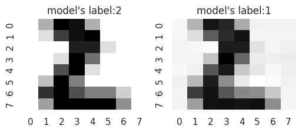

# 3-3. 深層学習ライブラリ（その2）

前回主にkerasの使い方を説明しましたが、深層学習の訓練のやり方が以下のプロトコルに依存していました：
```python
model.compile(...)
model.fit(...)
```
例えば `model.compile()` でロス関数を指定していましたが、自分がさせたい訓練目標がデフォルトの設定に存在しない場合はどうすれば良いでしょうか？

そのような場合、**訓練の定義を自作**することができます。しかしそのためには、kerasの背後のライブラリのことを知らないといけないようです。Kerasの背後で動いているライブラリには以下のようなものがあります：

```
Keras
├── TensorFlow
├── PyTorch
└── JAX
```

これらのライブラリは（JAXはやや例外的ではあるものの）単独で動かすことのできる深層学習用ライブラリであり、場合のよってはどれかのライブラリでしか欲しい実装例が見つからないこともあります。そこで今回はこれらのライブラリの簡単な入門編として、
- 深層学習ワークフローの書き方
- kerasでの使用方法

を説明したいと思います。

## `TensorFlow`

TensorFlow は深層学習用のフレームワークの一つで、ユーザーの数が多く、困ったときに検索するとたくさん解決策が見つかるのが良いです。他のライブラリに比べてデプロイを意識した機能が多い印象です。インポート文は以下です。
```python
import tensorflow as tf
```

これは全世界共通です。なお、ここでは最小限の機能の説明しかしませんので、詳細は公式ドキュメント
- https://www.tensorflow.org/?hl=ja

を参照してください。

### 深層学習ワークフローの書き方

#### モデルの作り方

ややこしいのですが、歴史的な経緯があって TenforFlow の中に更に keras が入っており（`tf.keras`）、そこからモデルを作ることができます。ですがこれは実質 keras なのでモデルの作り方は前回の説明から変わりません。クラス継承する形で再度書いておくと以下のようになります：
```python
class MyModel(tf.keras.Model):
    def __init__(self):
        # 内部パラメータなどの情報
        super().__init__()
        self.層1 = tf.keras.layers.層1()
        self.層2 = tf.keras.layers.層2()
        ...
        self.層L = tf.keras.layers.層L()
        #以下は任意（model.summaryの表示に影響）
        self.call(tf.keras.Input(shape=(入力1バッチあたりのshape)))

    def call(self, inputs):
        # 実際のニューラルネット処理
        x = self.層1(inputs)
        x = self.層2(x)
        ...
        outputs = self.層L(x)
        return outputs
```


#### モデルの訓練の仕方

一方で訓練方法ですが、kerasの `model.compile()` + `model.fit()` 部分を自作することができます。

##### `model.compile()` に当たる部分

この部分の「入力」は
- `model`（上の自作モデルクラスのインスタンス）
- `optimizer` ：微分情報を使ってどのようにパラメータ更新するかを制御するオブジェクト
    > - `optimizer = tf.keras.optimizers.更新手法名()` で作る
    > - どういうのがあるかは：https://keras.io/api/optimizers/ を参照
- `loss_fn` 関数：微分をとる対象の関数
    > - `tf.keras.losses.ロス関数名()` で作成する
    > - pythonの `def` でより複雑なものも作れる
- データ配列（教師ありの設定の場合はミニバッチ `X, y` ですが、この限りではないです）

です。訓練ステップ1回は以下のように書きます：

```python
#@tf.function # このデコレータをつけると速くなります
def train_step(model, optimizer, data):
    # データ読み込み
    X, y = data

    # 誤差逆伝播法のための記録処理
    with tf.GradientTape() as tape:
        y_pred = model(X, training=True) 
        loss_value = loss_fn(y, y_pred)   

    # 勾配計算
    grads = tape.gradient(loss_value, model.trainable_variables) 

    # パラメータ更新
    optimizer.apply_gradients(zip(grads, model.trainable_variables))
```

前回の図に照らし合わせると以下の部分が対応します：


ここでは教師ありの設定 `X, y = data` を考えましたが、モデルパラメータ $`\theta`$ に依存した関数があって、その微分更新をするというだけなので、教師ありの場合だけでなく、もっと自由に書くことができます。

##### `model.fit()` に当たる部分

あとは
- 与えられたデータをランダムに分割しミニバッチの列を作り
- ミニバッチの列方向に `for` 文で処理を書く

ということをやれば良いです。その際にコールバック的な処理をしたければ、自分で書きます。典型的には以下のようなコードになります。

```python
# 1. モデル、最適化手法、ロスなどの設定
model = MyModel()
optimizer = tf.keras.optimizers.更新手法名()
loss_fn = tf.keras以下の関数とpython構文で作った自作ロス関数
N_epochs = xxx

# 2. 訓練ループの外で、データ処理のオブジェクトとして `batches` を作る
batches = tf.data.Dataset.from_tensor_slices(data)
batches = batches.shuffle(buffer_size).batch(batch_size)

# 3. 訓練ループを回す
for epoch in range(N_epochs):
    # batches を使って各エポックは回す
    for batch in batches:
        train_step(model, optimizer, batch)
        # 1回更新ごとのコールバックが必要なら書く
    # 1エポックごとのコールバックが必要なら書く
```
`tf.data.Dataset` についての詳細は https://www.tensorflow.org/guide/data?hl=ja を見てください。


- 例：人工データ分布でtensorflowを実際に動かしてみる
    <details>
    <summary>データとモデルの用意</summary>
    <blockquote>

    前節でも使ったデータ生成器を使います。
    ```python
    class ToyDataGenerator():
        def __init__(self, dim: int, n_class: int):
            self.rg = np.random.default_rng(seed=3)
            self.mu_for_class_np = self.rg.normal(0, 1, size=(n_class, dim))
            self.dim = dim
            self.n_class = n_class
            
        def sample(self, N_batch:int):
            x = []
            y = []
            for n in range(self.n_class):
                mu = self.mu_for_class_np[n]
                x = x + (self.rg.normal(0, .2, size=(N_batch//self.n_class,self.dim)) + mu).tolist()
                y = y + (n*np.ones(shape=(N_batch//self.n_class, 1))).tolist() 
            x = np.array(x).astype(np.float32)
            y = np.array(y).astype(np.int32)
            df = pd.DataFrame(
                {"x0": x[:, 0],
                "x1": x[:, 1],
                "y": y.reshape(-1)}
                )  
            return df

    p = ToyDataGenerator(dim=2, n_class=5)
    df = p.sample(3000)
    sns.relplot(data=df, x="x0", y="x1", hue="y")
    ```
    > </img>
    
    モデルも前回と同じものをTensorFlowで書き換えただけにします：

    ```python
    class MyModel(tf.keras.Model):
        def __init__(self):
            # 内部パラメータなどの情報
            super().__init__()
            self.l1 = tf.keras.layers.Dense(10, activation='relu')
            self.l2 = tf.keras.layers.Dense(8, activation='relu')
            self.l3 = tf.keras.layers.Dense(5, activation='softmax')

        def call(self, inputs):
            # 実際のニューラルネット処理
            x = self.l1(inputs)
            x = self.l2(x)
            outputs = self.l3(x)
            return outputs
    ```

    </blockquote>
    </details>
    <details>
    <summary>loss_fnとtrain_stepの定義</summary>
    <blockquote>

    データが分類問題なので、ロス関数は分類のためのもの（相対エントロピー）を定義しておきます。
    なお、相対エントロピー には二種類あり
    - `SparseCategoricalCrossentropy`: ターゲットが分類ラベルを表す自然数の場合
    - `CategoricalCrossentropy`: ターゲットが分類ラベルを表す自然数の成分に1を持ち、他の成分が0のベクトルの場合

    です。ここではデータの形式が前者なので **Sparse** がついている方を選びます：
    ```python
    loss_fn = tf.keras.losses.SparseCategoricalCrossentropy()
    ```

    これだけでも良いのですが、以下のように自分で書いても良いです：

    ```python
    def loss_fn(y_true, y_pred):
        # 小文字の sparse_categorical_crossentropy は関数です
        loss_array = tf.keras.losses.sparse_categorical_crossentropy(y_true, y_pred) 
        loss_value = tf.reduce_mean(loss_array) # バッチごとに計算してくるので平均
        return loss_value
    ```

    自分で書く際は、tf の直下にある関数を使わないと学習がうまくいかないことに注意してください。numpyの関数などを使うと、そこで微分計算（誤差逆伝搬）がストップしてしまいます。
    
    train_stepですが、今回のロスは特に複雑ではないので、本文のテンプレート通りでOKです：

    ```python
    def train_step(model, optimizer, data):
        X, y = data
        with tf.GradientTape() as tape:       # 勾配計算に使う情報
            y_pred = model(X, training=True) 
            loss_value = loss_fn(y, y_pred)   
        # 勾配計算
        grads = tape.gradient(loss_value, model.trainable_variables) 
        # パラメータ更新
        optimizer.apply_gradients(zip(grads, model.trainable_variables))
        return loss_value # 後のために値を返すようにしておく
    ```
    </blockquote>
    </details>

    <details>
    <summary>訓練ループを回す</summary>
    <blockquote>
    
    あとは上のテンプレートに従って、訓練ループを書くだけです。データ周りの処理以外はほとんどコピペで済むはずです：

    ```python
    # 0. データの処理
    X_train = df[["x0", "x1"]]
    y_train = df["y"]
    data = (X_train, y_train)
    batch_size=10

    # 1. モデル、最適化手法、ロスなどの設定
    model = MyModel()
    optimizer = tf.keras.optimizers.Adam()
    N_epochs = 5

    # 2. 訓練ループの外で、データ処理のオブジェクトとして `batches` を作る
    batches = tf.data.Dataset.from_tensor_slices(data)
    batches = batches.shuffle(buffer_size=3000).batch(batch_size=batch_size)

    # 3. 訓練ループを回す
    for epoch in range(N_epochs):
        # batches を使って各エポックは回す
        for m, batch in enumerate(batches):
            loss_value = train_step(model, optimizer, batch)
            # 1回更新ごとのコールバックが必要なら書く
            if m%(len(X_train)//(10*batch_size))==0:
            print("=", end="")
        # 1エポックごとのコールバックが必要なら書く
        print(f" {epoch}-th epoch finished, loss for the final minibach={loss_value}")
    ```
    > ```
    > ========== 0-th epoch finished, loss for the final minibach=0.8673250079154968
    > ========== 1-th epoch finished, loss for the final minibach=0.2119894027709961
    > ========== 2-th epoch finished, loss for the final minibach=0.5714402794837952
    > ========== 3-th epoch finished, loss for the final minibach=0.2421935349702835
    > ========== 4-th epoch finished, loss for the final minibach=0.18907570838928223
    > ```

    なお、スピードが気になる場合は、`train_step` の定義に `@tf.function` のデコレータをつけてください。訓練後にモデルを使いたい場合は `model(X)` で良いはずです。ここでは検証は省略します。
    
    </blockquote>
    </details>

$\blacksquare$ **練習問題1:** 手書き文字認識をやってみましょう。データ読み込みは以下：
```python
from sklearn import datasets

df = datasets.load_digits()
X = df["images"]/np.max(df["images"]) # [0, 1] に収めておく
X = X.reshape(-1, 8, 8, 1)
y = df["target"]
```
<details class="memo">
<summary>ランダムにデータからサンプルを抽出して表示してみるプログラム</summary>
<blockquote>

```python
rng = np.random.default_rng(seed=1)
i = rng.integers(0, X.shape[0])

plt.figure(figsize=(2,2))
sns.heatmap(X[i], cmap="gray_r")
plt.title(f"{y[i]}")
plt.show()
```
> 

</blockquote>
</details>

loss_fn は自分で定義しても良いですが、上のデータ形式だと以下で十分です：
```python
loss_fn = tf.keras.losses.SparseCategoricalCrossentropy()
```
モデルはなんでも良いです。以下を展開すると参考モデル定義が出ます：
<details>
<summary>モデルの例</summary>
<blockquote>

```python
class CNNModel(tf.keras.Model):
    def __init__(self):
        super().__init__()
        self.c1 = tf.keras.layers.Conv2D(4, kernel_size=3, strides=(1,1), padding="valid", activation="relu")
        self.c2 = tf.keras.layers.Conv2D(8, kernel_size=3, strides=(1,1), padding="valid", activation="relu")
        self.c3 = tf.keras.layers.Conv2D(8, kernel_size=3, strides=(1,1), padding="valid", activation="relu")
        self.fl = tf.keras.layers.Flatten()
        self.l1 = tf.keras.layers.Dense(10, activation="softmax")
        self.call(tf.keras.Input(shape=(8,8,1)))

    def call(self, inputs, training=False):
        x = self.c1(inputs)
        x = self.c2(x)
        x = self.c3(x)
        x = self.fl(x)
        outputs = self.l1(x)
        return outputs
```
</blockquote>
</details>

> [!TIP]
> <details>
> <summary>解答例</summary>
> 
> 訓練ステップを定義しますが、本文中と全く同じで良いです。デコレータをつけておいて高速化します。
> ```python
> # @tf.function を実行するセルと同じセルで loss_fn を定義しておいた方が良いようです
> loss_fn = tf.keras.losses.SparseCategoricalCrossentropy()
> 
> @tf.function
> def train_step(model, optimizer, data):
>     # データ読み込み
>     X, y = data
> 
>     # 誤差逆伝播法のための記録処理
>     with tf.GradientTape() as tape:
>         y_pred = model(X, training=True) 
>         loss_value = loss_fn(y, y_pred)   
> 
>     # 勾配計算
>     grads = tape.gradient(loss_value, model.trainable_variables) 
> 
>     # パラメータ更新
>     optimizer.apply_gradients(zip(grads, model.trainable_variables))
>     return loss_value
> ```
> 訓練ループも同じで動くはずです。ホールドアウト検証を見越してテストデータを分けておきます。
> 
> ```python
> from sklearn import datasets
> from sklearn.model_selection import train_test_split
> 
> # 0. データの処理
> ## 読み込み
> df = datasets.load_digits()
> X = df["images"]/np.max(df["images"]) # [0, 1] に収めておく
> X = X.reshape(-1, 8, 8, 1)
> y = df["target"]
> ## 訓練データ/テストデータの分離
> X_train, X_test, y_train, y_test = train_test_split(X, y, test_size=0.2, random_state=1)
> data = (X_train, y_train)
> batch_size=10
> 
> # 1. モデル、最適化手法、ロスなどの設定
> model = CNNModel()
> optimizer = tf.keras.optimizers.Adam()
> N_epochs = 10
> 
> # 2. 訓練ループの外で、データ処理のオブジェクトとして `batches` を作る
> batches = tf.data.Dataset.from_tensor_slices(data)
> batches = batches.shuffle(buffer_size=3000).batch(batch_size=batch_size)
> 
> # 3. 訓練ループを回す
> for epoch in range(N_epochs):
>     # batches を使って各エポックは回す
>     for m, batch in enumerate(batches):
>         loss_value = train_step(model, optimizer, batch)
>         # 1回更新ごとのコールバックが必要なら書く
>         if m%(len(X_train)//(10*batch_size))==0:
>             print("=", end="")
>     # 1エポックごとのコールバックが必要なら書く
>     print(f" {epoch}-th epoch finished, loss for the final minibach={loss_value}")
> ```
> > ```
> > =========== 0-th epoch finished, loss for the final minibach=1.8005421161651611
> > =========== 1-th epoch finished, loss for the final minibach=1.3222359418869019
> > =========== 2-th epoch finished, loss for the final minibach=0.20885062217712402
> > =========== 3-th epoch finished, loss for the final minibach=0.2899131178855896
> > =========== 4-th epoch finished, loss for the final minibach=0.34687119722366333
> > =========== 5-th epoch finished, loss for the final minibach=0.23294863104820251
> > =========== 6-th epoch finished, loss for the final minibach=0.6767892837524414
> > =========== 7-th epoch finished, loss for the final minibach=0.048489805310964584
> > =========== 8-th epoch finished, loss for the final minibach=0.1609015166759491
> > =========== 9-th epoch finished, loss for the final minibach=0.13994833827018738
> > ```
> 検証してみます：
> ```python
> rng = np.random.default_rng(seed=999)
> i = rng.integers(0, X_test.shape[0])
> 
> plt.figure(figsize=(6,2))
> 
> plt.subplot(1,2,1)
> sns.heatmap(X_test[i].reshape(8, 8), cmap="gray_r", cbar=False)
> plt.title(f"data label:{y_test[i]}")
> 
> plt.subplot(1,2,2)
> plt.title(f"model: p(x)")
> sns.barplot(model(X_test[i:i+1]))
> plt.show()
> ```
> > 
> </details>

$\blacksquare$ **練習問題2:** **[少し進んだ深層学習の手法の実装]** 分類モデルを「だます」、すなわち、モデルの出力が狙った分類ラベル $`y_\text{tricked}`$ になるように入力値に微小な変更 $`\delta \mathbf{x}`$ を加えることができます。これを **敵対的摂動 (adversarial perturbation)** などと言います。いろいろなやり方がありますが、たとえば適当に小さな $\delta \mathbf{x}$ から初めて

$$
\begin{align*}
\delta \mathbf{x} \leftarrow \delta \mathbf{x} - \epsilon \nabla_{\delta \mathbf{x}} \Big( l\big(y_\text{tricked}, f_\theta(\mathbf{x}+ \delta \mathbf{x})\big) + c |\delta \mathbf{x}| \Big)
\end{align*}
$$

（ただし $`\epsilon, c>0`$、$`l`$ は$`f_\theta`$ を訓練したロス関数）という更新式を数回繰り返すことが考えられます。TensorFlowの自動微分を $`\delta \mathbf{x}`$ に適用すれば、これも実装できるはずです。以下、バッチサイズ1として
- $`\mathbf{x}`$ = `X`, $`f_\theta`$ = `model`
- $`y_\text{tricked}`$ = `y_tricked`, $`\delta \mathbf{x}`$ = `dX`

の場合で、10回更新する例を書いたコードが「更新コード」クリックで開きます。

<details>
<summary>更新コード</summary>
<blockquote>

```python
rng = np.random.default_rng(seed=999)
i = rng.integers(0, X_test.shape[0])

X = X_test[i:i+1]
X = tf.constant(X.reshape(1, 8, 8, 1).astype(np.float32))
y_tricked = 1
y_tricked = tf.constant(np.array([y_tricked]))

optimizer = tf.keras.optimizers.SGD()
dX = tf.Variable(initial_value=X+np.random.uniform(0,.05, (1, 8, 8, 1)), trainable=True)

def step(model, optimizer, X, dX, y_tricked):
    with tf.GradientTape() as tape:
        tape.watch(dX)
        loss_value = loss_fn(model, X, dX, y_tricked)
    grads = tape.gradient(loss_value, dX)
    optimizer.apply_gradients(zip([grads], [dX]))
    return loss_value

for _ in range(10):
  print(step(model, optimizer, X, dX, y_tricked))
```

</blockquote>
</details>

このコード中、$`l\big(y_\text{tricked}, f_\theta(\mathbf{x}+ \delta \mathbf{x})\big) + c |\delta \mathbf{x}|`$ = `loss_fn(model, X, dX, y_tricked)` は未実装です。これを実装して上の更新コードを動かし、敵対的摂動を見つけてください。

- いくつかヒント
    <details>
    <summary>loss_fnに使う TensorFlow の関数 </summary>
    <blockquote>

    $l$ については、訓練の時をまねて以下の処理で良いです

    ```python
    y_pred = model(X+dX)
    loss_array = tf.keras.losses.sparse_categorical_crossentropy(y_tricked, y_pred) 
    loss_value = tf.reduce_mean(loss_array) # バッチごとに計算してくるので平均
    ```

    l1正則化部分は

    ```python
    c=0.1
    penalty = c*tf.reduce_mean(tf.abs(dX))
    ```

    でOK。

    </blockquote>
    </details>

    <details>
    <summary>更新後にモデルを騙せているかチェックするコード</summary>
    <blockquote>
    
    ```python
    plt.figure(figsize=(6,2))

    plt.subplot(1,2,1)
    sns.heatmap(X.numpy().reshape(8, 8), cmap="gray_r", cbar=False)
    plt.title(f"model's label:{np.argmax(model(X))}")

    plt.subplot(1,2,2)
    sns.heatmap((X+dX).numpy().reshape(8, 8), cmap="gray_r", cbar=False)
    plt.title(f"model's label:{np.argmax(model(X+dX))}")
    plt.show()
    ```
    </blockquote>
    </details>

> [!TIP]
> <details>
> <summary>解答例</summary>
> 
> ```python
> def loss_fn(model, X, dX, y_tricked, c=0.1):
>     y_pred = model(X+dX)
>     loss_array = tf.keras.losses.sparse_categorical_crossentropy(y_tricked, y_pred) 
>     loss_value = tf.reduce_mean(loss_array) # バッチごとに計算してくるので平均
>     penalty = c*tf.reduce_mean(tf.abs(dX))
>     return loss_value + penalty
> ```
> あとは最初のプログラムを動かすと：
> ```python
> rng = np.random.default_rng(seed=999)
> i = rng.integers(0, X_test.shape[0])
> 
> X = X_test[i:i+1]
> X = tf.constant(X.reshape(1, 8, 8, 1).astype(np.float32))
> y_tricked = 1
> y_tricked = tf.constant(np.array([y_tricked]))
> 
> optimizer = tf.keras.optimizers.SGD()
> dX = tf.Variable(initial_value=X+np.random.uniform(0,.05, (1, 8, 8, 1)), trainable=True)
> 
> def step(model, optimizer, X, dX, y_tricked):
>     with tf.GradientTape() as tape:
>         tape.watch(dX)
>         loss_value = loss_fn(model, X, dX, y_tricked)
>     grads = tape.gradient(loss_value, dX)
>     optimizer.apply_gradients(zip([grads], [dX]))
>     return loss_value
> 
> for _ in range(10):
>   print(step(model, optimizer, X, dX, y_tricked))
> ```
> > ```
> > tf.Tensor(3.675457, shape=(), dtype=float32)
> > tf.Tensor(3.1734517, shape=(), dtype=float32)
> > tf.Tensor(2.6976757, shape=(), dtype=float32)
> > tf.Tensor(2.255257, shape=(), dtype=float32)
> > tf.Tensor(1.8544785, shape=(), dtype=float32)
> > tf.Tensor(1.5072026, shape=(), dtype=float32)
> > tf.Tensor(1.2186056, shape=(), dtype=float32)
> > tf.Tensor(0.98811334, shape=(), dtype=float32)
> > tf.Tensor(0.8195424, shape=(), dtype=float32)
> > tf.Tensor(0.69427234, shape=(), dtype=float32)
> > ```
> 
> 値が減っていっているので多分うまくいっているでしょう。みてみると：
> ```python
> plt.figure(figsize=(6,2))
> 
> plt.subplot(1,2,1)
> sns.heatmap(X.numpy().reshape(8, 8), cmap="gray_r", cbar=False)
> plt.title(f"model's label:{np.argmax(model(X))}")
> 
> plt.subplot(1,2,2)
> sns.heatmap((X+dX).numpy().reshape(8, 8), cmap="gray_r", cbar=False)
> plt.title(f"model's label:{np.argmax(model(X+dX))}")
> plt.show()
> ```
> > 
> 
> となって確かに見た目は（あまり）変わっていないけれども、モデルが間違って 1 に最大確率を返していることがわかります。
> 
> </details>


### kerasでの訓練を自分で定義する

TensorFlowで訓練ループを書くと、少々長くなってしまいます。kerasの `model.fit()` を思い出すと、 
- 記述が短く簡潔
- 深層学習のワークフローがフォーマット化している
- 豊富なコールバック処理がある

などを考えると、keras がそのまま使えると便利な気がします。実は kerasのモデルクラスで `model.fit()` を実行する際には、モデルクラスの他のメソッドが色々呼び出されているだけなので、そこを上書きすれば自分なりの訓練のやり方を定義することができます。


たとえば訓練ステップ（青色部分）ではデフォルトで設定されている `train_step(self, data)` が呼び出されています。このようなことが `model.evaluate()` などのメソッドでも起こっているため、そのデフォルト設定をクラス定義の際に書き換えると、kerasのパラダイムのまま比較的自由な訓練を実行することができます。

- 詳細は公式ドキュメントの解説記事が良いです：https://keras.io/guides/custom_train_step_in_tensorflow/

#### 訓練ステップ
`train_step(self)` が呼び出されています。ですのでこのメソッドを上書きすれば、訓練ループを自分で書かずに、そのまま `model.fit()` を使えるようになります。基本は以下のフォーマットで良いようです（教師ありの場合で書きましたが、本来もっと自由に書けます）：
```python
class MyModel(keras.Model):
    ...

    def loss_fn(self, y, y_pred):
        " ロス関数の実装 "
        ...
        return loss_value

    def train_step(self, data):
        ''' 訓練ステップの実装
            すでに解説した train_step(model, optimizer, data) とほとんど同じ '''
        # データ読み込み
        X, y = data

        # 誤差逆伝播法のための記録処理
        with tf.GradientTape() as tape:
            y_pred = self(X, training=True)
            loss_value = self.loss_fn(y, y_pred)
        
        # 勾配計算
        grads = tape.gradient(loss_value, self.trainable_variables)
        # パラメータ更新 (self.optimizer に注意)
        self.optimizer.apply_gradients(zip(grads, self.trainable_variables))

        return {"表示したい情報1": 値1,
                "表示したい情報2": 値2, ...} # 返り値を辞書オブジェクトにする
```

表示したい情報の部分は `model.fit()` を走らせた際に毎回のパラメータ更新時に表示される値を書きます。使用の際はたとえば以下のようにするなど考えられます：

```python
model = MyModel()
model.compile(optimizer='...')

# 訓練データ
X, y = data

# model.fit() で訓練を実行すると、上書きした train_step が呼ばれる
model.fit(X, y, epochs=..., batch_size=...)
```

#### 推論ステップ
`test_step(self)` が呼び出されています。ですのでこのメソッドを上書きすれば、そのまま `model.evaluate()` などを使えるようになります。基本は以下のフォーマットで良いようです：

```python
class MyModel(keras.Model):
    ...
    def test_step(self, data):
        " 推論用データが入ってきた時の処理を書く "
        # 何か処理をする
        return {"表示したい情報1": 値1,
                "表示したい情報2": 値2, ...} # 返り値を辞書オブジェクトにする
```

#### metricsの処理

`model.compile()` の際に引数で
- `loss="..."` や `metric=[...]` 

を指定すると、ログの処理なども自動でしてくれました。この辺りの処理がどうなっているか説明します。

##### `keras.metrics` のオブジェクト

keras内で、これらの情報を管理しているのが `keras.metrics` 以下のクラスで、以下のようなものがあります：
- `keras.metrics.Accuracy`：モデルの現在の精度を計算する
- `keras.metrics.MeanSquaredError`：モデルの現在の平均2乗ロスを計算する
- ...など、その他：https://keras.io/api/metrics/

これらのクラスから指標計算するには以下の3ステップが必要です：
1. インスタンスを作る：`self.metric = keras.metrics.指標名()`
2. 指標の値を更新する：`self.metric.update(計算に必要な情報)`
3. 指標の現在値を返す：`self.metric.result()`

これらの処理は特に `train_step(self)` や `test_step(self)` 内で有用です。具体的には、モデルクラスの初期化の段階でインスタンスを作っておき、それを後の処理で使うということです。テンプレートは以下
```python
class MyModel(keras.Model):
    def __init__(self):
        # 内部パラメータなどの情報
        ...
        # metrics
        self.metric1 = keras.metrics.指標名1()
        self.metric2 = keras.metrics.指標名2()
        ...
        self.metricN = keras.metrics.指標名N()

    @property
    def metrics(self):
        return [self.metric1, self.metric2, ..., self.metricN]
```

`@property` のデコレータをかけることで、このモデルを作った際に `model.metrics` とすると設定した指標のオブジェクトからなるリストを返してくれます。これを制定せずに、`model.compile()` で metric を指定した場合は `[<Mean name=loss>, <CompileMetrics name=compile_metrics>]` が入ります。

どの指標を使うかで若干 `.update()` に必要な引数が変わりますが、わからない場合は `help(model.metric1.update)` を読むなどしてください。


#### compileの再定義

ここまでくると `model.compile()` も再定義したくなるかもしれません。それももちろん可能です。ドキュメントをみると最低限必要なのは super関数を唱えておくことぐらいのようです。
```python
class MyModel(keras.Model):
    ...
    def compile(self, ...):
        super().compile()
        ...
```

たとえば、公式ドキュメントのGANの実装を見ると、モデル内に複数の最適化パラメータがあって、それを別々に更新したい場合は、`optimizer` を複数用意することになりますが、その場合はここで定義するようにしておくのが良さそうです。
> `optimizer` は keras.optimizers.最適化手法() でオブジェクトとして作成できます：https://keras.io/api/optimizers/

- 例：人工データ分布でkerasのカスタマイズモデルを実際に動かしてみる（metricも出す）
    <details>
    <summary>データ作成</summary>
    <blockquote>

    データはいつも通り：
    ```python
    class ToyDataGenerator():
        def __init__(self, dim: int, n_class: int):
            self.rg = np.random.default_rng(seed=3)
            self.mu_for_class_np = self.rg.normal(0, 1, size=(n_class, dim))
            self.dim = dim
            self.n_class = n_class
            
        def sample(self, N_batch:int):
            x = []
            y = []
            for n in range(self.n_class):
                mu = self.mu_for_class_np[n]
                x = x + (self.rg.normal(0, .2, size=(N_batch//self.n_class,self.dim)) + mu).tolist()
                y = y + (n*np.ones(shape=(N_batch//self.n_class, 1))).tolist() 
            x = np.array(x).astype(np.float32)
            y = np.array(y).astype(np.int32)
            df = pd.DataFrame(
                {"x0": x[:, 0],
                "x1": x[:, 1],
                "y": y.reshape(-1)}
                )  
            return df

    p = ToyDataGenerator(dim=2, n_class=5)
    df = p.sample(3000)
    sns.relplot(data=df, x="x0", y="x1", hue="y")
    ```
    > </img>

    </blockquote>
    </details>

    <details>
    <summary>モデル作成</summary>
    <blockquote>

    モデル定義は少し長いですが、たとえば以下のような感じ：
    ```python
    import keras

    class MyModel(keras.Model):
        def __init__(self):
            # 内部パラメータなどの情報
            super().__init__()
            self.l1 = keras.layers.Dense(10, activation='relu')
            self.l2 = keras.layers.Dense(8, activation='relu')
            self.l3 = keras.layers.Dense(5, activation='softmax')
            
            ##### 追加1（metricの表示のための処理2）#####
            self.loss_tracker = keras.metrics.Mean(name="loss")
            self.accuracy_metric = keras.metrics.SparseCategoricalAccuracy(name="accuracy")
            #########################################

        def call(self, inputs):
            # 実際のニューラルネット処理
            x = self.l1(inputs)
            x = self.l2(x)
            outputs = self.l3(x)
            return outputs

        ########## 追加2 ##########
        def train_step(self, data):
            ''' ここに1回更新あたりの処理を書く '''
            loss_value = train_step(self, self.optimizer, data) # train_step() は前の例でグローバルに定義した関数の流用

            # metricの表示のための処理2
            X, y = data
            y_pred = self(X, training=False)
            self.loss_tracker.update_state(loss_value)
            self.accuracy_metric.update_state(y, y_pred)
            return {m.name: m.result() for m in self.metrics}
        ###########################

        ########## 追加3 ##########
        @property
        def metrics(self):
            return [self.loss_tracker, self.accuracy_metric]
        ###########################
    ```
    </blockquote>
    </details>

    <details>
    <summary>訓練</summary>
    <blockquote>

    あとは compile時に optimizer を指定して fit すればOK：
    ```python
    model = MyModel()
    loss_fn = tf.keras.losses.SparseCategoricalCrossentropy()

    model.compile(optimizer='adam')

    # model.fit() で訓練を実行すると、上書きした train_step が呼ばれる
    model.fit(X_train, y_train, epochs=5, batch_size=10)
    ```
    > ```
    > Epoch 1/5
    > 300/300 ━━━━━━━━━━━━━━━━━━━━ 2s 2ms/step - accuracy: 0.5578 - loss: 1.3826
    > Epoch 2/5
    > 300/300 ━━━━━━━━━━━━━━━━━━━━ 1s 2ms/step - accuracy: 0.9961 - loss: 0.4211
    > Epoch 3/5
    > 300/300 ━━━━━━━━━━━━━━━━━━━━ 1s 2ms/step - accuracy: 0.9966 - loss: 0.1422
    > Epoch 4/5
    > 300/300 ━━━━━━━━━━━━━━━━━━━━ 1s 2ms/step - accuracy: 0.9972 - loss: 0.0634
    > Epoch 5/5
    > 300/300 ━━━━━━━━━━━━━━━━━━━━ 1s 2ms/step - accuracy: 0.9975 - loss: 0.0340
    > <keras.src.callbacks.history.History at 0x781eb5c89c90>
    > ```
    
    </blockquote>
    </details>

$\blacksquare$ **練習問題3:** 手書き文字認識をkeras+tfで書いてみましょう。基本は以下を展開したものを使ってください：

- テンプレート：
    <details>
    <summary>データ</summary>
    <blockquote>
    
    ```python
    from sklearn import datasets

    df = datasets.load_digits()
    X = df["images"]/np.max(df["images"]) # [0, 1] に収めておく
    X = X.reshape(-1, 8, 8, 1)
    y = df["target"]
    ```
    </blockquote>
    </details>
    <details>
    <summary>モデルクラス</summary>
    <blockquote>
    
    ```python
    class CNNModel(keras.Model):
        def __init__(self):
            super().__init__()
            self.c1 = keras.layers.Conv2D(4, kernel_size=3, strides=(1,1), padding="valid", activation="relu")
            self.c2 = keras.layers.Conv2D(8, kernel_size=3, strides=(1,1), padding="valid", activation="relu")
            self.c3 = keras.layers.Conv2D(8, kernel_size=3, strides=(1,1), padding="valid", activation="relu")
            self.fl = keras.layers.Flatten()
            self.l1 = keras.layers.Dense(10, activation="softmax")
            self.call(keras.Input(shape=(8,8,1)))

        def call(self, inputs, training=False):
            x = self.c1(inputs)
            x = self.c2(x)
            x = self.c3(x)
            x = self.fl(x)
            outputs = self.l1(x)
            return outputs
    ```
    </blockquote>
    </details>
    <details>
    <summary>metrics</summary>
    <blockquote>
    
    ```python
    loss_tracker = keras.metrics.Mean(name="My_loss")
    accuracy_metric = keras.metrics.SparseCategoricalAccuracy(name="My_accuracy")
    ```
    それぞれアップデート法は
    ```python
    loss_tracker.update(loss_value)
    accuracy_metric.update(y, y_pred)
    ```
    です。
    </blockquote>
    </details>
    <details>
    <summary>train_step関数</summary>
    <blockquote>
    
    ```python
    def train_step(model, optimizer, loss_fn, data):
        # データ読み込み
        X, y = data
        # 誤差逆伝播法のための記録処理
        with tf.GradientTape() as tape:
            y_pred = model(X, training=True) 
            loss_value = loss_fn(y, y_pred)   
        # 勾配計算
        grads = tape.gradient(loss_value, model.trainable_variables) 
        # パラメータ更新
        optimizer.apply_gradients(zip(grads, model.trainable_variables))
        return loss_value
    ```
    </blockquote>
    </details>

これらをうまく組み合わせて、モデルクラスを定義し直すことで、以下のような訓練結果が出るようにしてください：

```python
model = CNNModel()
model.compile(optimizer="adam") # loss や metric はここには書かない

model.fit(X, y, epochs=5, batch_size=10)
```
> ```
> Epoch 1/5
> 180/180 ━━━━━━━━━━━━━━━━━━━━ 3s 4ms/step - My_accuracy: 0.2061 - My_loss: 2.1905
> Epoch 2/5
> 180/180 ━━━━━━━━━━━━━━━━━━━━ 1s 2ms/step - My_accuracy: 0.7347 - My_loss: 1.0308
> Epoch 3/5
> 180/180 ━━━━━━━━━━━━━━━━━━━━ 0s 2ms/step - My_accuracy: 0.8355 - My_loss: 0.6477
> Epoch 4/5
> 180/180 ━━━━━━━━━━━━━━━━━━━━ 1s 2ms/step - My_accuracy: 0.8587 - My_loss: 0.4827
> Epoch 5/5
> 180/180 ━━━━━━━━━━━━━━━━━━━━ 1s 2ms/step - My_accuracy: 0.8801 - My_loss: 0.3889
> <keras.src.callbacks.history.History at 0x7eb52d3014d0>
> ```

> [!TIP]
> <details>
> <summary>解答例</summary>
> 
> train_stepを外部で定義する必要はないです：
> ```python
> 
> class CNNModel(keras.Model):
>     def __init__(self):
>         super().__init__()
>         self.c1 = keras.layers.Conv2D(4, kernel_size=3, strides=(1,1), padding="valid", activation="relu")
>         self.c2 = keras.layers.Conv2D(8, kernel_size=3, strides=(1,1), padding="valid", activation="relu")
>         self.c3 = keras.layers.Conv2D(8, kernel_size=3, strides=(1,1), padding="valid", activation="relu")
>         self.fl = keras.layers.Flatten()
>         self.l1 = keras.layers.Dense(10, activation="softmax")
>         self.call(keras.Input(shape=(8,8,1)))
>         ###
>         self.loss_fn = keras.losses.SparseCategoricalCrossentropy()
>         self.loss_tracker = keras.metrics.Mean(name="My_loss")
>         self.accuracy_metric = keras.metrics.SparseCategoricalAccuracy(name="My_accuracy")
> 
>     @property
>     def metrics(self):
>         return [self.loss_tracker, self.accuracy_metric]
> 
>     def call(self, inputs, training=False):
>         x = self.c1(inputs)
>         x = self.c2(x)
>         x = self.c3(x)
>         x = self.fl(x)
>         outputs = self.l1(x)
>         return outputs
> 
>     def train_step(self, data):
>         loss_value = train_step(self, self.optimizer, self.loss_fn, data)
> 
>         X, y = data
>         y_pred = self(X, training=False)
>         self.loss_tracker.update_state(loss_value)
>         self.accuracy_metric.update_state(y, y_pred)
>         return {m.name: m.result() for m in self.metrics}
> ```
> </details>

$\blacksquare$ **練習問題4:** 上の解答例だと
```python
model.evaluate(X, y, return_dict=True)
```
はエラーが出て動きません。これを改善して
> ```
> 57/57 ━━━━━━━━━━━━━━━━━━━━ 0s 3ms/step - My_accuracy: 0.9296 - My_loss: 0.2621
> {'My_accuracy': 0.9293266534805298, 'My_loss': 0.270922988653183}
> ```
のような表示が出るようにしてください。
> [!TIP]
> <details>
> <summary>解答例</summary>
> 
> 元のモデルを継承して、test_stepメソッドを追加すると良いです：
> ```python
> class CNNModel2(CNNModel):
>     def test_step(self, data):
>         X, y = data
>         y_pred = self(X, training=False)
> 
>         loss_value = self.loss_fn(y, y_pred)
>         self.loss_tracker.update_state(loss_value)
>         self.accuracy_metric.update_state(y, y_pred)
>         return {m.name: m.result() for m in self.metrics}
> ```
> このクラスからモデルを作ると良いです。
> </details>

$\blacksquare$ **練習問題5:** **[少し進んだ深層学習の手法の実装]** 変分自己符号化器（Variational Auto Encoder, VAE）のKeras+TensorFlow実装：以下の設定を考えます。
- データ $`x \in \mathbb{R}^{D_\text{data}}`$ 発生確率 $`p_\text{data}(x)`$
- 潜在変数 $`z \in \mathbb{R}^{D_\text{latent}}`$ 発生確率 $`q_\text{prior}(z)`$

ここでは $`q_\text{prior} = \mathcal{N}(0, I_{D_\text{latent}})`$（標準正規分布）に取ります。この設定のもとで、二つのモデルを訓練します：
- 符号化器 $`p_\varphi(z|x)`$：データをどの潜在変数に埋め込む（符号化する）かの確率
    - 以下では $`p_\varphi(\cdot|x) = \mathcal{N}(\mu=\mu_\varphi(x), \sigma^2 = e^{l_\varphi(x)})`$ （$`\mu_\varphi, l_\varphi`$ は適当なニューラルネット）とします
        <details>
        <summary><strong>kerasでの実装例</strong></summary>
        <blockquote>

        $`\mu_\varphi, l_\varphi`$ を同時に定義。
        ```python
        class Encoder(keras.Model):
            def __init__(self, dimZ):
                self.dimZ = dimZ
                super().__init__()
                self.c1 = keras.layers.Conv2D(4, kernel_size=3, strides=(1,1), padding="valid", activation="relu")
                self.c2 = keras.layers.Conv2D(8, kernel_size=3, strides=(1,1), padding="valid", activation="relu")
                self.c3 = keras.layers.Conv2D(16, kernel_size=3, strides=(1,1), padding="valid", activation="relu")
                self.fl = keras.layers.Flatten()
                self.l_mu = keras.layers.Dense(self.dimZ)
                self.l_l = keras.layers.Dense(self.dimZ)
                self.call(keras.Input(shape=(8,8,1)))

            def call(self, X, training=False):
                h = self.c1(X)
                h = self.c2(h)
                h = self.c3(h)
                h = self.fl(h)
                mu = self.l_mu(h)
                l = self.l_l(h)
                return (mu, ll)
        ```
        </blockquote>
        </details>
- 復号化器 $`q_\theta(x|z)`$：潜在変数をどのデータに対応させる（復号化する）かの確率
    - 以下では $`q_\theta(\cdot|z) = \mathcal{N}(\mu=f_\theta(z), \sigma^2=T)`$（$`f_\theta`$ は適当なニューラルネット、$`T`$ は固定する温度パラメータで、復号の際の温度に対応）とします
        <details>
        <summary><strong>kerasでの実装例</strong></summary>
        <blockquote>
        
        以下、$`f_\theta`$ に対応します。
        ```python
        class Decoder(keras.Model):
        def __init__(self, dimZ):
            self.dimZ = dimZ
            super().__init__()
            self.l1 = keras.layers.Dense(16*16, activation="relu")
            self.re = keras.layers.Reshape((4, 4, 16))
            self.c1 = keras.layers.Conv2DTranspose(8, kernel_size=2, strides=(1,1), padding="valid", activation="leaky_relu")
            self.c2 = keras.layers.Conv2DTranspose(4, kernel_size=2, strides=(1,1), padding="valid", activation="leaky_relu")
            self.c3 = keras.layers.Conv2DTranspose(1, kernel_size=3, strides=(1,1), padding="valid", activation="sigmoid")
            self.call(keras.Input(shape=(self.dimZ,))) # sigmoidは出力値を [0, 1] に収めるため（後でデータをそのようにするので）

        def call(self, Z, training=False):
            h = self.l1(Z)
            h = self.re(h)
            h = self.c1(h)
            h = self.c2(h)
            X_reconstructed = self.c3(h)
            return X_reconstructed
        ```
        </blockquote>
        </details>

この場合のロス関数は結論だけ書くと：

```math
\begin{align*}
L(\varphi, \theta) 
%&= \mathbb{E}_{x \sim p_\text{data}}\Big[
%    D_{KL}(p_\varphi(\cdot|x)\|q_\text{prior})
%    -\mathbb{E}_{z\sim p_\varphi(\cdot|x)}\big[
%        \log q_\theta(x|z)
%        \big]
%    \Big]\\
&=\mathbb{E}_{x \sim p_\text{data}}\Big[
    L_\text{KL}(\varphi, x)
    +
    L_\text{reconst}(\varphi, \theta, x, T)
    \Big]\\
&\left\{
    \begin{array}{ll}
    L_\text{KL}(\varphi, x) &= \frac{1}{2} \Big(- l_\varphi(x) - 1 + e^{l_\varphi(x)} + [\mu_\varphi(x)]^2
\Big)\\
    L_\text{reconst}(\varphi, \theta, x, T) &=\frac{1}{2T} \mathbb{E}_{\hat{\epsilon} \sim \mathcal{N}(0,I_{D_\text{latent}})}
    \Big[
    \Big(f_\theta(\mu_\varphi(x)+\hat{\epsilon}\odot e^{l_\varphi(x)/2}) - x\Big)^2
    \Big]
    \end{array}
\right.
\end{align*}
```

となります。$`\odot`$ は成分ごとの積を意味します。このロス関数を小さくするように $`\varphi, \theta`$ を更新したのち、サンプリング
1. $z \sim q_\text{prior}=\mathcal{N}(0, I_{D_\text{latent}})$
2. $x_\text{generated} = f_\theta(z)$

とすると、新しいデータ生成器と見なすことができます。そこで以下の

<details>
<summary><strong>kerasでのVAE実装（kl_loss と reconstruction_loss が未実装）</strong></summary>
<blockquote>

```python
class VAEModel(keras.Model):
    def __init__(self, T=0.001):
        super().__init__()
        self.dimZ = 10
        self.enc = Encoder(self.dimZ)
        self.dec = Decoder(self.dimZ)
        self.T = T
        ###
        self.loss_tracker = keras.metrics.Mean(name="loss")
        self.klloss_tracker = keras.metrics.Mean(name="kl_loss")
        self.reconloss_tracker = keras.metrics.Mean(name="reconstruction_loss")

    @property
    def metrics(self):
        return [self.loss_tracker, self.klloss_tracker, self.reconloss_tracker]

    def train_step(self, data):
        X = data
        with tf.GradientTape() as tape:
            ## ここでの関数が未実装 ##
            loss_kl = kl_loss(self.enc, X)
            loss_rec = reconstruction_loss(self.enc, self.dec, X, self.T)
            #######################
            loss_value = loss_kl + loss_rec
            
        grads = tape.gradient(loss_value, self.trainable_variables)
        self.optimizer.apply_gradients(zip(grads, self.trainable_variables))

        self.loss_tracker.update_state(loss_value)
        self.klloss_tracker.update_state(loss_kl)
        self.reconloss_tracker.update_state(loss_rec)
        return {m.name: m.result() for m in self.metrics}

from sklearn import datasets
import numpy as np

# 0. データの処理
df = datasets.load_digits()
X = df["images"]/np.max(df["images"]) # [0, 1] に収めておく
X = X.reshape(-1, 8, 8, 1)

model = VAEModel(T=0.01)
model.compile(optimizer="adam")

model.fit(X, epochs=20, batch_size=16)
```
</blockquote>
</details>

で定義されていない二つの関数 `kl_loss(enc, X)` と `reconstruction_loss(enc, dec, X, T)` を実装して、VAEを訓練してください。訓練後のサンプリングには以下を使ってください：

<details>
<summary><strong>訓練後のサンプル用コード</strong></summary>
<blockquote>

```python
import matplotlib.pyplot as plt
import seaborn as sns

N = 10

Z = tf.random.normal(shape=(N**2, model.dimZ))
X_reconstructed = model.dec(Z)
for i in range(N):
    for j in range(N):
        plt.subplot(N, N, i*N+j+1)
        plt.axis("off")
        sns.heatmap(X_reconstructed[i*N+j].numpy().reshape(8, 8), cmap="gray_r", cbar=False)
```
</blockquote>
</details>

ヒント：`reconstruction_loss(enc, dec, X, T)` に必要な $`\mathbb{E}_{\hat{\epsilon}}`$ 部分はモンテカルロ近似（実際にサンプルをとって、その平均値で近似）するのが普通です。データ `X` に対して 1 サンプルだけで近似しても割と良い結果が出ます。

> [!TIP]
> <details>
> <summary>解答例</summary>
> 
> ```python
> def kl_loss(enc, X):
>     mu, l = enc(X, training=True)
>     return tf.reduce_mean(-l - 1 + tf.exp(l) + mu**2)/2
> 
> def reconstruction_loss(enc, dec, X, T):
>     mu, l = enc(X, training=True)
>     Z = sample_from_N(mu, l)
>     X_reconstructed = dec(Z, training=True)
>     return tf.reduce_mean((X-X_reconstructed)**2)/(2*T)
> 
> def sample_from_N(mu, l):
>     epsilon = tf.random.normal(shape=tf.shape(l)) # 各データに対して1サンプルずつとる（増やしても良いですが、実装が面倒になるかも）
>     return mu + epsilon*tf.keras.backend.exp(l/2)
> ```
> 
> この後に問題文のVAEコードを動かすと良いです。うまく行った場合の生成データは以下のようになります：
> ```python
> import matplotlib.pyplot as plt
> import seaborn as sns
> 
> N = 10
> 
> Z = tf.random.normal(shape=(N**2, model.dimZ))
> X_reconstructed = model.dec(Z)
> for i in range(N):
>     for j in range(N):
>         plt.subplot(N, N, i*N+j+1)
>         plt.axis("off")
>         sns.heatmap(X_reconstructed[i*N+j].numpy().reshape(8, 8), cmap="gray_r", cbar=False)
> ```
> > 
> 
> 温度の設定部分を色々に変えてみて、どのような振る舞いになるかみてみるのも理解が深まるかもしれません。
> </details>


## `PyTorch`

PyTorch は深層学習用のフレームワークの一つで、ユーザーの数が多く、困ったときに検索するとたくさん解決策が見つかるのが良いです。他のライブラリに比べて細かい設定をユーザーが手で書くような仕様であり、研究者が使うことが多い印象です。詳細は公式ドキュメント
- https://pytorch.org/

を見てください。インポート文は以下です。

```python
import torch
```

### 深層学習ワークフローの書き方

#### モデルの作り方

こちらにも色々作り方があるようですが、モデルクラスを継承するのが（他のライブラリも同じような書き方ができるので）覚えることが少ない気がします。

```python
class MyModel(torch.nn.Module):
    def __init__(self):
        # 内部パラメータなどの情報
        super().__init__()
        self.層1 = torch.nn.層1()
        self.層2 = torch.nn.層2()
        ...
        self.層L = torch.nn.層L()

    def forward(self, inputs):
        ''' call ではない？'''
        # 実際のニューラルネット処理
        x = self.層1(inputs)
        x = self.層2(x)
        ...
        outputs = self.層L(x)
        return outputs
```

`call(self)` ではなく `forward(self)` という名前で出力を定義することに注意です。

#### モデルの訓練の仕方

訓練方法ですが、kerasの `model.compile()` + `model.fit()` 部分を自作するのがデフォルトです。

##### `model.compile()` に当たる部分

この部分の「入力」は
- `model`（上の自作モデルクラスのインスタンス）
- `optimizer` ：微分情報を使ってどのようにパラメータ更新するかを制御するオブジェクト
    > - `optimizer = torch.optim.更新手法名(model.parameters())` で作る。**モデルパラメータを明示的に指定しているのに注意。**
    > - どういうのがあるかは：https://pytorch.org/docs/stable/optim.html を参照
- `loss_fn` 関数：微分をとる対象の関数
    > - `torch.nn.ロス関数名()` で作成する
    > - pythonの `def` でより複雑なものも作れる
- データ配列（教師ありの設定の場合はミニバッチ `X, y` ですが、この限りではないです）

です。訓練ステップは以下のように書きます：

```python
def train_step(model, optimizer, data):
    # データ読み込み
    X, y = data

    # 勾配情報の消去
    optimizer.zero_grad()

    # 誤差逆伝播法のための記録処理
    y_pred = model(X, training=True)
    loss_value = loss_fn(y, y_pred)

    # 勾配計算
    loss_value.backward()

    # パラメータ更新
    optimizer.step()
```

前回の図に照らし合わせると以下の部分が対応します：


TenforFlow と異なる点は、PyTorchでは
1. `optimizer` は `model` のパラメータを監視しており、`optimizer` に 勾配情報が加算された状態で蓄えられてゆく
    - 普通に使う際には、パラメータ更新前か後に、現在の貯められている勾配の値をゼロにする処理（`optimizer.zero_grad()`）をする必要がある
2. 順伝播が常に記録モードになっており、いつでも誤差逆伝搬ができる（動的に計算グラフが生成される）

> [!NOTE]
> PyTorchでは TensorFlowの `GradientTape()` が常に効いているような状態で、どの演算に対しても順伝播の値を保存します。TensorFlowの時とは逆に、そのような処理をしたくない場合には以下の構文を使います：
> ```python
> with torch.no_grad():
>     # ここに微分したくない処理を書く
> ```

##### `model.fit()` に当たる部分

あとは2の処理だけが少し書き方が違いますが、TensorFlow とほぼ同じです。：
```python
# 1. モデル、最適化手法、ロスなどの設定
model = MyModel()
optimizer = torch.optim.更新手法名(model.parameters())
loss_fn = torch以下の関数とpython構文で作った自作ロス関数
N_epochs = xxx

# 2. 訓練ループの外で、データ処理のオブジェクトとして `batches` を作る
from torch.utils.data import TensorDataset, DataLoader

dataset = TensorDataset(data_tensor)
batches = DataLoader(dataset, batch_size=batch_size, shuffle=True)

# 3. 訓練ループを回す
for epoch in range(N_epochs):
    # batches を使って各エポックは回す
    for batch in batches:
        train_step(model, optimizer, batch)
        # 1回更新ごとのコールバックが必要なら書く
    # 1エポックごとのコールバックが必要なら書く
```
torch.utils.data についての詳細は https://pytorch.org/docs/stable/data.html を見てください。**注意：`data` は numpy配列から torch配列(`xxx_tensor`)に変換する必要があります：**
```python
X_tensor = torch.tensor(X_np)
```
などで変換できます。また、PyTorchでは数値の型を明示的に書かないとエラーが出ます。基本は
- 整数（`int`）：64ビット？
- 浮動小数点数（`float`）：32ビット

のようです。

- 例：人工データ分布でtorchを実際に動かしてみる
    <details>
    <summary>データとモデルの用意</summary>
    <blockquote>

    前節でも使ったデータ生成器を使います。
    ```python
    class ToyDataGenerator():
        def __init__(self, dim: int, n_class: int):
            self.rg = np.random.default_rng(seed=3)
            self.mu_for_class_np = self.rg.normal(0, 1, size=(n_class, dim))
            self.dim = dim
            self.n_class = n_class
            
        def sample(self, N_batch:int):
            x = []
            y = []
            for n in range(self.n_class):
                mu = self.mu_for_class_np[n]
                x = x + (self.rg.normal(0, .2, size=(N_batch//self.n_class,self.dim)) + mu).tolist()
                y = y + (n*np.ones(shape=(N_batch//self.n_class, 1))).tolist() 
            x = np.array(x).astype(np.float32)
            y = np.array(y).astype(np.int32)
            df = pd.DataFrame(
                {"x0": x[:, 0],
                "x1": x[:, 1],
                "y": y.reshape(-1)}
                )  
            return df

    p = ToyDataGenerator(dim=2, n_class=5)
    df = p.sample(3000)
    sns.relplot(data=df, x="x0", y="x1", hue="y")
    ```
    > </img>
    
    モデルも前回と同じものをPyTorchで書き換えただけにします。

    ```python
    class MyModel(nn.Module):
        def __init__(self):
            # 内部パラメータなどの情報
            super().__init__()
            self.l1 = nn.Linear(2, 10)
            self.a1 = nn.ReLU()
            self.l2 = nn.Linear(10, 8)
            self.a2 = nn.ReLU()
            self.l3 = nn.Linear(8, 5)
            # [NOTE] torch のロスで cross entropy にかける場合は以下を identity にする必要がある
            self.a3 = nn.Softmax(dim=-1)

        def forward(self, inputs, training=False):
            # 実際のニューラルネット処理
            x = self.a1(self.l1(inputs))
            x = self.a2(self.l2(x))
            outputs = self.a3(self.l3(x))
            return outputs
    ```

    </blockquote>
    </details>
    <details>
    <summary>loss_fnとtrain_stepの定義</summary>
    <blockquote>

    データが分類問題なので、ロス関数は分類のためのもの（相対エントロピー）を定義しておきますが、公式がサポートしているのはモデル出力の最後のsoftmaxがない場合のみのようで、今回のようにモデル出力にソフトマックスをかけた場合は自分で定義しないといけません：
    ```python
    def loss_fn(y_true, y_pred):
        # tensorflowと入出力の順が逆なことに注意
        loss_array = nn.functional.nll_loss(torch.log(y_pred), y_true)
        loss_value = torch.mean(loss_array)
        return loss_value
    ```

    自分で書く際は、torch の直下にある関数を使わないと学習がうまくいかないことに注意してください。numpyの関数などを使うと、そこで微分計算（誤差逆伝搬）がストップしてしまいます。
    
    train_stepですが、今回のロスは特に複雑ではないので、本文のテンプレート通りでOKです：

    ```python
    def train_step(model, optimizer, data):
        # データ読み込み
        X, y = data

        # 勾配情報の消去
        optimizer.zero_grad()               

        # 誤差逆伝播法のための記録処理
        y_pred = model(X, training=True)
        loss_value = loss_fn(y, y_pred)

        # 勾配計算
        loss_value.backward()
        # パラメータ更新
        optimizer.step()
        
        return loss_value # 後のために値を返すようにしておく
    ```
    </blockquote>
    </details>

    <details>
    <summary>訓練ループを回す</summary>
    <blockquote>
    
    あとは上のテンプレートに従って、訓練ループを書くだけです。データ周りの処理以外はほとんどコピペで済むはずです：

    ```python
    from torch.utils.data import TensorDataset, DataLoader

    # 0. データの処理 (型をきちんと指定しないとエラーが出ます)
    X_train = df[["x0", "x1"]].to_numpy().astype(np.float32)
    y_train = df["y"].to_numpy().astype(np.int64)
    batch_size=10

    # 1. モデル、最適化手法、ロスなどの設定
    model = MyModel()
    optimizer = torch.optim.Adam(model.parameters())
    N_epochs = 5
    #loss_fn = nn.CrossEntropyLoss()

    # 2. 訓練ループの外で、データ処理のオブジェクトとして `dataloader` を作る
    X_tensor = torch.tensor(X_train)
    y_tensor = torch.tensor(y_train)
    dataset = TensorDataset(X_tensor, y_tensor)
    batches = DataLoader(dataset, batch_size=batch_size, shuffle=True)

    # 3. 訓練ループを回す
    for epoch in range(N_epochs):
        # batches を使って各エポックは回す
        for m, batch in enumerate(batches):
            loss_value = train_step(model, optimizer, batch)
            # 1回更新ごとのコールバックが必要なら書く
            if m%(len(X_train)//(10*batch_size))==0:
                print("=", end="")
        # 1エポックごとのコールバックが必要なら書く
        print(f" {epoch}-th epoch finished, loss for the final minibach={loss_value}")
    ```
    > ```
    > ========== 0-th epoch finished, loss for the final minibach=0.607620894908905
    > ========== 1-th epoch finished, loss for the final minibach=0.13303247094154358
    > ========== 2-th epoch finished, loss for the final minibach=0.06326520442962646
    > ========== 3-th epoch finished, loss for the final minibach=0.07955949008464813
    > ========== 4-th epoch finished, loss for the final minibach=0.010605827905237675
    > ```

    訓練後にモデルを使いたい場合は `model(X_tensor)` (注：入力はnumpy配列ではなく、`X_tensor = torch.tensor(X_np)` のもの) で良いはずです。ここでは検証は省略します。
    
    </blockquote>
    </details>

$\blacksquare$ **練習問題6:** PyTorchで手書き文字認識をやってみましょう。データ読み込みは以下：
```python
from sklearn import datasets

# 0. データの準備
df = datasets.load_digits()
X = df["images"]/np.max(df["images"]) # [0, 1] に収めておく
X = (X.reshape(-1, 8, 8, 1)).astype(np.float32)
y = df["target"]
# tensorオブジェクトに変換
X_tensor = torch.tensor(X)
X_tensor = X_tensor.permute([0, 3, 1, 2]) # チャンネルが先
y_tensor = torch.tensor(y)
```


PyTorch には 確率値に対するクロスエントロピーがない（softmaxがかかる前の出力に対してのみ実装がある）ようなので、loss_fn は自作した方がわかりやすいかもしれません：
```python
def loss_fn(y_true, y_pred):
    # tensorflowと入出力の順が逆なことに注意
    loss_array = nn.functional.nll_loss(torch.log(y_pred), y_true)
    loss_value = torch.mean(loss_array)
    return loss_value
```
モデルはなんでも良いです。以下を展開すると参考モデル定義が出ます：
<details>
<summary>モデルの例</summary>
<blockquote>

```python
class CNNModel(nn.Module):
    def __init__(self):
        super().__init__()
        self.c1 = nn.Conv2d(1, 4, kernel_size=3, stride=(1,1), padding="valid")
        self.a1 = nn.ReLU()
        self.c2 = nn.Conv2d(4, 8, kernel_size=3, stride=(1,1), padding="valid")
        self.a2 = nn.ReLU()
        self.c3 = nn.Conv2d(8, 8, kernel_size=3, stride=(1,1), padding="valid")
        self.a3 = nn.ReLU()
        self.fl = nn.Flatten()
        self.l1 = nn.Linear(32, 10)
        self.softmax = nn.Softmax(dim=-1)

    def forward(self, inputs, training=False):
        x = self.a1(self.c1(inputs))
        x = self.a2(self.c2(x))
        x = self.a3(self.c3(x))
        x = self.fl(x)
        outputs = self.softmax(self.l1(x))
        return outputs
```
</blockquote>
</details>

> [!TIP]
> <details>
> <summary>解答例</summary>
> 
> 全体のコードを載せます：
> ```python
> from sklearn import datasets
> 
> # 0. データの準備
> df = datasets.load_digits()
> X = df["images"]/np.max(df["images"]) # [0, 1] に収めておく
> X = (X.reshape(-1, 8, 8, 1)).astype(np.float32)
> y = df["target"]
> # tensorオブジェクトに変換
> X_tensor = torch.tensor(X)
> X_tensor = X_tensor.permute([0, 3, 1, 2]) # チャンネルが先
> y_tensor = torch.tensor(y)
> 
> # 1. モデル、最適化手法、ロスなどの設定
> class CNNModel(nn.Module):
>     def __init__(self):
>         super().__init__()
>         self.c1 = nn.Conv2d(1, 4, kernel_size=3, stride=(1,1), padding="valid")
>         self.a1 = nn.ReLU()
>         self.c2 = nn.Conv2d(4, 8, kernel_size=3, stride=(1,1), padding="valid")
>         self.a2 = nn.ReLU()
>         self.c3 = nn.Conv2d(8, 8, kernel_size=3, stride=(1,1), padding="valid")
>         self.a3 = nn.ReLU()
>         self.fl = nn.Flatten()
>         self.l1 = nn.Linear(32, 10)
>         self.softmax = nn.Softmax(dim=-1)
> 
>     def forward(self, inputs, training=False):
>         x = self.a1(self.c1(inputs))
>         x = self.a2(self.c2(x))
>         x = self.a3(self.c3(x))
>         x = self.fl(x)
>         outputs = self.softmax(self.l1(x))
>         return outputs
> 
> model = CNNModel()
> optimizer = torch.optim.Adam(model.parameters())
> 
> def loss_fn(y_true, y_pred):
>     # tensorflowと入出力の順が逆なことに注意
>     loss_array = nn.functional.nll_loss(torch.log(y_pred), y_true)
>     loss_value = torch.mean(loss_array)
>     return loss_value
> 
> def train_step(model, optimizer, data):
>     # データ読み込み
>     X, y = data
>     # 勾配情報の消去
>     optimizer.zero_grad()               
>     # 誤差逆伝播法のための記録処理
>     y_pred = model(X, training=True)
>     loss_value = loss_fn(y, y_pred)
>     # 勾配計算
>     loss_value.backward()
>     # パラメータ更新
>     optimizer.step()
>     return loss_value # 後のために値を返すようにしておく
> 
> N_epochs = 5
> batch_size = 10
> 
> # 2. 訓練ループの外で、データ処理のオブジェクトとして `batches` を作る
> from torch.utils.data import TensorDataset, DataLoader
> 
> dataset = TensorDataset(X_tensor, y_tensor)
> batches = DataLoader(dataset, batch_size=batch_size, shuffle=True)
> 
> # 3. 訓練ループを回す
> for epoch in range(N_epochs):
>     # batches を使って各エポックは回す
>     for m, batch in enumerate(batches):
>         loss_value = train_step(model, optimizer, batch)
>         # 1回更新ごとのコールバックが必要なら書く
>         if m%(len(X_tensor)//(10*batch_size))==0:
>             print("=", end="")
>     # 1エポックごとのコールバックが必要なら書く
>     print(f" {epoch}-th epoch finished, loss for the final minibach={loss_value}")
> ```
> > ```
> > =========== 0-th epoch finished, loss for the final minibach=1.3670427799224854
> > =========== 1-th epoch finished, loss for the final minibach=0.3017640709877014
> > =========== 2-th epoch finished, loss for the final minibach=0.6257365942001343
> > =========== 3-th epoch finished, loss for the final minibach=0.6608127355575562
> > =========== 4-th epoch finished, loss for the final minibach=0.29345062375068665
> > ```
> </details>


### kerasでの訓練を自分で定義する

TensorFlowではなくPyTorchをkerasのバックエンドとして使うこともできます。その設定はノートブックであれば
```python
import os

os.environ["KERAS_BACKEND"] = "torch"
```
としたのち
```python
import keras
```
とすることです。
> 通常のpython環境であれば環境変数の `KERAS_BACKEND` を `torch` に変えてからpythonを実行してください。

- 詳細は公式ドキュメントの解説記事が良いです：https://keras.io/guides/custom_train_step_in_torch/

#### 訓練ステップ

大きく違うのは `train_step(self)` の書き方くらいだと思います。他は特殊なことをしない限り、keras+TensorFlowで説明したやり方がそのまま使えます。訓練ステップの実装（教示付きの場合）は以下：

```python
class MyModel(keras.Model):
    ...

    def loss_fn(self, y, y_pred):
        " ロス関数の実装 "
        ...
        return loss_value

    def train_step(self, data):
        ''' 訓練ステップの実装
            すでに解説した train_step(model, optimizer, data) とほとんど同じ '''
        # データ読み込み
        X, y = data

        # 勾配情報の消去
        ### 書き換え1 ###
        #optimizer.zero_grad()  
        self.zero_grad()            
        ################    

        # 誤差逆伝播法のための記録処理
        y_pred = model(X, training=True)
        loss_value = self.loss_fn(y, y_pred)

        # 勾配計算
        loss_value.backward()
        ### 書き換え2 ###
        trainable_weights = [v for v in self.trainable_weights]
        gradients = [v.value.grad for v in trainable_weights]
        ################

        # パラメータ更新
        ### 書き換え3 ###
        #optimizer.step()
        with torch.no_grad():
            self.optimizer.apply(gradients, trainable_weights)
        ################

        return {"表示したい情報1": 値1,
                "表示したい情報2": 値2, ...} # 返り値を辞書オブジェクトにする
```
注意点は3点です：
1. 勾配情報の消去が `self.optimizer.zero_grad()` **ではなく** `self.zero_grad()`
2. 勾配計算のち、明示的に微分値を指定する
3. その微分値を使って明示的にオプティマイザの更新をする

それぞれ `### 書き換え ###` で挟んだ部分に対応します。

- 例：人工データ分布でkerasのカスタマイズモデルを実際に動かしてみる（metricも出す）
    <details>
    <summary>データ作成</summary>
    <blockquote>

    データはいつも通り：
    ```python
    class ToyDataGenerator():
        def __init__(self, dim: int, n_class: int):
            self.rg = np.random.default_rng(seed=3)
            self.mu_for_class_np = self.rg.normal(0, 1, size=(n_class, dim))
            self.dim = dim
            self.n_class = n_class
            
        def sample(self, N_batch:int):
            x = []
            y = []
            for n in range(self.n_class):
                mu = self.mu_for_class_np[n]
                x = x + (self.rg.normal(0, .2, size=(N_batch//self.n_class,self.dim)) + mu).tolist()
                y = y + (n*np.ones(shape=(N_batch//self.n_class, 1))).tolist() 
            x = np.array(x).astype(np.float32)
            y = np.array(y).astype(np.int32)
            df = pd.DataFrame(
                {"x0": x[:, 0],
                "x1": x[:, 1],
                "y": y.reshape(-1)}
                )  
            return df

    p = ToyDataGenerator(dim=2, n_class=5)
    df = p.sample(3000)
    sns.relplot(data=df, x="x0", y="x1", hue="y")
    ```
    > </img>

    </blockquote>
    </details>

    <details >
    <summary>モデル作成</summary>
    <blockquote>

    モデル定義は少し長いですが、たとえば以下のような感じ：
    ```python
    import keras

    class MyModel(keras.Model):
        def __init__(self):
            # 内部パラメータなどの情報
            super().__init__()
            self.l1 = keras.layers.Dense(10, activation='relu')
            self.l2 = keras.layers.Dense(8, activation='relu')
            self.l3 = keras.layers.Dense(5, activation='softmax')
            
            ##### 追加1（metricの表示のための処理2）#####
            self.loss_tracker = keras.metrics.Mean(name="loss")
            self.accuracy_metric = keras.metrics.SparseCategoricalAccuracy(name="accuracy")
            #########################################

        def call(self, inputs):
            # 実際のニューラルネット処理
            x = self.l1(inputs)
            x = self.l2(x)
            outputs = self.l3(x)
            return outputs

        def loss_fn(self, y_true, y_pred):
            #loss_array = nn.functional.cross_entropy(y_pred, y_true) は softmaxに入れる前のlogitのみ受け付けるため、今回の実装では使えない
            loss_array = nn.functional.nll_loss(torch.log(y_pred), y_true)
            loss_value = torch.mean(loss_array)
            return loss_value

        ########## 追加2 ##########
        def train_step(self, data):
            ''' ここに1回更新あたりの処理を書く '''
            # データ読み込み
            X, y = data

            # 勾配情報の消去
            #self.optimizer.zero_grad()       
            self.zero_grad()        

            # 誤差逆伝播法のための記録処理
            y_pred = model(X, training=True)
            loss_value = self.loss_fn(y, y_pred)

            # 勾配計算
            loss_value.backward()
            ## 
            trainable_weights = [v for v in self.trainable_weights]
            gradients = [v.value.grad for v in trainable_weights]

            # パラメータ更新
            #self.optimizer.step()
            with torch.no_grad():
                self.optimizer.apply(gradients, trainable_weights)

            y_pred = self(X, training=False) # これも no_grad にかく？
            self.loss_tracker.update_state(loss_value)
            self.accuracy_metric.update_state(y, y_pred)
            return {m.name: m.result() for m in self.metrics}
        ###########################

        ########## 追加3 ##########
        @property
        def metrics(self):
            return [self.loss_tracker, self.accuracy_metric]
        ###########################

    ```
    </blockquote>
    </details>

    <details>
    <summary>訓練</summary>
    <blockquote>

    あとは compile時に optimizer を指定して fit すればOK：
    ```python
    X_train = df[["x0", "x1"]].to_numpy().astype(np.float32)
    y_train = df["y"].to_numpy().astype(np.int64)#.reshape(-1,1)

    model = MyModel()

    model.compile(optimizer='adam')

    # model.fit() で訓練を実行すると、上書きした train_step が呼ばれる
    model.fit(X_train, y_train, epochs=5, batch_size=10)
    ```
    > ```
    > Epoch 1/5
    > 300/300 ━━━━━━━━━━━━━━━━━━━━ 2s 7ms/step - accuracy: 0.3775 - loss: 1.4814
    > Epoch 2/5
    > 300/300 ━━━━━━━━━━━━━━━━━━━━ 2s 6ms/step - accuracy: 0.6667 - loss: 0.8089
    > Epoch 3/5
    > 300/300 ━━━━━━━━━━━━━━━━━━━━ 2s 6ms/step - accuracy: 0.9869 - loss: 0.3571
    > Epoch 4/5
    > 300/300 ━━━━━━━━━━━━━━━━━━━━ 2s 6ms/step - accuracy: 0.9954 - loss: 0.1046
    > Epoch 5/5
    > 300/300 ━━━━━━━━━━━━━━━━━━━━ 2s 6ms/step - accuracy: 0.9958 - loss: 0.0430
    > <keras.src.callbacks.history.History at 0x7848c9fb8590>
    > ```
    
    </blockquote>
    </details>

$\blacksquare$ **練習問題7:** **[少し進んだ深層学習の手法の実装]** 敵対的生成ネットワーク（Generative Adversarial Network, GAN）のKeras+PyTorch実装：以下の設定を考えます。
- データ $`x \in \mathbb{R}^{D_\text{data}}`$ 発生確率 $`p_\text{data}(x)`$
- 潜在変数 $`z \in \mathbb{R}^{D_\text{latent}}`$ 発生確率 $`q_\text{prior}(z)`$

ここでは $`q_\text{prior} = \mathcal{N}(0, I_{D_\text{latent}})`$（標準正規分布）に取ります。この設定のもとで、二つのモデルを訓練します：
- 生成器 $`G_\theta(z) \in \mathbb{R}^{D_\text{data}}`$：潜在変数から「偽データ」を作り出すニューラルネットワーク
    - $`z \sim q_\text{prior}`$ のち $`G_\theta(z)`$ とすることで（偽）データ生成器として使えます。
        <details>
        <summary><strong>kerasでの実装例</strong></summary>
        <blockquote>

        `.generate()` が $`z \sim q_\text{prior} \to G_\theta(z)`$ に対応します。
    
        ```python
        class Generator(keras.Model):
            def __init__(self, dimZ):
                self.dimZ = dimZ
                super().__init__()
                self.l1 = keras.layers.Dense(16*16, activation="relu")
                self.re = keras.layers.Reshape((4, 4, 16))
                self.bn    = keras.layers.BatchNormalization()
                self.c1 = keras.layers.Conv2DTranspose(8, kernel_size=2, strides=(1,1), padding="valid", activation="relu")
                self.bn1    = keras.layers.BatchNormalization()
                self.c2 = keras.layers.Conv2DTranspose(4, kernel_size=2, strides=(1,1), padding="valid", activation="relu")
                self.bn2    = keras.layers.BatchNormalization()
                self.c3 = keras.layers.Conv2DTranspose(1, kernel_size=3, strides=(1,1), padding="valid", activation="sigmoid")
                self.call(keras.Input(shape=(self.dimZ,)))

            def call(self, Z, training=False):
                h = self.l1(Z)
                h = self.re(h)
                h = self.bn(h, training=training)
                h = self.c1(h)
                h = self.bn1(h, training=training)
                h = self.c2(h)
                h = self.bn2(h, training=training)
                X_fake = self.c3(h)
                return X_fake

            def generate(self, sample_size=1, training=False):
                Z = keras.random.normal(shape=(sample_size, self.dimZ))
                X_fake = self(Z, training=training)
                return X_fake
        ```

        </blockquote>
        </details>
- 識別器 $`D_\varphi(x) \in \mathbb{R}`$：入力データが本物か偽物かを分類するニューラルネットワーク
    - $`\text{Sigmoid}(D_\varphi(x))`$ が $`x`$ が本物である確率の推定値になるようにします。
        <details>
        <summary><strong>kerasでの実装例</strong></summary>
        <blockquote>
        
        この場合の出力は `logit` と呼ぶべき量になります。
        ```python
        class Discriminator(keras.Model):
            def __init__(self):
                super().__init__()
                self.c1 = keras.layers.Conv2D(4, kernel_size=3, strides=(1,1), padding="valid", activation="relu")
                self.c2 = keras.layers.Conv2D(8, kernel_size=3, strides=(1,1), padding="valid", activation="relu")
                self.c3 = keras.layers.Conv2D(16, kernel_size=3, strides=(1,1), padding="valid", activation="relu")
                self.fl = keras.layers.Flatten()
                self.l1 = keras.layers.Dense(1)
                self.call(keras.Input(shape=(8,8,1)))

            def call(self, X, training=False):
                h = self.c1(X)
                h = self.c2(h)
                h = self.c3(h)
                h = self.fl(h)
                logit = self.l1(h)
                return logit
        ```

        </blockquote>
        </details>

ロス関数は生成器と識別器で別々のものを用意します。スタンダードなものは以下：

```math
\begin{align*}
L_D(\varphi, \theta) 
&= \mathbb{E}_{x \sim p_\text{data}} 
    \Big[
        \underbrace{
        \log (1+e^{-D_\varphi(x)})
        + \mathbb{E}_{z \sim q_\text{prior}} 
        \big[
            \log (1+e^{+D_\varphi(G_\theta(z))})
        \big]
        }_{=:L_D(\varphi, \theta, x)}
    \Big]
    \\
L_G(\varphi, \theta) 
&= \mathbb{E}_{z \sim q_\text{prior}} 
    \Big[
        \log (1+e^{-D_\varphi(G_\theta(z))})
    \Big]
\end{align*}
```

この二つのロスを使って、
- $`\varphi \leftarrow \varphi - \nabla_\varphi L_D(\varphi, \theta) `$ （識別器の訓練、本物と偽物を区別しようとする）
- $`\theta \leftarrow \theta - \nabla_\theta L_G(\varphi, \theta) `$（生成器の訓練、識別器を騙そうとする）

の更新を繰り返します。理想的にいけば、識別器が区別できないほど精巧な偽データを生成器が作れるようになります。その後、サンプリング
1. $z \sim q_\text{prior}=\mathcal{N}(0, I_{D_\text{latent}})$
2. $x_\text{generated} = G_\theta(z)$

とすると、新しいデータ生成器と見なすことができます。そこで以下の

<details>
<summary><strong>kerasでのGAN実装（dis_loss と gen_loss が未実装）</strong></summary>
<blockquote>

```python
class GANModel(keras.Model):
    def __init__(self):
        super().__init__()
        self.dimZ = 10
        self.dis = Discriminator()
        self.gen = Generator(self.dimZ)
        ###
        self.dis_loss_tracker = keras.metrics.Mean(name="dis_loss")
        self.gen_loss_tracker = keras.metrics.Mean(name="gen_loss")
        self.built = True

    @property
    def metrics(self):
        return [self.dis_loss_tracker, self.gen_loss_tracker]

    def compile(self, d_optimizer, g_optimizer):
        super().compile()
        self.d_optimizer = d_optimizer
        self.g_optimizer = g_optimizer
        # 以下、一回パラメータ初期化のためにそれぞれをcallしておくと良い
        X_fake = self.gen.generate(sample_size=1, training=False)
        self.dis(X_fake)

    def update(self, model, optimizer):
        trainable_weights = [v for v in model.trainable_weights]
        gradients = [v.value.grad for v in trainable_weights]
        with torch.no_grad():
            optimizer.apply(gradients, trainable_weights)

    def train_step(self, data):
        X = data

        # discriminator update
        for _ in range(5):
            self.dis.zero_grad()
            loss_D = dis_loss(self.dis, self.gen, X) ## この関数と
            loss_D.backward()
            self.update(self.dis, self.d_optimizer)
        
        # generator update
        self.gen.zero_grad() 
        loss_G = gen_loss(self.dis, self.gen, X)        ## この関数
        loss_G.backward()
        self.update(self.gen, self.g_optimizer)

        self.dis_loss_tracker.update_state(loss_D)
        self.gen_loss_tracker.update_state(loss_G)
        return {m.name: m.result() for m in self.metrics}

from sklearn import datasets
import numpy as np

# 0. データの処理
df = datasets.load_digits()
X = df["images"]/np.max(df["images"]) # [0, 1] に収めておく
X = X.reshape(-1, 8, 8, 1)

model = GANModel()
model.compile(d_optimizer=keras.optimizers.Adam(), 
              g_optimizer=keras.optimizers.Adam())

model.fit(X, epochs=20, batch_size=16)
```

</blockquote>
</details>

で定義されていない二つの関数 `dis_loss(dis, gen, X)`,`gen_loss(dis, gen, X)` を実装して、GANを訓練してください。訓練後のサンプリングには以下を使ってください：

<details>
<summary><strong>訓練後のサンプル用コード</strong></summary>
<blockquote>

```python
import matplotlib.pyplot as plt
import seaborn as sns

N = 10

with torch.no_grad():
    X_fake = model.gen.generate(sample_size=N**2, training=False)
X_fake = X_fake.numpy().reshape(-1, 8, 8)
for i in range(N):
    for j in range(N):
        plt.subplot(N, N, i*N+j+1)
        plt.axis("off")
        sns.heatmap(X_fake[i*N+j].reshape(8, 8), cmap="gray_r", cbar=False)
```
</blockquote>
</details>

- ヒント：
    - 両方に必要な $`\mathbb{E}_{z}`$ 部分はモンテカルロ近似（実際にサンプルをとって、その平均値で近似）するのが普通です。サンプルサイズはデータのミニバッチサイズと合わせるのが普通です。
    - 実は softplus関数 （`nn.functional.softplus`）と言うのがあって、定義は以下です：
```math
\text{softplus}(d) = \log (1+e^d)
```

> [!TIP]
> <details>
> <summary>解答例</summary>
>
> `gen_loss()` に関しては `X` 入力なしで `X_fake` のサンプル数を指定しても良いのですが、サンプル数をバランスさせた方がいい気がしたので以下のような実装になりました：
> ```python
> def dis_loss(dis, gen, X):
>     # 1項目
>     fst = nn.functional.softplus(-dis(X,      training=True))
>     # 2項目
>     X_fake = gen.generate(sample_size=X.shape[0], training=False)
>     snd = nn.functional.softplus(+dis(X_fake, training=True))
>     return torch.mean(fst + snd)
> 
> def gen_loss(dis, gen, X):
>     X_fake = gen.generate(sample_size=X.shape[0], training=True)
>     d   = nn.functional.softplus(-dis(X_fake, training=False))
>     return torch.mean(d)
> ```
> この後に問題文のGANコードを動かすと良いです。うまく行った場合の生成データは以下のようになります：
> ```python
> import matplotlib.pyplot as plt
> import seaborn as sns
> 
> N = 10
> 
> with torch.no_grad():
>     X_fake = model.gen.generate(sample_size=N**2, training=False)
> X_fake = X_fake.numpy().reshape(-1, 8, 8)
> for i in range(N):
>     for j in range(N):
>         plt.subplot(N, N, i*N+j+1)
>         plt.axis("off")
>         sns.heatmap(X_fake[i*N+j].reshape(8, 8), cmap="gray_r", cbar=False)
> ```
> > 
> 
> `train_step()` の実装をよくみると、生成器と識別器の更新回数が 1:5 になっています。これを別の比率にしてみるとGANの振る舞いの理解の助けになるかもしれません。
>
> また、今回の実装はわかりやすさを重視したため、少し遅くなっていると思います。高速化するには無駄な計算（重複している部分など）を解消するのが良いです。
> </details>

## `JAX`

TensorFlow/PyTorch では配列を（GPU使用も見据えて）処理するために numpy 配列ではなく独自の配列オブジェクトを使っていましたが、そこの機能と深層学習で使う処理を分けた方が良いという考え方もあります。JAXはそのようなライブラリで、一言で言うと
- 数値自動微分の機能を持った、GPU対応したnumpy ＋ 

です。詳しくは公式ドキュメント
- https://docs.jax.dev/en/latest/

を参照してください。インポート文は以下です。

```python
import jax
```

> [!NOTE]
> JAX は 関数型言語の思想を強めに反映したライブラリで、なるべくいろんな処理を「純粋な数学の意味での関数」として実装しているようです。例えば
> - 機械学習モデルのパラメータ $`\theta`$ は、モデルオブジェクトに格納しないで、その値のまま取り扱う
> - 擬似乱数は内部状態を明示的に更新する処理を書いて、どんなシード値を固定/変化させているかを明確にする
> - 高速化のための jit(just in time) 処理が `@jax.jit` で可能ですが、これで関数をデコレートすると返り値以外の処理（print文など）は無視される
>
> などが挙げられます。特に擬似乱数周辺はシード値を固定することに慣れていない場合はバグの温床になりがちなので注意してください。
> ただし、以下で述べる2025年最新版の flax から使う場合は純粋な関数型の思想からは外れ、普通のオブジェクト指向っぽい使い方をすることになります。

### 深層学習ワークフローの書き方

#### モデルの作り方

JAX自体にニューラルネットのモデルを作ったり、adamなどの勾配降下法の発展版を使う機能はありません（作ることは可能です）。ニューラルネットを作る場合には Flax（2025年現在でも開発が活発） というライブラリを使うと良いかと思います。
> Haiku と言うのもありますが、公式リポジトリ https://github.com/google-deepmind/dm-haiku のREADMEによると、flaxを使え、と書かれているようです（2025年3月）。

```python
import flax
```

Flax でのニューラルネット周りの処理は、
- `flax.linen`（JAXの関数型の思想をある程度反映している、2024年までのデフォルト）
    - モデルの内部にパラメータを格納しない形式で、外部に `params` としてパラメータを管理してゆく形式。例えばモデル出力は以下のようにする：
        ```python
        params = ... # 何かパラメータセットがgivenとする
        model.apply(params, X)
        ```
- `flax.nnx`（ほとんどオブジェクト指向、2024年からのデフォルト）
    - これまで通り、モデル内部にパラメータを格納する形式で、keras, tensorflow, torch とほとんど同じ使い勝手になった。例えばモデル出力は以下のようにする：
        ```python
        model(X)
        ```

の二種類があります。以下では後者でのモデル作成のテンプレートを示します：

```python
from flax import nnx

class MyModel(nnx.Module):
    def __init__(self, rngs: nnx.Rngs): # pythonでは関数の入力の型指定ができ、ここでは rngs が nnx.Rngs クラスのオブジェクトであることを意味します
        # 内部パラメータなどの情報
        self.層1 = nnx.層1(..., rngs=rngs)
        self.層2 = nnx.層2(..., rngs=rngs)
        ...
        self.層L = nnx.層L(..., rngs=rngs)

    def __call__(self, inputs):
        # 実際のニューラルネット処理
        x = self.層1(inputs)
        x = self.層2(x)
        ...
        outputs = self.層L(x)
        return outputs

model = MyModel(rngs=nnx.Rngs(整数)) # 作成の際に初期化用のシードを指定する使用らしいです
```

関数出力が `__call__(self)` なことに注意。

#### モデルの訓練の仕方

訓練方法ですが、kerasの `model.compile()` + `model.fit()` 部分を自作するのがデフォルトです。

##### `model.compile()` に当たる部分

この部分の「入力」は
- `model`（上の自作モデルクラスのインスタンス）
- `optimizer` ：微分情報を使ってどのようにパラメータ更新するかを制御するオブジェクト
    > ```python
    > import optax
    > optimizer = nnx.Optimizer(model, optax.更新手法名())
    > ```
    > で作ります。`optax` というのは JAX, Flax とも違う別のライブラリですが、 JAXベースでの パラメータの更新手法が色々入っているライブラリです。詳しくは https://optax.readthedocs.io/en/latest/ を参照。
- `loss_fn` 関数：微分をとる対象の関数
    > これまでのやり方と違い、ロス関数の第一引数はモデルオブジェクト自身とするようです：
    > ```python
    > def loss_fn(model, data): # data は後述の train_step() 関数での指定でもOK
    >     # jax/optax の関数と python の処理を組み合わせて書く
    >     return loss_value
    > ```
- データ配列（教師ありの設定の場合はミニバッチ `X, y` ですが、この限りではないです）

です。`loss_fn` 関数は毎回の入力にしなくても、最初に定義したものを使い続けるとかでも良いです。その場合の教師ありの場合の疑似コードは以下

```python
loss_fn = 自作ロス関数で第一引数が model のもの

#@nnx.jit # このデコレータをつけると速くなります
def train_step(model, optimizer, data):
    # 勾配計算
    grads = nnx.grad(loss_fn)(model, data)

    # パラメータ更新
    optimizer.update(grads)
```

前回の図に照らし合わせると以下の部分が対応します：


TensorFlow/PyTorch と異なる点は、Flax(JAX) では
- ロス関数の導関数を作って、そこに値を流し込む

という仕様になっています。また、この辺りの処理に `@nnx.jit` のデコレータをつけておくと特にGPUやTPU上で動かす際にチップ専用のコンパイルをして高速化してくれるようです。


##### `model.fit()` に当たる部分

あとはやはり これまでと同じです：
```python
# 1. モデル、最適化手法、ロスなどの設定
model = MyModel(rngs=nnx.Rngs(99))
optimizer = nnx.Optimizer(model, optax.adam(1e-3, eps=1e-07))
loss_fn = jax以下の関数とpython構文で作った自作ロス関数
N_epochs = 5

# 2. 訓練ループの外で、データ処理のオブジェクトとして `batches` を作る
batches = tf.data.Dataset.from_tensor_slices(data)
batches = batches.shuffle(3000).batch(batch_size)

# 3. 訓練ループを回す
for epoch in range(N_epochs):
    # batches.as_numpy_iterator() を使って各エポックは回す
    for m, batch in enumerate(batches.as_numpy_iterator()): # .as_numpy_iterator() に注意
        train_step(model, optimizer, batch)
        # 1回更新ごとのコールバックが必要なら書く
    # 1エポックごとのコールバックが必要なら書く
```

データを分ける処理は `tensorflow_datasets` を使うのが推奨？のようです。

- 例：人工データ分布で flax を実際に動かしてみる

    <details>
    <summary>データとモデルの用意</summary>
    <blockquote>

    前節でも使ったデータ生成器を使います。
    ```python
    class ToyDataGenerator():
        def __init__(self, dim: int, n_class: int):
            self.rg = np.random.default_rng(seed=3)
            self.mu_for_class_np = self.rg.normal(0, 1, size=(n_class, dim))
            self.dim = dim
            self.n_class = n_class
            
        def sample(self, N_batch:int):
            x = []
            y = []
            for n in range(self.n_class):
                mu = self.mu_for_class_np[n]
                x = x + (self.rg.normal(0, .2, size=(N_batch//self.n_class,self.dim)) + mu).tolist()
                y = y + (n*np.ones(shape=(N_batch//self.n_class, 1))).tolist() 
            x = np.array(x).astype(np.float32)
            y = np.array(y).astype(np.int32)
            df = pd.DataFrame(
                {"x0": x[:, 0],
                "x1": x[:, 1],
                "y": y.reshape(-1)}
                )  
            return df

    p = ToyDataGenerator(dim=2, n_class=5)
    df = p.sample(3000)
    sns.relplot(data=df, x="x0", y="x1", hue="y")
    ```
    > </img>
    
    モデルも前回と同じものを Flax で書き換えただけにします。なお、`nnx.display(model)` でモデルの表示をしてくれます。

    ```python
    from flax import nnx

    class MyModel(nnx.Module):
        def __init__(self, rngs: nnx.Rngs): # pythonでは関数の入力の型指定ができ、ここでは rngs が nnx.Rngs クラスのオブジェクトであることを意味します
            # 内部パラメータなどの情報
            self.l1 = nnx.Linear(2, 10, rngs=rngs)
            self.l2 = nnx.Linear(10, 8, rngs=rngs)
            self.l3 = nnx.Linear(8, 5, rngs=rngs)

        def __call__(self, inputs):
            # 実際のニューラルネット処理
            x = nnx.relu(self.l1(inputs))
            x = nnx.relu(self.l2(x))
            outputs = nnx.softmax(self.l3(x))
            return outputs

    model = MyModel(rngs=nnx.Rngs(999))
    nnx.display(model)
    ```
    >```
    > MyModel( # Param: 163 (652 B)
    >   l1=Linear(kernel=Param(value=<jax.Array float32(2, 10) ≈0.047 ±0.59 [≥-0.96, ≤0.84] nonzero:20>), bias=Param(value=<jax.Array float32(10,) ≈0.0 ±0.0 [≥0.0, ≤0.0] zero:10>), in_features=2, out_features=10, use_bias=True, dtype=None, param_dtype=jax.numpy.float32, precision=None, kernel_init=<function variance_scaling.<locals>.init at 0x7df90d559a80>, bias_init=zeros, dot_general=jax.lax.dot_general),
    >   l2=Linear(kernel=Param(value=<jax.Array float32(10, 8) ≈-0.037 ±0.31 [≥-0.71, ≤0.61] nonzero:80>), bias=Param(value=<jax.Array float32(8,) ≈0.0 ±0.0 [≥0.0, ≤0.0] zero:8>), in_features=10, out_features=8, use_bias=True, dtype=None, param_dtype=jax.numpy.float32, precision=None, kernel_init=<function variance_scaling.<locals>.init at 0x7df90d559a80>, bias_init=zeros, dot_general=jax.lax.dot_general),
    >   l3=Linear(kernel=Param(value=<jax.Array float32(8, 5) ≈0.02 ±0.38 [≥-0.74, ≤0.67] nonzero:40>), bias=Param(value=<jax.Array float32(5,) ≈0.0 ±0.0 [≥0.0, ≤0.0] zero:5>), in_features=8, out_features=5, use_bias=True, dtype=None, param_dtype=jax.numpy.float32, precision=None, kernel_init=<function variance_scaling.<locals>.init at 0x7df90d559a80>, bias_init=zeros, dot_general=jax.lax.dot_general),
    > )
    > ```
    各パーツの詳細をクリックで展開できるようになっているようです。

    </blockquote>
    </details>
    <details>
    <summary>loss_fnとtrain_stepの定義</summary>
    <blockquote>

    データが分類問題なので、ロス関数は分類のためのもの（相対エントロピー）を定義しておきますが、公式がサポートしているのはモデル出力の最後のsoftmaxがない場合のみのようで、今回のようにモデル出力にソフトマックスをかけた場合は自分で定義しないといけません。`jax.numpy` というのを使います：
    ```python
    import jax.numpy as jnp

    def loss_fn(model, batch):
        X, y_true = batch
        y_pred = model(X)

        loss_array = -jnp.log(y_pred)[jnp.arange(len(y_true)), y_true]
        loss_value = loss_array.mean()
        return loss_value
    ```

    自分で書く際は、`jax.numpy` の直下にある関数を使わないと学習がうまくいかないことに注意してください。普通の numpyの関数などを使うと、そこで微分計算（誤差逆伝搬）がストップしてしまいます。
    
    train_stepですが、今回のロスは特に複雑ではないので、本文のテンプレート通りでOKですが、テンプレート通りの `nnx.grad()` ではロス関数の値が帰ってこないので、代わりに `nnx.value_and_grad()` を使います：

    ```python
    @nnx.jit
    def train_step(model, optimizer, batch):
        # ロス関数と勾配の値を計算
        loss_value, grads = nnx.value_and_grad(loss_fn)(model, batch)
        # パラメータ更新
        optimizer.update(grads) 
        return loss_value # ロスの値を返す
    ```
    </blockquote>
    </details>

    <details>
    <summary>訓練ループを回す</summary>
    <blockquote>
    
    あとは上のテンプレートに従って、訓練ループを書くだけです。データ周りの処理以外はほとんどコピペで済むはずです：

    ```python
    import tensorflow as tf # データ処理のためだけに使う
    import optax

    # 0. データの処理
    X_train = df[["x0", "x1"]]
    y_train = df["y"]
    data = (X_train, y_train)
    batch_size=10

    # 1. モデル、最適化手法、ロスなどの設定
    model = MyModel(rngs=nnx.Rngs(99))
    optimizer = nnx.Optimizer(model, optax.adam(1e-3, eps=1e-07))
    #loss_fn = jax以下の関数とpython構文で作った自作ロス関数
    N_epochs = 5

    # 2. 訓練ループの外で、データ処理のオブジェクトとして `batches` を作る
    batches = tf.data.Dataset.from_tensor_slices(data)
    batches = batches.shuffle(3000).batch(batch_size)

    # 3. 訓練ループを回す
    for epoch in range(N_epochs):
        # batches を使って各エポックは回す
        for m, batch in enumerate(batches.as_numpy_iterator()): # .as_numpy_iterator() に注意
            loss_value = train_step(model, optimizer, batch)
            # 1回更新ごとのコールバックが必要なら書く
            if m%(len(X_train)//(10*batch_size))==0:
                print("=", end="")
        # 1エポックごとのコールバックが必要なら書く
        print(f" {epoch}-th epoch finished, loss for the final minibach={loss_value}")
    ```
    > ```
    > ========== 0-th epoch finished, loss for the final minibach=0.583633303642273
    > ========== 1-th epoch finished, loss for the final minibach=0.16427557170391083
    > ========== 2-th epoch finished, loss for the final minibach=0.1332676112651825
    > ========== 3-th epoch finished, loss for the final minibach=0.0854087844491005
    > ========== 4-th epoch finished, loss for the final minibach=0.01786334626376629
    > ```

    訓練後にモデルを使いたい場合は `model(X_np)` で良いはずです。ここでは検証は省略します。
    
    </blockquote>
    </details>

$\blacksquare$ **練習問題8:** Flaxで手書き文字認識をやってみましょう。データ読み込みは以下：
```python
from sklearn import datasets

# 0. データの準備
df = datasets.load_digits()
X = df["images"]/np.max(df["images"]) # [0, 1] に収めておく
X = (X.reshape(-1, 8, 8, 1))#.astype(np.float32)
y = df["target"]
```
loss_fn は自作した方がわかりやすいかもしれません：
```python
import jax.numpy as jnp

def loss_fn(model, batch):
    X, y_true = batch
    y_pred = model(X)

    loss_array = -jnp.log(y_pred)[jnp.arange(len(y_true)), y_true]
    loss_value = loss_array.mean()
    return loss_value
```
モデルはなんでも良いです。以下を展開すると参考モデル定義が出ます：
<details>
<summary>モデルの例</summary>
<blockquote>

```python
class CNNModel(nnx.Module):
    def __init__(self, rngs):
        super().__init__()
        self.c1 = nnx.Conv(1, 4, kernel_size=(3, 3), strides=1, padding="VALID", rngs=rngs)
        self.c2 = nnx.Conv(4, 8, kernel_size=(3, 3), strides=1, padding="VALID", rngs=rngs)
        self.c3 = nnx.Conv(8, 8, kernel_size=(3, 3), strides=1, padding="VALID", rngs=rngs)
        self.l1 = nnx.Linear(32, 10, rngs=rngs)

    def __call__(self, inputs, training=False):
        x = nnx.relu(self.c1(inputs))
        x = nnx.relu(self.c2(x))
        x = nnx.relu(self.c3(x))
        x = x.reshape((x.shape[0], -1))
        outputs = nnx.softmax(self.l1(x))
        return outputs
```
</blockquote>
</details>

> [!TIP]
> <details>
> <summary>解答例</summary>
> 
> 実際にはホールドアウト検証などした方が良いですが、訓練プログラムを動かすだけで良いことにします。全て載せます：
> ```python
> from sklearn import datasets
> from flax import nnx
> import numpy as np
> 
> def loss_fn(model, batch):
>     X, y_true = batch
>     y_pred = model(X)
> 
>     loss_array = -jnp.log(y_pred)[jnp.arange(len(y_true)), y_true]
>     loss_value = loss_array.mean()
>     return loss_value
> 
> @nnx.jit # このデコレータをつけると速くなります
> def train_step(model, optimizer, data):
>     # 勾配計算
>     loss_value, grads = nnx.value_and_grad(loss_fn)(model, data)
> 
>     # パラメータ更新
>     optimizer.update(grads)
>     return loss_value
> 
> class CNNModel(nnx.Module):
>     def __init__(self, rngs):
>         super().__init__()
>         self.c1 = nnx.Conv(1, 4, kernel_size=(3, 3), strides=1, padding="VALID", rngs=rngs)
>         self.c2 = nnx.Conv(4, 8, kernel_size=(3, 3), strides=1, padding="VALID", rngs=rngs)
>         self.c3 = nnx.Conv(8, 8, kernel_size=(3, 3), strides=1, padding="VALID", rngs=rngs)
>         self.l1 = nnx.Linear(32, 10, rngs=rngs)
> 
>     def __call__(self, inputs, training=False):
>         x = nnx.relu(self.c1(inputs))
>         x = nnx.relu(self.c2(x))
>         x = nnx.relu(self.c3(x))
>         x = x.reshape((x.shape[0], -1))
>         outputs = nnx.softmax(self.l1(x))
>         return outputs
> 
> import tensorflow as tf # データ処理のためだけに使う
> 
> # 0. データの準備
> df = datasets.load_digits()
> X = df["images"]/np.max(df["images"]) # [0, 1] に収めておく
> X = (X.reshape(-1, 8, 8, 1))#.astype(np.float32)
> y = df["target"]
> data = (X, y)
> batch_size=10
> 
> # 1. モデル、最適化手法、ロスなどの設定
> model = CNNModel(rngs=nnx.Rngs(99))
> optimizer = nnx.Optimizer(model, optax.adam(1e-3, eps=1e-07))
> #loss_fn = jax以下の関数とpython構文で作った自作ロス関数
> N_epochs = 5
> 
> # 2. 訓練ループの外で、データ処理のオブジェクトとして `batches` を作る
> batches = tf.data.Dataset.from_tensor_slices(data)
> batches = batches.shuffle(3000).batch(batch_size)
> 
> # 3. 訓練ループを回す
> for epoch in range(N_epochs):
>     # batches を使って各エポックは回す
>     for m, batch in enumerate(batches.as_numpy_iterator()): # .as_numpy_iterator() に注意
>         loss_value = train_step(model, optimizer, batch)
>         #print(loss_value)
>         # 1回更新ごとのコールバックが必要なら書く
>         if m%(len(X)//(10*batch_size))==0:
>             print("=", end="")
>     # 1エポックごとのコールバックが必要なら書く
>     print(f" {epoch}-th epoch finished, loss for the final minibach={loss_value}")
> ```
> > ```
> > =========== 0-th epoch finished, loss for the final minibach=1.4009976387023926
> > =========== 1-th epoch finished, loss for the final minibach=0.36971133947372437
> > =========== 2-th epoch finished, loss for the final minibach=0.3535798192024231
> > =========== 3-th epoch finished, loss for the final minibach=0.11309576779603958
> > =========== 4-th epoch finished, loss for the final minibach=0.8703868389129639
> > ```
> </details>

$\blacksquare$ **練習問題9:** **[少し進んだ深層学習の手法の実装]** Score-matching の Flax 実装：以下の設定を考えます。
- データ $`x \in \mathbb{R}^{2}`$ 発生確率 $`p_\text{data}(x)`$

実は $`\epsilon>0`$ に対して以下のサンプリング

```math
x_{n+1} = x_n + \epsilon \nabla_x \log p_\text{data}(x_n) + \sqrt{2\epsilon T} \xi_n, \quad \xi_n \sim \mathcal{N}(0, I_2)
```

を考えると、任意の初期値 $`x_0`$ から始めて、十分小さな $`\epsilon`$ で $`x_\infty \sim p_\text{data}`$ が近似的に成り立ちます。$`\nabla_x \log p_\text{data}(x)`$ は通常計算不能ですが、これを近似するモデル $`s_\theta(x)`$（以下実装例） 

<details>
<summary><strong>Flax実装例</strong></summary>
<blockquote>

```python
class ScoreModel(nnx.Module):
    def __init__(self, rngs: nnx.Rngs):
        # 内部パラメータなどの情報
        self.l1 = nnx.Linear(2, 32, rngs=rngs)
        self.l2 = nnx.Linear(32, 32, rngs=rngs)
        self.l3 = nnx.Linear(32, 2, rngs=rngs)

    def __call__(self, X):
        # 実際のニューラルネット処理
        h = nnx.softplus(self.l1(X))
        h = nnx.softplus(self.l2(h))
        SX = self.l3(h)
        return SX
```

</blockquote>
</details>

を以下のロス関数を小さくすることで作ることができます：

```math
L(\theta) = \mathbb{E}_{x \sim p_\text{data}}
\Big[ 
    \underbrace{
    s_\theta(x) \cdot s_\theta(x)
    +
    2\nabla_x \cdot s_\theta(x)    
    }_{=:L(\theta, x)}
\Big]
```

この値がなるべく小さくなるような $`\theta`$ を使えば、時間幅$`\epsilon>0`$、温度$`T>0`$ に対して以下のLangevinステップ
```math
x_{n+1} = x_n + \epsilon s_\theta(x_n) + \sqrt{2\epsilon T} \xi_n, \quad \xi_n \sim \mathcal{N}(0, I_2)
```
を適当な初期状態から始め、適当な回数すれば、やはりデータ生成をまねることが出来るはずです。そこで、次の

<details>
<summary><strong>訓練用プログラム</strong></summary>
<blockquote>

```python
class ToyDataGenerator():
    def __init__(self, dim: int, n_class: int):
        self.rg = np.random.default_rng(seed=3)
        self.mu_for_class_np = self.rg.normal(0, 1, size=(n_class, dim))
        self.dim = dim
        self.n_class = n_class
        
    def sample(self, N_batch:int):
        x = []
        y = []
        for n in range(self.n_class):
            mu = self.mu_for_class_np[n]
            x = x + (self.rg.normal(0, .2, size=(N_batch//self.n_class,self.dim)) + mu).tolist()
            y = y + (n*np.ones(shape=(N_batch//self.n_class, 1))).tolist() 
        x = np.array(x).astype(np.float32)
        y = np.array(y).astype(np.int32)
        df = pd.DataFrame(
            {"x0": x[:, 0],
            "x1": x[:, 1],
            "y": y.reshape(-1)}
            )  
        return df

def batch_jacobian(model):
    s = lambda x:(model(x.reshape(1, 2))).reshape(2) # (2,) -> (2,)
    j = jax.jacfwd(s)                                # (2,) -> (2, 2)
    J = jax.vmap(j)                                  # (batchsize, 2) -> (batchsize, 2, 2)
    return J

# def loss_fn(model, batch):
#     " これを実装してください "
#     return loss_value

@nnx.jit
def train_step(model, optimizer, batch):
    grad_fn = nnx.value_and_grad(loss_fn)

    loss_value, grads = grad_fn(model, batch)
    optimizer.update(grads)  

    return loss_value

p = ToyDataGenerator(dim=2, n_class=5)
df = p.sample(3000)

# 0. データの処理
X = df[["x0", "x1"]].to_numpy()
data = X

batch_size = 16
N_epochs = 20

model = ScoreModel(rngs=nnx.Rngs(99))
optimizer = nnx.Optimizer(model, optax.adam(1e-2))

# 2. 訓練ループの外で、データ処理のオブジェクトとして `batches` を作る
batches = tf.data.Dataset.from_tensor_slices(data)
batches = batches.shuffle(3000).batch(batch_size)

# 3. 訓練ループを回す
for epoch in range(N_epochs):
    for m, batch in enumerate(batches.as_numpy_iterator()):
        loss_value = train_step(model, optimizer, batch) # ここの関数
        if m%(len(X)//(10*batch_size))==0:
            print("=", end="")
    print(f" {epoch}-th epoch finished, loss for the final minibach={loss_value}")
```
</blockquote>
</details>

で未定義な `loss_fn(model, batch)` を実装して、上に書いたロス関数による訓練を実行し、訓練後にデータ生成できるかを試してみてください。

- ヒント：
    <details>
    <summary>ヤコビ行列関数の実装</summary>
    <blockquote>
    
    ベクトル値関数として複数データ入力（バッチ）を想定しない関数 `f: (D,) -> (D,)` があった時、以下でヤコビ行列関数 `j: (D,) -> (D, D)` を作ることができます。
    ```python
    j = jax.jacfwd(f)
    ```
    これを用いて、`model` の複数データ入力（バッチ）用のヤコビ行列関数を書くことができます：

    ```python
    def batch_jacobian(model):
        s = lambda x:(model(x.reshape(1, 2))).reshape(2) # (2,) -> (2,)
        j = jax.jacfwd(s)                                # (2,) -> (2, 2)
        J = jax.vmap(j)                                  # (batchsize, 2) -> (batchsize, 2, 2)
        return J
    ```
    これは関数を返すので、使う際は
    ```python
    J_model = batch_jacobian(model)
    J_model(X)
    ```
    のようになります。
    </blockquote>
    </details>
    <details>
    <summary>行列トレース</summary>
    <blockquote>
    
    ヤコビ行列のトレースを取れば、発散 $`\nabla \cdot s_\theta(x)`$ が計算できるはずです。行列のトレースには
    ```python
    import jax.numpy as jnp

    jnp.trace(J, axis1, axis2)
    ```
    を使うことができます。`J` はトレースを取りたい行列を表す配列で、`axis1`, `axis2` はトレースを取る行と列に対応した `J` の shapeの番号を入れます。
    </blockquote>
    </details>
    <details>
    <summary>訓練後のサンプリング用コード</summary>
    <blockquote>
    
    上に書いた $`x_{n+1} = ...`$ のコードです。本当はjaxの疑似乱数を使ったほうが良いですが、numpyでやってしまっています。。
    > jaxでの擬似乱数は明示的にシード値と内部状態を更新してゆく形式です：https://docs.jax.dev/en/latest/random-numbers.html

    なお、動画作成用のコードなので、これを走らせる前に `anim/` というディレクトリを作ってください：

    ```
    ! mkdir anim
    ```

    その後以下：

    ```python
    def langevin_step(X, model, epsilon=1e-2, T=1):
        Z = np.random.normal(0, 1, size=X.shape)
        return X + epsilon*model(X) + np.sqrt(2*epsilon*T)*Z

    N = 5000
    X_test = np.random.normal(0, np.std(X), size=(N, 2))

    for t in range(50):
        X_test = langevin_step(X_test, model, epsilon=0.01, T=1)

        plt.xlim(-3, 3)
        plt.ylim(-4, 4)
        plt.scatter(X[:, 0], X[:, 1], label="data")
        plt.scatter(X_test[:, 0], X_test[:, 1], alpha=.5, marker=".", label="model")
        plt.legend()
        #plt.show()
        plt.savefig(f"anim/{t:03}.jpg")
        plt.close()
    ```

    アニメーション作成：
    ```
    !ffmpeg -r 4 -i anim/%03d.jpg output.gif 
    ```
    4はフレームレート（単位時間あたり何枚表示するか）です。
    </blockquote>
    </details>

> [!TIP]
> <details>
> <summary>解答例</summary>
> 
> 
> ```python
> def loss_fn(model, batch):
>     X = batch
> 
>     ss = jnp.sum(model(X)**2, axis=1)                          # (batchsize, 1)
>     ds = jnp.trace(batch_jacobian(model)(X), axis1=1, axis2=2) # (batchsize, 1)
>     
>     loss_value = jnp.mean(ss + 2*ds)
>     return loss_value
> ```
> この関数を定義したのち、訓練用プログラムを回すと：
> > ```
> > =========== 0-th epoch finished, loss for the final minibach=-27.13858413696289
> > =========== 1-th epoch finished, loss for the final minibach=-16.543859481811523
> > =========== 2-th epoch finished, loss for the final minibach=-26.181121826171875
> > =========== 3-th epoch finished, loss for the final minibach=-1.427417278289795
> > =========== 4-th epoch finished, loss for the final minibach=-35.66462326049805
> > =========== 5-th epoch finished, loss for the final minibach=-13.964241027832031
> > =========== 6-th epoch finished, loss for the final minibach=-42.787025451660156
> > =========== 7-th epoch finished, loss for the final minibach=42.489627838134766
> > =========== 8-th epoch finished, loss for the final minibach=-34.115116119384766
> > =========== 9-th epoch finished, loss for the final minibach=17.441097259521484
> > =========== 10-th epoch finished, loss for the final minibach=-34.39603805541992
> > =========== 11-th epoch finished, loss for the final minibach=-39.127479553222656
> > =========== 12-th epoch finished, loss for the final minibach=-32.25352096557617
> > =========== 13-th epoch finished, loss for the final minibach=2.196227550506592
> > =========== 14-th epoch finished, loss for the final minibach=-52.20344924926758
> > =========== 15-th epoch finished, loss for the final minibach=-31.980083465576172
> > =========== 16-th epoch finished, loss for the final minibach=-17.145801544189453
> > =========== 17-th epoch finished, loss for the final minibach=-47.00287628173828
> > =========== 18-th epoch finished, loss for the final minibach=-48.529563903808594
> > =========== 19-th epoch finished, loss for the final minibach=-51.87216567993164
> > ```
> 
> こんなようなロスの減り具合です。サンプリングプロセスのアニメーションは、比較的うまく訓練できたケースのものを貼っておきます：
> > 
> 
> なお、画像でもできそうな気がしますが、画像のような高次元データになると、おそらく次元の呪いの効果でうまくいきません。実際、手書き文字データでいくつか試してみましたが、真ん中あたりにモヤっと文字らしき塊が出るのが精一杯でした。この辺りの事情をもう少し改善したモデルが **拡散モデル** と呼ばれるものです。例えば
> - https://yang-song.net/blog/2021/score/
> - https://lilianweng.github.io/posts/2021-07-11-diffusion-models/
> 
> などが良い入門になるかなと思います。
> </details>

### kerasでの訓練を自分で定義する

Flaxではなく、そのベースのJAXをkerasのバックエンドに設定することができるようです。詳しくは以下

- https://keras.io/guides/custom_train_step_in_jax/

ただし、ここでは以下の理由で説明を省きます：
- Keras+JAX は JAX の思想を反映した作り（Flaxでいう `flax.linen` に近いインターフェース）になっており、ニューラルネットモデルの管理方法がこれまでと少し異なる。入門講義でこれを説明するのは少し気が引ける。
- FlaxがJAXのラッパーとしては（おそらく）公式のものだけれど、上記のように、最近ではそちらが従来型の深層学習ライブラリの書き方に寄せてきたため、将来 Keras+JAX の書き方も変わるかもしれない。

ですが、Keras+JAX の使い方を学ぶと Flax の背後の処理や JAXの思想 などの理解も進むと思われるので、興味のある方は勉強してみると良いかもしれません。

## GPUの使用

ここまでで紹介したライブラリでは全て GPU などのチップによる高速化が標準装備です。それなりに大きなデータ、モデルを使った深層学習の訓練/推論では、これらのチップ（**アクセラレータ**と言います）による高速化はほとんど必須です。

### 1枚だけ使用

1枚だけ使う場合はライブラリによってやや状況は異なりますが、かなり簡単です。Pythonのプログラム中で変更しないといけないのは以下です：

- TensorFlow, JAX
    - 何も特別なことはしなくて良く、今まで通りでOK
- PyTorch
    - 明示的にチップ上のメモリにデータを載せる処理を自分で書く必要がある。具体的には以下：
        ```python
        model.to("cuda")    # モデルパラメータを転送
        X_tensor.to("cuda") # 配列を転送
        ```
    - 以下のようにしておいて、`"cuda"` の部分を `device` と言う変数にしておけば、CPU/GPUどちらでも動くので楽です：
        ```python
        device = "cuda" if torch.cuda.is_available() else "cpu"

        model.to(device)    # モデルパラメータを転送
        X_tensor.to(device) # 配列を転送
        ```

Kerasはバックエンドとしてどれを使うかに依存します。

### 複数枚使用

複数枚にわたって並列処理をさせることも可能ですが、こちらはもう少しPythonのプログラムも書き換える必要があります。このノートはそろそろ長くなってきたので説明しませんが、ここまでフォローしてこれば、公式のドキュメントを読めば使えるようになるかと思います。
> [TODO] もしかしたらsection4以降で説明を書くかも？

$\blacksquare$ **練習問題10:** GPUのスピードアップを体感してみましょう。以下のコードは28x28の手書き文字画像の分類問題を解くための訓練プログラムをKerasで書いたものです。

<details>
<summary>実験用コード（TensorFlowのチュートリアルと同じ）</summary>
<blockquote>

```python
import keras

(X_train, y_train), _ = keras.datasets.mnist.load_data()
X_train = X_train / 255.0
X_train = X_train.reshape((60000, 28, 28, 1))
y_train = y_train.reshape((60000, 1))

model = keras.models.Sequential()
model.add(keras.layers.Conv2D(32, (3, 3), activation='relu', input_shape=(28, 28, 1)))
model.add(keras.layers.MaxPooling2D((2, 2)))
model.add(keras.layers.Conv2D(64, (3, 3), activation='relu'))
model.add(keras.layers.MaxPooling2D((2, 2)))
model.add(keras.layers.Conv2D(64, (3, 3), activation='relu'))
model.add(keras.layers.Flatten())
model.add(keras.layers.Dense(64, activation='relu'))
model.add(keras.layers.Dense(10, activation='softmax'))

model.compile(optimizer='adam',
              loss='sparse_categorical_crossentropy',
              metrics=['accuracy'])

model.fit(X_train, y_train, epochs=5)
```

</blockquote>
</details>

これを CPU上でこれまで通り動かしてみたのち、GPU上で動かしてみてください。Google Colab を使っている場合は、
- 左上のメニューの[ランタイム] -> [ランタイムのタイプを変更] -> [ハードウェア アクセラレータ] を **T4 GPU** に変更 

で実行環境をGPUに変更することができます。変更後はpython環境が読み込み直しになり、うまくいっていれば右上に **T4** と表示されます。
> 無料アカウントでは実行時間が状況によりますが、数時間とかで打ち切られます

> [!TIP]
> <details>
> <summary>解答例</summary>
> 
> 最初のプログレスバーは手書き文字データのダウンロードの進行を表すので、訓練スピードの体感は2つ目以降のプログレスバーが対応するのに注意です。
> </details>


## コラム:コンテキストマネージャ

今回の
- TensorFlowの `tf.GradientTape()`
- PyTorchの `torch.no_grad()` 
- これに加えて、ファイル操作のところで出てきた `open()`

などの操作は、以下のようなテンプレートを使っていました：
```python
with 操作() as x:
    # 何か処理を書く
```
ここの `操作()` の部分を **コンテキストマネージャ** と言います。コンテキストマネージャは、基本的にはブロック内処理で
- 最初にやる処理
- 最後にやる処理

をあらかじめ自動化しておく仕組みで、自作することもできます。まず単純な作り方は以下のテンプレートに従ってクラスを書くことです：
```python
class MyContextManager:
    def __enter__(self):
        # ブロックに入る際の処理を書く
        return x

    def __exit__(self, exc_type, exc_value, traceback):
        # ブロックから出る際の処理を書く

with MyContextManager() as x:
    # 処理
```
- 例：リストの要素を数える際に、指定したオブジェクトは数えなくする
    <details>
    <summary>要素クラスと count() 関数の定義</summary>
    <blockquote>
    
    下準備として、`.is_countable` 属性を持ったクラスを作り、その属性が `True` の要素の数を数える関数を書きます：
    ```python
    class Element():
        def __init__(self, name):
            self.name = name
            self.is_countable = True

    def count(l):
        out = 0
        for element in l:
            if element.is_countable:
                out += 1
        return out
    ```

    使用用途としては以下のような感じです：

    ```python
    a = Element("a")
    b = Element("b")
    c = Element("c")
    l = [a, b, c]
    count(l)
    ```
    > ```
    > 3
    > ```
    </blockquote>
    </details>

    <details>
    <summary>指定した要素を数えないようにするコンテクストマネージャ</summary>
    <blockquote>

    初期化でどの要素 `element` を無視するか指定し、
    - `__enter__()` → `element.is_countable = False` にする
    - `__exit__()` → `element.is_countable = True` にする

    とするだけのものです：
        
    ```python
    class NoCount():
        def __init__(self, element):
            self.element = element

        def __enter__(self):
            self.element.is_countable = False
            return self.element.name

        def __exit__(self, exc_type, exc_value, traceback):
            self.element.is_countable = True
    ```

    このコンテクストマネージャのブロック内で `count()` 関数を呼び出すと、以下のような振る舞いをします：

    ```python
    a = Element("a")
    b = Element("b")
    c = Element("c")
    l = [a, b, c]

    with NoCount(c) as m:
        print(f" in `with` block: {count(l)}")

    print(f" out of `with` block: {count(l)}")
    ```
    > ```
    >  in `with` block: 2
    >  out of `with` block: 3
    > ```
    なお、`as m` で受けた部分は `__enter__(self)` の返り値になっているため、以下のようになります：
    ```python
    print(f"ignored element is {m}")
    ```
    > ```
    > ignored element is c
    > ```

    </blockquote>
    </details>

同様の実装が、`contextlib.contextmanager()` 関数を用いても可能です。こちらを使う際は、コンテキストマネージャは関数として実装して、そこにデコレータで `@contextlib.contextmanager` をかける形になるようです。テンプレは以下です：
```python
from contextlib import contextmanager

@contextmanager
def my_context():
    # ブロックに入る際の処理を書く
    yield x
    # ブロックから出る際の処理を書く

with my_context() as x:
    # 処理
```
- 例：リストの要素を数える際に、指定したオブジェクトは数えなくする
    <details>
    <summary>指定した要素を数えないようにするコンテクストマネージャ</summary>
    <blockquote>

    上の例と同様の実装です
        
    ```python
    from contextlib import contextmanager

    @contextmanager
    def my_context(element):
        element.is_countable = False
        yield element.name
        element.is_countable = True
    ```
    上の例のブロック部分を
    ```python
    with my_context(c) as f:
    print(f" in `with` block: {count(l)}")
    ```
    に置き換えると全く同じ動作となります。

    </blockquote>
    </details>

[前のsection](3-1.md) | [次のsection](../section4/4-1.md)
