# 4-2. 強化学習の環境ライブラリ

この節では、以下のような強化学習の基本的な事項は説明しません。
- https://ja.wikipedia.org/wiki/%E5%BC%B7%E5%8C%96%E5%AD%A6%E7%BF%92
- https://ja.wikipedia.org/wiki/%E3%83%9E%E3%83%AB%E3%82%B3%E3%83%95%E6%B1%BA%E5%AE%9A%E9%81%8E%E7%A8%8B


強化学習では環境システムを準備するのも少し骨が折れます。物理的な環境であれば実際にセンサーなどとエージェントを接続する必要があり、かなり大変ですが、シミュレーション環境でよければ、多数のライブラリがあります。この節ではそのうちでもユーザー数の多いライブラリで、使い勝手が似ている以下の二つ

- `Gymnasium`: エージェントが単体で動作することが前提の環境ライブラリ
- `PettingZoo`: エージェントが複数で動作することが前提の環境ライブラリ

の基本的な使い方を説明します。以下のライブラリは使用する前提です：
```python
import numpy as np
import matplotlib.pyplot as plt
```

## `gymnasium`

強化学習のシミュレーション環境ライブラリといえば、数年前までは OpenAI の `gym` というライブラリ が有名でしたが、2025年現在では開発がストップしています。このプロジェクトがフォークされ、今では Gymnasium (ギムナジウム) というライブラリが正当な後継者という位置付けのようです。インポートは
```python
import gymnasium as gym
```
とすることが推奨されているようです。このことからも `gym` の後継を意識していることがわかります。公式ドキュメントは以下です：
- https://gymnasium.farama.org/

### 基本的な使い方

基本的には以下のフォーマットで使います：

```python
env = gym.make("環境名", render_mode="human/rgb_array/ansi")
env.reset()

# ここから
episode_over = False
while not episode_over:
    a = エージェントの行動()
    s, r, terminated, truncated, info = env.step(a)
    episode_over = terminated or truncated
# ここまでが1エピソード

env.close()
```
- 離散的な状態/行動の環境例：

    動画用にディレクトリを作ります：
    ```
    !mkdir anim1
    ```
    その後、環境 `"CliffWalking-v0"` を呼び出して、適当に動かしてみる：
    ```python
    env = gym.make('CliffWalking-v0', render_mode="rgb_array")
    env.reset()

    # 適当な動きを定義
    str2action = {"up":0, "right":1, "down":2, "left":3}
    actions = ["up"]*2 + ["right"]*11 + ["down"]*2
    agt = iter(actions)
    # 動画用カウンタ
    n=0

    episode_over = False
    while not episode_over:
        a = str2action[agt.__next__()]
        s, r, terminated, truncated, info = env.step(a)
        episode_over = terminated or truncated
        # 動画用
        plt.axis("off")
        plt.title(f"a={a}, s={s}, r={r}, episode_over={episode_over}")
        plt.imshow(env.render())
        plt.savefig(f"anim1/{n:02}.jpg", bbox_inches="tight")
        n+=1

    env.close()
    ```
    この動きの動画作成：
    ```
    !ffmpeg -r 2 -i anim1/%02d.jpg sample1.gif 
    ```
    > 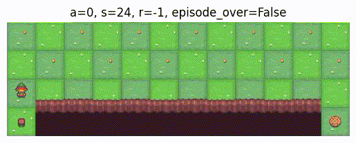
- 連続的な状態/行動の環境例：

    動画用にディレクトリを作ります：
    ```
    !mkdir anim2
    ```
    その後、環境 `"Pendulum-v1"` を呼び出して、適当に動かしてみる：
    ```python
    env = gym.make("Pendulum-v1", render_mode="rgb_array", g=9.81)
    env.reset()
    # 動画用カウンタ
    n=0

    episode_over = False
    while not episode_over:
        a = env.action_space.sample()
        s, r, terminated, truncated, info = env.step(a)
        episode_over = terminated or truncated

        # 動画用
        plt.axis("off")
        plt.title(f"a={np.round(a, 2)}, s={np.round(s, 2)}, r={np.round(r, 2)}, episode_over={episode_over}")
        plt.imshow(env.render())
        plt.savefig(f"anim2/{n:03}.jpg", bbox_inches="tight")
        n+=1
        if n > 50: # この環境は（多分）終わらないので適当に終わらせる
            break

    env.close()
    ```
    この動きの動画作成：
    ```
    !ffmpeg -r 16 -i anim2/%03d.jpg sample2.gif 
    ```
    > 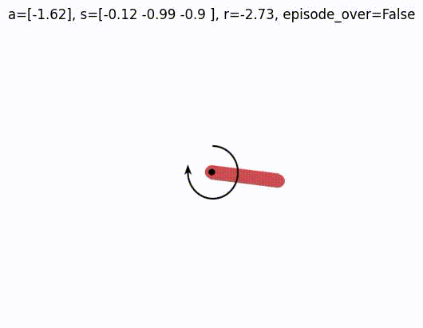


$\blacksquare$ **練習問題1:** 以下の環境を自分で動かしてみてください。具体的には以下のプログラムを動かして、どういう振る舞いをするか確認してみてください：
```python
env = gym.make('CliffWalking-v0', render_mode="rgb_array")
env.reset()

str2action = {"up":0, "right":1, "down":2, "left":3}

print("initial:")
plt.axis("off")
plt.imshow(env.render())
plt.show()

episode_over = False
while not episode_over:
    a = int(input(f"{str2action}\n"))               # ユーザー入力
    s, r, terminated, truncated, info = env.step(a)
    episode_over = terminated or truncated
    # プロット
    plt.axis("off")
    plt.title(f"a={a}, s={s}, r={r}, episode_over={episode_over}")
    plt.imshow(env.render())
    plt.show()

env.close()
``` 
> [!TIP]
> <details>
> <summary>解答例</summary>
> 
> 崖に落ちると $`r=-100`$ となるのがわかると思います。
> </details>

### 空間クラス

`gym.spaces` 以下のクラスを使います。以下ではいくつかの具体例を紹介しますが、もっと沢山あるので、どのようなものが用意されているかはドキュメントをみてください：
- https://gymnasium.farama.org/api/spaces/

といっても、他にあるのはベクトル化した離散値などで、基本的には以下の例の組み合わせのようなものになっていると思います。

#### 離散値の集合 `Discrete`

数学的に書くと以下のように、有限集合を表すオブジェクトを生成するクラスです:

```math
\{N_\text{start}, N_\text{start}+1, N_\text{start}+2, \dots, N_\text{start} + n \}
```

作成方法：
```python
# それぞれの引数はクラス変数として格納される
space = gym.spaces.Discrete(n, start, 
                            seed)     # seed は指定しなくても良い
```
この集合から確率分布 $`p`$ を指定してサンプルすることができます：
```python
# space 作成時の seed が使用される
p = np.array([p1, p2, ..., pn]) # 確率値の設定
space.sample(probability=p)    # 返り値がサンプル、pがない場合は一様サンプル？
```
マスクをかけたりもできるようです。

#### 連続値の集合 `Box`

数学的には以下のように、適当な次元のユークリッド空間の中の箱状の部分集合を表すオブジェクトを生成するクラスです:

```math
[x^\text{low}, x^\text{high}]^D \subset \mathbb{R}^D
```

作成方法：
```python
# それぞれの引数はクラス変数として格納される
space = gym.spaces.Box(low,           # -np.inf も使える
                       high,          # np.inf も使える
                       shape,         # D に当たる部分
                       seed)          # seed はなくて良い
```
基本は `low`, `high` を 1つの数 で指定し、`shape = (D,)` と指定すしますが、`low`, `high` を配列にして、次元ごとに最大値と最小値を変えることもできます。

こちらも `space.sample()` がサポートされており、どのような箱を設定したかでサンプルの際の確率分布のデフォルトが異なります。例えば `low = -np.inf`, `high=np.inf` の場合はガウス分布からのサンプリングになります。

マスクや確率分布をこちらから勝手に選ぶことはできないようです。


#### 文字列の集合 `Text`

数学的には以下のように、与えられた文字の集合から作られる可能な文字列の集合を表すオブジェクトを生成するクラスです:

```math
\cup_{i=\text{min\_length}}^\text{max\_length} \{ \text{文字の種類}\}^i
```

作成方法：
```python
# それぞれの引数はクラス変数として格納される
space = gym.spaces.Text(min_length, max_length, 
                        charset)   # なくても良い、ない場合は数字とアルファベット大文字＋小文字になる模様
```
`charset` が文字の種類を表す。通常の python の文字列で指定可能ですが、重複があると `space.sample()` でエラーが出るので、文字列をpythonの組み込み関数 `set()` で包んで `set("文字列")` としておくと良いです。

これも `sample()` でランダムサンプルできるようです。確率分布をこちらで設定するオプションもあるようです。マスクも可能なようです。

$\blacksquare$ **練習問題2:** 有限集合 $`\{0, 1, 2\}`$ を表す オブジェクトを作って、その上から確率 $`p(0)=0.1, p(1)=0.2, p(2)=0.7`$ でサンプリングしてください。
> [!TIP]
> <details>
> <summary>解答例</summary>
> 
> 丁寧に作ると以下のようになります：
> ```python
> space = gym.spaces.Discrete(start=0, n=3, seed=0)
> ```
> サンプリングは
> ```python
> p=np.array([0.1, 0.2, 0.7])
> space.sample(probability=p)
> ```
> > ```
> > np.int64(2)
> > ```
> で良いですが、numpyからやる方がいい気がします：
> ```python
> rng = np.random.default_rng(seed=0)
> rng.choice(np.arange(space.n), p=p)
> ```
> > ```
> > np.int64(2)
> > ```
> </details>

$\blacksquare$ **練習問題3:** 
> [!TIP]
> <details open>
> <summary>解答例</summary>
> 
> </details>

### 環境クラス

環境オブジェクトの役割は、適当な設定のマルコフ決定過程の環境側の振る舞いを提供することです。

#### 用意されている環境クラス

環境オブジェクトを作成するには以下のようにします：
```python
env = gym.make('環境名-バージョン', render_mode='human/rgb_array/ansi')
```

用意されている環境には以下の種類があります（`環境名-バージョン`は各リンク先を参照してください）：
- デフォルト設定だけで使える環境
    - Classic control: https://gymnasium.farama.org/environments/classic_control/
        - 振り子などの簡単な物理系の制御をする環境
    - Toy Text: https://gymnasium.farama.org/environments/toy_text/
        - 離散状態、離散行動の簡単な環境
- 追加で設定が必要なもの
    - Box2D: https://gymnasium.farama.org/environments/box2d/
        - 2次元の物理シミュレーション環境
        - 別ライブラリ `swig` を使用するため、以下のようにpython環境の修正が必要です：
            ```python
            !pip install swig
            !pip install gymnasium[box2d]
            ```
    - MuJoCo: https://gymnasium.farama.org/environments/mujoco/
        - 3次元の物理シミュレーション環境
        - 使うには以下のようにpython環境の修正が必要です：
            ```python
            !pip install gymnasium[mujoco]
            ```
            ですが、Google Colabからは画像化が難しいようです。環境そのものは使えると思います。
    - Atari: https://gymnasium.farama.org/environments/atari/ (元になっているurlにリダイレクトされます)
        - Atariのゲーム環境
        - 一旦別ライブラリを読み込んでから `gym` に読み込み直す必要があります：
            ```python
            import ale_py
            gym.register_envs(ale_py)
            ```
            この後、環境作成の際の `環境名-バージョン` は `ALE/環境名-バージョン` と指定します。


##### 環境のクラス変数

`env` にはいくつか重要な内部変数があります。
- `env.action_space`：空間クラスのオブジェクトで、取り得る行動 $`a`$ の集合を表します。
- `env.observation_space`：空間クラスのオブジェクトで、観測可能な状態 $`s`$ の集合を表します。（$`o`$ と書いた方が良いかもですが。）

他にも `env.render_mode` という変数が可視化の際に使われますが、それは後で説明します。
- 例：
    ```python
    env = gym.make('CliffWalking-v0')
    ```
    は冒頭で紹介した離散行動、離散状態の環境で、マルコフ決定過程のサンプル例は以下のようになっています：
    > 

    これの行動空間、状態空間を見てみると
    ```python
    env.action_space, env.observation_space
    ```
    > ```
    > (Discrete(4), Discrete(48))
    > ```

    となっており、行動が4つ（↑↓→←）、状態が48個（崖を含めて縦4マス $`\times`$ 横12マス ＝48マス）であることが確認できます。　アブメーションから、左上から右に順に状態 $`s`=$ 0,1,...11と割り振られて、突き当たりまでいけば一個下の一番左にとんで 12, 13,...という割り振りになっていることもわかります。
- 例：
    ```python
    env = gym.make("Pendulum-v1", render_mode="rgb_array", g=9.81)
    ```
    は冒頭の例に続いて紹介した振り子の環境で、マルコフ決定過程のサンプル例は以下のようになっています：
    > 

    これの行動空間、状態空間を見てみると
    ```python
    env.action_space, env.observation_space
    ```
    > ```
    > (Box(-2.0, 2.0, (1,), float32), Box([-1. -1. -8.], [1. 1. 8.], (3,), float32))
    > ```

    となっており、行動集合は $`[-2, 2]`$ の実数1次元、状態集合は $`[-1, 1] \times [-1, 1] \times [-8, 8]`$ の実数3次元になっていることがわかります。アニメーションをみると、行動はどうやら「どれくらいのトルクを与えるか」に対応しており1次元で、状態はすぐにはわかりませんが、公式ドキュメント
    - https://gymnasium.farama.org/environments/classic_control/pendulum/

    を読みに行くと、x座標、y座標、角速度に対応していることがわかります。

##### 使い方

マルコフ決定過程

```math
\begin{array}{cccccc}
*\overset{P_\text{env}^\text{init}}{\longrightarrow} (s_0 & \overset{\pi}{\longrightarrow} & a_0) & \overset{P_\text{env}}{\longrightarrow} & (s_1 & \overset{\pi}{\longrightarrow} & a_1) & \overset{P_\text{env}}{\longrightarrow} & (s_2 & \overset{\pi}{\longrightarrow} & a_2) & \overset{P_\text{env}}{\longrightarrow} & \cdots
\\
&&& \searrow &&&& \searrow &&&& \searrow 
\\
&&&& r_1 &&&& r_2 &&&& \cdots
\end{array}
```

を動かす上で必要なのは2つだけで、
- 環境のリセット $`\quad *\overset{P_\text{env}^\text{init}}{\longrightarrow}s_0`$：
    ```python
    env.reset()
    # 返り値は
    # s, info
    ```
- 環境の1ステップ更新 $`\quad \begin{array}{cccccc}
(s_t, a_t) & \overset{P_\text{env}}{\longrightarrow} & s_{t+1} 
\\
& \searrow 
\\
&& r_{t+1} 
\end{array}`$：
    ```python
    env.step(a) # s は envの内部に記録されている
    # 返り値は
    # s, r, terminated(真偽値), truncated(真偽値), info
    ```

です。公式ドキュメントだと state ではなく observation と書いてありますが、それは 部分観測MDP 
- https://ja.wikipedia.org/wiki/%E9%83%A8%E5%88%86%E8%A6%B3%E6%B8%AC%E3%83%9E%E3%83%AB%E3%82%B3%E3%83%95%E6%B1%BA%E5%AE%9A%E9%81%8E%E7%A8%8B

も取り扱えるようにしているためです。実際、環境によってはマルコフ的と見做せないものもあるかもしれませんが、ここではあまり深く考えないことにします。


なお、`env.close()` というので環境を閉じられるらしいですが、これは機能しない？

##### レンダリング（可視化）のやり方

数値的にはこれまでの説明で十分なのですが、実際に今どのような状態にエージェントがいるのかを可視化することは、強化学習がうまく行っているかどうかを確認するためには重要です。可視化は
```python
env.render()
```
を呼ぶことで可能になりますが、その際にどのような形態の可視化が取られるかは、環境オブジェクト作成時 `env = gym.make()` に渡すオプション変数 `render_mode='human/rgb_array/ansi'` のどれを指定したかによります。
- `'human'`
    - 人間がリアルタイムに観察するための別ウインドウが開かれます。ローカル環境でないと使用は難しい？
- `'rgb_array'`
    - RGB画像をnumpy配列として現在の状態を出力。`plt` で使用可能な配列が返ってくるので、Google Colabでは最適。使用する際は
        ```python
        plt.imshow(env.render())
        ```
- `'ansi'`
    - 文字列を返して、ASCIIアートのような感じで可視化します。使用する際は
        ```python
        print(env.render())
        ```

となっています。

これで最初の **基本的な使い方** で出てきたものは全て説明したことになります。

- 例：CliffWalking
    - 環境の作成
        ```python
        env = gym.make('CliffWalking-v0', 
                    render_mode="rgb_array") # 後で図示するため
        ```
        は冒頭で紹介した離散行動、離散状態の環境です。
    - 環境のリセット

        `reset()`してから `render()` してみます：
        ```python
        s, info = env.reset()
        # レンダリング
        plt.title(f"s={s}, info={info}")
        plt.imshow(env.render())
        ```
        > 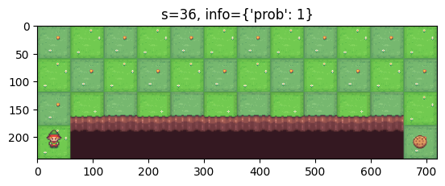
        座標は左上から右に向かって0,1,2,... と増えてゆくので、小人のようなエージェントが配置されている位置は 36 に対応するはずで、`s` にはその値が実際に入っていることがわかります。`info` には何か辞書オブジェクトが入っているようです。
    - 環境のステップ

        適当な行動を選んで、`env.step(a)` をしてみます：
        ```python
        a = 0 # 0は↑に対応
        s, r, terminated, truncated, info = env.step(a)
        # レンダリング
        plt.title(f"a={a}, s={s}, r={r}, terminated={terminated}, truncated={truncated}, info={info}")
        plt.imshow(env.render())
        ```
        > 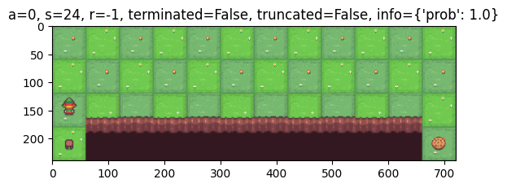
        エージェントが1マス上に上がったことがわかります

- 例：Pendulum
    - 環境の作成
        ```python
        env = gym.make('Pendulum-v1', 
                    render_mode="rgb_array") # 後で図示するため
        ```
        は冒頭の例に続いて紹介した振り子の環境です。
    - 環境のリセット

        `reset()`してから `render()` してみます：
        ```python
        s, info = env.reset(seed=1)  # ここで引数 `seed` を指定しないと毎回異なる結果
        # レンダリング
        plt.title(f"s={s}, info={info}")
        plt.imshow(env.render())
        ```
        > 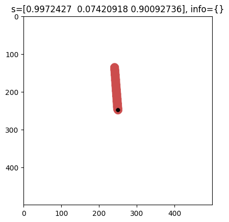
        `info` には何も入っていないようです。
    - 環境のステップ

        適当な行動を選んで、`env.step(a)` をしてみます：
        ```python
        a = np.array([1.3])
        s, r, terminated, truncated, info = env.step(a)
        plt.title(f"a={np.round(a, 3)}, s={np.round(s, 3)}, r={np.round(r, 3)}, terminated={terminated}, truncated={truncated}, info={info}")
        plt.imshow(env.render())
        ```
        > 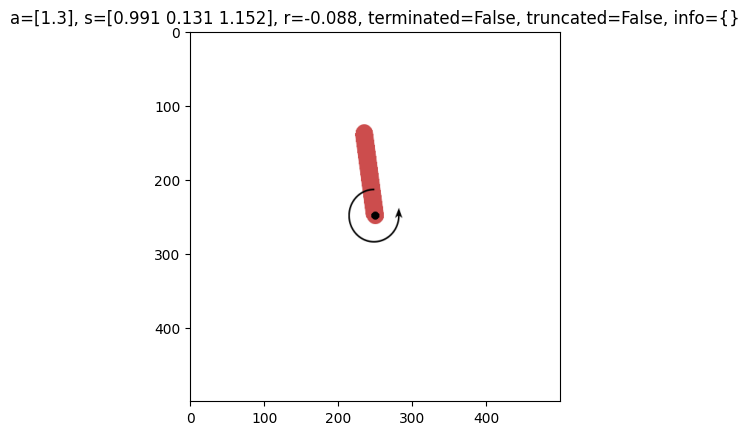

        トルクがかかって少し振り子の傾きが変わっているようです。

$\blacksquare$ **練習問題4:** 以下の環境
```python
env = gym.make('FrozenLake-v1', map_name="8x8",  # "4x4" でも良いです
               render_mode="rgb_array")

env.reset()
plt.imshow(env.render())
``` 
> 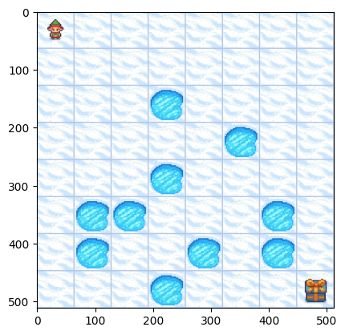

において、`env.action_space` から各時刻でランダムサンプルすることで、1エピソードを経過させてください。

> [!TIP]
> <details>
> <summary>解答例</summary>
> 
>アニメーションにしてみます。まず、gif作成用のディレクトリ作成：
>```
>!mkdir anim3
>```
>この元で以下が解答例です：
>```python
>n=0
>rng = np.random.default_rng(seed=1)
>
>episode_over = False
>while not episode_over:
>    a = rng.choice(np.arange(env.action_space.n) + env.action_space.start)
>    s, r, terminated, truncated, info = env.step(a)
>    episode_over = terminated or truncated
>    # 動画用
>    plt.axis("off")
>    plt.title(f"a={a}, s={s}, r={r}, episode_over={episode_over}")
>    plt.imshow(env.render())
>    plt.savefig(f"anim3/{n:03}.jpg", bbox_inches="tight")
>    n+=1
>
>env.close()
>```
>gifアニメとして可視化してみます：
>```
>!ffmpeg -r 4 -i anim3/%03d.jpg sample3.gif 
>```
>> 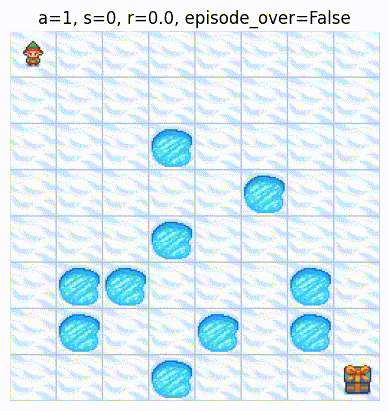
>
>残念ながら池に落ちてしまいました。
>
> </details>

$\blacksquare$ **練習問題5:** 以下の環境
```python
env = gym.make('Acrobot-v1', 
               render_mode="rgb_array")

env.reset(seed=1)
plt.imshow(env.render())
```
> 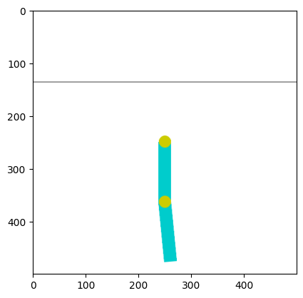
において、`env.action_space` から各時刻でランダムサンプルすることで、50回程度環境を動かしてください。

> [!TIP]
> <details>
> <summary>解答例</summary>
> 
>アニメーションにしてみます。まず、gif作成用のディレクトリ作成：
>```
>!mkdir anim4
>```
>この元で以下が解答例です：
>```python
>n=0
>rng = np.random.default_rng(seed=1)
>
>episode_over = False
>while not episode_over:
>    a = rng.choice(np.arange(env.action_space.n))
>    s, r, terminated, truncated, info = env.step(a)
>    episode_over = terminated or truncated
>    # 動画用
>    plt.axis("off")
>    plt.title(f"a={np.round(a, 2)}, s={np.round(s, 2)}, r={np.round(r, 2)}, episode_over={episode_over}")
>    plt.imshow(env.render())
>    plt.savefig(f"anim4/{n:03}.jpg", bbox_inches="tight")
>    n+=1
>    if n > 50:
>      break
>
>env.close()
>```
>gifアニメとして可視化してみます：
>```
>!ffmpeg -r 16 -i anim4/%03d.jpg sample4.gif
>```
>> 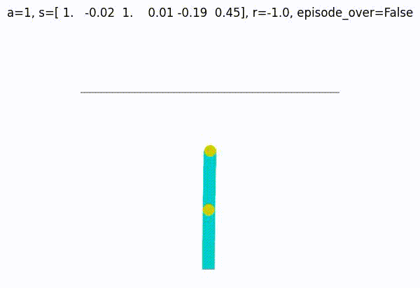
> </details>

#### 環境クラスを自作する

`gym`のクラスを継承して環境クラスを自作することができます。ここでは最低限のことだけ説明するので、詳しくは以下を参照してください：

- https://gymnasium.farama.org/introduction/create_custom_env/

##### 最低限必要な変数/メソッドの雛形

```python
class MyEnv(gym.Env):
    def __init__(self):
        self.action_space = gym.spaces.空間名()
        self.observation_space = gym.spaces.空間名()
    
    def reset(self, seed, options):
        # self.np_random: np.random._generator.Generator を設定する
        super().reset(seed=seed) 
        self._internal_s = ...   # 内部状態、self.observation_space の要素にしておく
        info = {...}             # info は 辞書オブジェクトにする
        return self._internal_s, info

    def step(self, a):
        # ランダム処理には self.np_random を使う
        self._internal_s = ... # 状態更新
        r = ...                # float 
        terminated, truncated, info = ... # info は 辞書オブジェクトにする
        return self._internal_s, r, terminated, truncated, info
```

これに加えて `self.render()` も作っておくと良いかと思います。その際は `self.__init__()` で `render_mode` を引数で受け入れるようにして、これが `"human/rgb_array/ansi"` の際の処理を書いておくのが良いでしょう。

##### `gym` に読み込む

作成した環境クラスは
```python
env = MyEnv()
```
と普通に作っても良いですが、推奨なのは以下のコマンドに読み込ませて：
```python
gym.register(
    id="my_envs/自作環境名-バージョン",
    entry_point=MyEnv,
)
```
これを実行したのちは、
```python
env = gym.make("my_envs/自作環境名-バージョン")
```
のように、デフォルト環境と同様の呼び出し方で環境作成するのがお作法のようです。このようにしておくと並列化などの恩恵を受けられるようです。自作環境を作成する際は、この手続きでエラーが出ないようにしておくと後々便利かと思います。


## `pettingzoo`

Gymnasium では基本的には単一のエージェントを想定しています。すなわち、シングルエージェント強化学習のためのライブラリと言えます。エージェントが多数存在するマルチエージェント強化学習を実装したい場合の環境ライブラリがこの PettingZoo です。公式ドキュメントは以下です：

- https://pettingzoo.farama.org/

### 基本的な使い方

基本的には1エピソード以下のフォーマットです：
```python
from pettingzoo.xxx import 環境名

env = 環境名.env(render_mode="human/rgb_array/ansi")
env.reset()

# ここから
for agent in env.agent_iter():
    obs, r, termination, truncation, info = env.last()

    if termination or truncation:
        a = None
    else:
        a = agentの行動()

    env.step(a)
# ここまでで1エピソード
env.close()
```
Gymnasiumと比べて変更点は以下です：
- 1エピソードのループが `while` ではなく、`for` 文になっていて、`env.agent_iter()` というイテレータで回っている
    - これは環境が勝手にどのエージェントの番かを判断し、その手番のエージェント情報をループ中に渡してくれるということです。ゲームが終了する場合は、その処理もこのイテレータが制御します。
- 各ステップで `env.last()` で、エージェントが行動選択する前に `s` と `r` を 得ている。
    - 特に `r` の方は手番のエージェントにとって「前回の行動」に対する報酬になっていることに注意
    - これと関連して、エピソードの終了が `termination`, `truncation` だけでは判別されていないのもポイントです。この仕様では、例えば勝利した瞬間の報酬が `for` ループの1回の処理中には得られず、次のエージェントの番でそれが `env.last()` で得られるということになっています。

例を見た方がわかりやすいかもしれません：

- 例：マルバツゲーム
    ```python
    from pettingzoo.classic import tictactoe_v3
    env = tictactoe_v3.env(render_mode="rgb_array")
    env.reset()

    rng = np.random.default_rng(seed=1)

    agt2stone ={"player_1":"x", "player_2":"o"}
    n = 1
    plt.figure(figsize=(20, 8))

    for agent in env.agent_iter():
        obs, r, termination, truncation, info = env.last()
        # ゲーム進行図用
        plt.subplot(3, 4, n)
        plt.title(f"n={n}, agent={agt2stone[agent]}, r={r}, termination={termination}")#, truncation={truncation}, info={info}")
        plt.axis("off")
        plt.imshow(env.render())

        if termination or truncation:
            a = None
        else:
            a = rng.choice(np.arange(9)[np.ones(9)==obs['action_mask']])

        env.step(a)
        n+=1

    env.close()
    plt.show()
    ```
    > 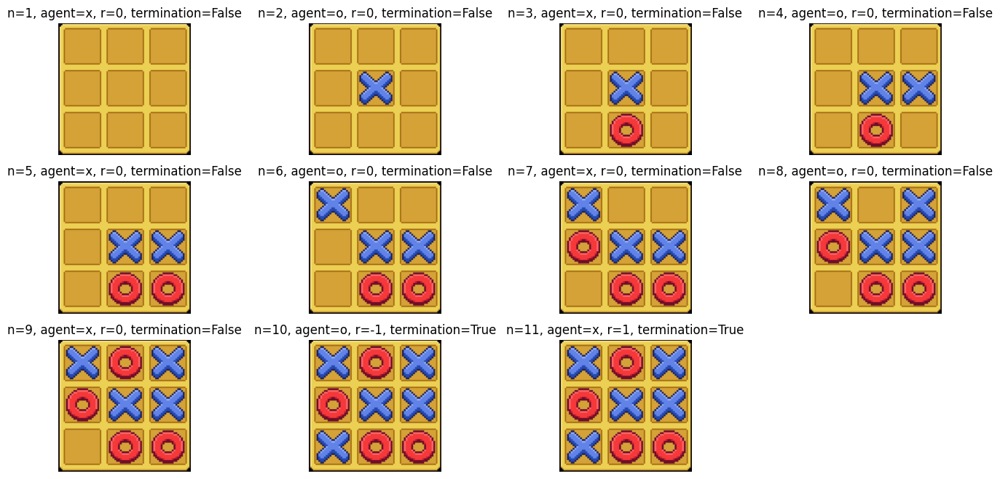

    `n=10` のループの時点で、ゲーム自体は終了(`termination = True`)していますが、ループ処理はもう一段 `n=11` の部分があるのがわかります。より詳しくは
    - `n=10` は マルの手番 (`agent = o`) だけど、打てるところがないので、負け `r=-1`
    - `n=11` は バツの手番 (`agent = x`) だけど、一個前ですでに決着はついていて、報酬だけもらっていないので `r=1`

### 環境クラス

空間クラスについては Gymnasium と同様のものが使えるようなので省略します。

#### 用意されている環境クラス

Gymnasium同様にいくつかデフォルトで対戦用の環境や協力用の環境が入っています。
- Atari (ゲーム): https://pettingzoo.farama.org/environments/atari/
- Butterfly (ゲーム): https://pettingzoo.farama.org/environments/butterfly/
- Classic (チェスなど): https://pettingzoo.farama.org/environments/classic/
- MPE (粒子を動かす環境): https://pettingzoo.farama.org/environments/mpe/
- SISL (協力タスク): https://pettingzoo.farama.org/environments/sisl/

Gymnasiumの時同様、場合によっては追加で何か入れる必要がありますが、詳細はリンク先を参考にしてください。

##### 重要なメソッド1: `env.agent_iter()`

これは主に `for` 分の中で以下のように使います：
```python
for agent in env.agent_iter():
    # この中で `agent` を呼ぶと、どのプレイヤーの番かを表す文字列が入る
    a = ...
    env.step(a) 
```
- 例：マルバツゲーム

    ```python
    from pettingzoo.classic import tictactoe_v3
    env = tictactoe_v3.env(render_mode="rgb_array")
    env.reset()

    rng = np.random.default_rng(seed=1)
    n = 1

    for agent in env.agent_iter():
        # ここで agent に何が入っているか表示
        print(f"n = {n}, agent = {agent} ({type(agent)})")

        obs, r, termination, truncation, info = env.last()
        if termination or truncation:
            a = None
        else:
            a = rng.choice(np.arange(9)[np.ones(9)==obs['action_mask']])
        env.step(a)
        n+=1

    env.close()
    ```
    > ```
    > n = 1, agent = player_1 (<class 'str'>)
    > n = 2, agent = player_2 (<class 'str'>)
    > n = 3, agent = player_1 (<class 'str'>)
    > n = 4, agent = player_2 (<class 'str'>)
    > n = 5, agent = player_1 (<class 'str'>)
    > n = 6, agent = player_2 (<class 'str'>)
    > n = 7, agent = player_1 (<class 'str'>)
    > n = 8, agent = player_2 (<class 'str'>)
    > n = 9, agent = player_1 (<class 'str'>)
    > n = 10, agent = player_2 (<class 'str'>)
    > n = 11, agent = player_1 (<class 'str'>)
    > ```
    このように、`player_1` か `player_2` が文字列として入っていることがわかります。

##### 重要なメソッド2: `env.last()`

PettingZooでは `env.step(a)` では返り値がない？ようです。代わりに `env.last()` で 状態や報酬を取得します。例えば2プレイヤーで互いに番が回ってくる場合：

```math
\begin{array}{cccccc}
*\overset{P_\text{env}^\text{init}}{\longrightarrow} \Bigg(s_{t=0} & \overset{\begin{pmatrix}\pi^\text{player\_1}\\-\end{pmatrix}}{\longrightarrow} & \begin{pmatrix}a_{t=0}\\ -\end{pmatrix}\Bigg) & \overset{P_\text{env}}{\longrightarrow} & \Bigg(s_{t=1} & \overset{\begin{pmatrix}-\\\pi^\text{player\_2}\end{pmatrix}}{\longrightarrow} & \begin{pmatrix}-\\ a_{t=1}\end{pmatrix}\Bigg) & \overset{P_\text{env}}{\longrightarrow} & \Bigg(s_{t=2} & \overset{\begin{pmatrix}\pi^\text{player\_1}\\-\end{pmatrix}}{\longrightarrow} & \begin{pmatrix}a_{t=2}\\-\end{pmatrix}\Bigg) & \overset{P_\text{env}}{\longrightarrow} & \cdots
\\
&&& \searrow &&&& \searrow &&&& \searrow 
\\
&&&& \begin{pmatrix}-\\r_{t=1}\end{pmatrix} &&&& \begin{pmatrix}r_{t=2}\\-\end{pmatrix} &&&& \cdots
\end{array}
```

この図の中で `env.step()` で $`\begin{array}{ccc}\overset{P_\text{env}}{\longrightarrow}\\\searrow\end{array}`$ が実行されたのち、$`s`$ と $`r`$ の観測に対応するのが `env.last()` です。

#### 環境クラスを自作する

こちらも環境自作が可能なようです。詳しくは
- https://pettingzoo.farama.org/content/environment_creation/

を参照してください。

[前のsection](4-1.md) | [次のsection](4-2.md)