# LaTeXコマンド入門

このノートでやること：


この図に出てくるコマンド、最低限必要なファイル等を説明します。

また、練習のためには Google Cloud Shell のエフェメラルモードでやると良いと思います。

## 基本事項

(La)TeXの文書をコンパイルする時、TeXShopなどのアプリケーションを使っていたとしても、背後ではコマンドが走っています。いくつかのコマンドがあり、その中でも基本的なものは以下です：
- tex系コマンド

    文書の本体を作成するコマンドで、これだけでもいろいろな種類がある
    ```bash
    tex系コマンド 文書名.tex
    ```
    - .dvi形式のファイルからpdfファイルに直すコマンド

        `tex系コマンド`での出力をpdf形式に変換するコマンド。現在では日本語環境では使う場合があるが、それ以外ではあまり使用しない？
        ```
        dvipdfm系コマンド dvi形式のファイル名
        ```
- bibtex系コマンド

    参考文献を自動化するコマンドで、必須ではないが使うと便利。こちらも種類がある。tex系コマンドと併用する
    ```bash
    bibtex系コマンド 文書名.tex
    ```

### ディストリビューションとTeXLive

このように、一口に(La)TeXコマンドといっても沢山あります。(La)TeX環境を作る際には「どのコマンドまで入れたら良いか？」というのが問題です。そこで
- ある程度の用途を想定して、必要そうなコマンド群をまとめたもの

があると、それをインストールすれば良いだけなので便利です。これを**ディストリビューション** と言います。

**TeXLive**
- 公式：https://www.tug.org/texlive/

は様々なディストリビューションを配賦しており、これらのディストリビューションはLinux/Unix系のパッケージマネージャー（[1-4参照](../section1/1-4.md)）で簡単にインストール/アンインストールすることができます。このノートではこのTeXLiveのディストリビューションを使います。

### Google Cloud Shell上で作成されたpdfファイルを見る方法

なお、Google Cloud Shell でpdfファイルを見るには、以下の2種類の方法があります：

1. ダウンロードする

    [1-1で説明した](../section1/1-1.md)エディタからのダウンロード：
    1. 右上の鉛筆のマークをクリックし、エディタを起動、ホームディレクトリを開く
    2. 対象のファイル（ディレクトリ中にある場合はディレクトリを展開して見つける）を右クリック
    3. ダウンロード

    することで確認してください（お手元のPCのダウンロードディレクトリがいっぱいになってしまったらすいません）。
2. サーバーを立ててそこにアクセスする

    ブラウザ経由でpdfファイルを見るには
    ```bash
    python3 -m http.server 8080 
    ```
    > ```
    > Serving HTTP on 0.0.0.0 port 8080 (http://0.0.0.0:8080/) ...
    > ```

    としたのち、`http://0.0.0.0:8080/`部分をクリックすると、ブラウザから Google Cloud Shell のディレクトリを読めるようになって、pdfファイルも開けるようになるはずです。
    > なお、このサーバーは実際には `https://ポート番号(8080)とランダムな文字列.cloudshell.dev/` のようなurlにアクセスしており、自身の Google Account にログインしないとアクセスできないようになっています
    >>参考：
    >> - https://cloud.google.com/shell/docs/using-web-preview?hl=ja
    >>
    >> によると、"These ports are only available to the secure Cloud Shell proxy service, which restricts access over HTTPS to your user account only." とあります。
    > 
    > 一応、セキュリティの観点から、確認したら \<control\>キー+\<C\>キーでサーバーを閉じるのがいいかと思います。

## `tex系コマンド`

(La)TeXの実行コマンドにはいくつか種類がありますが、このノートでは以下を紹介します：

||エンジン|マクロ|出力ファイル|コメント|
|--|--|--|--|--
|無印|`tex`|`latex`|.dvi形式|
|pdf+|`pdftex`|`pdflatex`|.pdf形式|スタンダード（2025年現在）
|xe+|`xetex`|`xelatex`|.pdf形式|`pdf(la)tex`の拡張、多言語出力
|lua+|`luatex`|`lualatex`|.pdf形式|`pdf(la)tex`の拡張、Lua拡張
|↓日本語専用
|p+|`ptex`|`platex`|.dvi形式|`(la)tex`の日本語拡張|
|up+|`uptex`|`uplatex`|.dvi形式|`p(la)tex`の拡張

> 参考文献：https://www.overleaf.com/learn/latex/Articles/What%27s_in_a_Name%3A_A_Guide_to_the_Many_Flavours_of_TeX

- `tex`（エンジン） と `latex`（マクロ） の差
    - `tex` のカラムにあるコマンドは、それぞれの行の基本コマンドです。
    - `latex` のカラムにあるコマンドは、基本コマンドによる命令をよく使う形式でまとめたもので、通常用途ではこちらを使うので十分だと思います。
    - ですので、**このノートでは実践では全て `latex` を使います**。
- 出力形式について
    - .dvi形式：DeVice Independent の略。昔はデバイス（PCの種類など）によって文書の表示方法が異なっていたので、どのデバイスでも同じ形式で文書データを出力する用途で使われた。（.dvi形式のファイルの取り扱いは後半の日本語環境の部分で説明します。）
    - .pdf形式：2025年現在では、「デバイスに依存しない文書形式」のスタンダードはpdfになったため、こちらを使うことの方が多い。

### 直接pdfを作成するコマンド (`pdflatex`/`xelatex`/`lualatex`)

初めの図は色々ごちゃごちゃしているので、まずは一番シンプルな



の使い方から始めます。なお、図では `pdftex系コマンド` と書いていますが、ここでは実用性を重視して `pdflatex系` コマンドを説明します。また、図では `文書.pdf` のみ作成されているように描いていますが、実際には別のファイルも作成されます。そのあたりは必要に応じてコメントします。

#### インストール

コマンドが使えなければ練習できないので、TeXLiveから何らかのディストリビューションを入手します。ここでは Linux 環境を想定し、`apt`（[1-4参照](../section1/1-4.md)）を使ってインストールします。以下のようにして様々なディストリビューションを入れることができます：
> 一応、こういう時は `apt` をアップデートするのが良いですが、スキップします

- `pdflatex`まで
    ```bash
    sudo apt install texlive-latex-base
    ```
- `xelatex`
    ```bash
    sudo apt install texlive-xetex
    ```
- `lualatex`
    ```bash
    sudo apt install texlive-luatex 
    ```

以下、`pdflatex` コマンドで解説しますが、`xelatex`/`lualatex` （できることが増える）でも概ね同様です。

#### 使い方

コンパイルの基本コマンドは以下です：

```bash
pdflatex [オプション] 文書名.tex
```

`[オプション]` 部分は [1-2参照](../section1/1-2.md) で説明しているコマンドのオプション部分に当たります。また、[1-2参照](../section1/1-2.md) の説明でのコマンド引数はこの場合は `文書名.tex` となります。

代表的な `[オプション]` については `-help`/`--help` のオプションでコマンド実行することで見ることができますが、有用なものを以下にまとめておきます。

##### エラー周辺のオプション

|`[オプション]`|効果|`[x]`
|--|--|--|
|`-interaction=[x]`|実行時のエラー処理/画面出力を指定する|<table><tbody><tr><td></td><td>エラー</td><td>逐次出力</td></tr><tr><td>`batchmode`</td><td>停止しない</td><td>なし</td></tr><tr><td>`nonstopmode`</td><td>停止しない</td><td>あり</td></tr><tr><td>`scrollmode`</td><td>ファイルがない場合<br>一旦停止</td><td>あり</td></tr><tr><td>`errorstopmode`</td><td>一旦停止</td><td>あり</td></tr></tbody></table><blockquote>上の表だけだと違いが明確でないので、詳細は例えば https://tex.stackexchange.com/questions/91592/where-to-find-official-and-extended-documentation-for-tex-latexs-commandlin など参照のこと</blockquote>
|`-halt-on-error`|エラーが起こったら強制停止させる
|`[-no]-file-line-error`|エラーが起こった際のログに「ファイルの何行目でエラーが起こったか」の情報を出すかどうか指定する。|<table><thead><tr><th>`-no`が</th><th>エラー表示</th></tr></thead><tbody><tr><td>あり</td><td><code>! LaTeX Error: xxxxx</code></td></tr><tr><td>なし</td><td><code>パス:行数: LaTeX Error: xxxxx</code></td></tr></tbody></table>

##### 出力ファイル制御のオプション

|`[オプション]`|効果|
|--|--|
|`-jobname=[ファイル名]`|コンパイルで生成されるファイル名を指定する|``
|`-output-directory=[ディレクトリパス]`|`[ディレクトリパス]`で指定したディレクトリに生成されるファイルが全て入る|``
|`-draftmode`|pdfファイルが生成されなくなる（.logや.auxは生成される）

##### 機能拡張のためのオプション

|`[オプション]`|効果|`[x]`
|--|--|--|
|`-synctex=[x]`|tex文書とpdfファイルの同期に使う"xxx.sync"というファイル作成に関して|`0`: 無効<br>`1`: 有効（ファイル圧縮）<br>`-1`: 有効（ファイル圧縮しない）
|`[-no]-shell-escape`|コンパイル時にtex文書内で使うパッケージによっては、外部コマンドの実行が必要なものがある。しかし外部コマンド実行はセキュリティリスクになるため、可能か不可能かをこのオプションで設定できる。|<table><thead><tr><th>`-no`が</th><th>コンパイルの時に他のシェルコマンドの実行を</th></tr></thead><tbody><tr><td>あり</td><td>許さない</td></tr><tr><td>なし</td><td>許す（セキュリティに注意）</td></tr></tbody></table>


$\blacksquare$ **練習問題1:** まずは何はともあれ、コマンド実行してpdfファイルを作成してみてください。以下の内容の "test.tex" ファイルを作成したのち、`pdflatex` でコンパイルしてください。

```tex
\documentclass{article}

\begin{document}

Hello, world! \LaTeX!

\end{document}
```

> [!TIP]
> <details>
> <summary>解答例</summary>
> 
>とりあえずファイルが沢山できるので、練習用のディレクトリを別個に作りましょう：
>```bash
>mkdir ~/exercise1
>cd ~/exercise1
>```
>こののち、`nano`などのコマンドか、あるいは Google Cloud Shell 上であればシェル外部のテキストエディタ （[1-1参照](../section1/1-1.md)） を用いて、問題文にある内容のファイルを "test.tex" という名前で保存します。その後
>```bash
>pdflatex test.tex
>```
>> ```
>> # なんか色々出るのち
>> Output written on test.pdf (1 page, 21783 bytes).
>> Transcript written on test.log.
>> ```
>のようになればOKです。
>この状態でカレントディレクトリの構成を見てみます：
>```bash
>ls
>```
>> ```
>> test.aux  test.log  test.pdf  test.tex
>> ```
>確かに "test.pdf" が作成されています。
> </details>

$\blacksquare$ **練習問題2:** 練習問題1の解答例のようにコマンドを通常実行すると、沢山ファイルができて混乱するかもしれません。そこでオプションを使って、適当なディレクトリにtex文書ではない生成物は全てそのディレクトリに入るようにしてください。
> [!TIP]
> <details>
> <summary>解答例</summary>
> 
>練習問題1をやった後だと違いが分かりづらいので、一旦別のディレクトリに移りましょう：
>```bash
>mkdir ~/exercise2
>cd ~/exercise2
>```
>ここで練習問題1と同様に "test.tex" ファイルをこの中に作ります。その後
>```bash
>mkdir files                                # このディレクトリに生成物を入れることにする
>pdflatex -output-directory=files test.tex  # -output-directory="ディレクトリ名" で指定
>```
>> ```
>> # なんか色々出る
>> Output written on files/test.pdf (1 page, 21783 bytes).
>> Transcript written on files/test.log.
>> ```
> 最後のメッセージが少し変化したのに注意。この状態でカレントディレクトリの構成を見てみます：
>```bash
>ls
>```
>> ```
>> files  test.tex
>> ```
>このように、生成ファイルは見当たりませんが、"files"ディレクトリを見てみると：
>```bash
>ls files
>```
>> ```
>> test.aux  test.log  test.pdf
>> ```
>となって、生成物が入っているのが分かります。
> </details>

$\blacksquare$ **練習問題3:** 以下のtex文書を `pdflatex` でコンパイルしようとすると、エラーが出ます。

```tex
\documentclass{article}

\begin{document}

Hello, world! \LaTeX!
こんにちは！

\end{document}
```

この際、
1. コンパイル時にエラー箇所で実行が止まる（一時停止ではなく完全に止まる）ようにしてください
2. エラーメッセージに、上の文書の何行目の指示でエラーが出たかを表示させてください
3. エラーを無視してともかくコマンド実行が終了するようにしてみてください

> [!TIP]
> <details>
> <summary>解答例</summary>
> 
>まずは環境を分けます
>```bash
>mkdir ~/exercise3
>cd ~/exercise3
>```
>このディレクトリに "error_test.tex" の名前で問題文のテキストを書き込みます。まず、コンパイル時にエラー箇所で止まるようにするには以下です：
>```bash
>pdflatex -halt-on-error error_test.tex
>```
>> ```
>> # なんか色々出たのち
>> !  ==> Fatal error occurred, no output PDF file produced!
>> Transcript written on error_test.log.
>> ```
>となって、コマンド実行自体がここで止まります。メッセージ通りpdfファイルは作成されていないはずです。このメッセージの上部にエラー箇所が出ているとは思いますが、**何行目か**を出させてみるには以下のオプションでした（`-halt-on-error`も一緒に）：
>```bash
>pdflatex -file-line-error -halt-on-error error_test.tex
>```
>> ```
>> # なんか色々出たのち
>> ./error_test.tex:6:  ==> Fatal error occurred, no output PDF file produced!
>> Transcript written on error_test.log.
>> ```
>と出ます `Fatal error occurred` のメッセージの前の表示が変わっていることに注意してください。これでどのファイルの何行目でエラーが発生したかが分かります。
>
>最後に、エラー無視ですが `-interaction=nonstopmode` のオプションで良いはずです。
>
>```bash
>pdflatex -interaction=nonstopmode error_test.tex
>```
>> ```
>> # なんか色々出たのち
>> Output written on error_test.pdf (1 page, 21783 bytes).
>> Transcript written on error_test.log.
>> ```
>ともかくpdfファイルができたことがわかります。デフォルトの`pdflatex`は日本語を取り扱えないはずなので、日本語はpdfファイルに反映されていないはずです（できたpdfファイルをみてみてください）。このように`-interaction=`のオプションを使うとエラーが起こった際に止まるか、止まらずに最後まで実行するか選べます。
> </details>

### 日本語

日本語環境をまとめたのが以下です：


- 1.直接pdfを作成するコマンド (`xelatex`/`lualatex`) + 日本語フォント
    - .tex → .pdf
- 2.`uplatex`/`platex` (`uptex`/`ptex`)
    - .tex → .dvi
    - `dvipdfmx` で .dvi → .pdf に変換する必要あり
- 2'.`ptex2pdf`
    - .tex → .dvi → .pdf
    - `uplatex`/`platex` + `dvipdfmx` (2をまとめたもの)

ここでは純粋にコマンドのことだけ説明します。

> - 実際には、1と2系では日本語フォントの取り扱いが違うため、tex文書の中身が関係してきます。
> - TeXの日本語パッケージによってはどちらかしか通らないとかはあるので、日本語環境でハマった時は使っているパッケージとの依存関係を調べるのが良いです。

#### インストール

どれを使うにしても、以下をインストールしておくと良いと思います。

```bash
sudo apt install texlive-lang-japanese
```

これで `uplatex`/`platex` コマンド、`ptex2pdf` コマンドが入るはずです。
> なお、`lualatex`を使う場合でもこれを入れないと日本語出力されないようです。`xelatex` はなくても良さそうです。

#### 1.直接pdfを作成するコマンド (`xelatex`/`lualatex`) + 日本語フォント

使用するには `xelatex`/`lualatex` のいずれかのコマンドが使えることが前提です。

##### 使い方

tex文書の方の書き方で、日本語の埋め込みなどが必要。この辺りは色々な設定があるようなのですが、以下で最低限の動作は確認しました：

- `xelatex`の場合：以下を追加
    ```tex
    \usepackage{xeCJK}
    ```
- `lualatex`の場合：以下を追加
    ```tex
    \usepackage{luatexja}
    ```


#### 2.一旦dviを作成するコマンド `platex`/`uplatex`

`pdftex` ではなく、`tex`/`latex`コマンドを日本語拡張したもの。

##### 使い方

```bash
platex [オプション] 文書名.tex
# あるいは
uplatex [オプション] 文書名.tex
```

代表的な `[オプション]` については `-help`/`--help` のオプションでコマンド実行することで見ることができます。`pdflatex`/`xelatex`/`lualatex` の説明で紹介したオプションは全て使えますが、日本語特有の漢字のオプションがあるのを覚えておくと良さそうです。

###### 漢字のオプション

|`[オプション]`|効果|`STRING`
|--|--|--|
|`-kanji=STRING`|コンパイルするtex文書の文字コード|`euc`/`jis`/`sjis`/`utf8`
|`-kanji-internal=STRING`|出力される dvi 形式のファイルの内部コード| `euc`/`sjis`
           
###### `dvipdfmx`: dvi → pdf の変換

注意ですが、 `uplatex`/`platex` では **.dvi形式のファイルができ、.pdf形式のファイルはできません**。pdf にするには、できた dvi 形式のファイルを使って、別のコマンド

```bash
dvipdfmx [オプション] dvi形式のファイル名
```

を実行する必要があります。従って、こちらで日本語のpdfファイルを作成する場合は
1. `uplatex`/`platex` で .tex → .dvi に変換
2. `dvipdfmx` で .dvi → .pdf に変換

の2ステップを踏む必要があります。

#### 2'.dviを介して直接pdfを作成するコマンド `ptex2pdf`

これは内部で`uplatex`/`platex`+`dvipdfmx`が行われると理解しておけばOKだと思います。

##### 使い方

コマンドは

```bash
ptex2pdf -l [オプション] 文書名.tex
```
です。ここで `-l` は latex としてコンパイルするというオプションで、ここまでの例では全て latex コンパイルだったので、そのようにしています。`platex`/`uplatex`のどちらを内部で使うかもオプション引数から指定できるはずですが、ここではデフォルト設定を使います。

###### 内部の `platex`/`uplatex` に関するオプション

|`[オプション]`|効果
|--|--|
|`-ot "<オプション>"`|内部で動く `platex`/`uplatex` のオプション変数に `<オプション>` を渡す。`"`か`'` で囲った方が安全だが、なくても動く場合あり。

この `<オプション>` 部分には上で説明している通常のコマンドのオプションも使えます。ただ、最近では `-ot` で指定しなくても、直接 `ptex2pdf` のオプション指定として書いても大丈夫な（自動で内部のエンジンに渡す）ようです。

###### 内部の `dvipdfmx` に関するオプション

|`[オプション]`|効果
|--|--|
|`-od "<オプション>"`|内部で動く `dvipdfmx` のオプション変数に `<オプション>` を渡す。`"`か`'` で囲った方が安全だが、なくても動く場合あり。

`dvipdfmx` のオプションは説明していませんが、`dvipdfmx -help` などで見られます。

$\blacksquare$ **練習問題4:**  以下の日本語を含むtex文書を「修正」して`xelatex` あるいは `lualatex` で日本語が表示されたpdfファイルが出るようにしてください。

```tex
\documentclass{article}

\begin{document}

Hello, world! \LaTeX!
こんにちは！

\end{document}
```

> [!TIP]
> <details>
> <summary>解答例</summary>
> 
>`xelatex`の場合：
>```tex
>\documentclass{article}
>\usepackage{xeCJK}    % XeLaTeX 用
>
>\begin{document}
>
>Hello, world! \LaTeX!
>こんにちは！
>
>\end{document}
>```
>で良いはずです。
>
>`lualatex`の場合：
>```tex
>\documentclass{article}
>\usepackage{luatexja} % LuaLaTeX 用
>
>\begin{document}
>
>Hello, world! \LaTeX!
>こんにちは！
>
>\end{document}
>```
>で良いはずです。
>
> </details>

$\blacksquare$ **練習問題5:** 練習問題4の内容のtex文書から `uplatex`/`platex` + `dvipdfmx`でpdfファイルを作成してください。
> [!TIP]
> <details>
> <summary>解答例</summary>
> 
>練習問題のディレクトリを作ります：
>```bash
>mkdir ~/exercise5
>cd ~/exercise5
>```
>この状態で、カレントディレクトリに "test.tex" を作成し、以下を実行
>```bash
>uplatex test.tex
>```
>> ```
>> # 色々出る
>> Output written on test.dvi (1 page, 416 bytes).
>> Transcript written on test.log.
>> ```
>出力が "test.dvi" になっていることに注意です。実際pdfファイルはできていません：
>```bash
>ls
>```
>> ```
>> test.aux  test.dvi  test.log  test.tex
>> ```
>pdfファイルを作るには以下：
>```bash
>dvipdfmx test
>```
>> ```
>> test.dvi -> test.pdf
>> [1]
>> 4410 bytes written
>> ```
>これで日本語表記できているはずです。
> </details>

$\blacksquare$ **練習問題6:** 練習問題4の内容のtex文書から `ptex2pdf` でpdfファイルを作成してください。 
> [!TIP]
> <details>
> <summary>解答例</summary>
> 
>練習問題用のディレクトリを作ります：
>```bash
>mkdir ~/exercise6
>cd ~/exercise6
>```
>同様に "test.tex" を作って、今度は `ptex2pdf` を使います：
>```bash
>ptex2pdf -l test.tex # -l オプションに注意
>```
>> ```
>> # 色々出ます
>> Output written on test.dvi (1 page, 412 bytes).
>> Transcript written on test.log.
>> test.dvi -> test.pdf
>> [1]
>> 4408 bytes written
>> test.pdf generated by dvipdfmx.
>> ```
>こんなような感じで、`(u)platex`と`dvipdfmx`の両方のメッセージが出ます。
> </details>

### ログの読み方


ここまでのコマンドは実行すると全て `文書名.log` というファイルを同時に生成するはずです。このファイルの内容は オプションで`-interaction=batchmode` をつけない場合の標準出力とほぼ同じになっているはずで、
1. 最初に `This is ****TeX, Version **** 日付` のような基本情報
    - ここを見れば`tex系コマンド`として何が動いているかわかる。
    - ただし LaTeX などのマクロ情報ではなく、一番低いレイヤーでのエンジン情報が出るのに注意
2. 次に「どのファイルが読み込まれたか」の情報 `(./xxx.tex ...`
    - `\input{path}` などで別ファイルを埋め込んだりした場合も、全て表示されるはず？
3. コンパイル中の警告（`LaTeX Warning`と表示）や情報
4. エラー（`LaTeX Error`と表示）
    - オプションによって表示の詳細が異なる
5. ページ数や出力のファイル名 
    - `Output written on xxx.dvi (y page, zzz bytes).`
    - `Output written on xxx.pdf (y page, zzz bytes).`
6. 出力の統計情報

から構成されるようです。特にエラー処理をする場合に読むことが多いかと思いますが、その場合に「正しいファイルが読み込まれているか」を2のあたりでチェックしたり、どんなエラーがあるかをLinuxコマンドと併用して表示させたりすることが考えられます。

$\blacksquare$ **練習問題7:** 以下のtex文書

```tex
\documentclass{article}

\begin{document}

Hello, world! \LaTeX!
math $\mathbb{N}$

\end{document}
```

を `pdflatex -interaction=nonstopmode` でコンパイルすると、一応pdfファイルはできますが、何かがおかしいです。原因究明してください。
> [!TIP]
> <details>
> <summary>解答例</summary>
> 
>練習問題用のディレクトリ作成：
>```bash
>mkdir ~/exercise7
>cd ~/exercise7
>```
>ここで例によって "test.tex" を作成して、以下を実行します：
>```bash
>pdflatex -interaction=nonstopmode test.tex
>```
>> ```
>> # ともかく実行でき、pdfファイルもできる
>> ```
>エラーがないかチェックしてみます。エラー表示指定をしない場合はエラーメッセージは `!` から始まるため、以下でチェックできます：
>```bash
>cat test.log | grep ! 
>```
>> ```
>> ! Undefined control sequence.
>> ```
>このメッセージが出ている周辺を見れば大体のことはわかるはずですが、具体的に何行目のtexコードがまずいかみるには、`pdflatex` 実行で `-file-line-error` を入れれば良いです：
>```bash
>pdflatex -file-line-error -interaction=nonstopmode test.tex 
>```
>> ```
>> # 実行できる
>> ```
>`-file-line-error`オプションを指定した場合のエラーの出方は `!` ではないですが、`Undefined control sequence` は出るので、これで検索してみます：
>```bash
>cat test.log | grep Undefined
>```
>> ```
>> ./test.tex:6: Undefined control sequence.
>> ```
>"test.tex" の6行目が悪いことがわかりました。具体的にはログのこの周辺に記述があるはずです。`grep -2` で検索ヒットした上下2行も表示できます：
>```bash
>cat test.log | grep -2 Undefined
>```
>> ```
>> (Font)              <5> on input line 5.
>> 
>> ./test.tex:6: Undefined control sequence.
>> <recently read> \mathbb 
>>  
>> ```
>`\mathbb`コマンドが使えていないことがわかりました。このコマンドを使うには適当なパッケージの宣言が必要です。
> </details>

## `bibtex系コマンド`

(La)TeXでは`.tex`文書内で `\cite{文献id}` と書くことで、`thebibliography環境` にリストアップした `文献id` で指定される文献を引用することができます：


`参考文献の情報` と書いた部分が実際にできる文書の参考文献欄に表示されるものになります。

この`参考文献の情報`の部分は、自力で書けなくはないですが面倒ですし、一貫したフォーマットで作るのは一苦労です。そのため、この部分をある程度、機械的に処理したくなってきます。それが `bibtex系コマンド` がやってくれることです。そのためには、tex文書以外に .bib形式のファイルを作り、その情報を元の tex文書に埋め込みます（以下図の右側）：


文書作成は以下のように進みます（上図左側）：
1. 1回目の `tex系コマンド` 実行
    - 本文での引用、表示させたい文献を検出し、補助ファイル（.aux）に書き込む
2. `bibtex系コマンド` 実行
    - .aux に書かれた情報をもとに、`thebibliography環境` のリストを作成（.bbl）
        > なお、この.bbl形式のファイルは `thebibliography環境` に直接貼り付けられるようなテキストファイルになっています
3. 2回目（3回目）の `tex系コマンド` 実行
    - .bbl形式のファイルなどを読み込み、参考文献とそこへのリンクを自動作成
    - 複数回実行が必要な場合あり

なお、通常のやり方でもコンパイルは2回？

### .bib形式のファイル

.bib形式のファイルは図にも書きましたが、以下のようなテキストファイルです：

```tex
@文献の種類{id1,
  author    = {著者名1},
  title     = {文献のタイトル1},
  % など
}

% 以下それぞれの文献情報を書き込む
@文献の種類{id2,
  author    = {著者名2},
  title     = {文献のタイトル2},
  % など
}

...
```

ここで `@文献の種類` にあたる部分は以下のようなパターンが用意されています：

<table>
<thead>
<tr>
<th>エントリタイプ</th>
<th>意味</th>
<th>必須フィールド（ない場合は警告が出ます）</th>
</tr>
</thead>
<tbody>
<tr>
<td>

```
@article
```

</td>
<td>学術論文（雑誌）</td>
<td>

```
author  = {},
title   = {},
journal = {},
year    = {},
```

</td>
</tr>
<tr>
<td>

```
@book
```

</td>
<td>単行本</td>
<td>

```
author    = {},
%editorでもOK
title     = {},
publisher = {},
year      = {},
```

</td>
</tr>
<tr>
<td>

```
@inproceedings
```

</td>
<td>会議録（国際会議など）</td>
<td>

```
author    = {},
title     = {},
booktitle = {},
year      = {},
```

</td>
</tr>
<tr>
<td>

```
@misc
```

</td>
<td>その他（ウェブサイト・ソフトウェアなど）</td>
<td>

```
なし（すべて任意）
```

</td>
</tr>
</tbody>
</table>


他にもいくつか種類が存在します。この`.bib`ファイルは自分で作成もできますが、多くの場合適当な論文のデータベースからダウンロードすることができます。ただしデータベースによって各フィールドの書き方が微妙に異なったりするため、別々のデータベースから`.bib`ファイルをとってきた場合は手元で記法などを揃える必要があります。


### 使い方

`bibtex系コマンド` 実行は

```bash
bibtex系コマンド [オプション] 文書名
```

で使用します。**注意ですが、`文書名`では.tex拡張子なし**です。


以下 `bibtex系コマンド` を2種類紹介します。どのコマンドを使うかで tex文書への .bibファイルの埋め込み方が変わるので、合わせて説明します。

#### `bibtex`

tex文書内の `%%%%%%%%%% 文献情報` 部分を以下のように置き換えます：

<table>
<thead>
<tr>
<th>通常のTeX文書</th>
<th>bibtexを使用する場合のTeX文書</th>
</tr>
</thead>
<tbody>
<tr>
<td>

```tex
\documentclass{article}
%%%%% 本文
\begin{document}
\cite{id1}の研究によると...

%%%%%%%%%% 文献情報
\begin{thebibliography}{99} 
\bibitem{id1}     
参考文献1の情報
\bibitem{id2}     
参考文献2の情報
...               
\end{thebibliography}
%%%%%%%%%% 文献情報終わり

\end{document}
%%%%% 本文終わり
```

</td>
<td>

```tex
\documentclass{article}
%%%%% 本文
\begin{document}
\cite{id1}の研究によると...

%%%%%%%%%% 文献情報
\bibliographystyle{参考文献のスタイル}  % 文献のスタイル
\bibliography{文献} % .bib 部分は除く


%%%%%%%%%% 文献情報終わり

\end{document}
%%%%% 本文終わり
```

</td>
</tr>
</tbody>
</table>

`bibtex` コマンドを実行すると .bbl形式の のファイルが作成されます。このファイルの中身は通常のtex文書の `thebibliography`環境部分 に対応する内容になっています。`\bibliographystyle{参考文献のスタイル}` で指定できるスタイルは色々あるので調べてみてください。


#### `biber` 

こちらを使用する場合は、プリアンブル（冒頭）にスタイル情報と .bib形式のファイル情報を埋め込んでおいて、`%%%%%%%%%% 文献情報` 部分には1行だけコマンドを追加します：

<table>
<thead>
<tr>
<th>通常のTeX文書</th>
<th>bibtexを使用する場合のTeX文書</th>
</tr>
</thead>
<tbody>
<tr>
<td>

```tex
\documentclass{article}


%%%%% 本文
\begin{document}
\cite{id1}の研究によると...

%%%%%%%%%% 文献情報
\begin{thebibliography}{99} 
\bibitem{id1}
参考文献1の情報
\bibitem{id2}
参考文献2の情報
...
\end{thebibliography}
%%%%%%%%%% 文献情報終わり

\end{document}
%%%%% 本文終わり
```

</td>
<td>

```tex
\documentclass{article}
\usepackage[style=スタイル, 
            sorting=ソートのルール]{biblatex} % 文献スタイル
\addbibresource{文献.bib}  % ← 文献.bib を登録
%%%%% 本文
\begin{document}
\cite{id1}の研究によると...

%%%%%%%%%% 文献情報
\printbibliography        % この1コマンド追加


%%%%%%%%%% 文献情報終わり

\end{document}
%%%%% 本文終わり
```

</td>
</tr>
</tbody>
</table>

こちらの場合、初回の texコンパイルで .bcf形式のファイルができ、`biber` を実行すると .bbl形式のファイルができます。この辺りの構造化のおかげで、2回目の`tex系コマンド`実行だけで十分なようです。プリアンブルで指定することのできる `style=スタイル`、`sorting=ソートのルール` は色々あるので、調べてみてください。

> [!NOTE]
> ただし、ディストリビューションによっては `biber` は入っていないケースがあります。今回の `texlive-latex-base` では入っていないようです。

## 自動化

自動化については幾つかの方法が考えられますが、コマンドを紹介するにとどめます：

### `latexmk`

ここまでで、(La)TeX 周辺のいくつかのコマンドを紹介してきましたが、`latexmk` はこれらの処理を自動化するコマンドです。使い方は

```bash
latexmk [オプション] 文書名.tex
```

です。オプションについては例えば `latexmk -help` などでみてください。`latexmk` は色々と自由度が高く、詳細な設定をするにはオプションよりもむしろ **設定ファイル** である **`.latexmkrc`** を書いて、それを読み込ませる形式が主流なようです。

オプションや設定ファイルの書き方は割愛します。詳しくは公式ドキュメントなどを参考にしてみてください。その他、LaTeX Workshop(+VScode)、TeXshop、TeXworksなどのエディターを使っても自動化できるはずです。

> [!NOTE]
> ただし、ディストリビューションによっては `latexmk` は入っていないケースがあります。今回の `texlive-latex-base` では入っていないようです。

$\blacksquare$ **練習問題8:** 以下に示すのは、bibliography環境をtex文書に直書きしたtex文書の例です：

```tex
\documentclass{article}

%%%%% 本文
\begin{document}
According to \cite{id1}, ...
and \cite{id2} shows ...

%%%%%%%%%% 文献情報
\begin{thebibliography}{99} 
\bibitem{id1}
Akinori Tanaka. An interesting theorem. \textit{Journal A}, 2025
\bibitem{id2}
Akinori Tanaka and Noriaki Nakata. Towards hoge.
\end{thebibliography}
%%%%%%%%%% 文献情報終わり

\end{document}
%%%%% 本文終わり
```
これを適当な名前で.tex形式ファイルとして保存し、コンパイル（`pdflatex`でOK）することで、確かに完成したpdfファイル中で参考文献の参照ができていることを確認してください。それができたら、上のtex文書をいじることで、参考文献の著者名が "名前のイニシャル.名字" に変更されたpdfファイルを作成してください。

> [!TIP]
> <details>
> <summary>解答例</summary>
> 
>作業用ディレクトリを作ります：
>```bash
>mkdir ~/exercise8
>cd ~/exercise8
>```
>あとは "test.tex" の名前で問題文の文書を保存し、
>```bash
>pdflatex test.tex
>```
>> ```
>> #色々出る
>> ```
>を **2回**実行するとpdfファイル中で文中の引用と参考文献番号が合うようになります。
>
>イニシャル表示に変えるには手で打ち直します：
>```tex
>\documentclass{article}
>
>%%%%% 本文
>\begin{document}
>According to \cite{id1}, ...
>and \cite{id2} shows ...
>
>%%%%%%%%%% 文献情報
>\begin{thebibliography}{99} 
>\bibitem{id1}
>%Akinori Tanaka. An interesting theorem. \textit{Journal A}, 2025
>A. Tanaka. An interesting theorem. \textit{Journal A}, 2025
>\bibitem{id2}
>%Akinori Tanaka and Noriaki Nakata. Towards hoge.
>A. Tanaka and N. Nakata. Towards hoge.
>\end{thebibliography}
>%%%%%%%%%% 文献情報終わり
>
>\end{document}
>%%%%% 本文終わり
>```
>この状態で再びコンパイルすると、当然ですが結果が反映されます。ですが、文献の表示を変更するたびに手で打ち直すのは苦痛でしょう。
> </details>

$\blacksquare$ **練習問題9:** 同じことを`bibtex`を用いてやってみてください。スタイルは、
- フルネーム表示：`\bibliographystyle{plain}`
- 名前をイニシャルに：`\bibliographystyle{abbrv}`

で調節できます。bibファイルは例えば以下のものを使ってください：

```bib
@article{id1,
  author  = {Tanaka, Akinori},
  title   = {An interesting theorem},
  journal = {Journal A},
  year    = {2025},
}

@misc{id2,
  author    = {Tanaka, Akinori and Nakata, Noriaki},
  title     = {Towards hoge},
}
```

> [!TIP]
> <details>
> <summary>解答例</summary>
> 
>作業用ディレクトリを作ります：
>```bash
>mkdir ~/exercise9
>cd ~/exercise9
>```
>ここに、今度は以下のような内容の "test.tex" を作ります：
>```tex
>\documentclass{article}
>
>%%%%% 本文
>\begin{document}
>According to \cite{id1}, ...
>and \cite{id2} shows ...
>
>%%%%%%%%%% 文献情報
>\bibliographystyle{plain}  % 文献のスタイル
>\bibliography{ref_file} % .bib 部分は除く
>%%%%%%%%%% 文献情報終わり
>
>\end{document}
>%%%%% 本文終わり
>```
>ここで、同じディレクトリ内に問題文にある内容で "ref_file.bib" というファイルを作成したのち
>1. `pdflatex test.tex`
>2. `bibtex test`
>3. `pdflatex test.tex`
>4. `pdflatex test.tex`
>
>とすると、最初のフォーマット（フルネーム表示）のpdfファイルができます。名前をイニシャルにするには "test.tex" の 
>```tex
>\bibliographystyle{plain}  % 文献のスタイル
>``` 
>部分を 
>```tex
>\bibliographystyle{abbrv}  % 文献のスタイル
>``` 
>に変えて同じことをやれば良いはずです。
> </details>


## コラム：コンパイル不要な数式環境

今日では tex文書 → pdfファイル というプロセス（コンパイル）を通じて数式入りの文書を書く以外に、いくつか便利な代替手段があります。

- htmlやmarkdown上で数式を書く
    - Mathjax や KaTeX を使うことで、html上で数式を書くことができます。転じて、markdownでも数式が書けることになりますが、html/markdownエディタは沢山の種類があり、基本的にソースの変更が即時反映されるため、数式のソースをコンパイルする必要がありません。
    - Mathjaxは高機能だがやや遅く、KaTeXは低機能だが早いという特徴があります。どちらも文法は (La)TeX と同じです。
- Typstを使う
    - 最近ちょくちょく名前を聞きようになってきたのが Typst と呼ばれるものです：https://typst.app/
    - こちらもソースを変更すると、対応したエディタが完成pdfに即時反映してくれるようです。文法が (La)TeX よりも簡略化されたものになっているようです。

これらは完成文書を動的に見ながら編集できるため便利かもしれません。htmlやmarkdownについては、近いうち説明を試みるかもしれません。